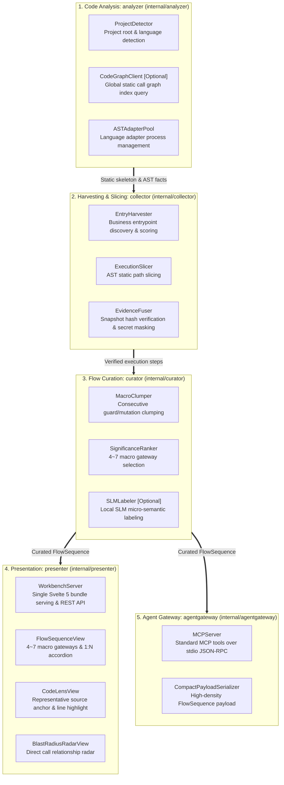
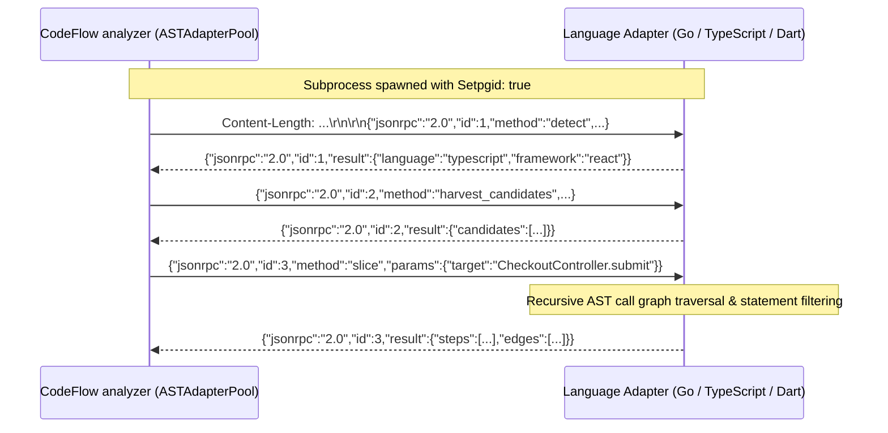
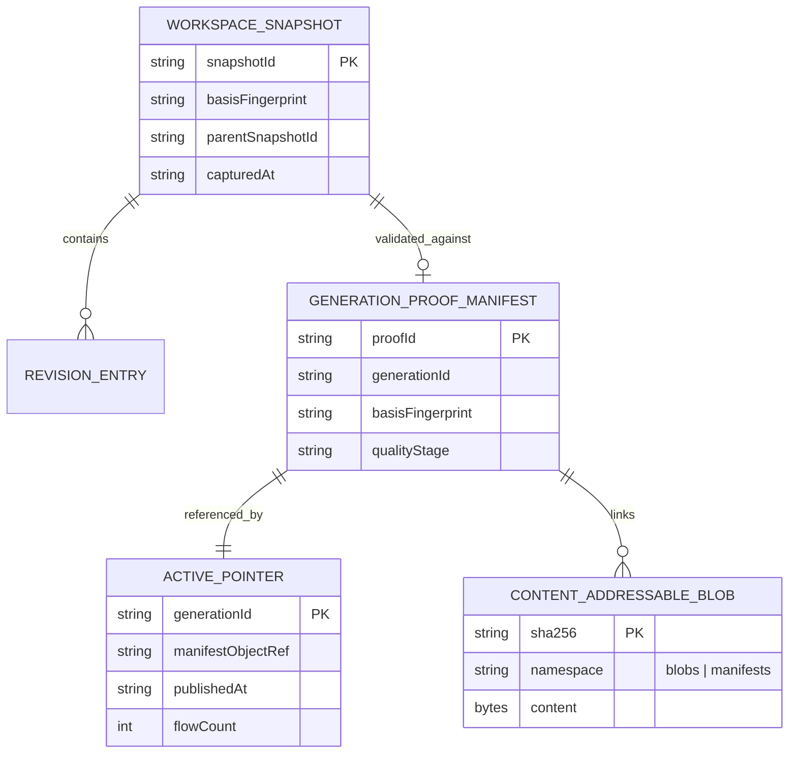

# CodeFlow Target Architecture & System Blueprint

> **Status**: Approved Canonical Architecture
> **Specification**: [`docs/design/specs/2026-09-16-codeflow-architectural-reset-and-flow-sequence-spec-ko.md`](design/specs/2026-09-16-codeflow-architectural-reset-and-flow-sequence-spec-ko.md)
> **Product Contract**: [`docs/design/specs/2026-09-14-flowview-code-comprehension-ko.md`](design/specs/2026-09-14-flowview-code-comprehension-ko.md)
> **Scope**: Entire CodeFlow Subsystem (`cmd/`, `internal/`, `adapters/`, `schemas/`, `web/`)

---

## 1. Vision & Architectural Philosophy

CodeFlow is a developer code comprehension tool that helps developers understand how business execution flows traverse complex, polyglot codebases end-to-end. Given a user prompt or entry point, CodeFlow extracts, slices, curates, and visualizes interactive, evidence-backed execution flows across architecture layers.

### Core Architectural Principles

1. **Code Comprehension First (Navigation & Context Restoration)**:
   The primary goal is developer code comprehension. Non-core statements and noise that do not advance the business flow are condensed, and relevant source code and nearby context are directly presented to eliminate disorientation.
2. **FlowSequence 1:N Timeline Model**:
   Business flows are structured into 4–7 macro business gateways (`FlowSequenceFrame`: `entry`, `decision`, `process`, `effect`, `result`, `boundary`). Each gateway contains 1 to N microscopic execution timeline steps (`SemanticStep`), providing high-level intent with drill-down line-level traceability.
3. **Explicit Re-analysis & Pinned Comparison**:
   Current flow is the default. Background file edits or watcher events never automatically swap the screen, move reading positions, or switch baselines. Re-analysis runs once upon explicit user command, and comparison requires an explicitly pinned baseline.
4. **Controlled Disclosure & Evidence-Bound Relations**:
   Macro clumping and significance ranking reduce noise; detailed execution steps and direct caller/callee/mutation relations (Radar) are disclosed on demand and bound to the same immutable snapshot.
5. **Anti-Telemetry Guard**:
   Internal engine telemetry (compiler epochs, lag, settlement flags, index statistics) is strictly forbidden from leaking into primary views or MCP payloads. Only verifiable business flow traversals, architecture layers, and source code are presented.
6. **Role-Based 5-Module Partitioning & Unidirectional Flow**:
   The Go core (`internal/`) is partitioned into exactly five modules with strict unidirectional data flow:
   `analyzer` $\to$ `collector` $\to$ `curator` $\to$ `presenter` / `agentgateway`.
7. **CodeGraph Synergy with Zero Hard Dependency**:
   Leverages repo-wide static call graph indexing (`.codegraph/`) for high-speed route discovery and dynamic dispatch resolution, while falling back gracefully to AST parsing if unavailable.
8. **Single-Gate Secret Redaction**:
   All egress paths (FlowView HTTP REST, MCP stdio JSON-RPC) route through a unified, single-gate secret redaction engine in `internal/collector/secret`.

---

## 2. 5-Module Architecture & Data Pipeline

The internal core is divided into five strictly separated modules, each capable of standalone operation and unit testing:



### Module Responsibilities & Boundary Invariants

| Module | Location | Core Responsibility | Dependency Rule |
|---|---|---|---|
| **`analyzer`** | `internal/analyzer` | Workspace structure discovery, language detection (`detect/`), adapter protocol management (`protocol/`), immutable workspace snapshot capture (`workspace/`), and installation health diagnostics (`doctor/`, `installation/`). | Leaf module: zero dependencies on other `internal/` modules. |
| **`collector`** | `internal/collector` | Raw candidate harvesting (`harvest/`), static/dynamic program slicing (`slicing/`), layer ordering & fusion (`fusion/`), deterministic naming (`naming/`), secret redaction (`secret/`), verification contracts (`contractharness/`, `evidence/`), and CAS persistence (`storage/`). | Depends only on `analyzer`. |
| **`curator`** | `internal/curator` | Distills raw sliced traces into 4–7 macro gateways via 2-stage curation (`MacroClumper`, `SignificanceRanker`), provides optional local SLM labeling (`SLMLabeler`), computes semantic deltas, and enforces publication gates (`semantic/`). | Depends on `collector` and `analyzer`. |
| **`presenter`** | `internal/presenter` | FlowView interactive web server (`flowview/`), Svelte 5 single-page application delivery, REST API endpoints, task view persistence, and before/after comparison views. | Depends on `curator`, `collector`, and `analyzer`. |
| **`agentgateway`** | `internal/agentgateway` | Model Context Protocol (`mcp/`) stdio JSON-RPC server exposing tools to AI agents, validating requests, and generating compact, high-density FlowSequence payloads. | Depends on `curator`, `collector`, and `analyzer`. |

Cross-module reverse imports (e.g. `analyzer` importing `collector`, or `collector` importing `curator`) are strictly prohibited.

---

## 3. FlowSequence and Execution Timeline Hierarchy

FlowSequence and the execution timeline maintain an **asymmetric 1:N hierarchical containment relationship**:

```
┌─────────────────────────────────────────────────────────────────────────────┐
│  [Macro Intent] FlowSequence                                                │
│  - Unit: FlowSequenceFrame                                                  │
│  - Types: entry, decision, process, effect, result, boundary                 │
│  - Quantity: 4 to 7 curated cards per flow                                  │
│  - Question answered: "What is the business intent of this stage?"          │
└──────────────────────────────────────┬──────────────────────────────────────┘
                                       │ 1:N Hierarchical Containment
                                       ▼
┌─────────────────────────────────────────────────────────────────────────────┐
│  [Micro Execution] Execution Timeline                                       │
│  - Unit: SemanticStep                                                       │
│  - Types: call, guard, mutation, return                                     │
│  - Quantity: 1 to N steps per frame (preserved inside accordion)            │
│  - Question answered: "Which exact lines of code execute for this stage?"   │
└─────────────────────────────────────────────────────────────────────────────┘
```

### 2-Stage Curation Pipeline
1. **Stage 1: Macro Block Clumping (`MacroClumper`)**:
   - Consecutive guard clauses (`if err != nil`, null checks) within the same block are coalesced into a single `decision` gateway ("Pre-validation").
   - Consecutive state field mutations are coalesced into a single `process` gateway.
   - Non-semantic utility calls (DTO conversions, logging, toString) are absorbed into the preceding gateway's collapsed details.
2. **Stage 2: Significance-Based Ranking (`SignificanceRanker`)**:
   - When clumped frames exceed 7, priority weights determine promotion:
     $$\text{Entry (100)} > \text{Effect (90)} > \text{Process (85)} > \text{Decision (80)} > \text{Internal Compute (50)}$$
   - The top 4–7 frames are promoted to FlowSequence main cards; remaining frames become collapsed details under adjacent cards.

---

## 4. Multi-Language Adapter Architecture

Language-specific AST extraction is delegated to decoupled worker subprocesses communicating over Content-Length framed JSON-RPC 2.0 stdio:



### Adapter Protocol Requirements (`schemas/adapter-protocol.schema.json`)
1. **Pure Structural AST Facts**: Adapters extract structural facts (`guard`, `mutation`, `call`, `effect`, `branch`), byte offsets, and SHA-256 hashes. Semantic layer assignment and curation remain in the Go core.
2. **Receiver & Method Support**: Adapters must parse standalone functions and struct/class receiver methods equally.
3. **Directed Slicing & Cycle Detection**: Slicers maintain visited symbol sets and record cycle edges rather than looping indefinitely.
4. **Process Group Isolation**: Subprocesses are spawned with `Setpgid: true` and cleaned up with negative PID signals (`-cmd.Process.Pid`), preventing zombie processes.

---

## 5. State Consistency & Storage Model



### Storage Invariants
1. **Snapshot Immutability**: Once created, `WorkspaceSnapshot` records are immutable.
2. **Dual CAS Namespace Segregation**:
   - `.codeflow/cas/blobs/<sha256>`: Raw file content revisions.
   - `.codeflow/cas/manifests/<sha256>`: Proof manifests.
   - Garbage collection scans only `blobs/`, preventing manifest loss.
3. **Active Pointer Publication**: Publishing a new flow generation uses atomic file renames against `active-pointer.json`.

---

## 6. Developer Verification & Quality Standards

To maintain architectural integrity, all changes must pass the standard verification suite:

```bash
# 1. Format and static analysis
make fmt
make vet

# 2. Domain naming conventions check
make check-naming

# 3. Full test suite (macOS CGO-free)
CGO_ENABLED=0 make test

# 4. Concurrency race detector on stateful modules
go test -race ./internal/analyzer/workspace/... ./internal/collector/storage/... ./internal/presenter/flowview/...
```

### Architectural Guardrails
- **Strict Unidirectional Flow**: Never import from a downstream module (`analyzer` must never import `collector`, `collector` must never import `curator`).
- **No Direct Disk Bypass**: Slicers and evidence extractors read from `workspace.SnapshotVFS` rather than raw filesystem paths.
- **Single-Gate Secret Redaction**: All public egress data must route through `secret.RedactJSON`.
- **No Absolute Home Paths**: Absolute home paths (`/Users/...`) are prohibited. Use `HOME/...` in code, docs, and configs.
