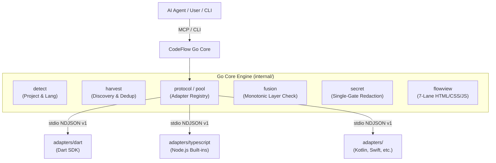

# CodeFlow Architecture & Maintenance Guide

CodeFlow is an interactive code analysis and visualization tool that extracts, slices, and renders end-to-end business flows across architecture layers in large codebases.

---

## 1. System Overview



---

## 2. Core Architecture Principles

### 1) Layer Authority (Track A)
- **Language Adapter**: Emits pure structural AST facts (`kind`: `guard`, `mutation`, `call`, `effect`, `branch`). The adapter never guesses or hardcodes architecture layers.
- **AI Agent**: Maps structural steps to 7 canonical layers (`presentation`, `controller`, `usecase`, `domain`, `data`, `infra`, `external`).
- **Go Core**: Validates monotonic layer traversal (`ValidateLayerOrder`) with strict validation rules.

### 2) Wire Protocol & Isolation (`stdio` NDJSON v=1)
- Go Core and language adapters run as isolated subprocesses communicating via 1-line NDJSON messages over standard I/O (`schemas/adapter-protocol.schema.json`).
- Max payload buffer: 1 MiB (`DefaultMaxMessageSizeBytes`).
- Standard operations: `ping`, `detect`, `harvest_candidates`, `slice`, `shutdown`.

### 3) FlowView UX & Style Invariance
- FlowView renders identical 7-lane interactive timelines regardless of the underlying language (Dart, TypeScript, Kotlin, etc.).
- UI styling and interactivity remain 100% consistent across all platforms.

### 4) Single-Gate Secret Redaction
- All source spans, descriptions, and payloads pass through a centralized secret redaction regex (`(?i)\b(?:api[_-]?key|secret|token|password)...`) to prevent sensitive credentials from leaking into published artifacts or UI.

---

## 3. Repository Layout

```
codeflow/
├── cmd/codeflow/          # CLI entry point
├── internal/
│   ├── detect/            # Polyglot project & manifest detection
│   ├── doctor/            # Environment & toolchain readiness diagnostics
│   ├── flowview/          # Embedded HTTP server & 7-lane UI renderer
│   ├── fusion/            # Layer normalization & monotonic order validation
│   ├── harvest/           # Candidate discovery, manifest overlays & scoring
│   ├── mcp/               # Model Context Protocol (MCP) server & tools
│   ├── pin/               # Adapter version compatibility pinning
│   ├── protocol/          # Stdio wire framing & AdapterRegistry process pool
│   ├── secret/            # Centralized credential redaction engine
│   ├── slicing/           # Structural slicing models & cache
│   ├── storage/           # Local state, generation pointers & file cache
│   └── watch/             # Language-aware source file watcher
├── adapters/
│   ├── dart/              # Reference Dart analyzer adapter
│   └── typescript/        # TypeScript/JavaScript AST scanner & slicer
├── docs/
│   ├── spec/              # Normative protocol & multi-language specs
│   ├── contracts/         # Contract pointers & deprecated archives
│   ├── ARCHITECTURE.md    # This architectural overview
│   └── llm-usage.md       # AI agent integration & layers guide
├── schemas/               # JSON Schema specifications (SSOT)
├── scripts/               # One-shot installer and build scripts
└── testdata/              # Test fixtures (Dart example, TS example app)
```

---

## 4. Maintenance & Extension Goals

1. **Adding a New Language Adapter**:
   - Follow [`docs/spec/llm-language-adapter-protocol.md`](file:///Users/junhyounglee/workspace/codeflow/docs/spec/llm-language-adapter-protocol.md).
   - Implement single-line NDJSON protocol in `adapters/<language>/`.
   - Ensure zero heavy external runtime dependencies wherever possible.
   - Register the adapter in [`internal/pin/compatibility.json`](file:///Users/junhyounglee/workspace/codeflow/internal/pin/compatibility.json) and [`internal/detect/detect.go`](file:///Users/junhyounglee/workspace/codeflow/internal/detect/detect.go).

2. **Quality Verification**:
   - Go Core: `go test ./...`
   - Dart Adapter: `cd adapters/dart && dart test`
   - TypeScript Adapter: `node adapters/typescript/test/index.test.js`

3. **Workspace Path Rules**:
   - Never commit absolute home-directory paths (`/Users/...`). Always use `HOME/...` or relative paths.
