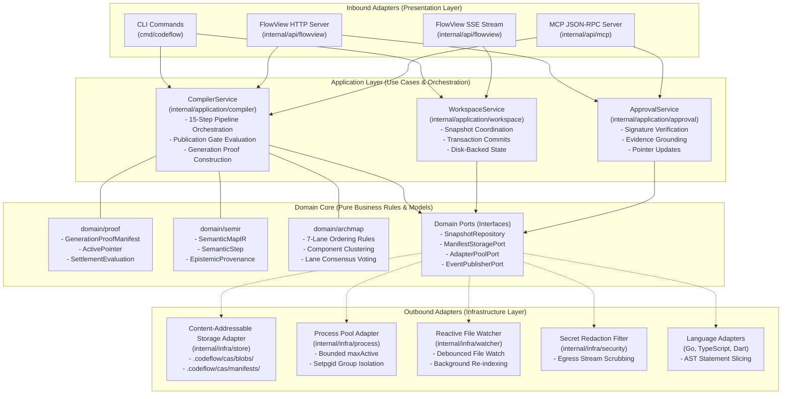
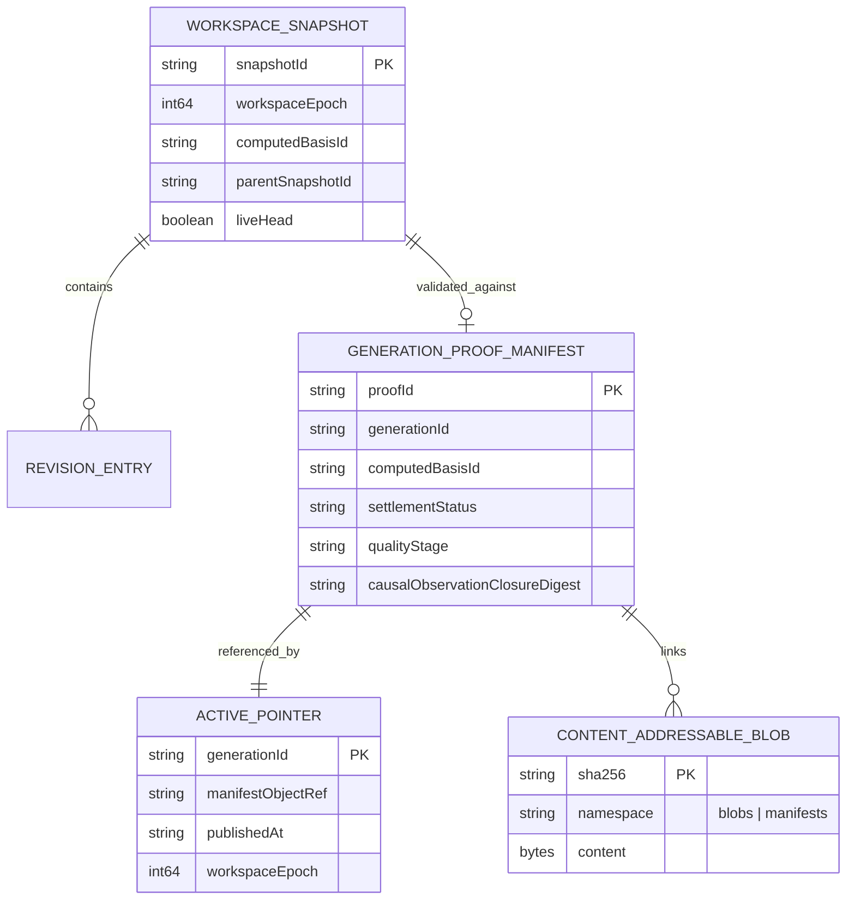
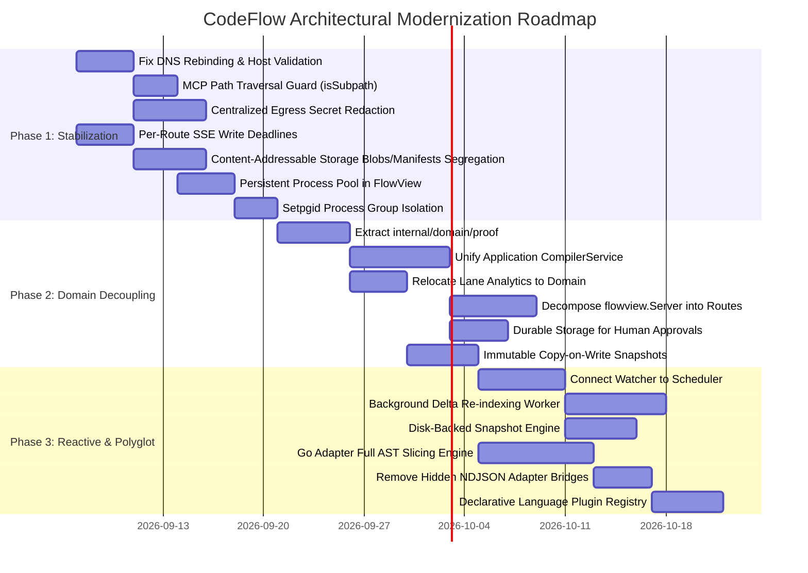

# CodeFlow Target Architecture & System Blueprint

> **Status**: Historical Supporting Blueprint
> **Based on**: [`docs/design/raw/requested-flow-live-semantic-compiler-architecture-draft-ko.md`](design/raw/requested-flow-live-semantic-compiler-architecture-draft-ko.md)
> **Current Product Contract**: [`docs/design/specs/2026-09-14-flowview-code-comprehension-ko.md`](design/specs/2026-09-14-flowview-code-comprehension-ko.md)
> **Scope**: Entire CodeFlow Subsystem (`cmd/`, `internal/`, `adapters/`, `schemas/`)

---

## 1. Vision & Architectural Philosophy

CodeFlow is a **Live Semantic Compiler** that bridges human developer intent and complex, polyglot codebases. Rather than merely describing static code structures, CodeFlow extracts, slices, verifies, and renders **interactive, end-to-end execution flows** across architectural layers.

### Core Architectural Principles

1. **Strict Epistemic Segregation**:
   The system enforces an uncompromisable distinction between four authorities of knowledge:
   - **AST Facts** (`sourceAuthority: code | compiler | test`): Deterministic structural truths derived from language parsers.
   - **SLM Proposals** (`sourceAuthority: model | agent`): Probabilistic interpretations and candidate enrichments produced by Small Language Models or LLMs.
   - **Runtime Observations** (`sourceAuthority: runtime`): Empirical execution traces, spans, and telemetry.
   - **Human Approvals** (`approvedBy: user`): Cryptographically signed developer sign-offs that ground speculative proposals into permanent facts.
   *Model proposals must never self-promote to verified state without explicit human approval backed by AST code evidence.*

2. **Single-Source Application Services**:
   The core 15-step compilation pipeline (intent normalization, harvesting, slicing, semantic IR compilation, critical obligation evaluation, generation proof construction, Content-Addressable Storage manifest persistence, and atomic pointer publishing) must exist in **one unified Application Service**, consumed identically by CLI, FlowView Web, and MCP interfaces.

3. **Sub-Second Reactive Feedback Loop**:
   Editing code triggers a non-blocking, multi-stage reactive pipeline:
   - **$T_0$**: Edit ingress via file watcher or IDE protocol.
   - **$T_0 + 300\text{ms}$**: Ephemeral revision registration and `activity.updated` ACK.
   - **$T_0 + 2\text{s}$**: Debounced publication coalescing and background AST re-indexing.
   - **$T_0 + 3\text{s}$**: Publication gate evaluation, atomic pointer swap, and `generation.published` SSE broadcast.

4. **Immutable State & Content-Addressable Storage Namespace Segregation**:
   Workspace snapshots represent immutable point-in-time states backed by Copy-on-Write (CoW) Virtual File Systems. Content-Addressable Storage strictly isolates raw file revisions from formal proof manifests to prevent garbage collection hazards.

5. **Defense-in-Depth Egress Security**:
   All outbound boundaries (FlowView HTTP REST, Server-Sent Events, MCP JSON-RPC stdio) pass through automated credential scrubbing. Loopback endpoints strictly validate Origin and Host headers to prevent DNS rebinding and cross-origin attacks.

---

## 2. Target Architectural Blueprint (Hexagonal / Ports & Adapters)

To resolve tight coupling, eliminate duplicated pipelines, and cleanly decouple domain logic from infrastructure and presentation concerns, CodeFlow adopts a **Hexagonal Architecture (Ports & Adapters)** model.



---

## 3. Layer Responsibilities & Package Boundaries

### 3.1 Domain Layer (`internal/domain/`)
The Domain Layer is the core of the system. It has **zero dependencies** on outer layers (no imports of `storage`, `flowview`, `net/http`, or OS subprocesses).

- **`internal/domain/proof/`**:
  Defines canonical data models for verification proofs:
  - `GenerationProofManifest`: Cryptographically linked audit record of a compilation run.
  - `ActivePointer`: Atomic pointer referencing current generation and snapshot.
  - `SettlementEvaluation`: Formal evaluation of the 5 critical obligations (Trigger, Handling, Side Effect, Terminal, Settlement).
  - *Eliminates legacy copy-paste duplication between `semantic` and `storage`.*
- **`internal/domain/semir/`**:
  Core semantic intermediate representations:
  - `SemanticMapIR`: Language-agnostic graph of features, summaries, and rules.
  - `SemanticStep`: Discrete execution step tagged with explicit `EpistemicProvenance` (`ASTFact`, `ModelProposal`, `RuntimeObservation`, `HumanApproved`).
  - `SemanticEdge`: Directed causal links containing strictly populated `FromStepID` and `ToStepID`.
- **`internal/domain/archmap/`**:
  Architecture topology and clustering:
  - 7 canonical architecture layers (`presentation`, `controller`, `usecase`, `domain`, `data`, `infra`, `external`).
  - Graph neighbor consensus voting (`propagationRounds = 3`, `voteCalleeWeight = 100`, `voteCallerWeight = 60`).
  - Relocated from UI presentation layer to domain core so CLI, FlowView, and MCP share identical architecture classification.
- **`internal/domain/ports/`**:
  Abstract interfaces implemented by infrastructure adapters:
  - `SnapshotRepository`: Read/write workspace snapshots and revisions.
  - `ManifestStoragePort`: Read/write proof manifests and Content-Addressable Storage objects.
  - `AdapterPoolPort`: Execute harvesting and slicing on language worker pools.
  - `EventPublisherPort`: Broadcast state changes to subscribers.

### 3.2 Application Layer (`internal/application/`)
The Application Layer coordinates use-case execution. It orchestrates domain objects and invokes infrastructure ports.

- **`internal/application/compiler/` (`CompilerService`)**:
  The authoritative orchestrator of the 15-step compilation pipeline:
  ```
  [User Intent / Query]
           │
           ▼
  1. Intent Normalization (semantic.NormalizeTaskIntent)
           │
           ▼
  2. Adapter Resolution & Pool Acquisition (ports.AdapterPoolPort)
           │
           ▼
  3. Candidate Discovery & Scoring (harvest.NewRunner)
           │
           ▼
  4. Query Target Resolution (semantic.ResolveFeatureQueryTarget)
           │
           ▼
  5. Polyglot AST Slicing (slicing.NewRunner)
           │
           ▼
  6. Semantic Map Compilation (semantic.CompileDeterministicFeatureMap)
           │
           ▼
  7. Critical Obligation Evaluation (Trigger, Handling, Mutation, Terminal, Settlement)
           │
           ▼
  8. Publication Subgate Verification (PublicationGate.Evaluate)
           │
           ▼
  9. Generation Proof Construction (proof.NewManifest)
           │
           ▼
  10. Atomic Content-Addressable Storage Commit & Pointer Swap (ports.ManifestStoragePort)
           │
           ▼
  11. Event Emission (ports.EventPublisherPort -> "generation.published")
  ```
- **`internal/application/workspace/` (`WorkspaceService`)**:
  Manages workspace snapshots, transaction commits, file revisions, and disk-backed state consistency across CLI and daemon processes.
- **`internal/application/approval/` (`ApprovalService`)**:
  Handles human grounding: verifies Ed25519 signatures, validates evidence packs against physical AST code anchors, transitions proposal status to `approved`, and commits updates to persistent storage.

### 3.3 Infrastructure Layer (`internal/infra/`)
Outbound adapters that interact with disk, operating system, external processes, and network.

- **`internal/infra/store/` (Content-Addressable Storage & Active Pointer)**:
  - Enforces strict directory segregation:
    - `.codeflow/cas/blobs/`: Immutable content revisions.
    - `.codeflow/cas/manifests/`: Immutable proof manifests and settlement evaluations.
  - Existing `PruneOrphanCAS` scans only `blobs/`, completely eliminating the catastrophic proof deletion hazard.
  - Manages atomic file rename operations for `active-pointer.json`.
- **`internal/infra/process/` (Hardened Worker Pool)**:
  - Manages language adapter worker pools (`protocol.Pool`).
  - Implements bounded concurrency with explicit `maxActive` limits to prevent process table exhaustion (fork bombs).
  - Sets `SysProcAttr: &syscall.SysProcAttr{Setpgid: true}` and issues negative PID signals (`-cmd.Process.Pid`) during teardown, preventing orphaned zombie processes.
  - Guarantees broken or timed-out connections are explicitly closed (`retryConn.Close()`).
- **`internal/infra/watcher/` (Reactive Watcher)**:
  - Debounced file watcher listening to filesystem modification events.
  - Feeds changed snapshots to `CoalescingScheduler`.
  - Spawns a background consumer worker listening to `scheduler.Checkpoints()` to trigger automated re-indexing and broadcast change pulses over SSE.
- **`internal/infra/security/` (Egress Redaction Filter)**:
  - Comprehensive regex pattern covering API keys, passwords, Bearer tokens (`Bearer eyJ...`), PEM private keys (`-----BEGIN RSA...`), AWS keys (`AKIA...`), and database connection strings (`postgres://...`).
  - Applied as an automatic wrapping stream on all FlowView HTTP responses, SSE data frames, and MCP JSON-RPC returns.

### 3.4 Presentation Layer (`internal/api/` & `cmd/`)
Inbound adapters that accept requests, decode input, invoke Application Services, and serialize output.

- **`cmd/codeflow/` (CLI)**:
  Thin command controllers (`query`, `status`, `doctor`, `init`). Directly invokes `CompilerService` and `WorkspaceService`.
- **`internal/api/flowview/` (FlowView Web Server)**:
  Decomposed, lightweight HTTP and SSE controllers:
  - `TaskViewController`: Handles `/api/task/{review,impact,debug,incident,onboarding}` via `CompilerService`.
  - `WorkspaceStreamController`: Handles `/api/workspace/stream` SSE events with per-route deadlines (disabling global HTTP write timeouts).
  - `ApprovalController`: Handles `/api/semantic/approve` via `ApprovalService`.
  - `StaticAssetController`: Serves embedded single-page application assets.
  - Enforces strict loopback origin and host validation to prevent DNS rebinding and CSRF.
- **`internal/api/mcp/` (Model Context Protocol)**:
  JSON-RPC 2.0 stdio server exposing 22 tools to AI agents. Delegates directly to `CompilerService` and `ApprovalService`. Enforces `isSubpath` checks to block host file traversal.

---

## 4. Multi-Language Adapter Architecture

CodeFlow analyzes polyglot codebases through decoupled, language-specific worker subprocesses communicating over Content-Length framed JSON-RPC 2.0 stdio protocols.

```mermaid
sequenceDiagram
    participant Core as CodeFlow Go Core (Process Pool)
    participant Worker as Language Adapter Subprocess (Go / TS / Dart)

    Note over Core,Worker: Subprocess spawned with Setpgid: true
    Core->>Worker: Content-Length: ...

{"jsonrpc":"2.0","id":1,"method":"detect",...}
    Worker-->>Core: {"jsonrpc":"2.0","id":1,"result":{"language":"typescript","framework":"react"}}

    Core->>Worker: {"jsonrpc":"2.0","id":2,"method":"harvest_candidates",...}
    Worker-->>Core: {"jsonrpc":"2.0","id":2,"result":{"candidates":[...]}}

    Core->>Worker: {"jsonrpc":"2.0","id":3,"method":"slice","params":{"target":"CheckoutController.submit"}}
    Note over Worker: Recursive AST call graph traversal & statement filtering
    Worker-->>Core: {"jsonrpc":"2.0","id":3,"result":{"steps":[...],"edges":[...]}}

    opt User Cancels Query
        Core->>Worker: {"jsonrpc":"2.0","method":"$/cancelRequest","params":{"id":3}}
        Worker-->>Core: {"jsonrpc":"2.0","id":3,"error":{"code":-32800,"message":"cancelled"}}
    end
```

### Adapter Parity Requirements

Every language adapter must fulfill the following contract specifications (`schemas/adapter-protocol.schema.json`):

1. **Pure Structural AST Facts**:
   Adapters must extract only code facts (`guard`, `mutation`, `call`, `effect`, `branch`). Layer classifications (`domain`, `infra`, etc.) belong strictly to the Go Core fusion engine.
2. **Receiver & Method Support**:
   Adapters must parse both standalone functions and class/struct receiver methods (e.g., Go `func (s *Server) Handle()` must not be discarded).
3. **True Statement-Level Slicing**:
   Adapters must construct directed call graphs with visited-set cycle detection, emitting discrete statement steps and valid causal edges.
4. **Cancellation Responsiveness**:
   Slicing algorithms must run in asynchronous or chunked execution blocks, allowing incoming `$/cancelRequest` notifications to abort long computations.
5. **Atomic Protocol Framing**:
   Header and body bytes must be flushed in an atomic write to prevent frame tearing over stdio pipes.

---

## 5. State Consistency & Storage Model



### Invariants of the Storage Subsystem

1. **Snapshot Immutability**:
   Once registered, a `WorkspaceSnapshot` is strictly immutable. Snapshot transitions use copy-on-write cloning; in-place mutations of `LiveHead` are prohibited.
2. **Disk-Backed State Single-Truth**:
   Snapshot indices and revision logs are persisted to `.codeflow/workspace/snapshots.json`. CLI commands, background daemons, and MCP servers share the identical disk-backed engine, preventing split-brain states.
3. **Content-Addressable Storage Dual-Namespace Segregation**:
   - `HOME/workspace/codeflow/.codeflow/cas/blobs/<sha256>`: Stores raw file content revisions.
   - `HOME/workspace/codeflow/.codeflow/cas/manifests/<sha256>`: Stores `GenerationProofManifest` documents.
   - Garbage collection scans only `blobs/`, preserving proof history indefinitely.
4. **Active Pointer compare-and-swap**:
   Publishing a new generation requires atomic compare-and-swap against `active-pointer.json`. If a concurrent edit updates the live head snapshot before publication completes, the swap aborts and triggers a reactive re-compilation.

---

## 6. Phased Modernization Roadmap

CodeFlow transitions from its current state to the Target Hexagonal Architecture through **3 strictly non-breaking, incremental phases** that preserve existing JSON schema contracts and external adapter protocols.



### Phase Summary

| Phase | Core Focus | Key Deliverables | Risk & Compatibility |
|:---|:---|:---|:---|
| **Phase 1: Immediate Stabilization & Security Hardening** | Security vulnerabilities, data corruption hazards, and process leaks | Loopback host parsing, `isSubpath` MCP protection, egress secret redaction, Content-Addressable Storage directory split, persistent process pool, and `Setpgid` subprocess termination. | **Zero breaking changes**. Modifies only internal infrastructure logic. |
| **Phase 2: Domain Decoupling & Application Service Extraction** | Modularity, pipeline duplication, and clean architecture | `internal/domain/proof` canonical models, unified `CompilerService` (CLI/FlowView/MCP), `internal/domain/archmap/` migration, and decomposed `flowview.Server`. | **Zero breaking changes**. Preserves all REST endpoints, SSE formats, and JSON schemas. |
| **Phase 3: Reactive Loop Activation & Multi-Language Parity** | Real-time reactivity, multi-language parity, and test fidelity | Active background re-indexer, disk-backed snapshot engine, full Go AST statement slicer with struct method support, and clean JSON-RPC 2.0 adapters. | **Zero breaking changes**. Wire compatibility preserved; language adapter protocol remains standard. |

---

## 7. Quality Standards & Developer Verification

To maintain architectural integrity as CodeFlow evolves, all contributors and automated agents must adhere to the following verification procedures:

### Automated Test Suites
```bash
# 1. Standard Unit & Integration Suite
go test ./...

# 2. Concurrency Race Detector (Mandatory for flowview, workspace, and storage)
go test -race ./internal/flowview/... ./internal/workspace/... ./internal/storage/...

# 3. Contract Schema & Invariant Harness
go test -v ./internal/contractharness/...

# 4. Multi-Language Adapter Tests
(cd adapters/dart && dart test)
(cd adapters/typescript && node test/index.test.js)
(cd adapters/go && go test ./...)
```

### Architectural Guardrails
- **No Circular Dependency Evasions**: Never duplicate structs across packages. Extract shared concepts to `internal/domain/`.
- **No Host Disk Bypass**: Evidence extractors and AST slicers must read from `workspace.SnapshotVFS`, never directly from `os.ReadFile`.
- **No Ephemeral Proposals**: Approval endpoints must reject any proposal that cannot be traced to physical AST anchors and compiler state.
- **No Unsanitized Egress**: Outbound HTTP, SSE, and MCP streams must pass through `secret.RedactJSON`.
- **No Absolute Home Paths**: Absolute home-directory paths (`/Users/...`) are strictly prohibited in documentation, code, configuration, or examples. Always use `HOME/...`.
