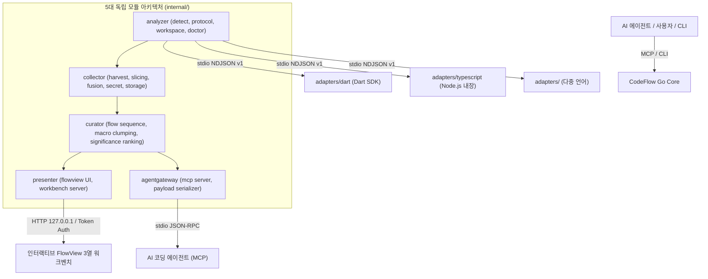

# CodeFlow — 프로젝트 개요 (Project Overview)

> **엔드투엔드 비즈니스 핵심 흐름 추출 및 스토리보드 시각화를 통한 대규모 코드베이스 이해 도구**

CodeFlow는 개발자와 AI 코딩 에이전트를 위한 인터랙티브 코드 분석 엔진이자 코드 이해(Code Comprehension) 워크벤치입니다. 대규모의 복잡한 코드베이스에서 진입 계층부터 데이터/외부 계층까지 관통하는 **비즈니스 핵심 흐름(Core Business Flows)**을 추출하고, 엄선된 스토리보드 장면(4~7개 매크로 비즈니스 관문)으로 구조화하며, 검증된 코드 앵커(Anchor)를 기반으로 각 단계를 보증하여, 인터랙티브한 3열 FlowView 워크벤치와 라인 수준 1:N 실행 타임라인으로 시각화합니다.

---

## 1. 핵심 역량 (Core Capabilities)

핵심 역량은 CodeFlow가 제공하는 도메인 엔진, 분석 방법론, 그리고 코드 분석의 신뢰성 및 정확도 보증 체계를 의미합니다.

### 1.1 엔드투엔드 핵심 흐름(Core Flow) 추출
* **계층 관통 실행 추적**: 진입 트리거(UI 클릭, HTTP 엔드포인트 요청, 라우트 또는 시스템 이벤트)에서 시작하여 컨트롤러, 유스케이스, 도메인 엔티티, 리포지토리/데이터, 그리고 인프라 및 외부 연동 API까지 이어지는 전체 실행 경로를 추적합니다.
* **비핵심 노이즈 제거**: 레이어 전환이나 비즈니스 의사결정에 기여하지 않는 보일러플레이트 코드, 단순 유틸리티 호출을 걸러내어 사용자가 요청한 핵심 비즈니스 로직에 집중합니다.

### 1.2 무환각 코드 앵커 검증 (Zero-Hallucination Grounding)
* **검증된 코드 근거(Fact Anchors)**: 모든 실행 단계는 파일 상대 경로, 바이트 범위, 라인 번호, 파일 해시, 스팬 해시, 정규 AST 핑거프린트 등 실제 코드 팩트와 강력하게 결합됩니다.
* **미확인 영역(Unknowns)의 투명한 공개**: 동적 디스패치(Dynamic Dispatch), 미확정 타입, 외부 경계로 인해 정적 분석이 단절될 경우, 추측으로 메우지 않고 `unresolved_dynamic`, `unknowns[]`, 또는 `boundary` 관문으로 명확하게 보고합니다.

### 1.3 스토리보드 비즈니스 관문 및 비대칭 1:N 타임라인 모델
* **FlowSequence 스토리보드 장면**: 획일적인 7계층 아키텍처 강제에서 탈피하여, 실행 흐름 상에서 일어나는 4~7개 매크로 비즈니스 관문(`entry`, `decision`, `process`, `effect`, `result`, `boundary`) 중심으로 흐름을 요약합니다.
* **비대칭 1:N 계층적 포함 관계**: 거시적 비즈니스 의도(`FlowSequenceFrame`)와 미시적 코드 실행(`SemanticStep`)을 연결하여, 아코디언 내부에서 코드 라인 단위의 정확한 추적성을 보존합니다.
* **유연한 아키텍처 맥락**: 모든 프로젝트에 동일한 계층 구조를 강제하지 않으며, 아키텍처 분류는 각 장면에 부착되는 선택적 보조 라벨로 활용됩니다.

### 1.4 출처(Provenance) 및 신선도(Freshness) 수명주기 추적
* **신선도(Freshness) 보증**: 코드가 수정되었을 때 기존 분석 결과가 유효한지 추적합니다 (`fresh`: 최신 일치, `stale`: 코드 변경으로 재분석 필요, `orphaned`: 심볼 삭제됨).
* **출처(Provenance) 권위 체계**: 각 스텝 정보의 신뢰 수준을 계층적으로 관리합니다 (`approved` > `session` > `derived` > `unknown`).

### 1.5 비즈니스 의도 신호 마이닝 및 후보 점수화
* **자연어 의도 매칭**: 진입점의 의도 신호(`derivedName`, `docLine`, `triggerClass`)를 추출하여 점수를 매기고, 자연어 질의(예: *"이메일 회원가입 흐름 보여줘"*)에 최적화된 후보를 탐색합니다.

### 1.6 Track A "레이어 권위(Layer Authority)" 분리 원칙
* **구조적 AST와 아키텍처 매핑의 분리**: 언어 어댑터는 순수한 AST 구조적 팩트(`guard`, `mutation`, `call`, `effect`, `branch`)만 추출하며, 레이어 분류 및 비즈니스 흐름 큐레이션은 Go Core 큐레이터와 AI 에이전트가 전담합니다.

### 1.7 FlowView 코드 이해 대전제 (Code Comprehension Premises)
* **내비게이션 및 맥락 복원**: 사용자가 혼란을 겪지 않도록 관련 소스 코드와 주변 맥락을 직접 보여줍니다.
* **명시적 재분석 및 기준선 비교**: 현재 흐름 보기가 기본이며, 변경 전후 비교는 사용자가 명시적으로 선택한 기준선(Baseline)과 비교합니다. 백그라운드 파일 수정이나 watcher 이벤트가 화면을 임의로 바꾸거나 읽기 위치를 이동시키지 않습니다.
* **절제된 정보 공개 및 증거 중심**: 매크로 응집과 중요도 선별로 노이즈를 줄이고, 상세 실행 단계와 직접 연결은 사용자가 요청했을 때만 펼칩니다.
* **안티 텔레메트리 보호 (Anti-Telemetry Guard)**: 컴파일러 에포크, 지연 시간, 내부 결재 플래그, 색인 통계 등 내부 엔진 텔레메트리를 기본 화면에 절대 노출하지 않으며, 오직 검증된 비즈니스 흐름과 소스 코드만을 제공합니다.

---

## 2. 제품 접점 및 인터페이스 (Product Surfaces & Interfaces)

제품 접점은 사용자와 AI 에이전트가 CodeFlow의 핵심 역량을 실제로 활용할 수 있도록 제공되는 구체적인 소프트웨어 도구, 인터페이스 및 프로토콜입니다.

### 2.1 FlowView 인터랙티브 웹 UI
* **3열 스토리보드 워크벤치**: Svelte 5 기반 단일 프로덕션 프론트엔드로, 매크로 스토리보드 트랙(4~7개 관문 카드), 내비게이션 레일, 라인 강조가 포함된 내장 코드 렌즈(CodeLens), 직접 관계망 레이더(Radar)를 제공합니다.
* **명시적 재분석 및 기준선 비교**: 사용자 명령에 따른 1회성 재분석 및 고정된 기준선과의 변경 전후 비교를 지원하며, 원치 않는 자동 화면 갱신을 배제합니다.
* **근거 기반 직접 관계망 레이더**: 선택된 장면에 대해 검증된 직접 호출자/피호출자, 상태 변경, 연관 테스트만을 탐색하며, 추측에 기반한 전역 영향 추정을 하지 않습니다.
* **토큰 인증 기반 로컬 보안**: 외부 노출 없이 `127.0.0.1` 루프백에만 바인딩되며, 실행 시 발급되는 일회용 암호화 토큰(`?token=...`)으로 보호됩니다.

### 2.2 멀티 에이전트 Model Context Protocol (MCP) 서버
* **Stdio JSON-RPC 인터페이스**: 4대 주요 AI 에이전트(**Codex, Claude Desktop, Cursor IDE, Antigravity / Gemini CLI**)를 위한 MCP 서버를 기본 내장합니다.
* **공식 8대 핵심 MCP 도구**:
  * `publish_core_flow`: 코드 앵커를 검증하고 아키텍처 관통 핵심 흐름을 원자적으로 게시합니다.
  * `harvest_flows`: 자연어 질의와 의도 신호에 기반하여 후보 흐름을 탐색하고 점수화합니다.
  * `get_flow_payload`: 단일 흐름의 FlowSpec JSON 및 ~500토큰 고밀도 압축 페이로드를 조회합니다.
  * `analyze_flow`: 임의의 진입점 심볼에 대해 온디맨드로 슬라이싱, 융합 및 게시를 수행합니다.
  * `submit_flow_draft`: 검증된 앵커가 포함된 구조화된 세션 여정 드래프트를 제출합니다.
  * `approve_step`: 단계 명칭 및 비즈니스 규칙을 사용자가 직접 승인합니다 (E3 승인 체계).
  * `report_unknowns`: 워크스페이스 내 확인되지 않은 호출 결손, 모호한 디스패치 및 분석 경계(`boundary`) 목록을 조회합니다.
  * `open_review`: 필요 시점에 FlowView를 지연 구동하고 인증 토큰이 포함된 리뷰 URL을 반환합니다.
* **동적 타겟 라우팅**: 워킹 디렉터리를 오염시키지 않고 `target` 인자를 통해 특정 하위 디렉터리나 모노레포 패키지를 독립 분석합니다.

### 2.3 다중 언어 폴리글랏 엔진 및 프로세스 풀
* **격리된 서브프로세스 통신 (`stdio` NDJSON v1)**: 언어별 런타임과 Go Core가 줄바꿈 구분 JSON 스트리밍으로 독립 격리 실행됩니다.
* **프로덕션 언어 어댑터**:
  * **Dart / Flutter 어댑터**: Dart Analyzer SDK 기반의 심층 정적 분석 제공.
  * **TypeScript / JavaScript 어댑터**: 외부 의존성 없는 내장 AST 스캐너로 React, Node.js, Next.js 등 분석.
* **프로세스 풀 관리자 (`AdapterRegistry`)**: 저장소 및 언어별로 재사용 가능한 격리된 서브프로세스 풀을 관리합니다.

### 2.4 선언적 아키텍처 설정 (`codeflow.layers.yaml`)
* **레이어 규칙 및 경로 매칭**: 디렉터리 글로브 패턴(`pathPatterns`) 및 관용적 별칭(`aliases`)을 표준 레이어에 매핑하는 YAML 규격입니다.
* **엄격성 제어**: 순서 위반(`strictOrder`) 및 미정의 레이어 허용 여부(`allowUnknownLayer`)를 제어합니다.

### 2.5 네이티브 CLI 툴체인
* `codeflow init [path]`: 대상 저장소를 초기화하고 `.codeflow/workspace.json`을 생성합니다.
* `codeflow flows [path]`: 점수순으로 정렬된 후보 흐름 목록을 출력합니다.
* `codeflow publish [path]`: 수집, 슬라이싱, 레이어 융합 및 게시를 일괄 수행합니다.
* `codeflow show <id|entry>`: 특정 흐름의 단계와 비즈니스 규칙을 JSON/텍스트로 출력합니다.
* `codeflow view` / `codeflow serve`: FlowView 웹 UI를 실행합니다.
* `codeflow mcp`: AI 에이전트용 MCP JSON-RPC 서버를 시작합니다.
* `codeflow doctor [path]`: 실행 환경, 도구 SDK, 어댑터 핀, 스키마 무결성을 진단합니다.
* `codeflow uninstall`: 설치된 MCP 설정, 스킬, 바이너리를 깨끗하게 제거합니다.

### 2.6 원샷 무마찰 인스톨러 (Zero-Friction One-Shot Installer)
* **단 한 줄의 원격 설치**: OS 및 CPU 아키텍처를 자동 감지하여 사전 빌드된 바이너리, 어댑터, 4대 에이전트 MCP 및 스킬을 셸 rc 오염 없이 한 번에 자동 설치합니다:
  ```sh
  curl -fsSL https://raw.githubusercontent.com/cutehackers/codeflow/main/scripts/install.sh | bash
  ```

### 2.7 단일 관문 비밀 정보 마스킹 (Single-Gate Secret Redaction)
* **중앙 집중식 자격증명 보호**: 모든 소스 코드 스팬, 설명문, FlowView 페이로드에서 API 키, 비밀 토큰, 비밀번호 등의 민감 정보를 사전에 정규식으로 자동 마스킹합니다.

---

## 3. 시스템 아키텍처 구성도



---

## 4. 관련 문서 색인

* **아키텍처 및 내부 구조**: [`docs/ARCHITECTURE.md`](ARCHITECTURE.md)
* **LLM 및 에이전트 지침**: [`docs/guides/llm-usage.md`](guides/llm-usage.md)
* **기능 및 프롬프트 가이드**: [`docs/guides/feature.md`](guides/feature.md)
* **개발 환경 및 CLI 가이드**: [`docs/guides/development.md`](guides/development.md)
* **다중 언어 어댑터 프로토콜**: [`docs/design/specs/llm-language-adapter-protocol.md`](design/specs/llm-language-adapter-protocol.md)
* **영문 프로젝트 개요**: [`docs/PROJECT.md`](PROJECT.md)
