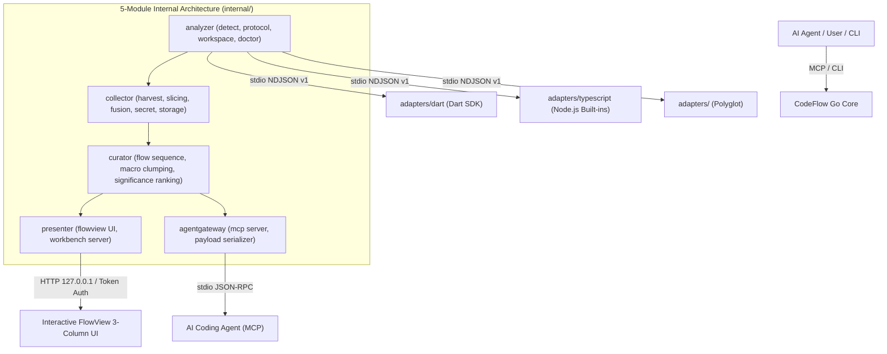

# CodeFlow — Project Overview

> **Understand Large Codebases Through End-to-End Business Flow Extraction & Storyboard Visualization**

CodeFlow is an interactive code analysis engine and developer code comprehension platform for developers and AI coding agents. Given a large, complex repository, CodeFlow extracts end-to-end **Core Business Flows** (핵심 흐름), structures them into curated Storyboard scenes (4–7 macro business gateways), validates every step against verifiable code anchors, and visualizes the complete execution path through an interactive 3-column FlowView workbench with line-level 1:N timeline drill-down.

---

## 1. Core Capabilities

Core Capabilities describe the domain engine, analytical methodologies, and correctness guarantees provided by CodeFlow.

### 1.1 End-to-End Core Flow Extraction
* **Cross-Layer Execution Traversal**: Traces the complete execution path starting from an entry trigger (UI click, HTTP endpoint, route, or system event) through controllers, use cases, domain entities, repositories, down to infrastructure and external APIs.
* **Non-Core Noise Pruning**: Isolates the requested business flow by filtering out non-advancing statements, boilerplate, and irrelevant utility invocations.

### 1.2 Zero-Hallucination Code Grounding (Fact Anchors)
* **Verifiable Code Anchors**: Every single step is tied to real code facts: exact repo-relative file paths, byte ranges, line numbers, file hashes, span hashes, and canonical AST fingerprints.
* **Honest Gap Surfacing**: When dynamic dispatch, missing type information, or external boundaries interrupt static resolution, CodeFlow explicitly flags them as `unresolved_dynamic`, `unknowns[]`, or `boundary` gateways instead of inferring plausible but unverified steps.

### 1.3 Storyboard Business Gateways & Asymmetric 1:N Timeline Model
* **FlowSequence Storyboard Scenes**: Transcends rigid architectural layer enforcement by organizing code execution around 4–7 macro business gateways (`entry`, `decision`, `process`, `effect`, `result`, `boundary`).
* **Asymmetric 1:N Execution Timeline Containment**: Connects high-level business intent (`FlowSequenceFrame`) with microscopic execution steps (`SemanticStep`), preserving exact line-level traceability inside expandable accordions.
* **Flexible Architectural Context**: Rather than forcing every codebase into an identical 7-layer hierarchy, architecture classifications serve as secondary context labels attached to scenes.

### 1.4 Provenance & Freshness Lifecycle Tracking
* **Freshness Guarantees**: Tracks whether anchors are `fresh`, `stale` (source modified after generation), or `orphaned` (symbol deleted or relocated).
* **Authority Hierarchy**: Enforces confidence levels across step approvals (`approved` > `session` > `derived` > `unknown`).

### 1.5 Business Intent Signal Mining & Candidate Scoring
* **Semantic Discovery**: Automatically identifies and ranks candidate business flows by extracting natural language intent signals (`derivedName`, `docLine`, `triggerClass`) for semantic queries (e.g., *"Show email signup flow"*).

### 1.6 Track A "Layer Authority" Separation
* **Structural AST vs. Architectural Mapping**: Language adapters extract purely structural AST facts (`guard`, `mutation`, `call`, `effect`, `branch`), leaving high-level layer mapping and flow synthesis to the Go Core curation engine and AI agent.

### 1.7 FlowView Code Comprehension Premises
* **Navigation & Context Restoration**: Directly presents relevant source code and surrounding context without navigational disorientation.
* **Explicit Re-analysis & Pinned Comparison**: Current flow is the default; baseline comparison is explicitly chosen by the user. Background file edits or watcher events never automatically swap the screen or move reading positions.
* **Controlled Disclosure & Focus**: Macro clumping and significance ranking reduce noise; detailed execution steps and direct relations are revealed only on demand.
* **Anti-Telemetry Guard**: Internal engine telemetry (compiler epochs, lag, settlement flags, index statistics) is strictly forbidden from leaking into primary views. Only verifiable business flow traversals, architecture layers, and source code are presented.

---

## 2. Product Surfaces & Interfaces

Product Surfaces are the concrete software components, user touchpoints, protocols, and tools shipped with CodeFlow.

### 2.1 FlowView Interactive Web UI
* **3-Column Storyboard Workbench**: Single Svelte 5 production frontend featuring the macro Storyboard track (4–7 gateway cards), navigation rail, embedded CodeLens panel with line-level highlights, and Blast Radius Radar.
* **Explicit Re-analysis & Baseline Comparison**: Single-shot re-analysis upon explicit user command; side-by-side comparison against a pinned historical baseline without automatic screen refreshes.
* **Evidence-Backed Direct Relation Radar**: Explores verified direct caller/callee relationships, state mutations, and related tests for the selected scene without speculative global impact inference.
* **Secure Token-Authenticated Loopback**: Embedded HTTP server bound strictly to `127.0.0.1` and protected by per-session cryptographic auth tokens (`?token=...`).

### 2.2 Multi-Agent Model Context Protocol (MCP) Server
* **Stdio JSON-RPC Interface**: Built-in MCP server providing out-of-the-box auto-configuration for 4 major AI agent ecosystems: **Codex, Claude Desktop, Cursor IDE, and Antigravity / Gemini CLI**.
* **Official 8 Core MCP Tools**:
  * `publish_core_flow`: Atomically verifies anchors and publishes architecture-layer core flows.
  * `harvest_flows`: Discovers and scores candidate entry-point flows matching natural language queries.
  * `get_flow_payload`: Retrieves structured FlowSpec JSON and high-density compact payloads for a specific flow.
  * `analyze_flow`: On-demand slice, fuse, and publish for arbitrary symbol entry points.
  * `submit_flow_draft`: Submits structured session journey drafts with verified anchors.
  * `approve_step`: Human/agent in-place approval for step descriptions and business rules.
  * `report_unknowns`: Inspects unresolved gaps, missing types, and dynamic call boundaries.
  * `open_review`: Lazily launches FlowView and provides an authenticated review URL.
* **Dynamic Target Routing**: Analyzes arbitrary target directories or monorepo sub-packages without polluting host working directories.

### 2.3 Multi-Language Polyglot Engine & Process Pools
* **Isolated Subprocess Protocol (`stdio` NDJSON v1)**: Decoupled language runtimes communicating with the Go Core via streaming line-delimited JSON.
* **Production Adapters**:
  * **Dart / Flutter Adapter**: Deep static analysis via the Dart Analyzer SDK.
  * **TypeScript / JavaScript Adapter**: Fast, zero-external-dependency AST scanner for React, Node.js, Express, and Next.js.
* **Process Pool Management (`AdapterRegistry`)**: Maintains reusable, isolated adapter subprocess worker pools per repository and language.

### 2.4 Declarative Architecture Configuration (`codeflow.layers.yaml`)
* **Layer Rules & Path Matching**: Declarative YAML configuration defining directory glob patterns (`pathPatterns`) and project-specific nomenclature (`aliases`).
* **Strict Validation Controls**: Configurable validation strictness (`strictOrder`, `allowUnknownLayer`).

### 2.5 Native CLI Toolchain
* `codeflow init [path]`: Prepares repository and sets up `.codeflow/workspace.json`.
* `codeflow flows [path]`: Lists harvested candidate flows sorted by score.
* `codeflow publish [path]`: Executes harvest, slice, fuse, and atomic generation publish.
* `codeflow show <id|entry>`: Displays flow steps and rules in JSON or human-readable format.
* `codeflow view` / `codeflow serve`: Launches the FlowView interactive web UI.
* `codeflow mcp`: Starts the MCP stdio JSON-RPC server.
* `codeflow doctor [path]`: Runs environment, toolchain, adapter pin, and schema integrity diagnostics.
* `codeflow uninstall`: Cleanly removes CodeFlow MCP registrations, agent skills, and binaries.

### 2.6 Zero-Friction One-Shot Installer
* **Single-Line Remote Setup**: Automatically detects OS/architecture, downloads pre-built binaries, installs adapters, and registers MCP servers and agent skills without modifying shell rc files:
  ```sh
  curl -fsSL https://raw.githubusercontent.com/cutehackers/codeflow/main/scripts/install.sh | bash
  ```

### 2.7 Centralized Single-Gate Secret Redaction
* **Automated Sanitization**: Centralized regex filter that strips API keys, tokens, passwords, and private credentials from code spans, descriptions, and FlowView payloads prior to storage or presentation.

---

## 3. Architectural Topology



---

## 4. Documentation Index

* **Architecture & Internals**: [`docs/ARCHITECTURE.md`](ARCHITECTURE.md)
* **LLM & Coding Agent Guide**: [`docs/guides/llm-usage.md`](guides/llm-usage.md)
* **Features & Prompts Guide**: [`docs/guides/feature.md`](guides/feature.md)
* **Development and CLI Guide**: [`docs/guides/development.md`](guides/development.md)
* **Multi-Language Adapter Protocol**: [`docs/design/specs/llm-language-adapter-protocol.md`](design/specs/llm-language-adapter-protocol.md)
* **Korean Project Overview**: [`docs/PROJECT-ko.md`](PROJECT-ko.md)
