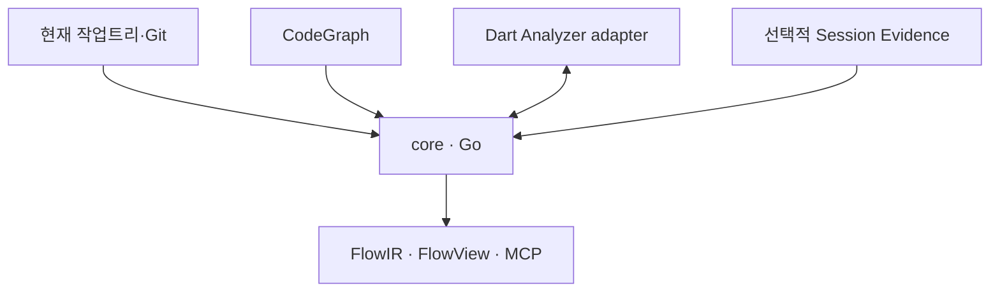
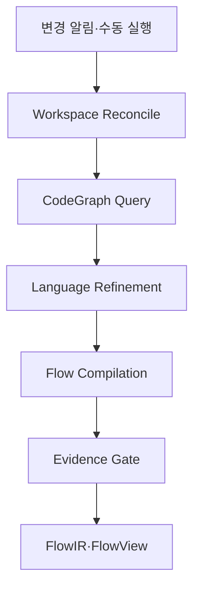

# CodeFlow v3.0 — Production Design Specification

> 상태: 구현 계약 확정안
> 작성일: 2026-08-18
> 초기 적용 대상: 정적 타입 단일 저장소, Flutter/Dart 프로젝트

---

## 1. 한 문장 정의

**CodeFlow는 현재 작업트리와 CodeGraph를 결합하여, 사용자 행동이 코드·상태·외부 경계를 통과하는 과정을 증거가 연결된 흐름으로 컴파일하는 로컬 개발 도구다.**

CodeFlow의 목표는 문서를 많이 만드는 것이 아니다. 개발이 끝났을 때 개발자가 다음 질문에 빠르게 답할 수 있게 하는 것이다.

- 사용자가 무엇을 하면 어떤 결과가 발생하는가?
- 그 동작은 어느 코드에서 결정되는가?
- 어떤 상태와 시스템 경계를 거치는가?
- 현재 작업으로 무엇이 달라졌는가?
- 무엇은 코드만으로 확실히 알 수 없는가?

---

## 2. 해결하려는 문제

AI Agent가 빠르게 코드를 구현할수록 사람이 작성된 코드를 이해하는 속도와의 차이가 커진다. 이 차이가 누적되면 다음 문제가 생긴다.

- 구현은 완료됐지만 전체 동작을 설명하기 어렵다.
- 파일은 많이 바뀌었지만 사용자 행동이 어떻게 달라졌는지 모른다.
- 조건문과 상태 전이가 여러 계층에 흩어져 핵심 규칙을 찾기 어렵다.
- Agent의 설명을 그대로 믿으면 구현자의 오해까지 설명에 복제될 수 있다.
- 세션 로그가 누락되거나 개발 세션이 종료되면 흐름을 복원하기 어렵다.

CodeFlow는 이를 **Current-State-First Flow Compilation**으로 해결한다.

> 세션이 무엇을 했다고 말하는지가 아니라, 지금 저장소에 실제로 무엇이 존재하는지를 먼저 본다.

---

## 3. 핵심 설계 원칙

1. **현재 작업트리가 최종 진실이다.**
   프롬프트, transcript, JSONL, 파일 이벤트는 보조 증거다.

2. **CodeGraph는 구조적 출발점이지 최종 판정자가 아니다.**
   그래프의 심볼과 관계는 현재 파일·해시·언어 분석기로 다시 검증한다.

3. **동작과 의미를 분리한다.**
   코드는 동작을 증명한다. “왜 필요한가”와 같은 비즈니스 의미는 사람 승인 전까지 추론으로 표시한다.

4. **세션 없이도 작동해야 한다.**
   종료된 세션, 누락된 로그, 다른 Agent가 작성한 코드도 저장소만으로 다시 분석할 수 있어야 한다.

5. **이벤트는 알림이지 사실 원장이 아니다.**
   삭제·rename·미커밋 변경을 이벤트만으로 복원하지 않는다. 최종 분석 전에 파일시스템과 Git을 다시 조사한다.

6. **증거 없는 설명을 완성된 흐름처럼 보여주지 않는다.**
   확인하지 못한 영역은 `unknown`으로 남긴다.

7. **한 번의 동작으로 코드 근거를 연다.**
   설명과 실제 코드가 멀어지면 이해 도구가 다시 인지 부담이 된다.

8. **Core는 Codex와 독립적이다.**
   CLI, 로컬 서버, MCP 중 어느 인터페이스에서도 동일한 결과를 생성한다.

9. **제품 코드는 읽기 전용이다.**
   CodeFlow는 분석 결과와 캐시에만 쓴다.

10. **LLM은 필수 경로가 아니다.**
    결정적 흐름은 LLM 없이 생성하고, LLM은 이름·요약·의도 후보만 보강한다.

11. **검증 비용도 인지부채로 취급한다.**
    별도의 Golden Flow 저장소를 유지하지 않는다. 자동 검증은 Schema·hash·앵커 같은 저비용 불변식에 한정하고, 실제 흐름의 정확성과 이해 가능성은 적용 기능을 보며 사람이 직접 확인한다.

---

## 4. 제품 형태

CodeFlow는 하나의 Agent나 Skill이 아니다. 제품 본체와 연결·배포 계층을 분리한다.

| 구성 | 역할 |
|---|---|
| `core` | 현재 상태 재조정, 흐름 컴파일, 증거 검증, 저장, 로컬 서버 |
| CodeGraph adapter | 이미 인덱싱된 심볼·호출·상속·경계 관계 조회 |
| Dart adapter | Dart 타입·심볼·Riverpod·라우팅·상태 전이 정밀 해석 |
| FlowView | 사용자가 흐름을 한눈에 보는 로컬 HTML 화면 |
| MCP | Codex와 다른 Agent가 CodeFlow 기능을 호출하는 표준 인터페이스 |
| Skill | Agent가 CodeFlow를 언제 어떤 순서로 사용할지 정의하는 얇은 작업 지침 |
| Plugin | Core 실행 설정, MCP, Skill, Hook, UI 자산을 팀에 배포하는 패키지 |

### 4.1 최종 기술 선택

| 영역 | 기술 |
|---|---|
| Core | **Go** |
| Dart 정밀 분석 | **Dart Analyzer adapter** |
| CodeGraph 연결 | HTTP API 우선, MCP는 보조 |
| 저장 | SQLite + 버전이 있는 JSON FlowIR |
| 화면 | 정적 HTML + 작은 TypeScript/JavaScript 번들 |
| Agent 연결 | Core에 포함된 MCP stdio 서버 |
| 배포 | 단일 `codeflow` 바이너리 + Dart adapter + Plugin 패키지 |

Go는 장기 실행 로컬 프로세스, 파일 감시, 스트림 처리, 병렬 I/O, HTTP, 단일 바이너리 배포를 균형 있게 만족한다. Dart는 Core 전체가 아니라 Dart 언어의 의미를 가장 정확하게 해석하는 어댑터에만 사용한다.

---

## 5. 전체 아키텍처



### 5.1 책임 경계

#### CodeGraph가 책임지는 것

- 파일·클래스·함수·심볼 색인
- 호출자·피호출자 관계
- import·상속·구현 관계
- 저장소 전체의 구조 탐색
- 변경된 파일의 그래프 갱신

#### CodeFlow Core가 책임지는 것

- 현재 작업트리가 CodeGraph와 일치하는지 검증
- 기준 revision과 현재 상태 비교
- 사용자 진입점에서 관련 관계만 선택
- 기술적 호출 관계를 사용자 행동 순서로 재배열
- 분기·상태 변화·외부 효과 연결
- 각 단계의 코드 근거와 현재성 검증
- 흐름 변화와 불확실성 계산
- HTML, CLI, MCP에 같은 결과 제공

#### Dart adapter가 책임지는 것

- 타입이 해석된 심볼과 실제 호출 대상
- `ref.watch`, `ref.read`, Provider 의존 관계
- `Notifier`·`AsyncNotifier`의 상태 변경
- `go_router` 진입점과 이동 대상
- Freezed/sealed class 분기
- CodeGraph의 구문 분석만으로 모호한 Dart 동적 지점 보강

#### 의미 계층이 책임지는 것

- 사람이 알아보기 쉬운 흐름·단계 이름 후보
- 세션에서 발견한 의도·결정 후보
- 코드 식별자와 도메인 표현 연결
- 설명 문장 축약

의미 계층은 코드 동작의 정답을 만들지 않는다.

---

## 6. 권위 있는 입력과 보조 입력

### 6.1 권위 있는 입력

우선순위는 다음과 같다.

1. **현재 파일시스템의 실제 내용과 해시**
2. **Git HEAD, index, 명시적 baseline**
3. **현재 파일과 대조된 CodeGraph 관계**
4. **Dart Analyzer가 해석한 타입·심볼 관계**
5. **기존 테스트·설정·계약 파일**

### 6.2 보조 입력

- 프롬프트와 프롬프트 변경
- Agent 응답
- Codex/도구 JSONL 이벤트
- transcript
- 도구 호출과 테스트 실행 결과
- OS 파일 이벤트 스트림
- PR 제목·설명

보조 입력은 다음 용도로만 사용한다.

- 기능 범위 후보 발견
- 사람이 의도한 목표 후보 생성
- 변경 과정의 결정·질문 후보 수집
- 분석 우선순위 조정

다음과 같은 주장의 단독 증거로는 사용할 수 없다.

- “현재 이 파일이 존재한다.”
- “이 함수가 실제로 호출된다.”
- “이 분기에서 이 화면으로 이동한다.”
- “이 변경이 최종 코드에 반영됐다.”

---

## 7. 처리 파이프라인



### 7.1 Workspace Reconcile

모든 분석은 재조정 단계에서 시작한다. watcher와 세션 이벤트는 “변경 가능성”만 알리고, 최종 상태는 실제 파일과 Git으로 다시 만든다.

```yaml
WorkspaceFile:
  path: string
  file_hash: string
  language: string
  generated: boolean
  git_state: clean | added | modified | deleted | renamed | untracked
```

고정 처리 순서는 다음과 같다.

1. 대상 경로의 실제 파일 전체 Manifest를 만든다.
2. Git HEAD, 명시적 baseline, index, 작업트리를 읽는다.
3. 추가·수정·삭제·rename·미추적 파일을 분류한다.
4. 각 파일의 원본 byte 기준 `file_hash`를 계산한다.
5. CodeGraph의 파일 hash와 현재 Manifest를 대조한다.
6. 불일치 파일은 재색인을 요청하고, 갱신 전 그래프 노드는 사용하지 않는다.
7. 변경 심볼과 reverse dependency로 영향 범위를 계산한다.
8. 영향받은 심볼만 언어 어댑터로 재분석한다.
9. 결과 저장 직전에 관련 파일 hash를 다시 읽는다.
10. 분석 중 파일이 바뀌었으면 한 번 재시도한다.
11. 계속 변경 중이면 마지막 일관된 Snapshot을 유지하고 `analyzing`으로 표시한다.
12. 새 Snapshot은 SQLite transaction과 atomic replace로 한 번에 공개한다.

추가 규칙:

- 삭제된 파일의 앵커는 현재 Flow에서 즉시 제거한다.
- rename이 확실하지 않으면 억지로 동일 파일로 연결하지 않고 `삭제 + 추가`로 취급한다.
- 서로 다른 시점의 파일이 하나의 Flow에 섞이는 것을 허용하지 않는다.
- 파일 watcher나 세션 이벤트가 전부 누락되어도 이 단계가 최종 상태를 복원해야 한다.

### 7.2 CodeGraph Query

Core는 CodeGraph 내부 라이브러리를 직접 import하지 않고 공개 HTTP 계약을 사용한다.

```text
POST /api/v1/tools/call
POST /api/v1/query
POST /api/v1/index
```

조회 결과는 그대로 신뢰하지 않고 다음을 검사한다.

- 경로가 현재 존재하는가?
- 심볼이 현재 파일에 존재하는가?
- line range의 content hash가 일치하는가?
- 호출 관계가 현재 revision 범위에 속하는가?

### 7.3 Language Refinement

CodeGraph가 찾은 영향 범위 중 의미 해석이 필요한 Dart 심볼만 Dart adapter로 전달한다.

```text
core → JSON-RPC/stdio → Dart adapter
core ← SemanticFact JSON ← Dart adapter
```

전체 저장소를 두 번 분석하지 않고 영향을 받은 심볼만 보강한다.

### 7.4 Flow Compilation

호출 그래프를 그대로 재생하지 않는다. 사용자 또는 시스템의 인과관계가 바뀌는 지점만 단계로 만든다.

```text
진입점 발견
  → 관련 GraphSlice 추출
  → 언어 제어 흐름으로 순서·분기 보강
  → 인과 사건 추출
  → 내부 helper 호출 축약
  → FlowStep 구성
  → Evidence Gate
```

다음 중 하나가 발생할 때 새로운 단계가 된다.

- 사용자 입력 또는 버튼 동작
- 중요한 조건 분기
- 도메인 또는 화면 상태 변경
- 라우트 이동
- repository 읽기·쓰기
- 외부 API 호출
- 사용자에게 보이는 성공·실패 결과

단순 helper, mapper, logger 호출은 별도 단계로 만들지 않는다.

각 단계의 기본 Code Lens는 최대 3개 앵커만 노출한다.

1. 분기를 결정하는 조건
2. 상태를 변경하는 코드
3. 외부 효과 또는 화면 결과를 발생시키는 코드

기본 코드 범위는 앵커당 5~20줄이다.

#### 안정적인 식별자

줄 번호와 파일 경로는 ID 생성에 사용하지 않는다. `behavior_key`는 전역 고유 ID가 아니라 revision 사이의 동작을 묶는 의미 매칭 키이며, 같은 Flow 안에서 중복될 수 있다.

```text
flow_id = entrypoint의 논리적 식별자
          예: route:/signup

behavior_key = flow_id + actor + effect_kind + effect_target
               예: route:/signup + system + route_transition + route:/terms
```

나머지 ID는 다음 규칙으로 결정적으로 생성한다.

```text
Fact.id = sha256(schema_version
                 + fact_kind
                 + canonical_subject_symbol
                 + canonical_object_symbol
                 + structural_control_flow_fingerprint)

FlowStep.id = sha256(flow_id
                     + trigger_fact_id
                     + ordered_causal_fact_ids)

Branch.id = sha256(condition_fact_id
                   + ordered_outcome_behavior_keys)
```

- canonical symbol은 SCIP symbol 또는 Dart library URI와 선언 경로로 만든 언어 표준 symbol이다.
- structural fingerprint는 주석·공백·줄 번호를 제외한 canonical AST에서 만든다.
- `FlowStep.id`는 Snapshot 내부 식별자다. revision 사이의 동일성 판정에는 사용하지 않는다.
- 동일한 `behavior_key`가 여러 개이면 하나의 매칭 bucket으로 다룬다.

FlowDelta는 각 `behavior_key` bucket 안에서 one-to-one 매칭하며 순서는 다음으로 고정한다.

1. `behavior_key` 일치
2. SCIP 또는 언어 심볼 일치
3. 구조적 코드 fingerprint 일치
4. 유일하게 매칭되지 않거나 둘 이상의 후보가 남으면 `삭제 + 추가`

이전 단계와 현재 단계를 LLM으로 매칭하지 않는다.

### 7.5 Evidence Gate

FlowIR에 들어가기 전 다음 조건을 통과해야 한다.

- `observed` 단계는 현재 해시와 일치하는 코드 앵커가 있다.
- 분기는 조건문·테스트·trace 중 하나 이상의 근거가 있다.
- 사용자에게 보이는 결과는 UI 상태·라우트·출력 코드 근거가 있다.
- 의미 계층이 만든 문장은 `inferred`를 넘을 수 없다.
- 끊긴 호출과 외부 동작은 추측하지 않고 `unknown`으로 남긴다.

Schema validation으로 다음 불변식을 강제한다.

- `session` 앵커만 가진 사실은 `observed`가 될 수 없다.
- `stale` 사실은 현재 FlowStep에 포함될 수 없다.
- Branch는 조건 앵커를 가져야 한다.
- visible result는 UI 상태 또는 route 앵커를 가져야 한다.
- 하나의 단계가 기본 노출하는 핵심 앵커는 3개를 넘지 않는다.

### 7.6 어댑터 계약

모든 어댑터는 자연어 설명이 아니라 구조화된 Fact만 반환한다. 외부 도구의 고유 형식은 adapter 내부에서 Core 표준 계약으로 정규화한다.

#### CodeGraph adapter

```go
type GraphProvider interface {
    Status(ctx, repo) GraphStatus
    EnsureIndexed(ctx, changes) IndexResult
    ResolveEntryPoints(ctx, scope) []EntryPoint
    Slice(ctx, entryPoint) GraphSlice
    Callers(ctx, symbols) []Relation
    Callees(ctx, symbols) []Relation
}
```

모든 Graph Fact는 `source_revision`, `file_hash`, 관계 양끝의 심볼, 증거 앵커를 포함한다.

#### Dart adapter

JSON-RPC 2.0 over stdio로 고정한다.

| 메서드 | 역할 |
|---|---|
| `initialize` | SDK·프로젝트·capability 확인 |
| `discoverEntryPoints` | route·화면·handler 발견 |
| `resolveSymbols` | 실제 타입과 호출 대상 해석 |
| `extractControlFlow` | 실행 순서와 조건 분기 추출 |
| `extractStateTransitions` | Provider·Notifier 상태 변화 추출 |
| `extractFrameworkFacts` | Riverpod·go_router·Freezed 해석 |
| `shutdown` | 프로세스 종료 |

#### Session adapter

Session adapter는 `USER_GOAL`, `FEATURE_SCOPE`, `DECISION`, `QUESTION`, `TEST_EVIDENCE`, `AGENT_ASSERTION`, `COMPLETION_CLAIM`만 반환한다. 코드 동작을 `observed`로 확정할 권한은 없다.

#### 공통 오류

```text
STALE_GRAPH
WORKTREE_CHANGED
ADAPTER_UNAVAILABLE
UNSUPPORTED_LANGUAGE
EVIDENCE_INVALID
EXTERNAL_BOUNDARY_UNKNOWN
ANALYSIS_TIMEOUT
```

오류가 발생하면 추측으로 대체하지 않고 `unknown` 또는 `unavailable`을 반환한다.

### 7.7 실행 가능한 Adapter 계약

M0의 adapter 계약은 인터페이스 선언만으로 완료되지 않는다. 다음 versioned artifact를 함께 고정한다.

- FlowIR JSON Schema
- CodeGraph 요청·응답 OpenAPI schema와 대표 fixture
- Dart adapter 각 JSON-RPC method의 params·result·error schema
- capability와 protocol version 협상 규칙
- pagination, index job polling, cancellation, deadline, partial result 규칙
- 외부 오류를 CodeFlow 공통 오류로 변환하는 표

CodeGraph의 응답에 현재 revision이나 hash가 없으면 Core가 현재 파일에서 검증 가능한 anchor를 다시 만들기 전까지 해당 관계를 `observed`로 사용하지 않는다. 지원하지 않는 필드와 기능은 자연어 추측이 아니라 typed `unknown`으로 반환한다.

---

## 8. 세션 관찰과 Micro Ontology

세션 관찰은 Core의 필수 입력이 아니라 선택적 의미 보강 과정이다.

### 8.1 수집 방식

가능한 source adapter가 다음 스트림을 읽는다.

- JSONL append stream
- transcript export
- prompt/response event
- tool invocation result
- test/build result
- 파일 변경 notification

진행 중인 세션은 tail 방식으로 읽고, 종료된 세션은 export된 파일을 batch로 읽는다.

### 8.2 정규화 단위

원문을 그대로 Flow로 만들지 않고 작은 의미 이벤트로 정규화한다.

```text
USER_GOAL
FEATURE_SCOPE
CODE_EDIT_INTENT
DECISION
QUESTION
TEST_EVIDENCE
AGENT_ASSERTION
COMPLETION_CLAIM
```

예시:

```json
{
  "type": "DECISION",
  "subject": "signup duplicate email",
  "statement": "중복 이메일이면 화면을 유지한다",
  "source": "session",
  "status": "inferred",
  "source_hash": "sha256:..."
}
```

### 8.3 저장 원칙

- 전체 transcript는 기본적으로 영구 저장하지 않는다.
- 정규화된 후보, source locator, 해시, 짧은 인용 범위만 저장한다.
- 시크릿 패턴이 탐지된 이벤트는 의미 처리에서 제외한다.
- 세션 데이터가 없더라도 CurrentFlow 생성에는 영향이 없어야 한다.
- 세션 데이터가 존재하면 `IntentCandidate`와 흐름 이름 후보만 보강한다.

### 8.4 종료된 세션

종료된 세션에서도 두 경로가 가능하다.

| 상황 | 동작 |
|---|---|
| transcript/JSONL export가 있음 | batch 정규화 후 IntentCandidate 보강 |
| 세션 자료가 없음 | 현재 작업트리와 Git만으로 CurrentFlow 재생성 |

따라서 세션 보존 여부가 CodeFlow의 재현성을 결정하지 않는다.

---

## 9. 핵심 데이터 모델

CodeFlow 내부에서는 UI 문장보다 구조화된 `FlowIR`을 먼저 만든다. 결정적 사실과 사용자용 자연어 설명은 물리적으로 분리한다.

### 9.1 FlowDocument

```yaml
FlowDocument:
  schema_version: string
  basis: FlowBasis
  facts: FactSet
  architecture: ArchitectureSlice
  current: BehaviorFlow
  semantic_overlay: SemanticOverlay
  delta: FlowDelta | null
  unknowns: [Unknown]
```

### 9.2 FlowBasis

```yaml
FlowBasis:
  repository: string
  head_revision: string
  baseline_revision: string | null
  worktree_fingerprint: string
  dirty: boolean
```

동일한 `FlowBasis`가 아니면 두 Flow를 같은 현재 상태로 취급하지 않는다.

`FlowBasis`와 결정적 FlowIR에는 생성 시각을 넣지 않는다. 다음 publication metadata는 저장·응답 envelope에만 둔다.

```yaml
SnapshotMetadata:
  generated_at: timestamp
  runtime_status: ready | analyzing | unavailable
  view_url: string | null
```

동일 입력에 대한 결정성은 canonical JSON으로 직렬화한 FlowIR 본문에 적용한다. 집합 의미의 배열은 정렬하고, 인과 순서인 `BehaviorFlow.steps`와 branch outcome 순서는 보존한다.

### 9.3 FactSet

```yaml
FactSet:
  facts: [Fact]

Fact:
  id: string
  kind: entry_point | call | condition | state_transition
      | route_transition | repository_access | external_call
      | visible_result | terminal_result
  subject: string
  object: string | null
  evidence: [EvidenceAnchor]
  status: observed | stale | unknown
```

`FactSet`은 Core와 어댑터가 만든 결정적 사실의 집합이다. LLM과 세션 계층은 이 영역에 쓸 수 없다.
조건의 모든 선택지가 resolved AST에서 확인되면 실제 실행 시 하나만 선택되더라도 `unknown`이 아니다.
화면 이동 없이 끝나는 명시적 `return`은 `terminal_result`로 기록한다.

### 9.4 BehaviorFlow

외부 UX에서는 `CurrentFlow`라고 부르지만 내부 정규 모델은 `BehaviorFlow`다. 코드가 증명하는 것은 비즈니스 의도 자체가 아니라 현재 동작이기 때문이다.

```yaml
BehaviorFlow:
  id: string
  flow_key: string
  entry_point_fact: Fact.id
  steps: [FlowStep]
  status: observed | mixed | unknown
```

### 9.5 FlowStep

```yaml
FlowStep:
  id: string
  behavior_key: string
  order: int
  actor: user | system | external
  trigger_fact: Fact.id
  behavior_facts: [Fact.id]
  result_facts: [Fact.id]
  branches: [Branch]
  primary_evidence: [EvidenceAnchor]
  intent_refs: [IntentCandidate.id]
  status: observed | mixed | unknown
```

```yaml
Branch:
  id: string
  condition_fact: Fact.id
  outcome_step_ids: [FlowStep.id]
  evidence: [EvidenceAnchor]
  status: observed | unknown
```

`StepCodeLens`는 별도 진실 원장이 아니라 `FlowStep.primary_evidence`에서 만들어지는 표시 모델이다.

```yaml
StepCodeLens:
  step_id: FlowStep.id
  snippets:
    - anchor: EvidenceAnchor
      code: string
      role: decision | state_change | visible_effect
```

### 9.6 SemanticOverlay

사람이 읽기 쉬운 이름과 설명만 담는다.

```yaml
SemanticOverlay:
  flow_title:
    text: string
    status: inferred | confirmed
  step_descriptions:
    - step_id: FlowStep.id
      action_text: string
      result_text: string | null
      intent: string | null
      status: inferred | confirmed
```

LLM은 `SemanticOverlay`만 제안할 수 있다. Fact, Branch 정답, 상태 전이를 만들거나 변경할 수 없다.

### 9.7 EvidenceAnchor

```yaml
EvidenceAnchor:
  kind: code | test | config | contract | trace | session
  path: string
  symbol: string | null
  line_range: [int, int] | null
  byte_range: [int, int] | null
  file_hash: string
  span_hash: string | null
  semantic_fingerprint: string | null
  captured_at_revision: string
```

`session` 앵커는 의도 설명을 지지할 수 있지만 `observed` 코드 동작의 유일한 앵커가 될 수 없다.

Hash 계약은 다음으로 고정한다.

- `file_hash`는 newline·공백을 정규화하지 않은 원본 file byte의 SHA-256이다.
- `span_hash`는 anchor의 정확한 byte range에 대한 SHA-256이다.
- `semantic_fingerprint`는 주석·공백·줄 번호를 제외한 canonical AST fingerprint다.
- repository fingerprint는 repository-relative path, file type·mode, `file_hash`, Git state tuple을 path 순으로 정렬해 SHA-256으로 계산한다.
- path separator는 `/`로 정규화한다. symlink는 기본적으로 따라가지 않고 link target byte를 hash한다.
- generated file은 Manifest에 `generated: true`로 기록할 수 있지만 기본 동작 분석에서는 제외한다.

### 9.8 ArchitectureSlice

전체 시스템 지도가 아니라 선택한 흐름과 관련된 최소 아키텍처만 담는다.

```yaml
ArchitectureSlice:
  entry_points: [string]
  boundaries: [ui, application, domain, data, external]
  components: [string]
  relations: [call, read, write, transition, side_effect]
```

### 9.9 FlowDelta

```yaml
FlowDelta:
  baseline: string
  added_steps: [FlowStep.id]
  removed_steps: [FlowStep.id]
  matched_steps:
    - before: FlowStep.id
      after: FlowStep.id
      basis: behavior_key | symbol | structural_fingerprint
  changed_results: [FlowStep.id]
  changed_branches: [FlowStep.id]
  new_unknowns: [Unknown.id]
```

### 9.10 IntentCandidate

```yaml
IntentCandidate:
  id: string
  statement: string
  source: session | pr | document | human
  anchors: [EvidenceAnchor]
  status: inferred | confirmed | stale
```

### 9.11 Unknown

```yaml
Unknown:
  id: string
  question: string
  reason: missing_relation | dynamic_dispatch | external_system
        | missing_contract | stale_graph | evidence_conflict
  related_steps: [FlowStep.id]
  evidence: [EvidenceAnchor]
```

### 9.12 Schema 강제 규칙

- `observed Fact`는 코드·설정·테스트·계약 중 하나 이상의 앵커가 필요하다.
- `session` 앵커만 가진 항목은 `IntentCandidate` 또는 `SemanticOverlay`에만 들어간다.
- `stale Fact`는 현재 `BehaviorFlow`에서 참조할 수 없다.
- line number와 자연어 문장은 ID 생성에 사용하지 않는다.
- `behavior_key`와 Fact 관계가 같으면 설명 문구가 달라도 동일 동작으로 본다.
- raw CodeGraph 전체를 FlowIR에 복사하지 않고 현재 흐름에 필요한 ArchitectureSlice만 저장한다.
- 모든 Schema는 `schema_version`을 가지며 Core 시작 시 호환성을 검사한다.

---

## 10. 신뢰 상태

| 상태 | 의미 | 기본 UI |
|---|---|---|
| `observed` | 현재 코드·설정·테스트에서 직접 확인 | 표시 |
| `confirmed` | 사람이 의미 또는 이름을 승인 | 표시 + 승인 근거 |
| `inferred` | 의미 계층 또는 세션에서 추론 | 기본 접힘 |
| `unknown` | 증거가 부족하거나 경계 밖 | 경고와 함께 표시 |
| `stale` | 앵커가 현재 작업트리와 불일치 | 현재 흐름에서 제외, 재분석 표시 |

CodeFlow가 사용자 화면에서 “현재 동작”이라고 부를 수 있는 것은 `observed` Fact뿐이다. `confirmed`는 사람이 승인한 이름·의도·설명에만 사용한다.

---

## 11. 사용자 경험: HTML FlowView

기본 UX는 여러 CLI 명령을 탐색하는 여정이 아니라 자동 갱신되는 단일 HTML 화면이다.

### 11.1 화면 구성

1. **상단 상태**
   흐름 이름, 현재 revision, dirty 여부, baseline, 마지막 갱신 시각

2. **세로 Flow Timeline**
   사용자 행동 → 시스템 처리 → 보이는 결과를 순서대로 표시

3. **선택한 단계의 Code Lens**
   핵심 코드 5~20줄, 파일·심볼·상태 라벨, IDE 열기

4. **변화와 불확실성**
   baseline 대비 변경된 단계와 `unknown`을 해당 위치에 직접 표시

### 11.2 단계 카드

```text
3. 인증 코드를 확인한다                         [observed]

사용자 행동     인증 코드 입력 후 확인 버튼을 누른다
시스템 처리     SignUpNotifier가 VerifyCodeUseCase를 실행한다
보이는 결과     성공하면 약관 화면으로 이동한다
분기            만료된 코드 → 오류 표시 후 현재 화면 유지

[핵심 코드 보기] [왜 필요한가?] [분기 보기]
```

### 11.3 UX 규칙

- 평범한 단계도 생략하지 않아 전체 순서를 먼저 형성한다.
- 한 단계에는 핵심 코드만 보여주고 전체 파일은 요청할 때 연다.
- `inferred` 설명은 관찰된 동작과 섞지 않는다.
- `unknown`은 흐름의 해당 위치에 둔다.
- 분기는 세로로 확장하며 전체 그래프를 한 화면에 펼치지 않는다.
- FlowDelta는 파일 diff보다 먼저 보여준다.
- ArchitectureSlice는 별도 전체 지도 대신 현재 흐름의 경계로 표현한다.

### 11.4 산출물

| 산출물 | 답하는 질문 |
|---|---|
| `CurrentFlow` | 지금 실제로 어떻게 동작하는가? |
| `FlowDelta` | 이번 작업으로 무엇이 달라졌는가? |
| `ArchitectureSlice` | 어떤 계층과 경계를 통과하는가? |
| `StepCodeLens` | 이 단계의 핵심 코드는 무엇인가? |
| `IntentCandidate` | 왜 이렇게 만들었을 가능성이 있는가? |
| `Unknown` | 어디부터는 확실히 말할 수 없는가? |

---

## 12. Core 실행 형태

Core는 하나의 Go 바이너리로 제공한다.

```bash
codeflow
```

기본 사용은 다음 한 명령으로 끝나야 한다.

```bash
codeflow open signup
```

이 명령은 Core 실행 여부 확인, CodeGraph·Dart adapter 점검, Workspace Reconcile, Flow 컴파일, FlowView 열기까지 수행한다. 별도의 daemon 운영법을 사용자가 먼저 배울 필요가 없다.

### 12.1 프로세스 계약

저장소마다 하나의 Core 프로세스만 허용한다.

```text
codeflow process
├── Workspace Reconciler
├── Flow Compiler
├── SQLite
├── HTTP FlowView
├── MCP server
└── Dart adapter child process

CodeGraph
└── 독립 로컬 서비스
```

실행 상태는 다음 파일로 관리한다.

```text
.codeflow/runtime.json
.codeflow/codeflow.lock
```

```yaml
RuntimeState:
  pid: int
  port: int
  repository_fingerprint: string
  auth_token: string
  started_at: timestamp
```

- PID와 repository fingerprint를 함께 확인한다.
- 비정상 종료가 남긴 lock은 자동 복구한다.
- HTTP는 `127.0.0.1`의 임의 port에만 bind한다.
- FlowView와 Core 통신에는 runtime token을 사용한다.
- SQLite는 WAL을 사용하고 Snapshot 교체는 transaction으로 수행한다.
- 캐시는 언제든 삭제하고 현재 작업트리에서 재생성할 수 있어야 한다.
- 캐시 Schema가 호환되지 않으면 복잡한 migration 대신 재생성한다.
- 사람이 승인한 이름·의도만 보존 migration 대상이다.

### 12.2 CLI

```bash
codeflow doctor
codeflow analyze signup
codeflow diff signup --baseline <revision>
codeflow serve
codeflow open signup
codeflow refresh signup
codeflow mcp
```

| 명령 | 역할 |
|---|---|
| `doctor` | Git, CodeGraph, Dart SDK, adapter, 설정 점검 |
| `analyze` | 현재 작업트리 기준 일회성 Flow 생성 |
| `diff` | 명시적 baseline과 현재 Flow 비교 |
| `serve` | watcher, 증분 분석, 로컬 FlowView 서버 실행 |
| `open` | 선택한 FlowView 열기 |
| `refresh` | 이벤트 상태와 무관하게 강제 재조정 |
| `mcp` | stdio MCP 서버 실행 |

### 12.2.1 Feature selector 해석

`codeflow open signup` 같은 shorthand는 다음 순서로 해석한다.

1. `route:/signup` 같은 정확한 logical entry point
2. `codeflow.yaml`에 사람이 명시한 alias
3. Dart adapter가 발견한 route segment·symbol·file 기반 alias 중 유일한 후보

후보가 없으면 사용 가능한 entry point를 보여주고 종료한다. 둘 이상의 후보가 있으면 candidate 목록을 보여주며 자동 선택하지 않는다. 자동 발견은 `codeflow.yaml`을 수정하지 않는다.

### 12.3 MCP 표면

```text
codeflow.current(feature)
codeflow.diff(feature, baseline)
codeflow.step(step_id)
codeflow.unknowns(feature)
codeflow.refresh(feature)
codeflow.open(feature)
```

MCP는 Core 기능의 얇은 어댑터다. 별도의 분석 로직을 갖지 않는다.
`codeflow mcp`가 여러 Agent에 의해 실행되더라도 기존 저장소 Core에 연결하며 분석 엔진을 중복 실행하지 않는다.

MCP transport는 modern `2026-07-28`과 legacy `2025-11-25`를 함께 지원한다. client의 첫 요청으로 era를 판별하고, 두 경로 모두 동일한 tool handler와 `CodeFlowResponse`를 사용한다. 지원 범위와 legacy 종료 정책은 release manifest에 명시한다. 알 수 없는 version은 자동 추정하지 않고 호환성 오류와 해결 방법을 반환한다.

모든 MCP 응답은 다음 공통 envelope을 사용한다.

```yaml
CodeFlowResponse:
  basis: FlowBasis
  status: ready | analyzing | unavailable
  data: object | null
  unknowns: [Unknown]
  view_url: string | null
```

### 12.4 Skill과 Plugin

Skill은 다음과 같은 workflow만 정의한다.

- 기능 이해 요청 시 `codeflow.current` 호출
- 변경 검토 시 `codeflow.diff` 우선 호출
- 사용자 설명에서 `unknown`과 신뢰 상태 보존
- 사용자가 원할 때 FlowView 열기

Plugin은 다음을 묶는 배포 단위다.

- Skill
- MCP 설정
- 선택적 세션 Hook
- FlowView 정적 자산
- Core 설치·발견 설정

Plugin이 Core를 대체하지 않는다.

### 12.5 배포와 호환성

- macOS 초기 배포는 Homebrew 또는 서명된 release binary를 사용한다.
- Core는 대상 프로젝트의 Flutter/Dart SDK를 자동 탐색해 Dart adapter를 실행한다.
- Plugin은 PATH 또는 명시적 설정에서 `codeflow`를 찾는다.
- Core, FlowIR Schema, CodeGraph adapter, Dart adapter, Plugin 버전을 handshake에서 확인한다.
- 호환되지 않는 조합은 실행을 중단하고 해결 방법을 표시한다.
- 설치·업데이트 실패가 프로젝트 파일을 변경해서는 안 된다.

---

## 13. 저장소 구조

```text
codeflow/
├── core/
│   ├── cmd/codeflow/
│   └── internal/
│       ├── config/
│       ├── workspace/
│       ├── baseline/
│       ├── reconcile/
│       ├── graph/
│       ├── session/
│       ├── ontology/
│       ├── compiler/
│       ├── evidence/
│       ├── storage/
│       ├── server/
│       └── mcp/
├── adapters/
│   ├── codegraph/
│   └── dart/
├── view/
├── skills/
├── plugin/
└── schemas/
```

대상 프로젝트에는 다음만 둔다.

```text
sgp-981-app/
├── codeflow.yaml
└── .codeflow/
    ├── knowledge/       # 사람 승인 이름·의도, 선택적 Git 추적
    ├── flows/           # 재생성 가능한 FlowIR
    ├── cache/
    ├── state.db
    ├── runtime.json
    └── codeflow.lock
```

초기 `codeflow.yaml` 계약은 다음 최소 schema로 고정한다. 알 수 없는 field는 경고하고, 지원하지 않는 `schema_version`은 실행을 중단한다.

```yaml
schema_version: "1"
repository:
  id: "sgp-981-app"
analysis:
  include: ["apps/**", "packages/**"]
  exclude: ["**/.env*", "**/build/**", "**/.dart_tool/**", "**/*.g.dart", "**/*.freezed.dart"]
features:
  signup:
    entry_point: "route:/signup"
```

- `repository.id`는 사용자가 옮겨도 유지되는 논리 ID다.
- `features` key는 명시적 shorthand alias이며 하나의 logical entry point만 가리킨다.
- include·exclude는 repository-relative glob이다. exclude가 include보다 우선한다.
- 설정이 없어도 unique-only 자동 발견은 동작하며 어떤 파일도 생성하거나 수정하지 않는다.

| 데이터 | Git 정책 |
|---|---|
| `codeflow.yaml` | 추적 |
| 사람이 승인한 이름·의도 | 선택적 추적 |
| FlowIR | 기본 미추적 |
| cache·SQLite | 미추적 |
| runtime·lock | 미추적 |
| 원본 transcript | 기본 비저장 |

---

## 14. 변경 감지와 재현성

### 14.1 진행 중인 개발

```text
파일 이벤트
  → 영향 후보 표시
  → debounce
  → Workspace Reconcile
  → 영향받은 Flow 재컴파일
  → 열린 FlowView 갱신
```

### 14.2 구현 완료 시점

세션 종료 Hook이 존재하면 `codeflow refresh`를 호출한다. Hook이 없거나 실패해도 사용자가 `analyze`, `open`, `serve`를 실행하면 동일한 재조정이 일어난다.

따라서 “Agent 구현 완료와 이해 결과 완성”은 Hook으로 가까워지지만, Hook에 의존하지 않는다.

### 14.3 Baseline Snapshot

명시적 baseline은 먼저 immutable commit SHA로 resolve한다. branch와 tag를 입력할 수 있지만 결과에는 resolve된 commit SHA만 저장한다.

Core는 checkout이나 현재 worktree 변경 없이 Git object database에서 baseline tree와 blob을 읽어 `.codeflow/cache/baselines/<commit>/` 아래의 격리된 분석 mirror를 만든다. CodeGraph와 Dart adapter의 baseline 분석은 이 mirror만 대상으로 한다.

- baseline anchor의 `captured_at_revision`은 resolve된 commit SHA다.
- file hash는 Git blob에서 얻은 원본 byte로 계산한다.
- dependency는 기존 local SDK와 package cache만 사용한다.
- 자동 network fetch나 `pub get`을 제품 저장소에서 실행하지 않는다.
- 필요한 dependency가 local에 없으면 해당 의미 분석을 `unknown`으로 남긴다.
- mirror와 생성된 분석 산출물은 재생성 가능한 cache이며 제품 코드를 변경하지 않는다.

### 14.4 재현 키

Flow 결과는 다음 조합으로 식별한다.

```text
repository id
+ baseline revision
+ HEAD revision
+ worktree fingerprint
+ CodeFlow schema version
+ language adapter version
```

세션 ID는 재현 키에 포함하지 않는다.

---

## 15. 장애와 저하 동작

| 실패 | 동작 |
|---|---|
| 세션 데이터 없음 | 정상 분석. IntentCandidate만 생략 |
| 파일 watcher 이벤트 누락 | 다음 reconcile에서 현재 상태 복원 |
| CodeGraph 갱신 지연 | 현재 해시 불일치 앵커를 사용하지 않고 재색인 요청 |
| CodeGraph 사용 불가 | 저장소 전체 흐름을 완성하지 않고 분석 불가 사유 표시 |
| Dart adapter 사용 불가 | Dart 의미가 필요한 단계는 `unknown`; 완성된 흐름으로 표시하지 않음 |
| LLM 사용 불가 | 관찰된 Flow는 유지, 자연어 이름·의도 보강만 생략 |
| 외부 시스템 계약 없음 | 경계에서 `unknown`으로 종료 |
| 앵커 해시 변경 | 연결된 설명을 즉시 `stale` 처리 후 재컴파일 |

부분 결과를 제공하더라도 어떤 부분이 유효하고 어떤 부분이 미확인인지 명확히 분리한다.

---

## 16. 보안과 프라이버시

- 모든 분석은 로컬 우선이다.
- Core와 adapter는 제품 코드에 쓰지 않는다.
- FlowView 서버는 기본적으로 loopback에만 bind한다.
- MCP와 HTTP 입력은 shell command로 직접 연결하지 않는다.
- `.env*`, secrets, generated, build 디렉터리는 기본 제외한다.
- LLM을 사용할 경우 필요한 앵커와 제한된 주변 코드만 전송한다.
- 전송 전 secret scanner를 통과해야 한다.
- 원본 prompt·response·transcript는 기본 영구 저장하지 않는다.
- 세션 수집은 명시적으로 지원되는 source adapter와 사용자가 허용한 경로만 읽는다.

---

## 17. 성능 예산

초기 기준 저장소: 20만 LOC, 변경 파일 15개 이하.

| 작업 | 목표 |
|---|---|
| 캐시된 FlowView 열기 | p95 1초 이하 |
| 파일 이벤트 → 영향 후보 계산 | p95 1초 이하 |
| 변경 파일 reconcile | p95 5초 이하 |
| 캐시 적중 CurrentFlow 재컴파일 | p95 10초 이하 |
| Code Lens 열기 | p95 500ms 이하 |
| 의미 보강 | 비동기, 결정적 Flow 표시를 막지 않음 |

CodeGraph의 전체 재색인과 선택적 의미 계층은 사용자 화면의 크리티컬 패스에서 제외한다.

---

## 18. 초기 구현 범위

### 포함

- 단일 Flutter/Dart 저장소
- 현재 작업트리 및 Git baseline 재조정
- CodeGraph HTTP adapter
- Dart Analyzer adapter
- `go_router` 진입점
- Riverpod Provider·Notifier 관계
- 사용자 행동, 상태 변경, 라우팅, repository, 외부 API 흐름
- CurrentFlow와 FlowDelta
- 단계별 핵심 코드
- `unknown`과 상태 라벨
- 단일 HTML FlowView
- CLI와 MCP
- 선택적 JSONL/transcript batch 처리

### 제외

- 다중 저장소 장기 추적
- 완전한 시스템 지도
- 그래프 DB 재구현
- Vault 또는 Vault-Graph 의존
- 항상 실행되는 두 번째 LLM Agent
- 제품 코드 자동 수정
- 모든 세션 도구의 비공식 내부 로그 강제 수집
- 개인별 이해도·평가 시스템
- 화려한 대시보드와 복수 UX 동시 구현
- TUI 우선 구현
- 전용 Golden Flow 저장소와 기대 Flow 지속 관리
- 다수 참여자를 요구하는 정기적 사용성 실험

---

## 19. 구현 단계

### M0 — 구현 계약 고정

- FlowIR JSON Schema
- CodeGraph adapter 계약
- Dart adapter JSON-RPC 계약
- Workspace Reconcile 알고리즘
- `flow_id`·`behavior_key`·FlowDelta 매칭 규칙
- MCP 공통 응답과 오류 코드
- runtime·저장·호환성 계약

**완료 조건:** 구현 Agent가 별도 해석 없이 같은 입력·출력·오류·ID 규칙을 적용할 수 있다.

### M1 — Current-State Core

- Go CLI
- workspace scan
- Git baseline·dirty 상태
- hash·stale 처리
- SQLite cache
- 강제 reconcile

**완료 조건:** 파일 추가·수정·삭제·rename을 세션 로그 없이 정확히 복원한다.

### M2 — Graph와 Dart 의미 결합

- CodeGraph HTTP query
- 앵커 현재성 검증
- Dart Analyzer worker
- go_router·Riverpod 해석
- ArchitectureSlice

**완료 조건:** 실제 적용 기능 한 개의 핵심 호출·상태·라우팅 관계를 증거와 함께 재현하고 사용자가 직접 확인한다.

### M3 — Flow Compiler와 Evidence Gate

- CurrentFlow
- FlowDelta
- Branch·Fact·Unknown
- StepCodeLens
- 상태 라벨

**완료 조건:** 모든 `observed` 단계가 유효한 현재 코드 앵커를 가진다.

### M4 — FlowView

- 세로 timeline
- 단계별 코드
- inline delta
- unknown 표시
- 자동 갱신

**완료 조건:** 사용자가 실제 기능의 흐름·핵심 코드·변경점·`unknown`을 한 화면에서 직접 확인하고 승인한다.

### M5 — Agent 연결과 의미 보강

- MCP
- 얇은 Skill
- Plugin 패키징
- 세션 source adapter
- Micro Ontology
- IntentCandidate

**완료 조건:** 세션 유무와 관계없이 동일한 CurrentFlow가 생성되고, 세션이 있으면 의도 후보만 추가된다.

---

## 20. 검증 정책

별도의 Golden Flow 저장소를 만들지 않는다. 기대 Flow 파일을 장기간 관리하거나 출력 변경 때마다 갱신하는 비용이 실제 인지부채 감소 효과보다 커질 수 있기 때문이다.

검증은 **저비용 자동 불변식 검사 + 실제 기능에 대한 사용자 직접 확인**으로 고정한다.

### 20.1 자동 불변식 검사

자동화는 정답 Flow 전체가 아니라 시스템이 절대로 위반해서는 안 되는 조건만 검사한다.

- 모든 출력이 JSON Schema를 통과한다.
- `observed Fact`의 파일·심볼이 현재 작업트리에 존재한다.
- 앵커의 현재 `file_hash`와 `span_hash`가 저장된 hash와 일치한다.
- `stale Fact`가 현재 BehaviorFlow에 포함되지 않는다.
- Branch가 조건 앵커 없이 생성되지 않는다.
- 세션 앵커만으로 코드 동작을 `observed` 처리하지 않는다.
- 동일 입력의 결정적 계층은 동일한 FlowIR을 생성한다.
- cache 삭제 후에도 현재 작업트리에서 재생성할 수 있다.

이 검사는 작은 unit·contract test로 유지하며 별도 Golden 저장소를 요구하지 않는다.

### 20.2 사용자 직접 확인

각 주요 마일스톤에서 실제 적용 기능 한 개를 CodeFlow로 열어 사용자가 다음 항목만 확인한다.

1. 사용자 시작 행동과 최종 결과가 맞는가?
2. 중요한 분기와 상태 변화가 빠지지 않았는가?
3. 기본 노출 코드가 그 단계를 이해하는 데 실제로 중요한 코드인가?
4. baseline 대비 FlowDelta가 과도한 노이즈 없이 변경을 보여주는가?
5. 확실하지 않은 부분이 `unknown`으로 남아 있는가?

확인 결과는 별도 기대 Flow로 저장하지 않는다. 구현 수정에 필요한 이슈만 남기고 승인 여부로 마일스톤을 결정한다.

### 20.3 세션 독립성 확인

동일한 작업트리를 다음 두 방식으로 한 번씩 분석해 관찰된 동작과 코드 앵커가 같은지 직접 확인한다.

1. 개발 세션 중 실시간 관찰 후 생성
2. 세션 자료 없이 종료 후 재생성

IntentCandidate와 표현 문구는 달라도 되지만 `FactSet`과 `BehaviorFlow`가 달라지면 안 된다.

### 20.4 중단 기준

다음 검증 활동은 도입하지 않는다.

- 모든 기능의 기대 Flow 작성
- HTML 전체 snapshot 비교
- line number까지 고정하는 출력 비교
- 정기적인 다수 사용자 실험
- 문구 변경마다 Golden 갱신

검증 작업 자체가 별도의 유지 프로젝트가 되기 시작하면 인지부채 해결이라는 원래 목표를 침해한 것으로 판단한다.

---

## 21. 최종 사용자 경험

사용자는 CodeFlow를 배우기 위해 새로운 CLI 여행을 하지 않는다.

직접 사용할 때는:

```bash
codeflow open signup
```

한 번만 실행하면 필요한 Core가 시작되고 FlowView가 열린 뒤 변경에 따라 갱신된다. `codeflow serve`는 명시적으로 백그라운드 실행을 제어하려는 경우에만 사용한다.

Codex에서는 다음처럼 요청한다.

> “현재 작업트리 기준으로 회원가입 흐름을 보여줘.”

Codex는 Skill의 지침에 따라 MCP를 호출하고, CodeFlow는 현재 상태를 재조정한 뒤 FlowView를 연다.

사용자가 최종적으로 받는 것은 다음 한 화면이다.

- 위에서 아래로 이어지는 사용자 흐름
- 각 단계의 보이는 결과와 상태 변화
- 분기와 외부 경계
- 이번 작업으로 달라진 지점
- 단계별 핵심 코드
- 확인된 사실, 추론, 불확실성의 구분

---

## 22. 최종 결정 요약

1. 프로젝트 이름은 **CodeFlow**다.
2. 본체 이름은 **`core`**다.
3. Core는 **Go 단일 로컬 바이너리**로 구현한다.
4. Dart 의미 분석은 **Dart Analyzer adapter**가 맡는다.
5. CodeGraph는 저장소 구조의 주요 소스이며 **공개 HTTP API로 연결**한다.
6. 현재 작업트리가 최종 진실이며 세션 데이터는 의도 보강에만 사용한다.
7. 삭제·미커밋·rename은 이벤트 기록이 아니라 **Workspace Reconcile**로 판정한다.
8. 핵심 결과는 `CurrentFlow`, `FlowDelta`, `ArchitectureSlice`, `StepCodeLens`, `Unknown`이다.
9. 기본 UX는 자동 갱신되는 **단일 HTML FlowView**다.
10. MCP는 연결, Skill은 사용 지침, Plugin은 배포를 담당한다.
11. 세션이 끝나거나 기록이 없어도 같은 코드 동작을 다시 생성할 수 있어야 한다.
12. CodeFlow의 성공은 흐름 수가 아니라 **사람이 현재 코드를 더 빠르고 정확하게 설명할 수 있는가**로 판단한다.
13. Workspace Reconcile은 실제 파일 Manifest와 Git을 기준으로 일관된 Snapshot을 원자적으로 만든다.
14. Flow Compiler는 인과 사건 중심으로 단계를 구성하고 `behavior_key`로 FlowDelta를 매칭한다.
15. 모든 adapter는 자연어가 아닌 근거가 있는 Fact만 반환한다.
16. FlowIR은 결정적 `FactSet`·`BehaviorFlow`와 의미 표현 `SemanticOverlay`를 분리한다.
17. 기본 실행은 `codeflow open <feature>` 한 명령이며 저장소별 Core 프로세스 하나만 유지한다.
18. 전용 Golden Flow 저장소는 만들지 않는다. 자동 검증은 저비용 불변식에 한정하고 실제 Flow는 사용자가 직접 확인한다.

---

## 참고 구현 근거

- [CodeGraphContext Architecture](https://codegraphcontext.github.io/concepts/architecture/)
- [CodeGraphContext HTTP API](https://codegraphcontext.github.io/reference/api/)
- [Dart Static Analysis](https://dart.dev/tools/analysis)
- [Model Context Protocol SDKs](https://modelcontextprotocol.io/docs/2026-07-28/sdk)
- [Tree-sitter](https://tree-sitter.github.io/tree-sitter/)
