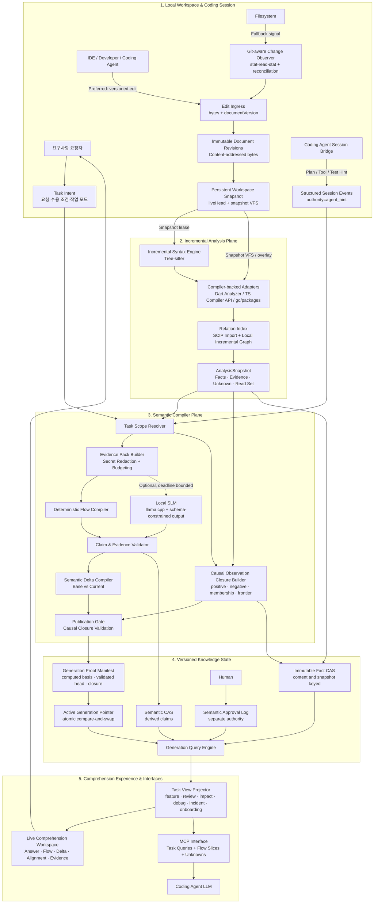
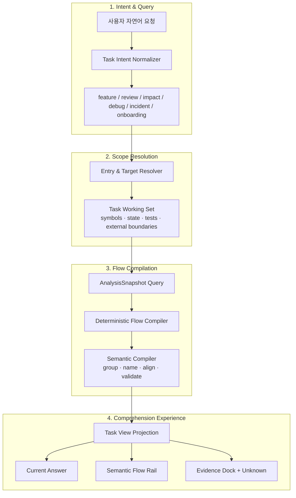
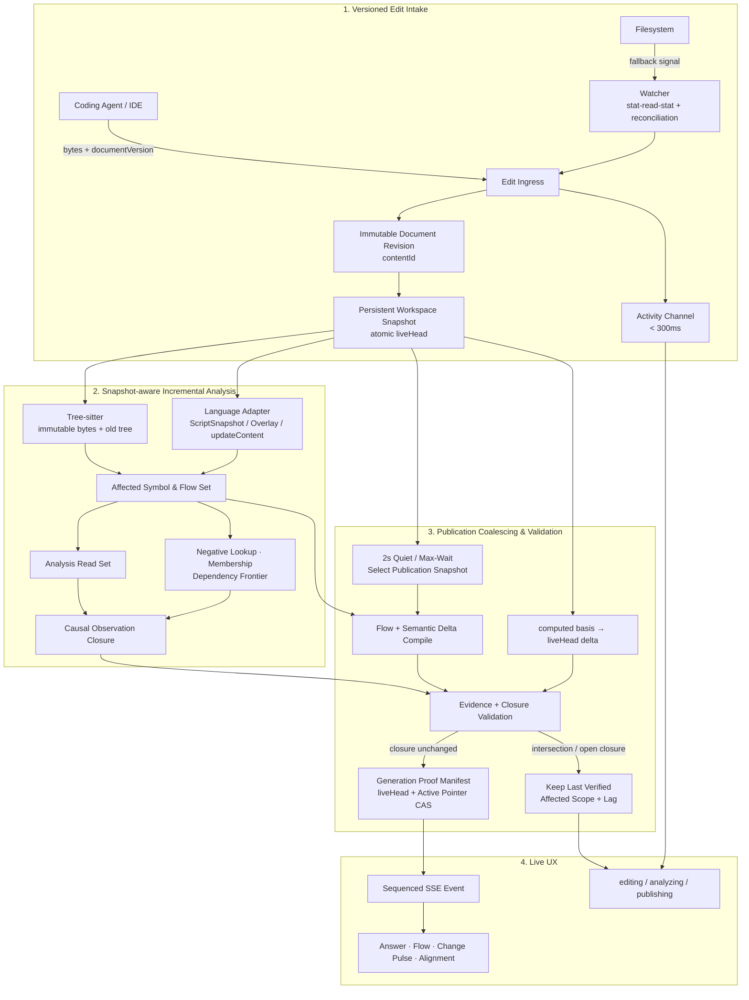
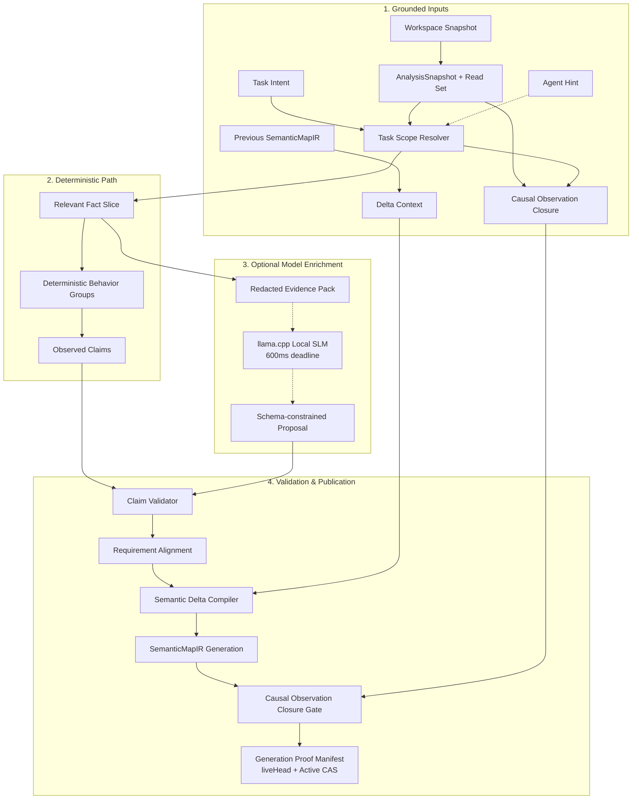
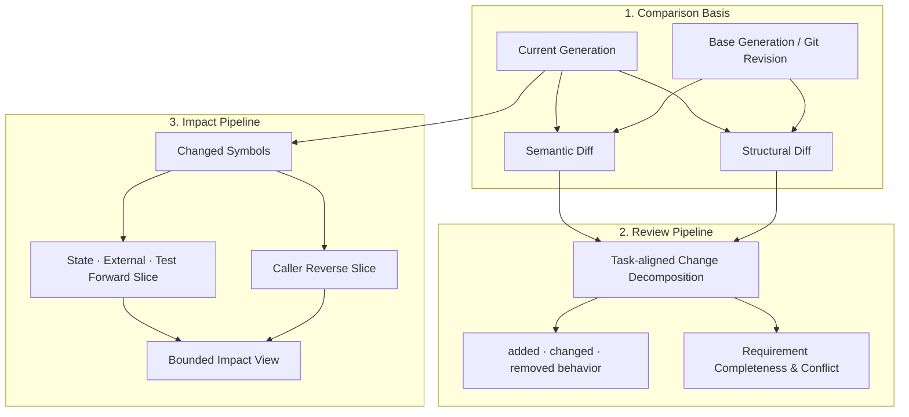
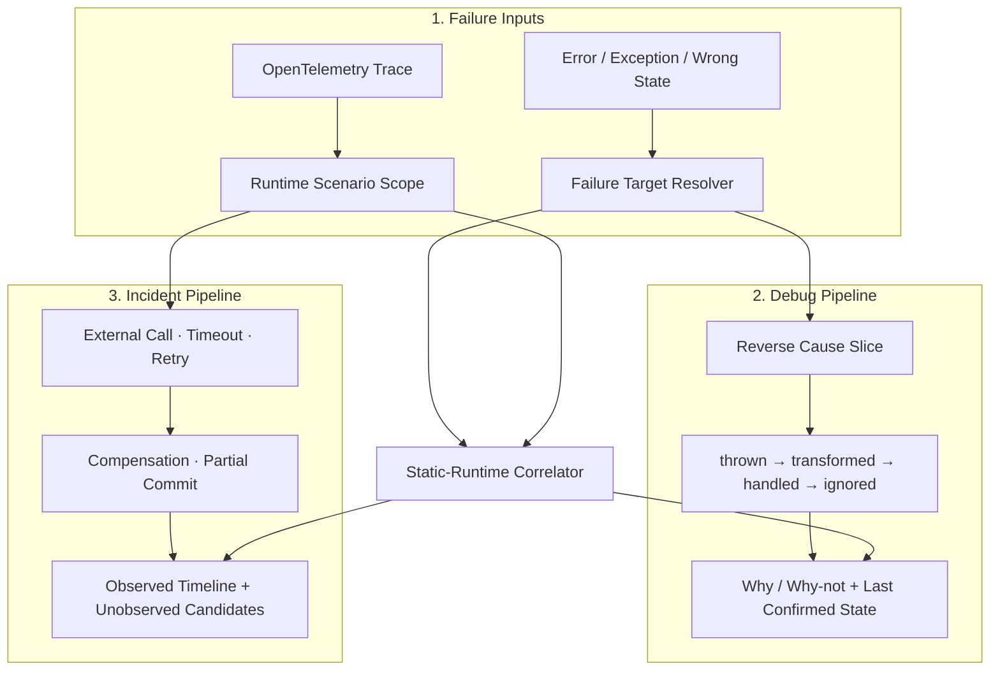
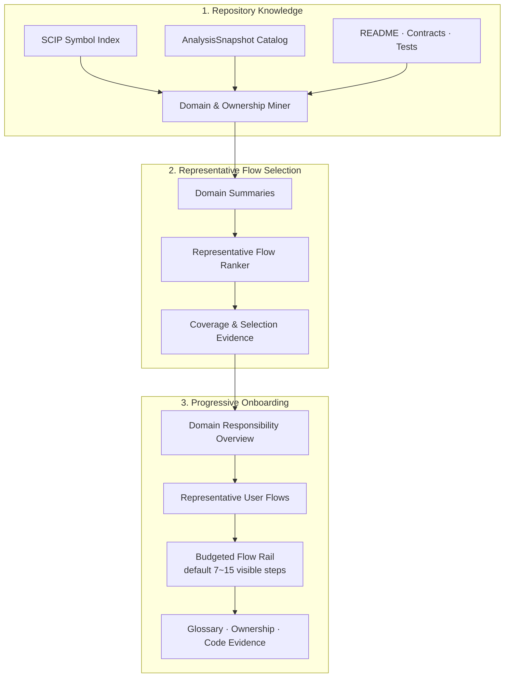
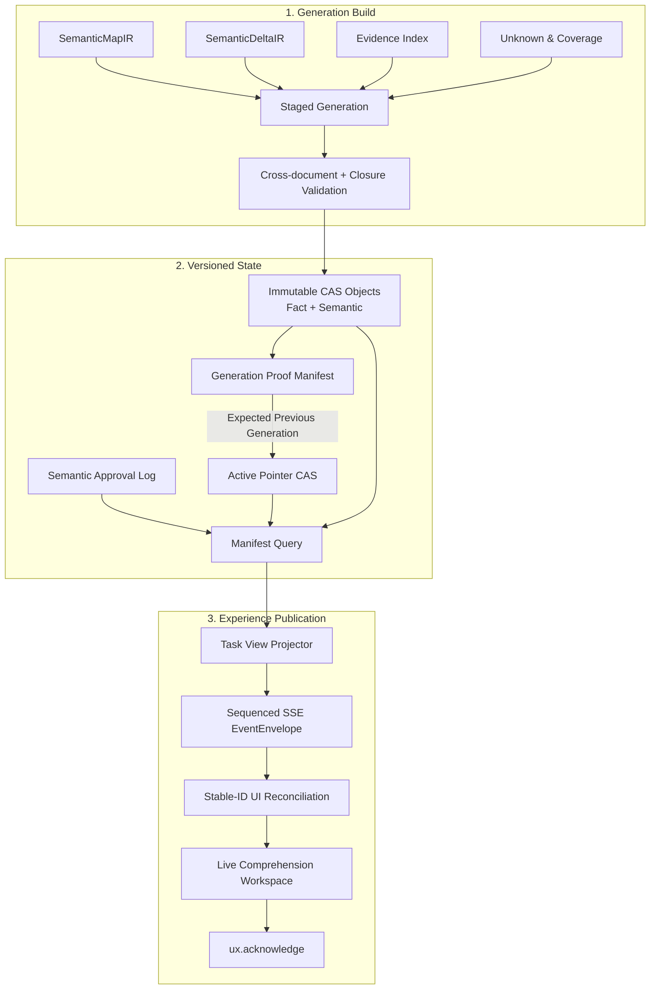

# 요청 흐름 이해와 실시간 Semantic Compiler 통합 아키텍처 설계 초안

- 상태: Raw Specification Draft
- 작성일: 2026-09-02
- 문서 성격: 제품 의도와 목표 아키텍처 정의
- 설계 기준: 현재 CodeFlow 구현이 아니라 최종 사용자 문제와 제품 경험
- 선행 문서:
  - `semantic-map-layered-architecture-draft.md`
  - `slm-llm-hybrid-code-intelligence-spec-ko.md`

---

## 0. 최종 개선 의도

### 0.1 한 문장 정의

> 사용자가 요청한 흐름과 coding agent가 현재 구현하고 있는 흐름을 증거 기반의 이해하기 쉬운 UX로 제공하고, 구현 변화가 발생하면 지원 환경에서 P95 3초 이내에 현재 의미 흐름 또는 명시적인 latest-vs-verified gap을 갱신하여 요구사항 요청자의 인지 부채가 누적되지 않게 한다.

### 0.2 두 가지 제품 의도

#### I1. 요청 흐름 이해

사용자가 자연어로 기능, 문제, 변경 영향 또는 장애 흐름을 요청하면 CodeFlow는 해당 요청에 필요한 코드 경로만 선택하여 다음을 제공한다.

- 흐름의 시작점
- 전체 흐름을 보존한 Semantic Map과 기본 표시 예산 7~15개의 핵심 행동
- 핵심 판단과 분기
- 상태 변화
- 외부 효과
- 최종 결과
- 실제 코드와 테스트 근거
- 확인되지 않은 영역

사용자는 전체 코드베이스와 전체 그래프를 읽지 않고도 자신이 요청한 흐름을 빠르게 설명할 수 있어야 한다.

#### I2. 실시간 구현 이해

coding agent가 요구사항을 구현하는 동안 CodeFlow는 변경된 파일 목록이나 원시 diff를 나열하는 데 그치지 않는다. 변경된 코드가 현재 요청 흐름의 의미를 어떻게 바꾸었는지 지속적으로 컴파일한다.

- 어떤 행동이 추가, 변경 또는 제거되었는가
- 어떤 조건과 실패 경로가 달라졌는가
- 어떤 상태 변화와 외부 효과가 생겼는가
- 어떤 요구사항이 코드 근거로 확인되는가
- 어떤 요구사항은 아직 부분 확인 또는 미확인인가
- 현재 화면이 어느 변경 시점까지 반영했는가

모든 편집을 즉시 불변 revision과 workspace snapshot으로 수집하고, 2초 publication window에서 선택한 snapshot을 분석한다. 지원 환경에서 관련 편집 후 P95 3초 안에 current 검증 결과를 발행하거나 최신 snapshot과 마지막 검증 결과의 차이·영향 범위·분석 지연을 표시한다. 이 SLO는 검증되지 않은 결과의 current 발행이나 `settled` 품질 판정을 정당화하지 않는다.

### 0.3 통합 제품 정의

요청 흐름 이해와 실시간 구현 이해는 별도 제품이 아니다.

요청 흐름 이해는 사용자가 알고 싶은 범위를 정의한다. 실시간 구현 이해는 coding agent가 그 범위에 가하는 변화를 지속적으로 갱신한다. 두 기능은 동일한 Task Intent, SemanticMapIR, Evidence, Unknown, FlowViewProjection을 사용한다.

```text
사용자 요청
→ 요청 흐름의 초기 이해
→ coding agent 구현 시작
→ 코드 변경 감지
→ Semantic Compiler
→ 현재 구현 흐름과 의미 변화 발행
→ 사용자가 최신 구현 상태를 이해
```

---

## 1. 해결할 문제

### 1.1 요청과 구현 사이의 이해 지연

coding agent는 사람이 코드를 읽고 검토하는 속도보다 빠르게 코드를 생성하고 변경할 수 있다. 구현 속도가 빨라질수록 요구사항 요청자가 알고 있는 상태와 실제 코드 상태 사이의 차이가 커진다.

이 차이는 다음 형태로 나타난다.

- 요청자는 구현이 어디서 시작되는지 모른다.
- 변경된 파일은 알지만 실제 동작 변화는 알기 어렵다.
- coding agent의 설명이 현재 코드와 일치하는지 검증하기 어렵다.
- 테스트 통과를 요구사항 완료와 동일하게 오해할 수 있다.
- 변경이 계속되는 동안 이미 읽은 설명이 오래된 설명이 된다.
- 실패 경로, 외부 효과, 미확인 호출이 사용자 설명에서 누락된다.
- 이전 변경과 현재 변경 사이의 의미 차이가 누적된다.

### 1.2 인지 부채의 제품 정의

이 문서에서 인지 부채는 다음 세 상태의 차이다.

```text
사용자가 요청한 동작
≠ 사용자가 현재 이해한 동작
≠ 코드가 현재 수행하는 것으로 확인된 동작
```

CodeFlow의 목적은 이 차이를 추측으로 채우는 것이 아니다. 현재 확인 가능한 흐름, 변경된 의미, 근거, 미확인 영역을 짧은 지연으로 반복 제공하여 차이가 누적되지 않게 하는 것이다.

### 1.3 핵심 사용자

- 요구사항 요청자: 제품 담당자, 리뷰어, 개발자, 운영 담당자
- coding agent 사용자: agent에게 구현을 지시하고 결과를 검토하는 사람
- 코드 이해 사용자: 기존 기능, 영향, 버그 또는 장애 흐름을 조사하는 사람
- 신규 참여자: 도메인과 핵심 흐름을 빠르게 파악해야 하는 사람

사용자가 코드를 직접 작성하는지 여부는 제품 사용 조건이 아니다.

---

## 2. 제품 목표와 비목표

### 2.1 제품 목표

- G1. 사용자가 요청한 범위에서 시작점부터 결과까지의 핵심 흐름을 제공한다.
- G2. coding agent의 변경을 의미 단위의 추가, 변경, 제거로 설명한다.
- G3. 지원 환경에서 관련 변경 후 P95 3초 안에 UX가 current 검증 결과 또는 명시적인 latest-vs-verified gap을 표시한다.
- G4. 모든 중요한 설명을 코드, 테스트, 계약 또는 실행 근거로 이동할 수 있게 한다.
- G5. 요청 내용, coding agent 설명, 모델 추론, 코드 사실의 권위를 구분한다.
- G6. 변경 중에도 사용자의 선택 위치와 읽기 맥락을 유지한다.
- G7. 모델이 없거나 늦어도 구조적 흐름과 변경 사실을 제공한다.
- G8. 확인되지 않은 관계와 요구사항을 `unknown`으로 유지한다.
- G9. feature, review, impact, debug, incident, onboarding 작업을 하나의 일관된 UX에서 지원한다.
- G10. 사용자가 원시 코드 diff보다 행동 변화와 요구사항 차이를 먼저 이해하게 한다.

### 2.2 비목표

- coding agent 자체를 구현하거나 대체하는 것
- coding agent의 작업 완료 선언을 사실로 승인하는 것
- 전체 저장소의 모든 노드와 엣지를 기본 화면에 표시하는 것
- 모델이 코드 사실이나 요구사항 완료 여부를 단독으로 결정하는 것
- 모든 코드 변경을 사용자에게 그대로 스트리밍하는 것
- 키 입력 단위의 임시 문법 오류를 완성된 의미 변화로 발행하는 것
- 사용자의 생산성이나 coding agent의 성능을 감시하거나 평가하는 것
- 모든 언어와 프레임워크에서 동일한 분석 coverage를 주장하는 것
- 현재 CodeFlow 패키지, 프로토콜 또는 저장 구조를 설계의 전제로 고정하는 것

---

## 3. 핵심 용어

### 3.1 Task Intent

사용자가 이해하거나 구현하고 싶은 흐름의 목적, 기대 결과, 수용 조건, 범위 힌트를 표현한 버전 관리 계약이다.

Task Intent는 코드 사실이 아니다. 현재 구현을 어떤 관점으로 읽어야 하는지 결정하는 사용자 권위의 입력이다.

사용자 원문은 불변 `rawRequest`로 보존하고 정규화된 actor, trigger, expected outcome, acceptance criterion과 분리한다. parser가 정규화를 완료한 상태와 사용자가 그 해석을 확인한 상태도 `intentStatus`로 구분한다.

### 3.2 Requested Flow

Task Intent를 기준으로 선택된 작업 범위의 흐름이다. 진입 이벤트에서 시작하여 핵심 판단, 상태 변화, 외부 효과를 거쳐 결과가 만들어지는 경로를 포함한다.

### 3.3 Current Implementation Flow

현재 workspace generation에서 근거로 확인된 Requested Flow의 구현 상태다.

### 3.4 Semantic Compiler

Task Intent, 현재 코드 사실, 변경 배치, 이전 Semantic Map을 입력으로 받아 사용자가 이해할 수 있는 현재 흐름과 의미 변화를 생성하는 전체 처리 체계다.

Semantic Compiler는 특정 SLM 또는 LLM의 이름이 아니다. 다음을 포함하는 개념적 컴파일 파이프라인이다.

- 편집 revision 수집과 workspace snapshot 선택
- 구조적 사실 추출
- 요청 범위 선택
- 흐름 재구성
- 의미 이름과 행동 그룹 생성
- 요구사항 정렬
- 근거 검증
- 이전 generation과의 의미 차이 계산
- UX projection 발행

SLM 또는 LLM은 Semantic Compiler 내부에서 선택적으로 의미 후보를 제안할 수 있다. 모델이 없더라도 Semantic Compiler는 동작해야 한다.

### 3.5 Semantic Map

현재 요청 범위의 구조적 사실, 의미 표현, 요구사항 정렬, 증거, 미확인 영역을 결합한 사용자 이해 모델이다.

### 3.6 Semantic Delta

두 Semantic Map generation 사이에서 사용자가 이해해야 할 동작 차이다.

- 행동 추가
- 행동 제거
- 행동 의미 변경
- 조건 또는 분기 변경
- 상태 변화 변경
- 외부 효과 변경
- 실패 처리 변경
- 요구사항 정렬 상태 변경
- 근거 또는 freshness만 변경

### 3.7 Document Revision

한 파일의 특정 바이트 내용을 나타내는 불변 객체다. `contentId`, 단조 증가 `documentVersion`, 파일 경로, 생성 원인을 가지며 생성 이후 수정되지 않는다.

### 3.8 Workspace Snapshot

분석 대상 worktree의 모든 파일 경로를 특정 Document Revision에 연결한 불변 시점이다. Git commit 여부와 무관하게 dirty 파일을 포함하며, 분석기는 운영체제 파일을 다시 읽지 않고 이 snapshot의 가상 파일 시스템만 읽는다.

### 3.9 Analysis Read Set

한 분석 결과를 만들 때 실제로 읽은 Document Revision, 설정, index revision의 집합이다. 발행 직전 최신 Workspace Snapshot과 비교하여 결과가 여전히 현재 상태를 설명하는지 판단한다.

Analysis Read Set만으로는 현재성을 증명할 수 없다. 분석 당시 존재하지 않았던 파일, symbol, caller 또는 relation이 추가되는 경우는 읽은 입력 목록에 나타나지 않기 때문이다.

### 3.10 Causal Observation Closure

분석 결과를 바꿀 수 있는 관찰 범위를 닫힌 집합으로 기록한 검증 계약이다. Analysis Read Set에 다음을 추가한다.

- 존재한다고 읽은 document, symbol, relation과 설정
- 존재하지 않음을 전제로 한 file, symbol, route, framework convention 등의 negative lookup
- source root, directory, package, module, project membership
- caller·callee·state·test·external effect의 dependency frontier
- graph와 index revision
- analyzer capability와 coverage boundary

새 snapshot의 변경이 이 closure와 교차하지 않을 때만 기존 분석 결과가 최신 snapshot에서도 유효하다고 판정할 수 있다.

### 3.11 Generation Proof Manifest

한 Semantic Generation이 어떤 snapshot에서 계산되었고, 어느 최신 snapshot을 대상으로 현재성 검증을 통과했는지 기계적으로 확인할 수 있는 발행 기록이다. 여기서 proof는 암호학적 증명이나 형식 증명이 아니라 서버가 재검증할 수 있는 입력·관찰 범위·gate 결과의 불변 기록을 뜻한다.

### 3.12 Live Generation

특정 Task Intent revision과 Workspace Snapshot을 기준으로 검증을 마치고 원자적으로 발행된 Semantic Map 버전이다. `generationId`는 결과 식별자, `computedBasisId`는 실제 계산 입력, `validatedAgainstSnapshotId`는 현재성 검증 대상이며 서로 대체할 수 없다.

### 3.13 Evidence Anchor

구조적 사실 또는 의미 주장을 실제 코드, 테스트, 계약, 실행 결과의 위치와 revision에 연결하는 식별자다.

### 3.14 Unknown

분석 범위, 언어 capability, 동적 호출, 불완전한 코드 또는 부족한 근거 때문에 현재 확정할 수 없는 사실이나 의미다.

### 3.15 Requirement Alignment

사용자의 수용 조건과 현재 구현 근거 사이의 관계다. 구현 완료 판정이 아니라 확인 가능한 정렬 상태다.

### 3.16 Dual Plane

이 아키텍처는 사실과 의미를 논리적으로 두 plane으로 분리한다.

- Plane B, Structural Contract: symbol, signature, call, branch, state mutation, external effect, anchor, freshness
- Plane A, Semantic Interpretation: 사용자 행동 이름, 행동 그룹, 규칙 설명, 요구사항 연결, 승인된 의미

두 plane은 동일 generation에서 함께 조회되지만 권위와 저장 이벤트를 분리한다. Plane A가 Plane B를 수정할 수 없으며, 모델은 Plane B를 생성할 수 없다.

### 3.17 Critical Obligation

현재 task mode에서 흐름을 완료됐다고 설명하기 전에 반드시 검증해야 하는 항목이다. 공통 kind는 entry, result, critical branch, state mutation, external effect, failure path, requirement link이며 mode별 계약은 이 중 필요한 항목과 추가 항목을 `required=true`로 지정한다. `settlement=passed`는 모든 필수 Critical Obligation이 verified일 때만 가능하다.

---

## 4. 핵심 설계 결정

- D1. 제품의 기준은 현재 구현이 아니라 사용자 이해 결과다.
- D2. 모든 분석은 Task Intent 또는 명시적 작업 쿼리로 범위를 제한한다.
- D3. 구조적 사실, 사용자 의도, agent 힌트, 모델 추론, 사람 승인을 서로 다른 권위로 저장한다.
- D4. Semantic Compiler는 전체 처리 체계이며 SLM 또는 LLM과 동일한 개념이 아니다.
- D5. 모델은 의미 후보를 제안할 수 있지만 코드 사실을 생성하거나 수정할 수 없다.
- D6. 사용자 기본 결과는 `Current Answer + Semantic Flow Rail + What Changed + Requirement Alignment + Evidence`다.
- D7. coding agent 변경은 원시 이벤트가 아니라 검증된 Semantic Delta로 발행한다.
- D8. 모든 편집은 즉시 불변 Document Revision과 Workspace Snapshot을 만든다. 2초 window는 파일 안정화 대기가 아니라 의미 결과의 발행 병합에 사용한다.
- D9. 지원 환경에서 관련 편집 후 P95 3초 안에 최신 검증 결과를 발행하거나, 최신 snapshot과 마지막 검증 결과의 차이·영향 범위·분석 지연을 명시한다.
- D10. 늦게 도착한 결과는 동일한 `computedBasisId`를 참조하고 발행 시점의 Causal Observation Closure 검증을 통과할 때만 현재 generation을 보강할 수 있다.
- D11. feature, review, impact, debug, incident, onboarding은 동일한 IR에 적용되는 쿼리와 강조 정책이다.
- D12. 작업 모드가 바뀌어도 Answer Strip, Flow Rail, Change Pulse, Evidence Dock의 기본 위치는 유지한다.
- D13. active generation은 완전한 단위로 교체하며 부분 결과를 현재 사실처럼 혼합하지 않는다.
- D14. coding agent의 계획, 메시지, 완료 선언은 intent hint이며 코드 사실이 아니다.
- D15. 요구사항 정렬은 근거가 없으면 `unknown`이며 agent 또는 모델 설명만으로 `confirmed`가 되지 않는다.
- D16. 현재 구현의 재사용 여부는 이 계약이 승인된 뒤 별도 구현 설계에서 결정한다.
- D17. Local SLM은 외부 MCP 권위가 아니라 Semantic Compiler가 호출하는 격리된 model host다. coding agent는 Core MCP를 통해서만 검증된 generation을 조회한다.
- D18. hot path의 모든 parser와 언어 adapter는 Workspace Snapshot을 읽어야 한다. snapshot 입력을 지원하지 않는 도구는 비동기 보강 경로에서만 사용할 수 있다.
- D19. active generation 발행은 Causal Observation Closure 검증, Generation Proof Manifest 생성, active pointer compare-and-swap을 포함하는 단일 트랜잭션이다.
- D20. 사실 저장, 의미 해석, 사람 승인은 별도 객체와 이벤트로 관리한다. commit과 사람 승인은 같은 promotion 연산이 아니다.
- D21. 품질 단계, freshness, settlement, model enrichment, 사용자 연결, 편집 활동은 서로 독립된 상태 축으로 표현한다.
- D22. 6대 작업 뷰는 공통 필드가 모두 선택적인 요청이 아니라 mode별 필수 입력을 갖는 판별 합집합으로 정의한다.
- D23. Analysis Read Set이 같다는 이유만으로 최신 snapshot에 결과를 rebase하지 않는다. negative lookup, membership, dependency frontier, index revision까지 닫힌 Causal Observation Closure가 변경과 교차하지 않아야 한다.
- D24. Generation Proof Manifest가 없거나 검증에 실패한 generation은 품질 단계와 관계없이 `current`가 될 수 없다.
- D25. 프로세스 경계를 통과하거나 영구 저장, CAS hash, 외부 발행의 대상이 되는 payload는 `schemaId`와 `schemaVersion`으로 식별되는 정규 JSON Schema 계약을 가져야 한다. 문서의 YAML 예시는 정규 계약이 아니다.
- D26. 정규 schema와 valid·invalid fixture는 해당 계약을 처음 사용하는 Vertical Slice의 구현 시작 조건이다. 모든 schema를 아키텍처 승인 전에 작성하지 않으며, 내부 전용 자료구조와 schema의 물리적 파일 분할은 구현 결정으로 남긴다.
- D27. current generation 발행 자격과 `settled` 승격 자격을 분리한다. Q1·Q2는 Current Publication Gate를 통과하면 `current + settlement=pending`으로 발행할 수 있고, 명시적 settlement 평가가 실패한 경우에만 `settlement=failed`를 사용한다. Settlement Gate는 Q3의 `settlement=passed` 승격에만 적용한다. Q4는 Q3 사실을 바꾸지 않는 선택적 refinement다.
- D28. currentness와 Evidence 정확성은 타협할 수 없는 hard invariant이고 3초는 지원 환경에서 측정하는 end-to-end P95 UX SLO다. SLO를 놓치면 latest-vs-verified gap과 지연을 표시하며 검증되지 않은 결과를 current로 발행하지 않는다.
- D29. Task Intent의 원문, 정규화 결과, 사용자 확인 상태를 분리한다. `rawRequest`는 불변으로 보존하고 `intentStatus`는 `parsed`, `needs_confirmation`, `user_confirmed`를 사용하며, 도메인별 수용 조건은 공통 TaskIntent 필드가 아니라 모호하지 않은 acceptance criterion으로 표현한다.
- D30. `degraded`를 독립 상태 축으로 만들지 않는다. 품질 저하 원인, 영향 범위, 복구 조건은 `quality.degradations[]`에 기록하고 모델 실패는 `enrichmentStatus`, adapter 실패는 quality stage와 coverage로 표현한다.
- D31. `settlement=passed`는 가중 점수나 coverage 비율이 아니라 mode별 필수 Critical Obligation 전부가 검증되고 critical unknown과 conflict가 0일 때만 허용한다. obligation 산출 방식은 해당 Vertical Slice의 정규 계약으로 정의한다.
- D32. SemanticMapIR은 확인된 전체 흐름을 보존하고 7~15개는 기본 projection의 표시 예산으로만 사용한다. 7개 미만이면 모두 표시하고 15개를 넘으면 비핵심 구간만 접으며 entry, result, critical branch, failure, external effect, unknown boundary는 항상 유지한다.

---

## 5. 전체 제품 구조



### 5.1 입력

- 사용자 자연어 요청
- 명시적 Task View Query
- 요구사항 또는 수용 조건
- 현재 repository와 workspace 상태
- 기준 generation 또는 Git revision
- coding agent가 생성한 코드 변경
- 테스트, 컴파일, 실행 관찰 결과
- 선택적인 coding agent intent hint
- 선택적인 사람 승인 의미

### 5.2 출력

- 요청 흐름 요약
- 현재 구현 흐름
- 변경 전과 현재의 Semantic Delta
- 요구사항별 확인 상태
- 코드와 테스트 Evidence
- unknown, conflicting, historical 상태
- currentness proof, 검증 대상 snapshot, coverage boundary
- 실시간 컴파일 상태
- FlowViewProjection

### 5.3 권위 방향

```text
코드·테스트·계약·실행 근거
→ 구조적 사실
→ 검증된 흐름
→ 의미 후보
→ 사람 승인 의미
→ UX 표현
```

역방향으로 사실을 생성하지 않는다. UX 문장, 모델 출력 또는 coding agent 설명이 코드 사실을 변경할 수 없다.

---

## 6. Semantic Compiler 상세 설계

### 6.1 책임

Semantic Compiler는 다음 질문에 지속적으로 답한다.

1. 사용자가 지금 이해하려는 흐름은 무엇인가?
2. 현재 코드에서 어디까지 확인되는가?
3. 마지막 generation 이후 어떤 행동 의미가 바뀌었는가?
4. 이 변경은 어떤 요구사항과 연결되는가?
5. 사용자가 지금 믿을 수 있는 근거는 무엇인가?
6. 아직 확인할 수 없는 부분은 무엇인가?

### 6.2 컴파일 단계

#### C1. Intent Normalization

자연어 요청의 불변 원문을 보존한 채 Task Intent를 정규화한다. parser는 `intentStatus=parsed|needs_confirmation`까지만 설정할 수 있으며 사용자 확인 없이 `user_confirmed`로 승격할 수 없다.

- actor
- trigger
- expected outcome
- acceptance criteria
- entry hints
- domain hints
- excluded scope
- task mode

모호한 항목은 임의로 확정하지 않고 unresolved intent로 남긴다.

#### C2. Edit Capture and Snapshot Selection

편집 이벤트를 받는 즉시 새 Document Revision과 Workspace Snapshot을 만든다. 의미 결과는 관련 변경을 기준으로 2초 quiet window 또는 2초 max-wait checkpoint에서 선택한 snapshot을 입력으로 사용한다. 분석을 시작한 뒤에는 파일 시스템의 최신 바이트를 다시 읽지 않는다.

#### C3. Structural Compilation

선택한 Workspace Snapshot의 가상 파일 시스템에서 다음 사실을 추출한다. 실제 입력은 Analysis Read Set에, 존재하지 않음과 탐색 경계는 Causal Observation Closure에 기록한다.

- symbol과 signature
- call와 delegation
- guard와 branch
- state read와 mutation
- external call와 side effect
- thrown error와 failure handling
- test와 contract relation
- unresolved dynamic relation

#### C4. Flow Scope Resolution

Task Intent와 구조적 관계를 이용해 현재 요청에 필요한 경로만 선택한다.

- 진입점
- 핵심 경로
- 중요한 대안 분기
- 종료 조건
- 관련 상태와 외부 효과
- 관련 테스트

전체 의존 그래프를 기본 결과로 만들지 않는다.

#### C5. Semantic Compilation

구조적 사실을 사용자가 읽을 행동 단위로 변환한다.

- technical action을 user action으로 이름 지정
- 반복되는 세부 호출을 하나의 행동으로 그룹화
- 행동 사이의 인과 관계 정리
- 상태 변화와 외부 효과 요약
- failure와 compensation 의미 분류

모델이 사용되는 경우에도 입력 Evidence 밖의 행동, 규칙 또는 이유를 추가할 수 없다.

#### C6. Requirement Alignment

수용 조건을 현재 흐름과 연결한다.

- 어떤 step이 수용 조건을 뒷받침하는가
- 근거가 코드인지 테스트인지 계약인지
- 일부만 확인되는가
- 현재 분석 범위에 근거가 없는가
- 근거가 서로 충돌하는가

#### C7. Evidence Validation

모든 fact와 semantic claim의 anchor, basis, freshness, authority를 검증한다. 발행 직전 `computedBasisId`와 `liveHead` 사이의 Workspace Delta를 Causal Observation Closure와 비교한다.

다음 중 하나라도 발생하면 해당 결과를 `current`로 발행하지 않고 최신 snapshot 분석을 우선한다.

- positive dependency의 revision이 변경됨
- 새 파일이나 symbol이 negative lookup을 만족함
- package, module, source root 또는 generated-source membership이 변경됨
- dependency frontier와 연결될 수 있는 relation이 추가·삭제됨
- graph, index, compiler 설정 또는 capability revision이 변경됨

교차가 없을 때도 `computedBasisId`를 최신 snapshot ID로 바꾸지 않는다. 대신 Generation Proof Manifest의 `validatedAgainstSnapshotId`에 검증한 `liveHead`를 기록한다. 근거 검증 실패 항목은 제거하거나 unknown 또는 conflicting으로 낮춘다.

#### C8. Delta Compilation

이전 generation과 현재 generation을 비교하여 구조 변경과 의미 변경을 분리한다.

```text
구조 변경: 함수 이동, 이름 변경, 호출 대상 변경
의미 변경: 검증 규칙 추가, 실패 처리 변경, 상태 전이 변경
표현 변경: 의미 문장 개선, 근거 추가
```

#### C9. Atomic Publication

SemanticMapIR, SemanticDeltaIR, Evidence Index, Unknowns, FlowViewProjection이 동일한 `computedBasisId`와 `generationId`를 참조하고 Causal Observation Closure 검증을 통과할 때만 Generation Proof Manifest를 완성한다. active pointer는 예상 이전 generation과 예상 `liveHead`를 조건으로 원자 교체한다.

### 6.3 모델의 위치

SLM 또는 LLM은 다음 작업에 사용할 수 있다.

- 구조적 행동의 짧은 사용자 언어 이름 제안
- 기본 projection의 7~15개 행동 그룹 후보 제안
- 변경된 행동의 짧은 설명 제안
- Evidence가 있는 요구사항 연결 후보 제안
- 사용자가 다음에 확인할 질문 후보 생성

다음 작업에는 사용하지 않는다.

- 존재하지 않는 호출 대상 확정
- 실행되지 않은 경로를 실행 사실로 승격
- 요구사항 완료 단독 판정
- 코드 또는 테스트 Evidence 생성
- source anchor 수정
- 닫히고 유효한 Causal Observation Closure가 없는 결과의 current generation 편입

### 6.4 Deterministic Baseline

모델이 없거나 제한 시간 안에 응답하지 못해도 Semantic Compiler는 다음을 발행한다.

- 기술 이름 기반 흐름
- 구조적 call과 branch
- state mutation과 side effect
- source와 test Evidence
- 변경된 symbol과 relation
- unresolved와 unknown
- 구조적 Semantic Delta

사용자는 모델 장애 때문에 오래된 화면을 보아서는 안 된다.

---

## 7. 실시간 갱신 계약

### 7.1 Versioned Virtual Workspace

실시간 분석의 기준은 변경 중인 파일 시스템이 아니라 불변 Workspace Snapshot이다.

1. IDE 또는 coding agent가 `bytes + path + documentVersion`을 Edit Ingress에 전달한다.
2. Edit Ingress는 즉시 content-addressed Document Revision을 만들고 persistent map의 변경 경로만 교체한다.
3. 새 Workspace Snapshot을 `liveHead`로 원자 교체한다.
4. parser와 언어 adapter는 발급받은 snapshot lease를 통해서만 파일을 읽는다.
5. 분석 결과는 읽은 revision과 설정을 Analysis Read Set으로 남긴다.
6. scope resolver와 adapter는 negative lookup, membership, dependency frontier를 포함한 Causal Observation Closure를 완성한다.
7. Publication Gate가 `computedBasisId → liveHead` Workspace Delta와 closure의 교차 여부를 검증한다.
8. 검증 기록을 Generation Proof Manifest로 만들고 current 발행 여부를 결정한다.

Git commit은 snapshot 생성 조건이 아니다. commit OID와 blob OID는 존재할 때 provenance와 CAS 재사용에 사용하고, dirty content는 자체 `contentId`로 식별한다.

여러 파일을 바꾸는 명시적 edit transaction은 각 revision을 staging한 뒤 transaction 종료 시 하나의 Workspace Snapshot으로 `liveHead`에 반영한다. transaction이 없는 LSP 입력은 각 document version을 독립 snapshot으로 반영한다. snapshot lease가 살아 있거나 generation, baseline, Evidence가 참조하는 revision은 제거하지 않으며, 참조가 사라진 content만 background GC 대상으로 삼는다.

### 7.2 두 채널과 발행 병합

실시간 UX는 활동 상태 채널과 의미 결과 채널을 분리한다.

#### Channel A. Activity Channel

편집 이벤트를 받으면 300ms 안에 다음 정보를 UX에 표시한다.

- `editing`: 최신 Workspace Snapshot이 생성됨
- `analyzing`: 선택한 snapshot을 분석 중
- `publishing`: Causal Observation Closure 검증과 원자 발행 중
- 영향이 예상되는 flow 또는 step
- `analysisLagMs`와 `pendingRevisions`

이 채널은 새 의미 사실을 발행하지 않는다. 활동 상태와 사용자 연결 상태는 Semantic Map의 품질 상태와 별도로 관리한다.

#### Channel B. Semantic Publication Channel

2초 window는 파일이 안정되기를 기다리는 debounce가 아니라 중간 결과가 화면을 과도하게 교체하지 않도록 하는 publication coalescing이다. 편집 수집, incremental parse, dependency invalidation은 window 동안 계속 실행한다.

- 2초 안에 관련 편집이 멈추면 quiet-window 끝의 최신 snapshot을 선택한다.
- 편집이 계속되면 첫 미발행 관련 편집에서 2초가 된 시점의 최신 snapshot을 checkpoint로 선택한다.
- 선택한 snapshot의 검증된 최소 의미 단위를 남은 P95 1초 sub-budget 안에 원자적으로 발행하는 것을 목표로 한다.

```text
T0         편집 수신, revision과 snapshot 즉시 생성, activity 표시
T0~T0+2s   incremental 분석 지속, 중간 발행은 병합
T0+2s      quiet 또는 max-wait 기준으로 publication snapshot 선택
T0+3s      P95 목표: current generation 또는 명시적 latest-vs-verified gap 표시
```

### 7.3 3초 사용자 이해 최신성 SLO

지원 환경의 정상 연결 상태에서 end-to-end P95 3초를 목표로 한다. 이는 모든 실행의 hard deadline이나 “항상 최신 바이트의 settled 결과” 보장이 아니다. SLO 측정의 성공 결과는 다음 둘 중 하나다.

1. `current`: Generation Proof Manifest가 최신 Workspace Snapshot에 대한 closure 검증을 통과한 generation
2. `last_verified + editing`: 마지막 검증 generation과 최신 snapshot 사이의 변경 범위, 영향받는 flow, `analysisLagMs`, `pendingRevisions`

3초 목표 시점까지 전체 semantic enrichment가 완료되지 않아도 검증된 deterministic 결과는 발행한다. 미완료 모델 보강은 `enrichmentStatus=pending|timed_out|unavailable`로 표시하며 deterministic 결과의 quality stage나 coverage를 변경하지 않는다.

시간과 무관한 hard invariant는 검증되지 않은 generation을 `current`로 표시하지 않는 것이다. SLO를 놓치면 마지막 검증 generation, 최신 snapshot, 영향 범위, `analysisLagMs`, `pendingRevisions`를 표시하고 측정 실패로 기록한다.

`settlement`, `qualityStage`, `freshness`, `enrichmentStatus`, `activityStatus`, `connectionStatus`는 별도 축이다.

```text
current + passed + Q3       최신 코드 기준이며 Settlement Gate 통과
current + pending + Q1      최신 코드 기준의 검증된 최소 결과, 품질 검증 진행 중
last_verified + editing     최신 편집이 observation closure와 겹쳐 이전 검증 결과와 차이를 표시
current + Q3 + timed_out    deterministic 결과는 유효하고 모델 보강만 시간 초과
```

### 7.4 연속 변경과 Causal Observation Closure 검증

- 각 편집은 대기 없이 새 snapshot을 만든다. 분석 중인 snapshot은 변경되지 않는다.
- `liveHead`가 앞서가면 `computedBasisId → liveHead` 사이의 모든 path·membership·graph delta를 closure와 비교한다.
- positive dependency가 그대로여도 새 caller, 구현체, route, generated source가 negative lookup 또는 dependency frontier에 들어오면 충돌이다.
- closure와 교차하지 않을 때만 `validatedAgainstSnapshotId=liveHead`인 proof를 만들고 `current`로 발행한다. 실제 계산 basis는 변경하지 않는다.
- closure가 불완전하거나 변경과 교차하면 결과를 `current`로 발행하지 않는다.
- 이때 화면은 `last_verified + editing`을 유지하고 겹친 observation, 예상 영향 범위, coverage boundary를 표시한다.
- 취소 가능한 비필수 작업은 중단하고 최신 snapshot 분석을 우선한다. parser cache와 content CAS 결과는 재사용한다.
- 부분 문법 오류가 있는 revision은 그대로 분석 basis에 포함하고 affected step을 `temporarily_unresolved`로 표시한다. 이전 fact를 현재 사실처럼 복사하지 않는다.

current 판정 알고리즘은 다음과 같다.

```text
delta = diff(computedBasisId, capturedLiveHead)

if closure.closureStatus != closed:
  reject current

if delta intersects positiveDependencies
   or delta satisfies negativeObservations
   or delta changes membershipObservations
   or delta crosses dependencyFrontiers
   or delta changes resolution/index/capability inputs:
  reject current

proof.validatedAgainstSnapshotId = capturedLiveHead
CAS(expectedLiveHead=capturedLiveHead,
    expectedGeneration=previousActive,
    nextGeneration=proof)
```

CAS 시점에 `liveHead`가 다시 바뀌면 발행을 중단하고 새 head를 대상으로 closure 검증을 반복한다. 이 검증은 결과를 다시 계산했다는 뜻이 아니므로 `computedBasisId`를 변경하지 않는다.

### 7.5 편집 수집 경로와 watcher 보완

입력 우선순위는 다음과 같다.

1. coding agent edit transaction 또는 IDE/LSP의 versioned change
2. atomic save/rename을 관찰하는 filesystem watcher
3. Watchman clock 또는 전체 스캔을 이용한 주기적 reconciliation

watcher는 변경 사실을 알리는 신호이며 분석 바이트의 권위가 아니다. watcher 경로에서 snapshot을 만들 때는 `stat-before → read → stat-after + content hash`를 수행하고 크기, mtime 또는 file identity가 달라지면 다시 읽는다. rename, delete, recrawl, 이벤트 유실은 workspace epoch와 reconciliation으로 처리한다.

### 7.6 변경 관련성

모든 파일 변경이 active flow 갱신을 발생시키지는 않는다.

관련 변경은 다음 중 하나를 만족한다.

- active flow의 Evidence Anchor와 겹친다.
- active flow의 caller, callee, state, contract 또는 test 관계를 변경한다.
- Task Intent의 acceptance criterion과 연결된 symbol을 변경한다.
- active flow의 unresolved edge를 해결하거나 새 unknown을 만든다.
- 사용자가 현재 선택한 task scope를 변경한다.

관련성이 확인되지 않는 변경은 global activity count에는 포함할 수 있지만 active flow를 재배치하지 않는다.

이 관련성 판정은 scheduling 최적화일 뿐 currentness proof가 아니다. 관련 없음으로 분류된 변경도 Workspace Delta에는 남으며, active generation을 current로 유지하기 전에 Causal Observation Closure와 반드시 비교한다. 관련성이 unknown이면 보수적으로 closure 충돌로 처리한다.

### 7.7 현재 결과 오발행 차단

모든 컴파일 작업은 다음 식별자를 가진다.

- workspace epoch
- Task Intent revision
- Workspace Snapshot sequence, `computedBasisId`, `validatedAgainstSnapshotId`
- Analysis Read Set
- Causal Observation Closure
- generation sequence
- derivation parent
- supersedes 대상

`derivationParent`는 결과의 계산 계보이고 freshness 판단 기준이 아니다. Publication Gate는 Task Intent revision, workspace epoch, Causal Observation Closure, 예상 `liveHead`, 예상 active generation을 검증한다. 실패한 결과는 historical artifact로 보존할 수 있지만 active generation으로 발행하지 않는다.

`current`는 저장소 전체에 대한 완전성 주장이 아니다. Generation Proof Manifest에 기록된 Task Intent, query, capability profile, coverage boundary 안에서 최신 snapshot과 모순되지 않는다는 뜻이다. 경계 밖은 unknown으로 유지한다.

---

## 8. 6대 작업 중심 뷰 쿼리

### 8.1 공통 원칙

feature, review, impact, debug, incident, onboarding은 별도 데이터 모델이 아니다. 동일한 SemanticMapIR과 Evidence를 서로 다른 질문, 탐색 방향, 강조 정책으로 projection한다.

화면의 기본 구조는 유지한다.

```text
Task & Live Status Bar
→ Current Answer Strip
→ Semantic Flow Rail
→ Change Pulse
→ Requirement Alignment
→ Evidence Dock
→ Unknown and Conflict
```

### 8.2 Task View Query 계약

Task View Query는 `mode`를 판별자로 사용하는 합집합이다. 공통 envelope만 선택적으로 공유하고 각 mode의 시작 조건은 필수다.

```yaml
taskViewQuery:
  schemaId: codeflow.task-view-query
  schemaVersion: 1
  mode: feature
  common:
    taskId: task-auth-signup
    intentRevision: 3
    basisSelector:
      kind: active
    filters:
      includeTests: true
      includeRuntimeEvidence: true
      maxVisibleCoreSteps: 15
  feature:
    entrySymbol: symbol-signup-submit
```

| `mode` | 필수 입력 | 추가 제약 |
|---|---|---|
| `feature` | `request`, `flowId`, `entrySymbol`, `domain` 중 하나 | 여러 흐름이 일치하면 `ambiguous_target` |
| `review` | `baseline`과 `current` | 두 basis가 비교 가능해야 함 |
| `impact` | `symbolId` 또는 `changeBatchId` | 분석 가능한 언어 capability 필요 |
| `debug` | `error`, `symptom`, `failureEvidenceId` 중 하나 | 역추적 시작점이 Evidence로 연결되어야 함 |
| `incident` | `traceId` 또는 `incidentEvidenceId` | runtime scope와 time window 필수 |
| `onboarding` | `repositoryId` | `domain`은 선택 필터 |

정규 계약은 JSON Schema 2020-12의 `oneOf`와 mode별 `const`로 검증한다. 선택한 mode와 같은 이름의 variant 하나만 허용한다. `basisSelector.kind=active`이면 `id`를 허용하지 않고 `generation|workspaceSnapshot`이면 `id`를 필수로 한다. 유효하지 않은 요청은 다음 오류 중 하나로 거절하며 임의의 기본 scope를 만들지 않는다.

- `missing_precondition`: mode의 필수 입력 없음
- `ambiguous_target`: 둘 이상의 시작점이 동일 우선순위로 일치
- `incomparable_basis`: review의 기준이 서로 다른 repository 또는 호환되지 않는 epoch
- `unsupported_capability`: 요청한 탐색을 현재 언어 adapter가 제공하지 않음

`maxVisibleCoreSteps`는 SemanticMapIR의 흐름을 자르는 제한이 아니라 기본 projection의 표시 예산이다. 확인된 행동이 7개 미만이면 모두 표시한다. 15개를 넘으면 비핵심 구간을 접고 생략된 구간 수와 drill-down 가능 여부를 반환한다. entry, result, critical branch, failure, external effect, unknown boundary는 표시 예산을 맞추기 위해 제거하지 않는다.

### 8.3 Mode별 탐색 계약

| Mode | 사용자의 질문 | 시작점과 방향 | 우선 표시 | 완료 조건 |
|---|---|---|---|---|
| `feature` | 이 기능은 어떻게 동작하는가? | trigger에서 result까지 순방향 | 기본 표시 예산 7~15개 행동, 상태, 외부 효과 | 시작·핵심 판단·결과 설명 가능 |
| `review` | 이 변경으로 동작이 어떻게 달라졌는가? | Base와 Current 비교 | 구조 Delta와 의미 Delta, 영향, historical basis | added·changed·removed 행동 구분 |
| `impact` | 이 수정은 어디에 영향을 주는가? | 변경 symbol에서 caller 역방향과 effect 순방향 | caller, state, API, test | 직접·간접 영향과 unknown 구분 |
| `debug` | 이 오류는 어떤 경로로 발생했는가? | error 또는 symptom에서 trigger 방향 역추적 | thrown, handles_failure, branch, state | 마지막 확인 지점과 끊긴 지점 표시 |
| `incident` | 장애가 어떤 외부 효과와 복구 경로를 거쳤는가? | runtime symptom과 external boundary 중심 | calls_external, timeout, retry, compensates | 관찰 범위와 미관찰 경로 분리 |
| `onboarding` | 이 프로젝트의 핵심 도메인과 흐름은 무엇인가? | domain summary에서 대표 flow로 단계적 진입 | 도메인 목록, 대표 flow, ownership, glossary | 전체 그래프 없이 주요 책임 설명 가능 |

### 8.4 feature mode

기본 사용자 요청 예시는 다음과 같다.

```text
"이메일 회원가입 흐름을 보여줘"
"결제 승인 기능은 어디서 시작해서 무엇을 저장해?"
```

첫 화면은 다음 질문에 답한다.

> 이 기능은 어디서 시작하고, 어떤 핵심 판단과 상태 변화를 거쳐, 무엇을 결과로 만드는가?

### 8.5 review mode

Base와 Current의 차이를 두 층으로 분리한다.

```text
Structural Delta
- 함수 추가
- 호출 대상 변경
- branch 추가

Semantic Delta
- 결제 실패 시 재시도 행동 추가
- 최초 시도 포함 총 시도 한도 3회에서 5회로 변경
- 최종 실패 시 보상 처리 추가
```

코드 줄 수와 변경 파일 수는 보조 정보다. 기본 결과는 사용자 행동의 변화다.

### 8.6 impact mode

특정 symbol 또는 change batch에서 다음 관계를 제한적으로 확장한다.

- 상위 caller
- 관련 진입 흐름
- 변경되는 상태
- 외부 API 또는 persistence
- 관련 test와 contract
- unresolved dynamic caller

모든 transitive dependency를 한 번에 표시하지 않는다. 직접 영향, 한 단계 간접 영향, 추가 탐색으로 구분한다.

### 8.7 debug mode

오류, 예외 유형, 실패 상태 또는 잘못된 결과에서 역방향으로 추적한다.

- 오류가 생성된 위치
- 전달 또는 변환된 위치
- 처리된 위치
- 무시된 위치
- 실패 전 마지막 상태 변화
- 실패 후 side effect
- 확인되지 않은 dynamic hop

정적 후보와 실제 실행 Evidence를 구분한다.

### 8.8 incident mode

incident view는 시간과 외부 경계를 강조한다.

- external call
- timeout
- retry
- circuit break
- compensation
- partial commit
- alert 또는 failure emission

실행하지 않은 경로를 장애 당시 실행된 경로로 표시하지 않는다. runtime scenario와 trace scope를 항상 함께 노출한다.

### 8.9 onboarding mode

onboarding은 프로젝트 전체 그래프를 제공하는 모드가 아니다. 다음 순서로 progressive disclosure를 적용한다.

1. 핵심 도메인과 책임
2. 도메인별 대표 사용자 흐름
3. 선택한 흐름의 전체 구조를 보존한 기본 7~15개 핵심 행동 projection
4. architecture layer와 ownership
5. Evidence와 glossary

대표 흐름 선정 근거와 coverage를 표시한다. coverage가 낮으면 “프로젝트 전체를 설명한다”고 표현하지 않는다.

---

## 9. 인지력을 우선하는 UX 설계

### 9.1 기존 UI를 전제로 하지 않는 결정

이 설계는 기존 FlowView, 7-Lane 또는 파일 중심 코드 브라우저를 기본 UX로 유지하지 않는다.

architecture layer는 중요한 기술 맥락이지만 사용자가 처음 알고 싶은 답은 아니다. 기본 화면은 레이어별 상자를 먼저 보여주지 않고 다음 질문을 순서대로 해결한다.

1. 지금 이 기능은 무엇을 하는가?
2. coding agent의 마지막 변경으로 무엇이 달라졌는가?
3. 내가 요청한 조건은 현재 어디까지 확인되는가?
4. 이 설명을 어떤 코드와 테스트로 확인할 수 있는가?
5. 무엇이 아직 미확인인가?

레이어 정보는 선택한 행동의 Context Ribbon과 mode별 filter로 제공한다.

### 9.2 UX 연구에서 채택한 근거

#### Task working set

[Code Bubbles 연구](https://cs.brown.edu/people/spr/researchenv.html)는 파일 전체보다 현재 작업에 필요한 코드 조각과 관계를 working set으로 구성한다. [Debugger Canvas 경험 연구](https://www.microsoft.com/en-us/research/publication/debugger-canvas-industrial-experience-with-the-code-bubbles-paradigm/)는 이 방식이 긴 호출 경로, 익숙하지 않은 코드베이스, 복잡한 control pattern에서 특히 유용하다고 보고한다.

적용 결정:

- 저장소 전체가 아니라 active task working set을 기본 단위로 사용한다.
- source file tree는 첫 화면에서 제거하고 Evidence 탐색 시에만 사용한다.
- 현재 질문에 필요한 code fragment, call path, state, test를 한 작업 공간에 유지한다.

#### Chronological semantic cues

[중단된 프로그래밍 작업 복귀 연구](https://www.microsoft.com/en-us/research/publication/evaluating-cues-for-resuming-interrupted-programming-tasks/)에서는 자동화된 복귀 단서가 메모만 사용한 경우보다 높은 작업 성공률을 보였고, 사용자는 활동을 시간 순서의 code snippet으로 보여주는 방식을 선호했다.

적용 결정:

- 변경 이력을 파일 이벤트 목록이 아니라 시간 순서의 Semantic Change Pulse로 제공한다.
- 사용자는 generation을 선택해 당시 흐름과 현재 흐름을 비교할 수 있다.
- coding session을 다시 열면 마지막으로 이해한 generation과 이후 핵심 변경부터 보여준다.

#### Why and why-not interaction

[Whyline 연구](https://www.microsoft.com/en-us/research/video/candidate-talk-debugging-reinvented-asking-and-answering-why-and-why-not-questions-about-program-behavior/)는 사용자가 원인을 추측하게 하지 않고 프로그램 행동에서 직접 `왜 발생했는가`와 `왜 발생하지 않았는가`를 묻게 한다.

적용 결정:

- step, state, side effect, requirement에서 context question을 직접 제공한다.
- 자유형 chatbot보다 현재 Evidence로 답할 수 있는 닫힌 질문을 먼저 제공한다.
- 답은 관련 flow slice와 Evidence path로 표현한다.

#### Text and graphics together

[프로그램 이해 연구](https://www.microsoft.com/en-us/research/wp-content/uploads/2005/05/Towards_understanding_programs_through_w.pdf)는 그래픽 표현만으로 항상 이해도가 높아지는 것은 아니며, 숙련 사용자가 텍스트와 그래픽 정보를 함께 사용한다는 점을 설명한다.

적용 결정:

- 그래프만으로 의미를 전달하지 않는다.
- 각 시각 요소에는 짧은 행동 문장과 상태 변화가 항상 함께 표시된다.
- 그래픽은 순서, 인과, 변화, 범위를 압축하는 용도로만 사용한다.

#### Change completeness and risk

[산업 코드 변경 이해 연구](https://www.microsoft.com/en-us/research/publication/how-do-software-engineers-understand-code-changes-an-exploratory-study-in-industry/)는 변경의 완전성, 일관성, 다른 컴포넌트에 미치는 위험을 파악하기 어렵고 composite change를 작업 이슈별로 분해하는 지원이 필요하다고 보고한다.

적용 결정:

- diff를 Task Intent와 acceptance criterion별 의미 변화로 분해한다.
- review와 impact view에서 completeness, conflict, external effect, test coverage를 우선한다.

#### Progressive disclosure and status visibility

[Progressive Disclosure 지침](https://www.nngroup.com/articles/progressive-disclosure/)은 첫 화면에 핵심 선택을 남기고 상세 기능을 요청 시 제공하는 방식을 권장한다. 시스템 상태를 명확히 보여주면 사용자가 현재 상태를 추측하는 부담도 줄어든다.

적용 결정:

- 처음에는 현재 답, 핵심 흐름, 마지막 의미 변화만 표시한다.
- 기술 relation과 원시 코드는 Evidence Dock에서 확장한다.
- editing, analyzing, current 또는 last_verified, settlement, analysis lag를 항상 확인할 수 있게 한다.

### 9.3 UX 설계 원칙

- UX1. Answer first: 사용자가 요청한 질문에 대한 현재 답을 첫 줄에 표시한다.
- UX2. Task working set: 현재 질문과 관련된 행동, 코드, 테스트만 기본 표시한다.
- UX3. Stable causal layout: step의 화면 위치를 generation 사이에서 최대한 유지한다.
- UX4. Semantic change before code diff: 행동 변화와 요구사항 차이를 원시 diff보다 먼저 표시한다.
- UX5. Recognition over recall: 가능한 질문, 상태, 근거를 화면에 보이게 하여 기억에 의존하지 않게 한다.
- UX6. Evidence in context: 별도 페이지 이동 없이 선택한 행동 옆에서 근거를 확인한다.
- UX7. Uncertainty in place: unknown, conflict, historical 또는 last_verified 상태를 발생한 flow 위치에 표시한다.
- UX8. Controlled attention: 사용자 행동을 바꾸는 변경만 강조한다.
- UX9. Accessible redundancy: 상태를 색상만으로 표현하지 않고 label, shape, line style을 함께 사용한다.
- UX10. Monochrome first: Web UX는 흑백과 중립 회색을 기본으로 하며 정보 위계와 상태를 색상이 아니라 명암, 타이포그래피, 공간, 선, 형태, 명시적 label로 전달한다.

### 9.4 Live Comprehension Workspace

새 기본 UX의 이름은 `Live Comprehension Workspace`다.

```text
┌────────────────────────────────────────────────────────────────────────────┐
│ Task · Mode · Agent Activity · Live Status · Updated 1.2s ago · Coverage   │
├────────────────────────────────────────────────────────────────────────────┤
│ CURRENT ANSWER                                                             │
│ 결제 승인을 최초 시도 포함 총 3회까지 시도하고 최종 실패 상태를 저장한다. │
│ 요청과 일치: 2/3 · 부분 확인: 1 · 미확인: 0                                │
├─────────────────────────────────────────┬──────────────────────────────────┤
│ SEMANTIC FLOW RAIL                      │ EVIDENCE DOCK                    │
│                                         │                                  │
│ ① 결제 요청을 검증한다                  │ 선택: ③ 승인을 재시도한다        │
│       ↓                                 │ 의미: 실패 후 남은 횟수만큼 호출 │
│ ② 외부 승인을 요청한다                  │ 상태: retryCount 0 → 1           │
│       ↓ failure                         │ 코드 · 테스트 · 계약 · 실행 근거 │
│ ③ 승인을 재시도한다  [ADDED]            │ 왜 발생? · 왜 3회? · 코드 열기   │
│       ↓ exhausted                       │                                  │
│ ④ 최종 실패를 저장한다                  │ UNKNOWN                          │
│                                         │ timeout 후 보상 경로는 미확인    │
├─────────────────────────────────────────┴──────────────────────────────────┤
│ CHANGE PULSE                                                               │
│ gen-41 ─ 재시도 없음 ── gen-42 ─ 정책 추가 ── gen-43 ─ 테스트 추가 [NOW]   │
├────────────────────────────────────────────────────────────────────────────┤
│ REQUIREMENT ALIGNMENT                                                      │
│ AC-1 재시도 수행 ✓  AC-2 총 3회 시도 ◐  AC-3 최종 실패 저장 ✓              │
└────────────────────────────────────────────────────────────────────────────┘
```

#### 9.4.1 흑백 UI 시각 언어

`Live Comprehension Workspace`의 Web UX는 `monochrome-first` 흑백 UI를 기본 스타일로 사용한다. 이 결정의 목적은 장식 요소를 줄이는 것이 아니라 사용자의 시선을 현재 답, 핵심 흐름, 마지막 의미 변화, Evidence, unknown 순서로 제어하는 것이다.

흑백 자체가 코드 인지력을 자동으로 높인다고 가정하지 않는다. 인지력을 높이는 핵심은 task-scoped 정보량, 안정적인 위치, 짧은 행동 문장, 근거와 불확실성의 근접 배치다. 흑백 시각 언어는 이 정보 구조를 색상 해석 없이 일관되게 판독하도록 지원한다.

| 의미 | 기본 표현 | 색상 없이 구분하는 보조 표현 |
|---|---|---|
| 현재 선택 | 전경·배경 반전 | 굵은 focus outline과 `SELECTED` label |
| added | 굵은 실선 | `+`와 `ADDED` label |
| changed | 이중선 또는 change bar | `±`와 `CHANGED` label |
| removed | 옅은 outline | 취소선과 `REMOVED` label |
| settlement pending | 점선 | `◐`와 `VERIFYING` label |
| unknown | 끊긴 선 | `?`와 `UNKNOWN` label |
| conflicting | 이중 outline | `×`와 `CONFLICT` label |
| last verified | 사선 pattern | `LAST VERIFIED`와 기준 generation, lag 표시 |
| settled | 단일 실선 | `✓`와 `SETTLED` label |

시각 규칙은 다음과 같다.

- 기본 palette는 black, white, neutral gray로 제한하고 gradient, 장식적 shadow, 채도가 있는 상태색을 사용하지 않는다.
- light와 dark mode 모두 같은 의미 계층과 형태를 유지한다.
- body text는 배경과 최소 4.5:1, 의미를 전달하는 boundary, icon, focus indicator는 인접 배경과 최소 3:1 contrast를 충족한다.
- 얇은 회색선만으로 관계를 표현하지 않고 line weight, dash pattern, arrow shape, label을 함께 사용한다.
- hover, animation, 밝기 변화만으로 새 정보나 상태를 전달하지 않는다.
- 사용자가 선택적으로 accent color를 활성화할 수 있지만 색상은 기존 label과 형태를 보강할 뿐 새로운 의미를 단독으로 갖지 않는다.

WCAG는 색상을 정보 구분의 유일한 수단으로 사용하지 말고 shape 또는 text를 병행하도록 요구한다. 또한 일반 text는 4.5:1, 의미 있는 UI component와 graphical object는 3:1 이상의 contrast를 요구한다. [WCAG 2.2 Use of Color](https://www.w3.org/WAI/WCAG22/Understanding/use-of-color) [WCAG 2.2 Contrast Minimum](https://www.w3.org/WAI/WCAG22/Understanding/contrast-minimum.html) [WCAG 2.2 Non-text Contrast](https://www.w3.org/WAI/WCAG22/understanding/non-text-contrast.html)

### 9.5 Task and Live Status Bar

상단은 화면의 최신성과 범위를 답한다.

- 현재 Task Intent와 revision
- task mode
- coding agent session 상태
- live generation
- currentness proof 상태와 `validatedAgainstSnapshotId`
- 마지막 반영 시각
- activity 상태, current 또는 last_verified, quality stage, settlement, enrichment, connection
- `analysisLagMs`와 `pendingRevisions`
- coverage와 unknown count
- 고정 baseline

새 변경을 감지하면 기존 화면을 지우지 않는다. 상태를 `editing`으로 바꾸고 영향을 받을 가능성이 있는 step만 낮은 강조로 표시한다.

### 9.6 Current Answer Strip

첫 문장은 현재 Evidence로 답할 수 있는 가장 짧은 사용자 언어 설명이다.

```text
현재 확인됨: 결제 승인을 최초 시도 포함 총 3회까지 시도하고 최종 실패를 저장한다.
요청과 차이: timeout 보상 처리는 아직 확인되지 않았다.
```

규칙:

- technical symbol을 첫 문장에 강제하지 않는다.
- requested와 observed를 한 문장으로 혼합하지 않는다.
- unknown이 핵심 결과에 영향을 주면 같은 영역에 표시한다.
- 모델 제안만 있는 문장은 `의미 제안`으로 표시한다.

### 9.7 Semantic Flow Rail

Flow Rail은 전체 SemanticMapIR에서 기본 표시 예산 7~15개의 핵심 행동을 선택해 위에서 아래 또는 왼쪽에서 오른쪽으로 배치하는 인과 흐름이다. 확인된 행동이 7개 미만이면 채우기 위한 보조 step을 만들지 않는다. 15개를 넘으면 D32의 보존 대상을 제외한 비핵심 subflow만 접는다.

각 step은 다음 네 줄을 넘지 않는 기본 표현을 사용한다.

```text
③ 승인을 재시도한다                  [ADDED]
실패 후 남은 횟수만큼 Gateway를 다시 호출
retryCount 0 → 1 · External call
[코드 확인] [fresh] [? timeout compensation]
```

기본 화면에서 숨기는 정보:

- 전체 caller와 callee 목록
- 모든 architecture layer
- confidence 소수점
- 원시 AST node
- 전체 파일 경로
- 모델 prompt와 token 정보

이 정보는 Context Ribbon 또는 Evidence Dock에서 확인한다.

### 9.8 Context Ribbon

레이어와 기술 경계는 선택한 step 위에 한 줄로 제공한다.

```text
Presentation → UseCase → Domain → Data → External
                         ^ selected
```

사용자가 layer를 선택하면 해당 step을 강조하지만 나머지 흐름을 숨기지 않는다. architecture map은 onboarding 또는 impact에서 요청할 때 별도 overview로 제공한다.

### 9.9 Change Pulse

Change Pulse는 file save 로그가 아니라 사용자 의미가 바뀐 generation만 보여준다.

```text
10:21:03  재시도 정책 추가          added_behavior
10:21:07  최대 횟수 5회 → 3회       changed_rule
10:21:12  최종 실패 테스트 추가      evidence_updated
```

interaction:

- pulse 선택 → 당시 generation을 preview
- 두 pulse 선택 → Semantic Delta 비교
- `NOW` 선택 → active generation 복귀
- coding session 재개 → 마지막으로 읽은 pulse 이후부터 표시
- structural-only change → 기본 pulse에서 접힘

### 9.10 Requirement Alignment Board

요구사항별 현재 확인 상태를 compact matrix로 제공한다.

| Requirement | Current | Evidence | Gap |
|---|---|---|---|
| AC-1 실패 시 재시도 | `evidence_confirmed` | retry loop + test | 없음 |
| AC-2 최초 시도 포함 총 3회 | `partially_evidenced` | constant=3, boundary test 없음 | 경계 테스트 |
| AC-3 timeout 보상 | `not_observed` | timeout branch 없음 | 구현 또는 scope 확인 |

`not_observed`를 자동으로 구현 누락이라고 단정하지 않는다. coverage가 충분한지 함께 표시한다.

### 9.11 Evidence Dock

Evidence Dock은 선택한 행동의 설명과 근거를 같은 시야에 유지한다.

tab은 최대 네 개로 제한한다.

1. `Why`: 이 행동이 발생하는 원인과 결과
2. `Code`: source와 정확한 anchor
3. `Test`: 관련 테스트와 실행 결과
4. `History`: 이 의미가 언제, 왜 변경되었는가

Code tab은 함수 또는 관련 span만 먼저 보여준다. 전체 파일은 사용자가 요청할 때 연다.

### 9.12 Why / Why-not Questions

선택한 대상에 따라 답할 수 있는 질문을 생성한다.

step:

- 왜 이 행동이 실행되는가?
- 어떤 조건에서 건너뛰는가?
- 다음 상태를 무엇이 결정하는가?

requirement:

- 왜 부분 확인인가?
- 어떤 근거가 더 필요한가?
- 어떤 변경에서 정렬 상태가 달라졌는가?

failure:

- 이 오류는 어디서 생성되었는가?
- 왜 여기서 처리되지 않았는가?
- 어떤 side effect 이후 실패했는가?

질문에 답할 Evidence가 없으면 새로운 설명을 생성하지 않고 확인 불가 이유와 다음 탐색 대상을 반환한다.

### 9.13 Live Status

한 개의 상태 enum으로 서로 다른 의미를 합치지 않는다. 화면은 아래 축을 조합해서 표시한다.

| 상태 축 | 값 | 사용자 의미 |
|---|---|---|
| `activityStatus` | `idle`, `editing`, `analyzing`, `publishing`, `reconciling` | 최신 편집과 분석 활동 |
| `displayBasis` | `current`, `last_verified` | 표시 결과가 최신 snapshot을 설명하는지 여부 |
| `qualityStage` | `Q1`~`Q4` | 완료된 의미 품질 단계 |
| `settlement` | `pending`, `passed`, `failed` | 독립적으로 평가한 Settlement Gate 결과 |
| `enrichmentStatus` | `not_requested`, `pending`, `available`, `timed_out`, `unavailable` | 선택적 모델 보강 상태 |
| `connectionStatus` | `connected`, `replaying`, `disconnected` | UX 전송 연결 상태 |

`last_verified`일 때는 `analysisLagMs`, `pendingRevisions`, 영향받는 step을 함께 표시한다. `Q0 activity`는 generation 품질 단계가 아니라 Activity Channel의 상태다.

`quality.degradations[]`는 상태 축이 아니라 현재 quality stage와 coverage가 낮아진 이유를 설명하는 진단 목록이다. 각 항목은 원인, 영향 범위, 복구 조건을 가지며 모델 보강 상태를 대신하지 않는다.

`current` label에는 사용자가 세부 구현을 몰라도 이해할 수 있는 `최신 변경까지 검증됨` 설명을 제공한다. Evidence Dock의 상세 보기에서는 `computedBasisId`, `validatedAgainstSnapshotId`, coverage boundary, closure validation 결과를 확인할 수 있다. proof는 기본 화면의 새로운 인지 부담이 아니라 current 표시의 근거다.

### 9.14 변경 표현과 시각 안정성

- `added`: 새 행동
- `changed`: 의미, 조건, 상태 또는 side effect 변경
- `removed`: 사라진 행동
- `moved`: 구조 위치만 이동
- `evidence_updated`: 행동은 같고 근거만 변경
- `temporarily_unresolved`: 변경 중 분석 불가

stable step ID를 UI key와 layout identity로 사용한다. 업데이트 시 기존 step의 위치를 유지하고 added step만 인접 위치에 삽입한다. removed step은 즉시 사라지지 않고 한 generation 동안 collapse 가능한 tombstone으로 남긴다.

animation은 150~250ms 범위의 위치 보간에만 사용한다. 색상 점멸, 자동 scroll, 전체 canvas 재정렬은 금지한다. `prefers-reduced-motion`에서는 animation을 제거한다.

### 9.15 Mode별 UX 강조

| Mode | Current Answer | Flow Rail | Change Pulse | Evidence Dock |
|---|---|---|---|---|
| `feature` | 현재 기능 한 문장 | trigger → result | 최근 의미 변화 | Code·Test |
| `review` | 변경의 핵심 결과 | inline before/current | Base 이후 전체 Delta | History·Code |
| `impact` | 영향 범위 요약 | changed symbol 중심 양방향 | 영향이 생긴 generation | Caller·Test·External |
| `debug` | 가장 유력한 확인 경로 | failure → cause 역방향 | 실패 관련 변화 | Why·Runtime·Code |
| `incident` | 관찰된 장애 경로 | 시간+외부 경계 | incident window | Runtime·History |
| `onboarding` | 도메인 책임 요약 | 대표 flow 선택 | 기본 숨김 | Glossary·Code |

### 9.16 알림 정책

다음 경우에만 사용자 주의를 요구한다.

- 핵심 행동 추가, 제거 또는 의미 변경
- 요구사항 정렬 상태 변경
- 외부 효과 또는 failure path 변경
- last_verified 또는 conflicting 상태 발생
- 3초 SLO 목표에서 critical fact coverage가 부족하고 `quality.degradations[]`가 발생
- 사용자 판단이 필요한 unknown 발생

formatter, line move, import 정렬, 동일 의미 rename은 기본 알림을 만들지 않는다.

### 9.17 접근성과 반응형 설계

- 상태는 색상, text label, icon, line pattern을 함께 사용한다.
- Flow Rail과 Change Pulse는 키보드만으로 탐색할 수 있어야 한다.
- screen reader용으로 동일 내용을 순차 text outline으로 제공한다.
- desktop은 Flow Rail과 Evidence Dock을 나란히 배치한다.
- 좁은 화면은 Answer → Flow → Delta → Evidence 순서의 단일 column을 사용한다.
- Monaco 또는 code viewer가 로드되지 않아도 plain text Evidence를 제공한다.

### 9.18 UX 검증 계획

기존 UI와의 선호도만 묻지 않는다. 실제 이해 작업을 측정한다.

- 기능 시작점, 상태 변화, 결과를 설명하는 정확도와 시간
- 마지막 변경 의미를 찾는 정확도와 시간
- 요청과 current 구현의 차이를 찾는 성공률
- unknown을 사실로 오해한 비율
- interruption 후 작업 맥락 복귀 시간
- Flow Rail과 raw diff의 비교
- stable layout과 재배치 layout의 비교

UX 채택 기준은 그래픽의 선호도가 아니라 이해 정확도, 속도, latest-vs-verified gap 인지, Evidence 이동 성공률이다.

---

## 10. 데이터 계약

### 10.0 정규 계약 정책

이 절의 YAML은 사람이 읽기 위한 비정규 예시다. 정규 계약은 JSON Schema 2020-12와 Core Semantic Validator 규칙으로 구성한다.

다음 중 하나에 해당하는 payload는 정규 계약 대상이다.

- Core, language adapter, model host, MCP client 또는 Web UX 사이의 프로세스 경계를 통과한다.
- SQLite, object store 또는 CAS에 영구 저장된다.
- canonical hash 또는 generation proof의 입력이 된다.
- REST, MCP, SSE 또는 export surface를 통해 외부에 발행된다.
- 사용자 승인, baseline 변경 또는 active pointer 교체 같은 권위 변경 command다.

정규 payload는 `schemaId`와 `schemaVersion`을 포함한다. 독립적으로 직렬화되지 않는 중첩 객체는 부모 계약의 `$defs`를 상속할 수 있으며 자체 schema identity를 반복할 필요가 없다. 물리적으로 하나의 schema 파일에 둘지 여러 파일로 나눌지는 구현 결정이다.

검증 책임은 두 층으로 분리한다.

1. **Structural Validation:** JSON Schema가 필수 필드, 타입, enum, 식별자 형식, 빈 값, 추가 필드 허용 여부를 검증한다.
2. **Semantic Validation:** Core가 currentness, authority, basis 일치, settlement, cross-artifact reference, active pointer CAS처럼 JSON Schema만으로 닫기 어려운 불변 조건을 검증한다.

두 검증을 모두 통과하지 못한 payload는 저장, 발행 또는 권위 변경에 사용할 수 없다. 지원하지 않는 `schemaId` 또는 `schemaVersion`, 알 수 없는 enum, 필수 필드 누락을 조용히 기본값으로 바꾸지 않고 typed error로 거절한다.

발행된 schema version은 불변이다. 호환되지 않는 변경은 새 version과 명시적 migration을 요구하며, 기존 CAS artifact의 원본과 해석 schema를 보존한다. schema identity와 version은 canonical hash와 capability negotiation에 포함한다.

모든 schema를 이 아키텍처 문서의 승인 조건으로 만들지는 않는다. 각 Vertical Slice는 자신이 처음 생산하거나 소비하는 정규 payload의 schema, valid·invalid fixture, Semantic Validator 규칙, producer-consumer compatibility test를 구현 시작 전에 승인받아야 한다.

### 10.1 TaskIntent

```yaml
taskIntent:
  schemaId: codeflow.task-intent
  schemaVersion: 1
  taskId: task-payment-retry
  revision: 4
  request:
    rawRequest: "결제 승인 실패 시 최초 시도를 포함해 총 3회까지 승인 요청을 시도해줘"
  normalizedIntent:
    actor: customer
    trigger: payment authorization failure
    expectedOutcome: perform at most three total authorization attempts and return the final result
    unresolvedInterpretations: []
  acceptanceCriteria:
    - id: AC-1
      text: first and second failure trigger another authorization attempt
    - id: AC-2
      text: third failure records final failure state
  intentStatus: user_confirmed
  scopeHints:
    entrySymbols: []
    domains: [payment]
    excludedPaths: []
  mode: feature
  authority:
    source: user
```

`intentStatus=parsed`는 정규화가 끝났다는 뜻이고 `user_confirmed`는 사용자가 그 해석을 확인했다는 뜻이다. 둘 다 코드 구현 또는 Requirement Alignment가 확인됐다는 뜻이 아니다. 모호한 해석이 하나라도 남으면 `needs_confirmation`을 사용한다.

### 10.2 DocumentRevision과 WorkspaceSnapshot

```yaml
documentRevision:
  schemaId: codeflow.document-revision
  schemaVersion: 1
  revisionId: docrev-9821
  repositoryId: repo-codeflow
  workspaceEpoch: 12
  path: src/payment/retry_policy.ts
  documentVersion: 184
  contentId: sha256:...
  byteLength: 4210
  source: agent_edit | lsp_change | filesystem_capture | git_blob
  observedAt: 2026-09-02T10:00:00.000Z
```

```yaml
workspaceSnapshot:
  schemaId: codeflow.workspace-snapshot
  schemaVersion: 1
  snapshotId: wsnap-5042
  parentSnapshotId: wsnap-5041
  repositoryId: repo-codeflow
  worktreeId: worktree-main
  workspaceEpoch: 12
  sequence: 5042
  gitHeadOid: optional
  configurationFingerprint: sha256:...
  rootTreeId: sha256:...
  observerClock: c:1725258000:1234
  changedEntries:
    - path: src/payment/retry_policy.ts
      documentRevisionId: docrev-9821
```

`rootTreeId`는 경로에서 Document Revision으로 이어지는 persistent map의 내용 식별자다. snapshot 생성 이후 엔트리를 수정하지 않는다.

### 10.3 AnalysisReadSet

```yaml
analysisReadSet:
  schemaId: codeflow.analysis-read-set
  schemaVersion: 1
  readSetId: readset-43
  computedBasisId: wsnap-5042
  documents:
    - path: src/payment/retry_policy.ts
      documentRevisionId: docrev-9821
      contentId: sha256:...
  indexes:
    - kind: scip
      revisionId: scip-122
  configurationFingerprint: sha256:...
  adapterVersions:
    typescript: adapter-pinned-version
```

### 10.4 WorkspaceDelta

```yaml
workspaceDelta:
  schemaId: codeflow.workspace-delta
  schemaVersion: 1
  workspaceDeltaId: wsdelta-5042-5044
  fromSnapshotId: wsnap-5042
  toSnapshotId: wsnap-5044
  pathChanges:
    - path: src/payment/new_retry_caller.ts
      kind: added | modified | deleted | renamed
      beforeRevisionId: null
      afterRevisionId: docrev-9824
  membershipChanges:
    - containerRef: package-payment
      kind: member_added
      memberRef: src/payment/new_retry_caller.ts
  resolutionInputChanges: []
  graphRevisionChanges:
    from: graph-322
    to: graph-324
```

Workspace Delta는 watcher event를 재사용하지 않고 두 persistent Workspace Snapshot의 실제 차이로 계산한다. rename은 file identity와 content similarity를 이용한 파생 정보이며, soundness 판정에서는 delete와 add를 모두 보존한다.

### 10.5 CausalObservationClosure

```yaml
causalObservationClosure:
  schemaId: codeflow.causal-observation-closure
  schemaVersion: 1
  closureId: closure-43
  computedBasisId: wsnap-5042
  taskIntentRevision: 4
  normalizedQueryHash: sha256:...
  analysisReadSetId: readset-43
  positiveDependencies:
    documentRevisionRefs: [docrev-9821]
    relationRefs: [relation-payment-service-to-retry]
    configurationFingerprint: sha256:...
  negativeObservations:
    - kind: relation_absent
      selector: caller-of:symbol-retry-policy
      scopeRef: package-payment
      observedAgainstIndexRevision: graph-322
  membershipObservations:
    - kind: package_sources
      containerRef: package-payment
      membershipDigest: sha256:...
  dependencyFrontiers:
    - direction: callers
      rootRef: symbol-retry-policy
      boundaryRef: package-payment
      graphRevision: graph-322
  capabilityProfile:
    adapter: typescript
    features: [symbols, types, calls, project_references]
  coverageBoundary:
    includedSourceRoots: [src/payment]
    excludedReasons: []
  closureStatus: closed | open
  incompleteReasons: []
  closureDigest: sha256:...
```

`closureStatus=closed`는 선언된 capability와 coverage boundary 안에서 결과에 영향을 줄 수 있는 positive dependency, negative lookup, membership, dependency frontier가 모두 기록되었다는 뜻이다. `open` closure는 unknown을 설명하는 데 사용할 수 있지만 `current` 판정에는 사용할 수 없다.

### 10.6 ChangeBatch

```yaml
changeBatch:
  schemaId: codeflow.change-batch
  schemaVersion: 1
  batchId: batch-42
  sessionId: agent-session-7
  sequence: 42
  workspaceEpoch: 12
  fromSnapshotId: wsnap-5039
  toSnapshotId: wsnap-5042
  taskIntentRevision: 4
  firstEventAt: 2026-09-02T10:00:00.000Z
  lastEventAt: 2026-09-02T10:00:00.800Z
  closeReason: quiet_window | continuous_checkpoint | manual
  changes:
    - path: src/payment/retry_policy.ts
      kind: added
      beforeRevisionId: null
      afterRevisionId: docrev-9821
  sessionHints:
    authority: agent_hint
    operation: "retry policy implementation"
```

### 10.7 EvidenceRecord

```yaml
evidence:
  schemaId: codeflow.evidence-record
  schemaVersion: 1
  evidenceId: evidence-retry-loop
  kind: source | compiler | test_code | test_run | contract | configuration | runtime | trace
  sourceAuthority: code | compiler | test | contract | runtime
  computedBasisId: wsnap-5042
  documentRevisionId: docrev-9821
  anchor:
    stableSymbolId: symbol-retry-policy
    byteRange: [120, 380]
  producer:
    name: typescript-adapter
    version: 1.4.0
  runtimeScope: null
  validationStatus: verified
  redactionStatus: passed
```

Evidence는 관찰 가능한 근거다. 사용자 승인, agent 설명, 모델 제안은 Evidence가 아니며 각자의 별도 객체로 저장한다.

### 10.8 Semantic Claim

```yaml
semanticClaim:
  schemaId: codeflow.semantic-claim
  schemaVersion: 1
  claimId: claim-payment-retry
  targetRef: step-payment-authorize
  kind: behavior | rule | state_change | side_effect | intent_link
  text: "승인 실패 시 다시 결제를 요청한다"
  epistemicStatus: observed | inferred | unknown
  sourceAuthority: code | compiler | test | contract | runtime | model | agent
  validationStatus: pending | verified | rejected | conflicting
  freshness: current | historical | invalid
  evidenceRefs:
    - evidence-retry-loop
  basis:
    workspaceEpoch: 12
    taskIntentRevision: 4
    computedBasisId: wsnap-5042
```

교차 필드 불변 조건은 다음과 같다.

- `epistemicStatus=observed`는 하나 이상의 검증된 Evidence를 요구하며 `sourceAuthority=model|agent`와 조합할 수 없다.
- `sourceAuthority=model|agent`는 proposal 단계의 `epistemicStatus=inferred`만 허용한다.
- `validationStatus=verified`는 freshness가 `invalid`인 claim에 부여할 수 없다.
- 사람 승인은 claim의 네 축을 덮어쓰지 않고 SemanticApproval로만 연결한다.

### 10.9 SemanticApproval

```yaml
semanticApproval:
  schemaId: codeflow.semantic-approval
  schemaVersion: 1
  approvalId: approval-9
  targetClaimId: claim-payment-retry
  approvedText: "승인 요청을 최초 시도 포함 총 세 번까지 수행한다"
  taskIntentRevision: 4
  basisConstraint: wsnap-5042
  approvedBy: user
  approvedAt: 2026-09-02T10:00:04.000Z
  status: active | superseded | revoked
```

승인은 의미 표현에 대한 사용자 권위다. 구조적 사실을 만들거나 Evidence 검증을 대신하지 않는다.

### 10.10 SemanticMapIR

```yaml
semanticMap:
  schemaId: codeflow.semantic-map-ir
  schemaVersion: 1
  mapId: map-payment-retry
  generationId: gen-43
  computedBasisId: wsnap-5042
  validatedAgainstSnapshotId: wsnap-5044
  generationSequence: 43
  derivationParent: gen-42
  supersedes: gen-42
  publicationKind: initial | checkpoint | refinement
  freshness: current | historical | invalid
  settlement: pending | passed | failed
  enrichmentStatus: not_requested | pending | available | timed_out | unavailable
  quality:
    stage: Q2
    criticalObligations:
      - obligationId: obligation-entry
        kind: entry
        required: true
        targetRef: step-payment-authorize
        status: verified
        evidenceRefs: [evidence-retry-loop]
      - obligationId: obligation-result
        kind: result
        required: true
        targetRef: step-payment-final-failure
        status: unknown
        evidenceRefs: []
    criticalCoverageSummary:
      required: 2
      verified: 1
    unresolvedCriticalCount: 1
    conflictingCriticalCount: 0
    degradations:
      - code: adapter_partial_failure
        scopeRefs: [step-payment-retry]
        impact: failure edge is not compiler-resolved
        recoveryCondition: analyzer resolves the current basis successfully
  task:
    taskId: task-payment-retry
    intentRevision: 4
    intentStatus: user_confirmed
    mode: feature
  basis:
    workspaceEpoch: 12
    changeBatchId: batch-42
    computedWorkspaceSnapshotId: wsnap-5042
    analysisReadSetId: readset-43
    causalObservationClosureId: closure-43
  summary:
    requested: "결제 승인 요청을 최초 시도 포함 총 3회까지 수행"
    current: "승인 실패 후 다시 시도하며 세 번째 실패를 최종 실패로 저장"
  steps: []
  edges: []
  requirementAlignment: []
  evidence: []
  unknowns: []
  coverage: {}
  timings:
    detectedAt: ...
    settledAt: null
    publishedAt: ...
```

Activity와 UX 연결 상태는 generation artifact에 넣지 않는다. 해당 상태는 event stream과 connection session이 별도로 전달한다.

`criticalCoverageSummary`는 사용자 표시와 측정을 위한 파생 요약이며 `settlement` 판정 입력을 대체하지 않는다. `settlement=passed`는 모든 `required=true` Critical Obligation의 `status=verified`, `unresolvedCriticalCount=0`, `conflictingCriticalCount=0`을 요구한다.

`quality.degradations[]`는 독립 상태가 아니다. 각 항목은 품질 저하 원인, 영향 범위, 복구 조건을 설명한다. 모델 timeout 또는 미설치는 구조·행동 분석의 품질 저하로 기록하지 않고 `enrichmentStatus`로만 표현한다.

SemanticMapIR의 `steps`와 `edges`는 확인된 전체 요청 흐름을 보존한다. FlowViewProjection은 같은 generation을 참조하면서 `visibleStepRefs`, 접힌 subflow의 경계와 `hiddenCount`, drill-down target을 별도로 가진다. projection은 표시 예산을 이유로 SemanticMapIR의 step이나 edge를 삭제할 수 없다.

#### FlowViewProjection

```yaml
flowViewProjection:
  schemaId: codeflow.flow-view-projection
  schemaVersion: 1
  projectionId: projection-gen-43-feature
  generationId: gen-43
  computedBasisId: wsnap-5042
  mode: feature
  displayBudget:
    targetMin: 7
    targetMax: 15
    enforcement: soft
  visibleStepRefs:
    - step-payment-authorize
    - step-payment-final-failure
  preservedStepRefs:
    - step-payment-authorize
    - step-payment-final-failure
  foldedSubflows:
    - foldId: fold-retry-details
      entryStepRef: step-payment-authorize
      exitStepRef: step-payment-final-failure
      hiddenCount: 4
      drilldownTarget: subflow-payment-retry-details
```

확인된 전체 step 수가 7개 미만이면 `visibleStepRefs`는 전체 step을 포함한다. 15개를 넘으면 비핵심 구간만 `foldedSubflows`로 접는다. entry, result, critical branch, failure, external effect, unknown boundary에 해당하는 `preservedStepRefs`는 모두 `visibleStepRefs`에 있어야 한다. 보존 대상만으로 15개를 넘으면 정확성을 위해 표시 예산 초과를 허용한다. 모든 reference는 같은 `generationId`의 SemanticMapIR에서 해석되어야 한다.

### 10.11 GenerationProofManifest와 active pointer

```yaml
generationProofManifest:
  schemaId: codeflow.generation-proof-manifest
  schemaVersion: 1
  proofId: proof-gen-43
  generationId: gen-43
  computedBasisId: wsnap-5042
  validatedAgainstSnapshotId: wsnap-5044
  validatedWorkspaceDeltaId: wsdelta-5042-5044
  taskIntentRevision: 4
  normalizedQueryHash: sha256:...
  analysisReadSetId: readset-43
  causalObservationClosureId: closure-43
  causalObservationClosureDigest: sha256:...
  capabilityProfileDigest: sha256:...
  currentPublication:
    eligibility: passed
    snapshotGate: passed
    closureGate: passed
    evidenceGate: passed
    semanticAtomicityGate: passed
    taskRelevanceGate: passed
    comprehensionGate: passed
  settlementEvaluation:
    gate: pending
    evaluatedAt: null
    blockingObligationRefs: [obligation-result]
  artifactRefs:
    semanticMap: cas:sha256:...
    semanticDelta: cas:sha256:...
    evidenceIndex: cas:sha256:...
    projection: cas:sha256:...
  expectedLiveHeadSnapshotId: wsnap-5044
  expectedPreviousGenerationId: gen-42
```

모든 화면 데이터는 하나의 Generation Proof Manifest에서 조회한다. artifact를 먼저 CAS에 기록한 뒤 active pointer를 `expectedLiveHeadSnapshotId`와 `expectedPreviousGenerationId` 조건으로 교체한다. 조건이 실패하면 closure를 다시 검증하기 전까지 current로 재시도하지 않는다.

active pointer가 저장하는 `manifestObjectRef`는 Generation Proof Manifest canonical payload의 CAS hash다. manifest payload와 SemanticMapIR은 서로의 CAS hash를 포함하지 않아 순환 참조를 만들지 않는다.

active pointer key는 `(repositoryId, worktreeId, workspaceEpoch, taskId, intentRevision, normalizedQueryHash)`다. workspace sequence, generation sequence, event sequence, document version은 서로 다른 counter이며 비교하거나 대체하지 않는다.

서버는 다음 불변 조건을 schema 이후의 semantic validation으로 강제한다.

- `currentPublication.eligibility=passed`는 Current Publication Gate의 모든 하위 gate가 `passed`일 때만 허용한다. 하나라도 실패하거나 미완료이면 active pointer를 교체할 수 없다.
- `freshness=current`이면 `closureStatus=closed`, `currentPublication.eligibility=passed`, `currentPublication.closureGate=passed`이고 CAS 시점의 `liveHead`가 `validatedAgainstSnapshotId`와 같아야 한다.
- `computedBasisId`와 `validatedAgainstSnapshotId`가 달라도 Evidence Anchor는 computed basis의 Document Revision을 참조한다.
- `settlement=passed`이면 `quality.stage >= Q3`, 모든 필수 Critical Obligation이 verified이고 unresolved·conflicting critical count가 0이어야 한다.
- `currentPublication.eligibility=passed`와 `settlementEvaluation.gate=pending|failed`는 유효한 조합이다. 이 generation은 current로 발행할 수 있지만 settled로 표시할 수 없다.
- SemanticMapIR의 `settlement`와 `settlementEvaluation.gate`는 같아야 한다. `failed`는 `evaluatedAt`과 하나 이상의 `blockingObligationRefs`를 요구하고, `passed`는 비어 있는 blocking 목록과 D31의 모든 조건을 요구한다.
- `quality.stage=Q4`는 Q3의 구조적 사실, Critical Obligation, Requirement Alignment를 변경할 수 없고 표현과 projection만 보강한다.
- proof가 없는 generation은 historical artifact로 저장할 수 있지만 active pointer 대상이 될 수 없다.

### 10.12 SemanticDeltaIR

```yaml
semanticDelta:
  schemaId: codeflow.semantic-delta-ir
  schemaVersion: 1
  comparisonId: comparison-session-8
  taskIntentRevision: 4
  baselineComputedBasisId: wsnap-5031
  currentComputedBasisId: wsnap-5042
  currentValidatedAgainstSnapshotId: wsnap-5044
  fromGeneration: gen-42
  toGeneration: gen-43
  changes:
    - deltaId: delta-retry-added
      kind: added_behavior
      targetStepId: step-payment-retry
      summary: "결제 승인 재시도 행동이 추가됨"
      requirementRefs: [AC-1]
      structuralChanges: []
      evidenceRefs: [evidence-retry-loop]
      epistemicStatus: observed
      validationStatus: verified
```

### 10.13 RequirementAlignment

```yaml
requirementAlignment:
  schemaId: codeflow.requirement-alignment
  schemaVersion: 1
  criterionId: AC-1
  status: confirmed | partial | not_observed | conflicting | unknown
  coveredStepRefs: [step-payment-retry]
  evidenceRefs: [evidence-retry-loop]
  missingEvidence: []
  computedBasisId: wsnap-5042
```

`not_observed`는 현재 Evidence에서 구현을 찾지 못했다는 뜻이며 구현 부재의 증명과 같지 않다.
`confirmed`는 해당 criterion을 뒷받침하는 critical step과 Evidence가 현재 basis에서 모두 검증되었다는 뜻이다. 사람의 승인 여부는 SemanticApproval에서 별도로 조회한다.

### 10.14 EventEnvelope

```yaml
event:
  schemaId: codeflow.event-envelope
  schemaVersion: 1
  streamId: task-payment-retry
  sequence: 1044
  eventId: event-1044
  eventType: activity.updated | generation.published | approval.updated
  occurredAt: 2026-09-02T10:00:03.000Z
  computedBasisId: wsnap-5042
  validatedAgainstSnapshotId: wsnap-5044
  generationId: gen-43
  payloadRef: cas:sha256:...
```

client는 `(streamId, sequence)`로 순서를 확인하고 `eventId`로 중복을 제거한다. sequence gap이 있으면 마지막 정상 sequence부터 replay하거나 최신 Generation Proof Manifest 전체를 다시 읽는다.

### 10.15 Step 계약

각 step은 다음 정보를 지원한다.

- stable step ID
- ordinal
- user action name
- technical name
- layer
- kind
- structural status
- semantic status
- state before와 after
- side effect
- failure와 branch
- requirement references
- Evidence references
- freshness
- scenario scope
- CodeLens

line number만으로 stable identity를 만들지 않는다.

### 10.16 Critical Obligation과 Quality Degradation 계약

Critical Obligation은 SemanticMapIR의 중첩 계약이며 최소한 다음 정보를 가진다.

- obligation ID와 mode
- kind: entry, result, critical branch, state mutation, external effect, failure path, requirement link 또는 mode-specific kind
- `required` 여부와 target reference
- status: pending, verified, unknown, conflicting, invalid
- Evidence, unknown, conflict reference

mode별 계약은 어떤 obligation을 필수로 만드는지 정의한다. `criticalCoverageSummary`는 obligation 상태에서 계산하며 별도의 판정 권위를 갖지 않는다.

Quality Degradation도 SemanticMapIR의 중첩 계약이며 다음 정보를 가진다.

- 안정적인 degradation code
- 원인을 발생시킨 component 또는 capability
- 영향받은 flow, step, relation 또는 Evidence 범위
- quality stage와 coverage에 미치는 영향
- 복구 조건

같은 원인과 범위의 degradation은 stable identity를 유지한다. 원인이 사라진 새 generation에서만 제거하며, 모델 enrichment 실패는 Quality Degradation으로 만들지 않는다.

---

## 11. Evidence와 권위

### 11.1 Evidence 종류

- source code
- compiler 또는 type analyzer 결과
- test code
- test execution
- API 또는 schema contract
- configuration
- isolated runtime observation
- trace 또는 incident record

사용자 승인, Task Intent, coding agent hint, 모델 proposal은 Evidence와 별도의 권위 객체다.

### 11.2 권위 축

권위는 하나의 confidence 숫자로 합치지 않는다.

```text
구조적 사실
current source·compiler·test·contract·scoped runtime evidence

사용자 요청
Task Intent와 acceptance criteria

의미 표현 권위
SemanticApproval, validated inference, model proposal, agent hint
```

이를 하나의 선형 순위나 confidence 숫자로 축약하지 않는다. claim은 `epistemicStatus`, `sourceAuthority`, `validationStatus`, `freshness`를 각각 가진다. 사용자 요구가 높은 권위여도 현재 코드 사실을 변경하지 않으며, 코드 사실이 존재해도 그 이유와 사업 목적을 자동으로 확정하지 않는다.

### 11.3 coding agent 정보 정책

coding agent에서 다음 구조적 이벤트를 받을 수 있다.

- session started
- task revision changed
- file or symbol changed
- test or build executed
- tool result produced
- session completed

agent의 계획과 설명은 scope 선택과 의미 후보에 사용할 수 있다. 다음 승격은 금지한다.

```text
agent가 "구현 완료"라고 말함
→ validationStatus=verified
```

완료 설명은 agent hint로 저장하고 현재 코드, 테스트, 계약 Evidence를 별도로 검증한다.

### 11.4 모델 출력 정책

모든 모델 claim은 target fact와 Evidence reference를 가져야 한다. 근거가 없으면 abstain 또는 unknown이어야 한다.

### 11.5 freshness와 대상 상태

- `current`: Publication Gate 검증을 통과하여 최신 snapshot을 설명함
- `historical`: 과거 basis에는 유효하지만 현재 결과는 아님
- `invalid`: basis 또는 Evidence 검증 실패로 사용할 수 없음

`orphaned`는 대상 symbol 또는 Evidence의 생명주기 상태이고, `temporarily_unresolved`는 현재 분석 조건이다. 둘 다 freshness enum에 넣지 않는다.

---

## 12. 주요 사용자 시나리오

### 12.1 요청 흐름 최초 이해

```text
사용자: "이메일 회원가입 핵심 흐름을 보여줘"
→ Task Intent 생성
→ feature query 실행
→ deterministic flow 우선 발행
→ optional semantic enrichment
→ Current Answer + Semantic Flow Rail + Evidence 표시
```

### 12.2 coding agent 구현 시작

```text
사용자: "실패 시 재시도하도록 구현해줘"
→ Task Intent revision 생성
→ coding agent session 연결
→ baseline generation 고정
→ 변경 activity 표시
→ 편집마다 불변 revision과 snapshot 생성
→ 2초 publication coalescing 동안 incremental 분석
→ 선택한 snapshot을 남은 P95 1초 sub-budget 목표로 검증하고 발행
→ "재시도 행동 추가" Semantic Delta 표시
```

### 12.3 구현이 계속 변경되는 경우

```text
연속 file event
→ revision과 liveHead 즉시 갱신
→ editing 상태와 pending revision 표시
→ 2초 max-wait publication snapshot 선택
→ Causal Observation Closure 검증
→ 통과 시 current generation 발행
→ 충돌 시 last_verified와 affected scope 유지
→ 사용자 선택 위치 유지
→ quiet window 발생
→ Settlement Gate 평가
→ 통과 시 settled generation 발행
→ 미통과 시 settlement 상태와 원인 표시
```

### 12.4 문법 오류가 일시적으로 생긴 경우

- 마지막 settled flow를 배경으로 유지한다.
- 영향받은 step을 `temporarily_unresolved`로 표시한다.
- 이전 Evidence를 현재 Evidence처럼 표시하지 않는다.
- 문법이 복구되면 새 generation에서 다시 검증한다.

### 12.5 요구사항이 구현 중 변경된 경우

- Task Intent revision을 증가시킨다.
- 변경된 원문과 정규화 결과를 분리해 저장하고 `intentStatus`를 다시 `parsed` 또는 `needs_confirmation`으로 전이한다.
- 이전 intent와 current intent의 차이를 보존한다.
- 기존 코드가 새 요구와 어떻게 정렬되는지 다시 계산한다.
- 오래된 intent revision으로 실행 중인 결과를 발행하지 않는다.

### 12.6 coding agent가 완료를 선언한 경우

- session 상태는 `completed_by_agent`가 된다.
- Semantic Compiler는 마지막 refinement와 Settlement Gate 평가를 실행한다.
- 평가에 필요한 obligation 검증이 아직 끝나지 않았으면 `settlement=pending`을 유지한다. 명시적 Settlement Gate 평가를 완료했으나 조건을 충족하지 못한 경우에만 `settlement=failed`와 blocking obligation을 기록한다.
- Requirement Alignment와 unknown을 최종 요약한다.
- `intentStatus=user_confirmed`와 Requirement Alignment의 `confirmed`를 혼합하지 않는다. 전자는 요청 해석 확인이고 후자는 현재 코드 Evidence 정렬 상태다.

### 12.7 모델 사용 불가

- 모델을 기다리지 않고 Current Publication Gate를 통과한 구조적 흐름과 Delta를 발행한다.
- 사용자 행동 이름은 기술 이름 또는 닫힌 deterministic taxonomy를 사용한다.
- 화면에 `enrichmentStatus=unavailable`을 표시한다.
- 모델 복구가 현재 generation을 막지 않는다.

### 12.8 branch 또는 workspace 전환

- workspace epoch를 변경한다.
- 이전 workspace의 active result를 즉시 historical 처리한다.
- 새 basis가 준비될 때까지 결과를 혼합하지 않는다.
- 동일 Task Intent를 유지할 수 있지만 generation은 새로 시작한다.

---

## 13. 일관성과 동시성

### 13.1 Generation 불변 조건

한 화면에 표시되는 다음 항목은 하나의 Generation Proof Manifest와 동일한 generation을 참조해야 한다.

- summary
- steps와 edges
- requirement alignment
- semantic delta
- evidence
- unknowns
- coverage

### 13.2 최신 결과 우선

처리 큐가 밀리면 모든 중간 generation을 순서대로 표시하지 않는다.

- 이미 시작한 작업은 취소 가능해야 한다.
- 취소할 수 없는 작업은 발행 단계에서 Causal Observation Closure를 `computedBasisId → liveHead` delta와 재검증한다.
- 최신 publication snapshot을 우선한다.
- 삭제와 rename 이벤트는 단순 drop으로 잃지 않는다.
- 늦은 enrichment는 동일 basis의 refinement generation으로 발행하며 active pointer CAS를 통과해야 한다.
- closure가 최신 snapshot의 변경과 교차하지 않으면 계산 basis를 유지한 채 `validatedAgainstSnapshotId`만 최신 head로 기록한다. 교차하면 historical artifact로만 남긴다.

### 13.3 Stable Identity

step과 claim identity는 줄 번호가 아니라 구조적 대상, 관계, task scope를 기반으로 한다. rename 또는 line move만으로 사용자 선택이 초기화되지 않아야 한다.

### 13.4 Baseline

review와 live session에는 명시적 baseline이 있다.

- session start generation
- 사용자가 고정한 generation
- Git revision
- 승인된 release generation

baseline이 바뀌면 이전 Delta를 조용히 재해석하지 않고 새 비교 세션을 시작한다.

---

## 14. 보안과 프라이버시

- 제품 source는 읽기 전용으로 취급한다.
- raw source는 로컬 분석 경계 밖으로 기본 전송하지 않는다.
- 모델에는 active task에 필요한 최소 Evidence Pack만 제공한다.
- 모델 입력 전에 secret과 개인 정보를 검사하고 제거한다.
- coding agent 전체 transcript를 기본 수집하지 않는다.
- 구조화된 session hint만 명시적으로 수집한다.
- UI와 로그에 secret, token, environment value를 표시하지 않는다.
- source anchor와 내부 저장 결과의 접근 권한을 workspace 단위로 격리한다.
- 3초 SLO 목표 때문에 Evidence 검증이나 secret 검사를 우회하지 않는다.

외부 모델 사용은 별도 사용자 동의, 데이터 범위 표시, provider 정책이 있어야 한다.

---

## 15. 실패와 복원력

| 실패 | 사용자에게 보이는 상태 | 처리 |
|---|---|---|
| 모델 timeout | `enrichmentStatus=timed_out` | deterministic generation 유지, 동일 basis 보강만 재시도 가능 |
| 일부 언어 분석 실패 | `partial coverage` | 성공한 범위와 실패 범위 분리 |
| 변경 중 문법 오류 | `temporarily_unresolved` | 이전 settled 결과와 영향 범위 구분 |
| observation closure와 최신 snapshot 충돌 | `last_verified + editing` | current 발행 차단, 겹친 observation 표시, 최신 snapshot 재분석 |
| closure가 닫히지 않음 | `last_verified` 또는 current scope의 `unknown` | coverage boundary와 incomplete reason 표시, current proof 금지 |
| 늦은 compile result | 기본 화면에 표시하지 않음 | closure 검증 후 historical 보존 또는 최신 head 대상 proof 생성 |
| change queue 과부하 | `editing` + lag | publication은 병합하되 revision, 삭제, rename은 보존 |
| watcher 이벤트 유실 또는 recrawl | `reconciling` | observer clock 비교 후 전체 스캔으로 새 snapshot 생성 |
| snapshot capture 중 파일 재변경 | `editing` | stat-read-stat 검증이 성공할 때까지 제한 재시도 |
| branch 전환 | 과거 결과를 historical 표시 후 새 generation | workspace epoch 분리 |
| Evidence anchor 불일치 | `unknown` | claim 승격 금지 |
| runtime evidence 충돌 | `conflicting` | 정적·실행 Evidence 함께 표시 |
| P95 3초 SLO 목표 초과 | `last_verified` + lag 또는 current partial coverage | 검증된 결과와 최신 변경 범위를 함께 표시하고 SLO 실패로 기록 |
| UX 연결 중단 | 마지막 generation + disconnected | 재연결 후 최신 generation부터 동기화 |

어떤 실패도 오래된 의미를 현재 사실로 조용히 유지하는 이유가 될 수 없다.

---

## 16. 성능과 SLO

### 16.1 실시간 hot path

hot path는 초기 요청 흐름과 active task scope가 준비된 coding session을 의미한다.

| 지표 | 목표 |
|---|---|
| 변경 감지 → Activity 상태 표시 | P95 300ms 이하 |
| 관련 편집 → current verified generation 또는 명시적 latest-vs-verified gap | P95 3초 이하 |
| 연속 변경 중 publication snapshot 선택과 gap 갱신 | P95 3초 이하 |
| 유효한 Generation Proof Manifest가 없는 generation이 current로 발행되는 횟수 | 0 |
| 품질 gate를 통과하지 않은 generation이 settled로 발행되는 횟수 | 0 |
| 모델 미사용 fallback 발행 가능률 | 100% |
| UI의 선택 step과 scroll 유지 | generation update의 99% 이상 |

3초 목표 안에 full result가 준비되지 않더라도 최신 snapshot sequence, 마지막 검증 generation, 영향 범위, `analysisLagMs`, `pendingRevisions`를 표시한다. adapter 실패로 deterministic critical fact가 부족하면 quality stage와 coverage를 유지하고 `quality.degradations[]`에 원인, 영향 범위, 복구 조건을 기록한다.

`critical semantic closure` 시간은 P95 3초 SLO와 별도로 측정한다. 저장소 규모, 언어 adapter, 변경 범위별 분포를 먼저 수집하고 구현 전 spike 결과로 목표치를 정한다. 시간 목표를 맞추기 위해 critical evidence coverage를 낮추지 않는다.

### 16.2 초기 요청

초기 분석은 실시간 hot path와 별도 측정한다.

| 지표 | 목표 |
|---|---|
| 캐시된 requested flow 첫 화면 | P95 1초 이하 |
| 새 active scope의 첫 deterministic flow | P95 5초 이하 |
| 모델 보강 없이 사용할 수 있는 첫 결과 | 필수 |
| onboarding 도메인 요약 | 단계적으로 먼저 표시 |

대규모 저장소 전체 인덱싱 시간과 사용자가 요청한 첫 flow 표시 시간을 같은 지표로 합치지 않는다.

### 16.3 시간 측정 기준

- 지원 환경은 release별 OS, hardware profile, repository 규모, active task scope, 동시 작업 부하, browser 연결 조건으로 선언한다. 이 범위 밖에서도 correctness hard invariant는 유지하지만 P95 SLO 준수 대상으로 집계하지 않는다.
- 시작: 관련 edit가 새 Document Revision으로 수락된 시각
- snapshot 선택: quiet 또는 max-wait로 publication 대상 sequence를 고정한 시각
- 종료: UX가 current generation 또는 latest-vs-verified gap을 표시한 시각
- model latency, validation, publication, transport, rendering을 모두 포함
- hot과 cold, single-file과 batch, settled와 continuous를 분리 측정

단계별 P95를 더해 end-to-end P95라고 주장하지 않는다. 동일 trace ID로 실제 end-to-end 분포를 측정하고, 단계 예산은 병목 진단용 ceiling으로만 사용한다.

---

## 17. 품질 평가

### 17.1 이해도 평가

사용자가 다음 질문에 코드 원문 전체를 읽지 않고 답할 수 있는지 평가한다.

1. 흐름은 어디서 시작하는가?
2. 핵심 판단과 상태 변화는 무엇인가?
3. 어떤 외부 효과가 발생하는가?
4. 마지막 변경으로 어떤 행동이 달라졌는가?
5. 무엇이 아직 확인되지 않았는가?

측정값은 다음과 같다.

- 답변 정확도
- 첫 답변까지 걸린 시간
- Evidence 이동 성공률
- unknown을 사실로 오해한 비율
- 원시 diff만 사용한 경우와의 비교

### 17.2 실시간 평가

실제 coding agent 변경 trace를 재생하여 측정한다.

- 단일 파일 연속 저장
- 여러 파일 일괄 수정
- formatter와 rename
- 파일 추가와 삭제
- 문법 오류 후 복구
- branch 전환
- 테스트 실패 후 수정
- 모델 timeout

각 trace에서 latency와 함께 다음 품질 변화를 측정한다.

- first publication의 critical evidence coverage
- settled publication의 critical evidence coverage
- Q1/Q2가 Q3 settled로 수렴하는 시간
- `last_verified`가 새 변경 없이 장기 유지된 횟수
- 후속 generation이 이전의 검증된 claim을 근거 없이 철회한 횟수
- P95 3초 SLO 경계의 결과와 최종 settled 결과 사이의 semantic delta 크기

### 17.3 Semantic Delta 평가

- added behavior precision
- removed behavior precision
- changed rule precision
- state transition 정확도
- external effect 정확도
- structural-only 변경을 semantic change로 잘못 분류한 비율
- requirement link의 Evidence 유효률
- abstention과 unknown 정확도

### 17.4 인지 부채 지표

하나의 종합 점수로 감추지 않고 다음을 분리 측정한다.

- Understanding Lag: 코드 변경과 사용자 이해 화면 사이의 시간
- Staleness Exposure: 사용자가 오래된 generation을 현재로 볼 수 있었던 시간
- Comprehension Time: 요청부터 흐름을 설명할 수 있을 때까지의 시간
- Misunderstanding Rate: Evidence와 다른 의미를 선택한 비율
- Unknown Resolution Time: 중요한 unknown이 해결되기까지의 시간
- Requirement Drift Detection Time: 요청과 구현 충돌을 처음 표시하기까지의 시간

---

## 18. 주요 위험과 대응

이 문서에서 위험은 시스템 장애만 의미하지 않는다. 사용자가 요청 흐름이나 현재 구현 흐름을 늦게, 틀리게, 과도하게 단순화하여 이해하게 만드는 모든 상태를 위험으로 본다. 대응 우선순위는 다음과 같다.

1. **사실 안전성:** 근거가 없는 내용을 사실로 발행하지 않는다.
2. **시간 안전성:** 현재 코드와 다른 결과를 최신 결과처럼 표시하지 않는다.
3. **인지 안전성:** 빠른 갱신이 사용자의 위치, 맥락, 중요한 미확인 영역을 가리지 않는다.
4. **운영 안전성:** 분석 부하와 실패가 coding agent와 IDE의 주 작업을 방해하지 않는다.

### 18.1 공통 위험 통제 계약

모든 위험은 예방 규칙만으로 끝내지 않고 `감지 → 격리 → 사용자 표시 → 복구 → 측정` 순서로 처리한다.

current generation의 발행 자격은 다음 Current Publication Gate를 순서대로 통과하여 결정한다.

1. **Snapshot Gate:** Workspace Snapshot이 불변이고 모든 adapter가 동일 `computedBasisId`의 가상 파일 시스템을 읽었다.
2. **Closure Gate:** positive dependency, negative lookup, membership, dependency frontier, graph·index revision을 포함한 closure가 닫혔고 `liveHead`의 변경과 교차하지 않는다.
3. **Evidence Gate:** claim의 anchor, provenance, authority, freshness가 유효하고 secret 정책을 통과한다.
4. **Semantic Atomicity Gate:** 하나의 행동에 필요한 조건, 상태 변화, 외부 효과, failure 정보가 서로 모순되지 않는다.
5. **Task Relevance Gate:** active Task Intent 또는 사용자가 선택한 task-scoped view에 영향을 주는 정보다.
6. **Comprehension Gate:** 핵심 변화, 근거, unknown을 사용자가 구분할 수 있고 기존 읽기 위치를 보존한다.

앞 단계가 실패하면 뒤 단계의 성공으로 보완하지 않는다. 예를 들어 설명이 자연스럽더라도 Evidence Gate에 실패한 claim은 current로 발행하지 않는다. deadline 도달도 Current Publication Gate를 우회할 수 없다.

Settlement Gate는 Current Publication Gate와 독립적으로 평가하며 `settlement=passed` 승격에만 사용한다.

- Q1 또는 Q2 generation은 Current Publication Gate를 통과하면 `current + settlement=pending`으로 발행할 수 있다. 명시적 Settlement Gate 평가를 완료했으나 조건을 충족하지 못한 generation만 `current + settlement=failed`로 발행한다.
- `settlement=passed`는 Q3 이상이고 mode별 `required=true` Critical Obligation이 모두 verified이며 critical unknown과 conflict가 0일 때만 허용한다.
- `criticalCoverageSummary`의 비율이나 deadline 도달 여부는 Settlement Gate를 통과시키지 않는다.
- Q4는 Q3 사실을 사용하는 표현·projection refinement이며 settlement 결과를 바꾸지 않는다.

영향받지 않은 기존 settled step은 closure 재검증을 통과한 경우에만 새 generation에서 재사용할 수 있다. 영향받은 step은 pending, conflicting 또는 unknown으로 표현한다. 화면 전체를 비우지는 않되 과거 generation을 현재 결과로 가장하지 않고 `last_verified`로 명시한다.

### 18.2 시간 제한 아래의 품질 보존

P95 3초 SLO를 맞추기 위해 하나의 최종 결과를 강제로 완성하는 방식 대신, 중단 가능한 단계적 refinement를 사용한다. 이는 계산 시간이 늘수록 결과를 개선하되 어느 시점에도 현재 품질을 명시할 수 있는 anytime processing 원칙을 Semantic Compiler에 적용한 것이다.

| 단계 | 사용자에게 보이는 결과 | 필수 조건 | 시간 역할 |
|---|---|---|---|
| `Q1 structural` | 추가·변경·삭제 symbol과 구조 경로 | parser와 compiler evidence 검증 | P95 3초 최소 발행 목표 |
| `Q2 behavioral` | 조건, 상태 변화, 외부 효과, failure delta | Semantic Atomicity Gate 통과 | 준비된 단위부터 후속 발행 |
| `Q3 critical closure` | 요청 흐름의 critical path와 요구사항 연결 | mode별 필수 Critical Obligation 전부 verified, critical unknown·conflict 0 | `settled` 승격 조건 |
| `Q4 explanation` | 압축 설명과 task-specific projection | Q3 사실만 사용하고 구조·정렬·settlement 변경 금지 | 비권위적 UX 보강 |

핵심 제어 규칙은 다음과 같다.

- Activity Channel은 generation의 Q0가 아니다. 변경 중인 scope와 lag를 300ms 안에 독립적으로 표시한다.
- publication coalescing 중에도 incremental parse, symbol relink, dependency invalidation, prompt cache 준비를 수행한다. 2초를 유휴 대기로 사용하지 않는다.
- 작업 단위는 file이 아니라 dependency가 추적되는 fact, edge, semantic step으로 유지한다. 변경 영향이 없는 결과는 content-addressed basis가 일치할 때 재사용한다.
- publication은 검증이 끝난 최소 의미 단위에서만 발생한다. 조건만 갱신되고 연결된 effect가 이전 값인 혼합 step은 발행하지 않는다.
- 우선순위는 `현재 선택 step → 변경된 critical path → 요구사항 연결 → 외부 효과와 failure → 관련 test → 비핵심 설명` 순서다.
- P95 3초 SLO 경계 이후에도 같은 computed basis의 refinement를 계속한다. 새 변경이 들어오면 비필수 작업은 취소하고, content-addressed cache와 closure 검증을 통과한 결과만 다음 작업에서 재사용한다.
- `settled`는 시간이 아니라 Q3의 모든 필수 Critical Obligation 검증으로 결정한다. Q1 또는 Q2가 오래 유지되면 상태와 미완료 원인을 표시하고 자동으로 complete처럼 보이게 하지 않는다.
- freshness, settlement, quality stage, model enrichment, critical coverage, unresolved critical count, degradation reason을 서로 다른 필드로 저장하고 UX에서도 분리한다.

빠르게 변하는 source를 불변 snapshot으로 분석하는 방식은 언어 도구의 기존 계약과도 일치한다. Roslyn Workspace는 불변 Solution·Document snapshot을, TypeScript Language Service는 versioned `ScriptSnapshot`을 사용한다. Tree-sitter는 이전 tree를 복사해 증분 parse할 수 있고, Go `go/packages`는 overlay 파일 내용을, Dart Analysis Server는 versioned content update를 지원한다. 이 설계는 각 도구의 snapshot 입력을 하나의 Workspace Snapshot으로 통합하고, 실제 read와 탐색 경계를 Causal Observation Closure로 기록한다. [Roslyn Workspace](https://learn.microsoft.com/en-us/dotnet/csharp/roslyn-sdk/work-with-workspace), [TypeScript Language Service](https://github.com/microsoft/TypeScript/wiki/Using-the-Language-Service-API), [Tree-sitter incremental parsing](https://tree-sitter.github.io/tree-sitter/using-parsers/3-advanced-parsing.html), [Go packages overlay](https://pkg.go.dev/golang.org/x/tools/go/packages#Config), [Dart Analysis Server protocol](https://github.com/dart-lang/sdk/blob/main/pkg/analysis_server/doc/api.html)

자기조정 계산 연구는 dependency trace와 memoization을 사용해 입력 변경의 영향을 받은 계산만 다시 실행하면서 전체 재계산과 일관된 결과를 만들 수 있음을 보여준다. 이 원칙은 changed range만 빠르게 계산하는 최적화가 아니라, 재사용 결과의 정확성을 증명할 basis와 dependency를 함께 유지해야 한다는 요구로 반영한다. [A Consistent Semantics of Self-Adjusting Computation](https://www.cambridge.org/core/journals/journal-of-functional-programming/article/consistent-semantics-of-selfadjusting-computation/441A28C813BDA23B57F1ED2BB1A7E36E)

LSP pull diagnostics도 현재 동기화된 document version, result ID, partial result, cancellation, inter-file dependency를 분리한다. Semantic Compiler는 이를 더 넓은 flow generation에 적용하여 최신 version 우선, 오래된 작업 취소, 관련 문서의 단계적 갱신을 명시한다. [LSP Pull Diagnostics](https://github.com/microsoft/language-server-protocol/blob/gh-pages/_specifications/lsp/3.17/language/pullDiagnostics.md)

### 18.3 사실과 coverage 위험

#### R1. 모델 또는 coding agent 설명이 코드 사실로 승격됨

- agent 정보는 `agent_hint`, 모델 결과는 `semantic_proposal`로만 수집한다.
- observed claim은 모델과 agent 설명에서 독립된 code, compiler, test, contract 또는 scoped runtime Evidence를 요구한다.
- 모델은 fact의 생성·삭제·순서 변경 권한을 갖지 않고, validator가 승인한 fact의 이름과 설명만 보강한다.
- prompt injection을 포함한 source comment와 문자열은 Evidence data로 취급하며 지시문으로 실행하지 않는다.
- 검증 지표는 unsupported claim rate, evidence mismatch rate, model-off 결과 보존율이다.

생성형 모델이 근거와 다른 내용을 확신 있게 제시할 수 있다는 위험은 NIST의 Generative AI Profile이 정의한 confabulation 위험에 해당한다. 따라서 자연스러운 설명은 권위 상승의 근거가 될 수 없다. [NIST AI 600-1](https://www.nist.gov/publications/artificial-intelligence-risk-management-framework-generative-artificial-intelligence)

#### R2. 부분 coverage가 완성된 흐름처럼 보임

- precision과 coverage를 분리하고, 높은 precision이 전체 경로 분석 완료를 의미하지 않게 한다.
- entry, result, critical branch, state mutation, external effect, failure, requirement link별 coverage ledger를 유지한다.
- 끊긴 edge와 unresolved dynamic boundary는 원래 flow 위치에 표시한다.
- critical coverage 미달 또는 unresolved critical conflict가 하나라도 있으면 settled로 승격하지 않는다.
- 검증 지표는 false-complete rate, critical unknown recall, coverage 표시 인지 정확도다.

#### R3. runtime 관찰을 전체 동작으로 오해함

- 모든 RuntimeEvidence에 scenario, input, environment, dependency fingerprint, trace coverage와 관찰 시각을 기록한다.
- 실행되지 않은 branch와 timeout은 동작 부재가 아니라 unknown으로 유지한다.
- 정적 제약과 여러 독립 scenario가 일치할 때만 corroborated로 승격한다.
- UI는 관찰된 경로와 가능한 전체 경로를 구분한다.

#### R4. framework·adapter·언어 차이가 동일 품질처럼 보임

- framework rule에 지원 version, rule version, fixture result를 기록한다.
- dependency fingerprint 변경 또는 fixture 실패 시 관련 fact를 historical, invalid 또는 unsupported로 분류한다.
- 모든 언어는 동일한 Fact publication gate를 적용하되 coverage 차이는 숨기지 않는다.
- adapter별 precision, critical coverage, unsupported relation을 별도 측정한다.

### 18.4 시간과 동시성 위험

#### R5. P95 3초 SLO가 검증과 의미 품질을 약화함

- P95 3초는 Q1 이상의 current verified publication 또는 명시적 latest-vs-verified gap 표시를 측정하는 UX SLO로 제한한다.
- partial은 임의로 잘린 계산이 아니라 Semantic Atomicity Gate를 통과한 완결 단위다.
- Q3에 도달하지 않은 generation은 quiet window가 발생해도 settled로 표시하지 않는다.
- first publication과 settled 결과의 semantic delta, evidence coverage, contradiction 수를 함께 측정한다.
- 품질 저하가 반복되면 deadline을 늘리는 대신 invalidation 범위, stage priority, cache hit, adapter latency를 개선한다.

Anytime algorithm은 계산을 중단해도 현재 utility가 알려진 결과를 반환하고 시간이 주어지면 결과를 개선하는 방식이다. 여기서는 utility를 모호한 confidence 점수가 아니라 Q1~Q4 gate 충족 상태로 정의한다. [An Analysis of Time-Dependent Planning](https://www.aiinternational.org/Library/AAAI/1988/aaai88-009.php)

#### R6. 연속 변경으로 품질 개선이 영구적으로 굶주림

- 편집마다 불변 snapshot을 만들고 quiet window와 별개로 2초 max-wait publication snapshot을 선택한다.
- latest-wins queue를 사용하고 superseded generation의 비핵심 작업을 취소한다.
- 동일 symbol의 반복 편집은 하나의 invalidation으로 병합하지만 삭제와 public contract 변경은 보존한다.
- closure가 충돌하면 사용자가 읽던 마지막 검증 flow 위에 affected step과 lag만 live overlay로 표시한다.
- pending revision age, cancellation waste, repeated invalidation count를 측정한다.

#### R7. 취소되거나 오래된 결과가 현재 generation에 혼입됨

- `computedBasisId`, Analysis Read Set, Causal Observation Closure, workspace epoch, configuration fingerprint, Task Intent revision을 모든 stage output에 포함한다.
- staging과 publish 직전에 Closure Gate를 다시 검사한다.
- 기존 read가 그대로여도 새 caller, implementation, route, source member가 생기면 negative observation 또는 membership intersection으로 current 발행을 차단한다.
- `computedBasisId`와 `validatedAgainstSnapshotId`를 분리하여 검증만 통과한 결과를 최신 snapshot에서 다시 계산한 것처럼 표현하지 않는다.
- branch, worktree, compiler configuration 변경은 새 epoch를 만들고 이전 결과를 current에서 제거한다.
- active pointer는 예상 이전 generation을 조건으로 compare-and-swap한다. `generationId`, workspace sequence, event sequence를 혼용하지 않는다.
- 재연결 시 event sequence gap을 복구하고 불가능하면 최신 Generation Proof Manifest 전체를 다시 읽는다.

#### R8. 파일을 읽는 동안 coding agent가 다시 수정함

- versioned edit API를 우선 사용하여 bytes와 document version을 하나의 입력으로 수락한다.
- watcher 경로는 `stat-before → read → stat-after + hash`가 일치할 때만 revision을 만든다.
- parser와 adapter는 snapshot VFS 밖의 경로를 직접 읽지 못하게 conformance test로 검증한다.
- Watchman clock 또는 전체 스캔 reconciliation으로 이벤트 유실과 recrawl을 복구한다.
- snapshot mismatch, capture retry, reconciliation duration, missed-event count를 측정한다.

Watchman clock은 파일 이벤트의 전역 순서를 직접 보장하는 값이 아니라 이전 query 이후 변경을 재조회하는 기준으로 사용한다. watcher만으로 분석 일관성을 주장하지 않는다. [Watchman clockspec](https://facebook.github.io/watchman/docs/clockspec), [Watchman query](https://facebook.github.io/watchman/docs/cmd/query)

분석 중 입력이 바뀌는 문제를 단순 재시도로만 처리하면 서로 다른 시점의 산출물이 같은 cache key에 들어갈 수 있다. Bazel도 빌드 중 입력 변경이 cache 결과를 오염시킬 수 있음을 명시한다. 이 설계는 재시도보다 앞단에서 불변 snapshot을 만들고, closure 검증으로 publication을 차단한다. [Bazel remote caching known issues](https://bazel.build/remote/caching#known-issues)

#### R9. queue와 자원 경쟁이 coding agent 작업을 방해함

- watcher, adapter, model queue에 상한과 backpressure를 둔다.
- CPU, memory pressure, queue age가 한계를 넘으면 Q4, onboarding, 넓은 impact 순서로 작업을 줄인다.
- active flow의 Q1과 current 오발행 차단은 끝까지 유지하고 model enrichment는 먼저 중단한다.
- Core, adapter, model process별 CPU, RSS, queue depth, cancellation waste를 측정한다.
- overload와 load-shedding·fallback 경로를 실제 trace와 fault injection으로 정기 검증한다.

Google SRE의 overload 지침도 queue가 오래된 작업을 계속 처리하지 않도록 우선순위, load shedding, graceful degradation을 적용하고, fallback 경로 자체를 부하 시험할 것을 권고한다. 이 설계에서는 저가치 보강 작업을 줄이되 사실 검증과 current 오발행 차단은 줄이지 않는다. [Google SRE: Addressing Cascading Failures](https://sre.google/sre-book/addressing-cascading-failures/)

### 18.5 인지와 상호작용 위험

#### R10. 실시간 갱신이 변경 소음이 됨

- 원시 file event는 Activity Channel에서만 집계한다.
- Change Pulse에는 핵심 행동, 요구사항, state, external effect, failure의 semantic delta만 표시한다.
- formatter, import reorder, generated output, 의미가 같은 rename은 기본 pulse에서 접는다.
- 여러 작은 change가 같은 행동을 완성하면 하나의 사용자 의미 변화로 합친다.
- signal-to-noise ratio, pulse dismissal rate, 사용자가 마지막 의미 변화를 찾는 시간을 측정한다.

#### R11. 화면 재배치가 사용자의 읽기 맥락을 끊음

- stable step identity와 rename·move matching을 사용한다.
- 기존 Flow Rail을 기준으로 added, changed, removed를 국소적으로 표시한다.
- 선택 step, 펼침 상태, scroll, Evidence 위치를 generation 사이에 유지한다.
- identity가 불확실하면 step을 조용히 이동시키지 않고 remove/add 또는 ambiguous move로 표시한다.
- 변경 전후 이해 과제에서 위치 복구 시간과 잘못된 step 선택률을 측정한다.

중단된 프로그래밍 작업 연구에서 시간 순서의 코드 단서가 작업 복귀에 유용했고 사용자 선호도도 높았다. Change Pulse는 이벤트 수가 아니라 사용자가 하던 흐름을 다시 찾는 시간으로 평가한다. [Evaluating Cues for Resuming Interrupted Programming Tasks](https://www.microsoft.com/en-us/research/?p=159976)

#### R12. 요구사항이 모호하거나 구현 중 의미가 바뀜

- Task Intent를 versioned artifact로 유지하고 `rawRequest`, `normalizedIntent`, `intentStatus`를 분리한다.
- acceptance criterion의 코드 정렬은 Task Intent lifecycle이 아니라 RequirementAlignment의 `confirmed`, `partial`, `not_observed`, `conflicting`, `unknown`으로 표현한다.
- 모호한 문장에 하나의 코드 경로를 임의로 연결하지 않고 가능한 해석과 필요한 확인을 표시한다.
- 사용자 요청이 바뀌면 새 revision을 만들고 이전 revision 기준의 구현 차이를 별도로 보존한다.
- requirement drift는 코드 완료 여부가 아니라 요청 revision과 Evidence 관계의 변화로 판정한다.

#### R13. task-scoped UX가 중요한 경로를 과도하게 숨김

- 기본 Flow Rail은 7~15개 표시 예산을 사용하되 실제 흐름이 더 짧으면 그대로 표시하고, critical branch, failure, external effect, security boundary, unknown boundary는 요약 과정에서 제거하지 않는다.
- 축약된 subflow마다 hidden count, coverage boundary, expand action을 제공한다.
- impact와 onboarding은 전체 graph를 직접 표시하지 않고 domain과 risk frontier를 먼저 보여준다.
- 사용자가 핵심 질문에 틀리게 답한 원인이 숨겨진 정보라면 projection 규칙을 실패로 기록한다.

#### R14. 사용자가 지도를 코드 또는 리뷰의 대체물로 신뢰함

- 중요한 claim에서 CodeLens와 Evidence Workbench로 이동할 수 있게 한다.
- confirmed, inferred, runtime-observed, unknown, conflicting을 텍스트와 형태로 구분한다.
- 보안, 데이터 손실, 외부 계약, 보상 실패처럼 고위험 변화는 사람이 근거를 확인하기 전 완료로 표현하지 않는다.
- 평가는 UI 선호도가 아니라 이해 정확도, Evidence 이동 성공률, misunderstanding rate로 수행한다.

### 18.6 격리와 제품 방향 위험

#### R15. 분석 과정이 사용자 코드의 외부 효과를 발생시킴

- 정적 분석을 기본으로 하고 runtime 실행은 별도 동의와 명시된 scenario에서만 수행한다.
- runtime mode를 `sandboxed`, `containerized`, `trusted_local`, `blocked`로 구분하고 실제 수준을 UI와 Evidence에 유지한다.
- network 기본 차단, read-only source, command allowlist, credential 제거, resource limit를 적용한다.
- 실행 불가나 격리 부족은 정확도를 가장하지 않고 unknown으로 처리한다.

#### R16. source, prompt, Evidence에 secret 또는 민감 정보가 노출됨

- Evidence Pack 생성 전에 secret scanner와 path policy를 적용한다.
- `.env*`, credential store, generated secret, binary, 개인 경로를 model과 browser payload에서 제외한다.
- source span 전체가 필요하지 않으면 최소 anchor와 정규화된 fact만 전달한다.
- log, trace, crash dump, CAS에 원문이 남는 범위와 보존 기간을 명시한다.
- secret fixture와 adversarial source comment로 유출 방지 검사를 수행한다.

#### R17. 현재 구현 또는 선택한 기술스택이 제품 의도를 제한함

- 이 문서의 기술스택은 구현 기준선이지만 사용자 계약보다 높은 권위를 갖지 않는다.
- 각 component는 충족해야 하는 contract, SLO, quality gate, failure behavior로 평가한다.
- spike에서 기준을 통과하지 못한 package, language adapter, model, database는 동일 계약을 유지한 채 교체한다.
- 현재 CodeFlow 구현의 재사용률은 성공 지표로 사용하지 않는다.

#### R18. latency 지표가 실제 사용자 이해보다 우선됨

- 단일 종합 점수를 두지 않고 freshness, critical coverage, misunderstanding, unknown resolution, resource cost를 분리한다.
- P95 3초 SLO 성공률은 latest-vs-verified gap만 표시한 비율과 current verified delta를 발행한 비율을 구분한다.
- benchmark corpus에 단일 파일뿐 아니라 다중 파일, rename, 삭제, syntax error, branch 전환, dynamic dispatch, model timeout을 포함한다.
- 성능 최적화 전후에 false-complete rate와 semantic delta precision이 악화되지 않았는지 회귀 검증한다.

### 18.7 최종 개선 의도에 대한 위험 수용 기준

위험 대응의 목적은 모든 실패를 숨기거나 모든 분석을 hard deadline 안에 끝내는 것이 아니다. 다음 조건을 모두 만족할 때만 최종 개선 의도에 부합한다.

- 지원 환경의 P95 3초 SLO 안에 사용자는 최신 snapshot, 마지막 검증 결과, 현재 분석 중인 차이와 범위를 알 수 있다.
- 빠른 결과가 늦은 고품질 결과와 모순될 경우 조용히 덮어쓰지 않고 semantic delta와 이유를 보여준다.
- 현재 요청 흐름의 critical path가 확인되기 전에는 완료된 흐름처럼 표현하지 않는다.
- 변경이 계속되어도 마지막 settled 맥락과 현재 affected scope를 함께 볼 수 있다.
- 모델, runtime, adapter, cache가 실패해도 오래된 사실이나 추측이 현재 사실로 승격되지 않는다.
- 시스템의 분석 부하가 coding agent와 사용자의 주 작업을 방해하지 않는다.
- 사용자가 현재 구현 흐름, 마지막 의미 변화, 근거, 미확인 영역을 빠르고 정확하게 설명할 수 있는지가 최종 판정 기준이다.

---

## 19. 단계별 검증 계획

모든 단계에는 공통 Contract Gate가 적용된다. 해당 단계가 처음 생산하거나 소비하는 정규 payload는 구현 시작 전에 Contract Registry 등록, JSON Schema, valid·invalid fixture, Semantic Validator 규칙, producer-consumer compatibility test를 가져야 한다. 이후 단계의 계약을 앞당겨 모두 구현할 필요는 없다.

### P0. Intent와 UX 계약

- Contract Registry와 structural·semantic validation 경계
- Task Intent와 6대 Query 계약 정의
- 첫 화면과 live status prototype
- 사용자 이해 질문 검증
- SemanticMapIR과 SemanticDeltaIR schema 초안

완료 조건: 사용자가 요청 흐름, 현재 흐름, 변경 의미, unknown을 구분할 수 있다.

### P1. Requested Flow Baseline

- feature query
- 전체 흐름을 보존하는 SemanticMapIR과 기본 7~15개 표시 예산의 Semantic Flow Rail
- Evidence와 CodeLens
- deterministic baseline
- 모델 없는 fallback

완료 조건: 새 요청에서 시작점, 핵심 행동, 결과를 근거와 함께 제공한다.

### P2. Live Semantic Compiler

- versioned edit ingress와 immutable Document Revision
- persistent Workspace Snapshot과 snapshot VFS
- snapshot-aware language adapter
- Analysis Read Set과 Causal Observation Closure
- Generation Proof Manifest와 publication validation
- Activity Channel
- 2초 publication coalescing
- end-to-end P95 3초 UX SLO
- current와 last_verified 표현
- active generation pointer의 atomic CAS

완료 조건: 실제 coding agent trace에서 current verified generation 또는 명시적 latest-vs-verified gap이 end-to-end P95 3초 UX SLO를 만족한다. 닫히고 유효한 closure와 Generation Proof Manifest가 없는 generation은 current로 발행되지 않으며, Settlement Gate를 통과하지 않은 generation은 settled로 승격되지 않는다.

### P3. Semantic Delta와 Requirement Alignment

- added, changed, removed behavior
- requested vs current
- acceptance criteria Evidence 연결
- review와 impact mode

완료 조건: 사용자가 원시 diff보다 먼저 행동 변화를 설명할 수 있다.

### P4. Failure-oriented Views

- debug mode
- incident mode
- runtime scenario scope
- thrown, handles_failure, calls_external, compensates

완료 조건: 관찰 경로와 후보 경로를 구분한 역방향 조사 결과를 제공한다.

### P5. Onboarding과 Semantic Enrichment

- domain summary
- 대표 흐름 선정
- glossary와 ownership
- 선택적 SLM/LLM enrichment
- human confirmation

완료 조건: 전체 그래프 없이 프로젝트의 주요 책임과 대표 흐름을 탐색할 수 있다.

### P6. Scale과 Release Evaluation

- 대규모 저장소
- 여러 언어와 프레임워크
- 연속 변경과 batch 폭주
- 모델과 분석 실패
- comprehension study
- security review

완료 조건: SLO, 정확도, 복원력, 이해도 기준을 모두 통과한다.

---

## 20. 제품 수용 기준

### 20.1 요청 흐름

- A1. 사용자는 자연어 요청으로 feature flow를 조회할 수 있으며, 시스템은 불변 원문, 정규화 결과, `intentStatus`를 분리해 보존한다.
- A2. 첫 결과는 시작과 결과를 포함하고 전체 SemanticMapIR을 보존한다. Flow Rail은 D32의 보존 규칙을 지키는 기본 7~15개 표시 예산을 사용한다.
- A3. 중요한 행동은 실제 Evidence로 이동할 수 있다.
- A4. unknown, conflict, historical basis를 발생 위치에서 확인할 수 있다.

### 20.2 실시간 구현 이해

- A5. 지원 환경에서 관련 변경 후 P95 300ms 안에 화면이 변경 활동을 표시한다.
- A6. 각 편집은 즉시 불변 Document Revision과 Workspace Snapshot을 생성한다.
- A7. 지원 환경에서 관련 편집 후 P95 3초 안에 current verified generation 또는 최신 snapshot과 마지막 검증 결과의 차이·영향 범위·지연을 표시한다.
- A8. 연속 변경 중에도 publication snapshot 선택과 latest-vs-verified gap 갱신이 P95 3초 이하를 만족한다.
- A9. 모든 hot-path adapter는 동일 Workspace Snapshot을 읽고 실제 입력, negative lookup, membership, dependency frontier를 Causal Observation Closure로 반환한다.
- A10. 유효한 Generation Proof Manifest가 없는 결과는 current generation으로 발행되지 않으며 `liveHead` 또는 active pointer CAS 실패도 조용히 덮어쓰지 않는다.
- A11. 사용자의 선택 위치와 읽기 상태가 갱신 후에도 유지된다.

### 20.3 의미와 요구사항

- A12. 구조 변경과 의미 변경이 분리된다.
- A13. 사용자 요청과 현재 구현이 별도 문장과 상태로 표시된다.
- A14. agent 또는 모델 설명만으로 requirement가 confirmed가 되지 않는다.
- A15. 모델이 없어도 deterministic flow와 Delta를 사용할 수 있고 모델 timeout은 별도 enrichment 상태로만 표현되며 quality degradation으로 기록되지 않는다.

### 20.4 작업 중심 뷰

- A16. 각 mode는 필수 시작 조건을 검증하고 누락·모호함·비교 불가·capability 부재를 typed error로 반환한다.
- A17. feature는 진입점부터 결과까지의 순방향 흐름을 제공한다.
- A18. review는 Base와 Current의 구조·의미 Delta를 분리한다.
- A19. impact는 caller, external effect, test를 제한된 범위로 제공한다.
- A20. debug는 error 중심 역방향 인과와 마지막 확인 지점을 제공한다.
- A21. incident는 external call, timeout, retry, compensation과 runtime scope를 제공한다.
- A22. onboarding은 domain summary에서 대표 flow로 단계적으로 진입한다.

### 20.5 복원력과 보안

- A23. 분석 또는 모델 실패 시 historical 의미를 현재 사실로 유지하지 않는다.
- A24. Q1·Q2는 Current Publication Gate 통과 후 `current + settlement=pending`으로 발행할 수 있고, 명시적 Settlement Gate 평가가 실패한 경우에만 `settlement=failed`를 사용한다. P95 3초 SLO 달성 여부나 coverage 비율만으로 settled로 승격하지 않으며, 모든 필수 Critical Obligation이 verified이고 critical unknown·conflict가 0일 때만 `settlement=passed`를 허용한다.
- A25. secret과 전체 agent transcript가 모델 또는 UX에 기본 노출되지 않는다.
- A26. 제품 source를 변경하지 않는다.
- A27. 구현된 각 Vertical Slice의 경계·영구 저장·CAS·외부 발행 payload는 Contract Registry에 등록된 `schemaId`와 `schemaVersion`, JSON Schema, valid·invalid fixture, Semantic Validator 규칙, producer-consumer compatibility test를 가진다.
- A28. event replay와 mutation idempotency 계약이 consumer test를 통과한다.

---

## 21. Practical Technology Stack

### 21.1 기술 선택 원칙

이 절은 현재 CodeFlow 구현을 정당화하기 위한 목록이 아니다. 앞에서 정의한 UX, Evidence, P95 3초 갱신 SLO, 6대 작업 뷰를 실제 제품으로 구현하기 위한 권장 기술 기준선이다.

- hot path는 모델 없이도 완료되어야 한다.
- 문법 분석과 type·symbol 분석을 한 기술에 맡기지 않는다.
- 언어별 의미 분석은 해당 언어의 compiler 또는 공식 analyzer를 우선한다.
- 모델은 별도 프로세스로 격리하고 schema-constrained output만 허용한다.
- live state는 versioned generation으로 발행한다.
- UI에는 단방향 generation stream과 명시적 command API를 사용한다.
- 모든 버전, model revision, grammar, analyzer, schema를 cache key에 포함한다.

### 21.2 권장 스택 요약

| 영역 | 기본 기술 | 역할 | 선택 이유 |
|---|---|---|---|
| Core runtime | Go 1.26+ | scheduler, generation, query, MCP, local server | 단일 바이너리, 동시성, 낮은 운영 복잡도. release별 지원 minor를 toolchain으로 pin |
| Edit ingress | Agent edit transaction + IDE/LSP change | bytes와 단조 증가 document version 수집 | 빠른 연속 편집을 원자 입력으로 수락 |
| File events | OS native watcher + Watchman reconciliation + Git CLI | fallback 변경 신호, 누락 복구, Git provenance | watcher를 분석 바이트 권위로 사용하지 않음 |
| Workspace snapshot | persistent immutable map + content CAS | document revision, `liveHead`, snapshot VFS | 분석 중 입력 변화를 구조적으로 차단 |
| Currentness proof | Causal Observation Closure + Generation Proof Manifest | positive·negative dependency와 최신 head 검증 | 읽지 않은 곳의 새 relation까지 current 판정에 반영 |
| Incremental syntax | Tree-sitter | changed range와 오류 내성 CST | 편집 중 증분 parse와 다언어 fallback |
| Dart semantics | Dart `analyzer` | resolved AST, type, call, error | 언어 공식 analyzer 기반 정확도 |
| TypeScript/JavaScript | TypeScript Compiler API | Program, checker, symbol relation | 프로젝트 설정과 type resolution 반영 |
| Go semantics | `go/packages` + `go/types` | package, type, call relation | compiler-compatible 의미 분석 |
| Cross-language index | SCIP protobuf import | definition, reference, symbol occurrence | compiler indexer 결과 재사용 |
| Runtime Evidence | OpenTelemetry traces | external call, exception, latency, scenario | polyglot trace 의미 표준화 |
| Local SLM runtime | `llama-server` | local quantized inference | CPU·Metal·CUDA·Vulkan, schema output |
| Canonical contracts | JSON Schema 2020-12 | IR, proposal, query, event 검증 | 언어 중립 계약과 fixture 검증 |
| Adapter protocol | framed JSON-RPC 2.0 over stdio | polyglot sidecar 통신 | request ID, cancellation, typed error |
| Knowledge state | SQLite 3 WAL + content-addressed objects | manifest, active pointer, CAS index, approval, event ledger | local atomic transaction과 concurrent read |
| Compression | Zstandard | immutable IR와 Evidence Pack 압축 | 빠른 로컬 압축과 저장 절감 |
| Agent interface | MCP stdio + Streamable HTTP | coding agent query와 notification | 표준 agent integration |
| UI update | REST commands + SSE generation stream | live state 전송과 재연결 | 단방향 update에 단순한 browser API |
| Web UX | React + TypeScript + Vite | Live Comprehension Workspace와 monochrome-first visual system | 상태 기반 component와 배포 생태계 |
| Flow visualization | D3 modules + SVG | Flow Rail, Change Pulse, stable transition | 기본 표시 예산 안의 의미 객체를 직접 layout 제어 |
| Code Evidence | Monaco Editor ESM | read-only source와 anchor 강조 | VS Code 계열 코드 탐색 경험 |
| UI state machine | XState parallel regions | activity, basis, quality, settlement, enrichment, connection | 독립 상태 축의 잘못된 조합을 명시적으로 검증 |
| Browser testing | Playwright + Vitest | interaction, stream, accessibility | 실제 사용자 흐름과 component 검증 |
| Internal telemetry | OpenTelemetry | stage latency, queue, fallback, publish | P95 3초 SLO의 단계별 병목 측정 |

### 21.3 Core Runtime

`codeflow-core`는 Go 1.26 이상으로 구현하고 실제 빌드는 지원 중인 minor를 toolchain에 고정한다.

책임:

- workspace와 Task Intent session 관리
- Edit Ingress, Document Revision, Workspace Snapshot 관리
- publication coalescing scheduler
- adapter process supervisor
- AnalysisSnapshot 조합
- Analysis Read Set과 Causal Observation Closure 생성·검증
- Semantic Compiler orchestration
- Generation Proof Manifest 생성과 `liveHead`·active pointer CAS
- SQLite single writer
- MCP server
- local REST와 SSE server
- authentication과 security gate

Core는 모델 library를 직접 link하지 않는다. `llama-server`를 별도 프로세스로 실행하여 crash, memory pressure, GPU backend 문제를 Core와 격리한다.

`llama-server` 자체를 별도 MCP server로 노출하지 않는다. coding agent가 model host를 직접 호출하면 Evidence Pack, claim validation, basis gate를 우회할 수 있고 두 개의 task authority가 생긴다. 외부 agent interface는 Core MCP 하나이며, Core가 내부적으로 model host에 bounded request를 보낸다.

### 21.4 Workspace와 Git

#### 입력 우선순위

coding agent와 IDE integration은 편집 결과의 bytes, path, monotonic document version을 직접 전달한다. 여러 파일을 하나의 논리 편집으로 바꾸는 경우 transaction ID와 완료 경계를 함께 전달한다. 이 경로가 없는 편집만 watcher capture로 보완한다.

#### File event fallback

OS native event API를 사용하는 watcher abstraction을 둔다. Go 구현에서는 `fsnotify` 계열을 사용할 수 있지만 product contract는 backend를 교체할 수 있게 한다.

watcher 이벤트는 invalidate 신호로만 사용한다. `stat-before → read → stat-after + hash`가 일치해야 Document Revision을 만들며, 이벤트 유실과 recrawl은 Watchman clock 또는 전체 스캔으로 복구한다. 이벤트만으로 현재 Git 상태를 추정하지 않는다. 다음 Git 명령을 machine-readable option으로 실행한다.

- `git rev-parse`
- `git status --porcelain=v2 -z`
- `git diff --raw -z`
- `git cat-file --batch`
- `git merge-base`

Git OID는 repository identity와 baseline을 표현한다. dirty content identity는 별도 SHA-256으로 계산한다.

#### 2초 publication window의 실제 처리

2초 동안 아무 작업도 하지 않고 기다리지 않는다.

```text
versioned edit 수신과 immutable snapshot 생성
→ Tree-sitter incremental parse 즉시 갱신
→ changed symbol 후보 계산
→ snapshot overlay를 사용하는 compiler adapter 요청
→ 2초 quiet 또는 max-wait에서 publication snapshot 선택
→ closure 검증과 proof 생성 후 scope·semantic·generation publish 완료
```

이 선행 계산이 없으면 1초 compile budget은 현실적으로 달성하기 어렵다.

### 21.5 Analysis Stack

#### Tree-sitter

[Tree-sitter 공식 문서](https://tree-sitter.github.io/)가 설명하는 증분 parsing과 오류 내성을 changed-range 검출, symbol boundary, fallback syntax fact에 사용한다.

parser는 Document Revision의 immutable bytes를 입력으로 받고 이전 parse tree의 복사본을 편집한 뒤 새 tree를 만든다. tree와 fact cache key에 `contentId`, grammar version, parser option을 포함한다.

Tree-sitter fact의 한계:

- type resolution을 확정하지 않는다.
- dynamic dispatch target을 확정하지 않는다.
- framework runtime behavior를 확정하지 않는다.

따라서 compiler-backed fact보다 낮은 capability로 기록한다.

#### Dart

[Dart analyzer의 AnalysisContextCollection](https://pub.dev/documentation/analyzer/latest/dart_analysis_analysis_context_collection/)과 resolved result API를 사용한다.

hot path는 Analysis Server의 `analysis.updateContent`와 document version 또는 동일한 의미의 custom `ResourceProvider`로 Workspace Snapshot의 bytes를 공급한다. 디스크를 직접 다시 읽은 결과는 current generation에 사용할 수 없다.

- library와 part 관계
- element와 type
- invocation target
- thrown error 후보
- analyzer diagnostic
- framework adapter가 필요한 dynamic relation

analyzer package version은 target workspace의 Dart SDK compatibility와 함께 pin한다.

#### TypeScript와 JavaScript

[TypeScript Compiler API](https://github.com/microsoft/TypeScript/wiki/Using-the-Compiler-API)의 `Program`, `CompilerHost`, `TypeChecker`, `SourceFile`을 사용한다.

- `tsconfig`와 project references 반영
- symbol definition과 reference
- call signature와 return type
- union, generic, overload resolution
- JS `checkJs`와 declaration file 관계
- watch program reuse
- Workspace Snapshot을 구현하는 `LanguageServiceHost`와 immutable `ScriptSnapshot`

정규식 scanner는 compiler가 시작할 수 없는 syntax-only fallback에서만 허용한다. 이 경로가 critical fact coverage를 낮추면 `quality.degradations[]`에 영향 범위와 복구 조건을 기록한다.

#### Go

`golang.org/x/tools/go/packages`, `go/types`, SSA 또는 callgraph package를 조합한다.

- package loading
- interface implementation
- function and method call
- error flow 후보
- test package relation
- `packages.Config.Overlay`로 Workspace Snapshot의 dirty content 제공

모든 adapter response는 분석한 `computedBasisId`, 실제 document·index·configuration read set, negative lookup, membership observation, dependency frontier를 반환한다. workspace source와 설정은 snapshot overlay로 공급하고, SDK·package cache 같은 외부 의존성은 immutable dependency fingerprint로 고정한다. 닫힌 closure를 제공하지 못하는 adapter는 Q1 current publication의 필수 경로에 포함하지 않는다.

#### SCIP

[SCIP protocol](https://sourcegraph.com/docs/code-navigation/writing-an-indexer)은 source range와 symbol occurrence를 protobuf index로 제공한다.

SCIP는 다음에 사용한다.

- 기존 compiler indexer 결과 import
- cold start relation seed
- definition과 reference navigation
- cross-package symbol identity

SCIP 전체 index 생성은 P95 3초 SLO hot path에 포함하지 않는다. background 또는 CI artifact로 취급하고 live changed range는 native adapter가 갱신한다.

#### Runtime Evidence

[OpenTelemetry semantic conventions](https://opentelemetry.io/docs/specs/semconv/general/trace/)을 incident와 debug mode의 runtime vocabulary로 사용한다.

- HTTP와 RPC call
- database operation
- messaging
- exception
- service와 resource identity
- trace와 span parent relation

trace는 해당 실행 scenario의 관찰 결과다. 정적 후보 전체를 실행 사실로 승격하지 않는다.

### 21.6 Local SLM Stack

#### Runtime

[llama.cpp `llama-server`](https://github.com/ggml-org/llama.cpp/blob/master/tools/server/README.md)를 기본 local runtime으로 사용한다.

- GGUF quantized model
- CPU fallback
- Apple Silicon Metal
- NVIDIA CUDA
- AMD 또는 범용 GPU Vulkan
- schema-constrained JSON response
- process-level timeout과 cancellation

[llama.cpp grammar 문서](https://github.com/ggml-org/llama.cpp/blob/master/grammars/README.md)의 JSON Schema→GBNF 제약을 사용한다. 구조가 맞는 JSON은 의미가 맞다는 뜻이 아니므로 Semantic Validator를 별도로 유지한다.

JSON Schema의 모든 기능이 grammar 변환에서 동일하게 지원된다고 가정하지 않는다. model 입력 계약은 지원 범위를 제한한 `ModelProposalSchemaProfile`로 별도 정의하고, 시작 시 grammar compile test와 출력의 정규 JSON Schema validation을 모두 통과해야 model host를 ready로 표시한다. `llama-server`는 loopback 또는 Unix domain socket에만 bind하고 browser Web UI는 비활성화하며 request size, concurrency, timeout을 Core가 제한한다.

#### 초기 모델 후보

| 역할 | 후보 | 배포 판단 |
|---|---|---|
| 기본 latency 후보 | [Qwen2.5-Coder-1.5B-Instruct](https://huggingface.co/Qwen/Qwen2.5-Coder-1.5B-Instruct) Q4_K_M | Apache 2.0, code-specific, 저사양 baseline |
| multilingual challenger | [Qwen3-4B](https://huggingface.co/Qwen/Qwen3-4B) Q4_K_M | Apache 2.0, 한국어 의미 품질 평가 |
| reasoning challenger | [Phi-4-mini-instruct](https://huggingface.co/microsoft/Phi-4-mini-instruct) Q4_K_M | MIT, 3.8B, latency와 schema adherence 평가 |
| benchmark only | Qwen2.5-Coder-3B-Instruct | Qwen Research license 검토 전 기본 배포 금지 |

Qwen2.5-Coder 제품군은 0.5B부터 32B까지 여러 크기를 제공하지만 [공식 Qwen 설명](https://qwenlm.github.io/blog/qwen2.5-coder-family/)에 따르면 3B variant는 다른 주요 variant와 license가 다르다. model pack은 model ID, immutable revision, quantization, SHA-256, license를 함께 기록해야 한다.

모델 이름을 architecture invariant로 만들지 않는다. 최종 default는 실제 Semantic Proposal benchmark에서 다음을 모두 만족한 가장 작은 모델로 결정한다.

- Evidence reference validity
- behavior grouping precision
- change summary precision
- Korean comprehension rating
- abstention precision
- target hardware P95 latency
- license와 redistribution 가능성

#### Hot-path inference contract

- input: changed flow Evidence Pack만 포함, 기본 최대 2K tokens
- output: 최대 192 tokens의 schema-constrained proposal
- temperature: 0 또는 deterministic sampling
- concurrency: device당 1 active hot request
- deadline: quiet window 종료 후 600ms
- timeout: deterministic result 발행, model result 대기 금지
- cache key: model revision + prompt version + schema + Evidence hash + task intent revision

600ms를 모든 hardware에서 보장할 수 없으므로 model output은 P95 3초 UX SLO의 필수 조건이 아니다.

### 21.7 Knowledge Storage

#### SQLite WAL

[SQLite WAL](https://www.sqlite.org/wal.html)은 reader가 writer를 막지 않고 writer도 reader를 막지 않는 local concurrency를 제공한다. writer는 하나로 직렬화한다.

권장 구성:

- SQLite WAL mode
- Core 내부 single writer queue
- read-only connection pool
- bounded WAL checkpoint
- short transaction
- schema migration journal

#### Content와 Fact CAS

immutable object key:

```text
SHA-256(
  repositoryIdentity
  + gitOID
  + normalizedAstFingerprint
  + analyzerVersion
  + schemaVersion
  + capabilityProfile
)
```

Git Blob OID만 사용하지 않는다. 같은 blob이라도 analyzer와 schema가 달라지면 fact를 다시 검증해야 한다.

#### Semantic CAS와 Approval Log

- Fact CAS에는 source, compiler, test, contract, runtime에서 검증한 구조적 결과를 저장한다.
- Semantic CAS에는 fact에서 파생한 claim, map, delta, projection을 저장한다.
- Semantic Approval Log에는 사용자 승인, 취소, supersede 이력을 별도 저장한다.
- Git commit은 Workspace Snapshot에 commit provenance를 추가하고 재사용 가능한 immutable fact를 식별하는 이벤트다.
- 사람 승인은 특정 claim 표현에 권위를 부여하는 이벤트다. commit과 동일한 Base promotion으로 합치지 않는다.

#### Generation publication

- artifact를 content CAS에 먼저 기록한다.
- 하나의 `computedBasisId`, `validatedAgainstSnapshotId`, Causal Observation Closure, artifact ref를 가진 Generation Proof Manifest를 작성한다.
- SQLite transaction에서 예상 `liveHead`, 예상 이전 generation, 현재 active pointer를 비교한다.
- 일치할 때만 active pointer와 event ledger를 함께 갱신한다.
- query는 active pointer가 가리키는 proof manifest 하나를 읽는다. 서로 다른 generation을 merge-on-read하지 않는다.
- historical generation과 comparison baseline은 명시적 ID로 조회한다.

#### Object format

- metadata와 index: SQLite row
- 큰 immutable payload: Zstandard-compressed canonical JSON 또는 CBOR object
- schema source: JSON Schema 2020-12
- hash 대상: canonicalized uncompressed bytes

### 21.8 Interfaces와 Transport

#### Language Adapter

Content-Length framed JSON-RPC 2.0 over stdio를 사용한다.

필수 기능:

- initialize와 capability negotiation
- request ID
- cancellation
- batch acknowledge
- typed error
- max message size
- backpressure
- workspace epoch
- workspace `computedBasisId`와 snapshot content overlay
- Analysis Read Set
- negative lookup, membership, dependency frontier
- Causal Observation Closure
- analyzer version

#### MCP

[MCP transport specification](https://modelcontextprotocol.io/specification/2025-11-25/basic/transports)에 맞춰 다음을 지원한다.

- local coding agent: stdio
- multi-client local host: Streamable HTTP
- loopback bind
- Origin validation
- session authentication

제품 MCP 표면은 task query 중심으로 설계한다.

- `query_task_view`
- `get_current_answer`
- `get_flow_slice`
- `get_semantic_delta`
- `get_requirement_alignment`
- `get_evidence`
- `report_unknowns`

MCP request/response 도구와 지속 구독을 혼합하지 않는다. agent notification을 제공할 경우 MCP의 협상된 capability와 transport 수명주기에 맞는 별도 notification 계약으로 정의한다. 도구 이름은 schema approval에서 최종 확정한다.

#### UX API

- REST: query, baseline pin, Evidence fetch, semantic approval
- SSE: generation, activity, status, invalidation
- 모든 mutation: idempotency key와 `expectedGenerationId` 또는 `expectedIntentRevision` 필수
- EventEnvelope: stream ID, 단조 증가 sequence, event ID, basis ID, generation ID
- `Last-Event-ID`: reconnect 이후 누락 event 재전송과 중복 제거
- snapshot endpoint: stream gap이 크면 최신 generation 전체 조회

[Server-Sent Events](https://developer.mozilla.org/en-US/docs/Web/API/Server-sent_events)는 server에서 browser로 단방향 event를 push하는 browser 표준이다. 사용자 command는 REST POST로 분리한다.

### 21.9 UX Technology

#### React와 state

- React + TypeScript
- Vite build
- XState live state machine
- immutable generation store
- stable step ID를 React key로 사용

[React state 보존 문서](https://react.dev/learn/preserving-and-resetting-state)는 key와 UI tree 위치가 state 유지에 영향을 준다고 설명한다. generation이 바뀔 때 step component를 무조건 재생성하지 않는다.

#### Monochrome visual system

- CSS custom property로 surface, ink, border, focus, pattern token을 정의한다.
- semantic component는 color name 대신 `surface-primary`, `ink-muted`, `line-strong`, `pattern-last-verified` 같은 역할 기반 token을 사용한다.
- light와 dark theme에서 state의 label, icon, line pattern, layout은 동일하게 유지한다.
- SVG pattern과 stroke-dasharray로 last_verified, settlement pending, unknown, conflicting 관계를 구분한다.
- focus와 current selection은 전경·배경 반전과 outline을 함께 사용한다.
- accent color는 optional preference이며 기본 screenshot과 acceptance test는 grayscale로 수행한다.

#### D3와 SVG

[D3 data join](https://d3js.org/d3-selection/joining)을 stable step identity에 적용한다.

- SVG: 기본 표시 예산의 Flow Rail과 Change Pulse
- D3 selection, shape, scale, transition만 사용
- force-directed graph는 기본 UX에서 사용하지 않음
- onboarding overview가 큰 경우 Canvas 또는 WebGL 별도 projection

#### Monaco

[Monaco Editor](https://github.com/microsoft/monaco-editor)의 ESM build를 read-only Evidence viewer로 사용한다.

- function 또는 source span만 우선 로드
- 정확한 range decoration
- before/current diff model
- source 수정 기능 비활성화
- plain text accessibility fallback

### 21.10 Testing과 Observability

#### Contract tests

- Contract Registry의 schema identity·version 중복과 누락 검사
- 경계·영구 저장·CAS·외부 발행 payload의 미등록 schema 사용 거절
- JSON Schema valid와 invalid fixture
- JSON Schema를 통과하지만 cross-artifact 불변 조건을 위반하는 Semantic Validator fixture
- mode별 Task View Query precondition과 typed error fixture
- adapter capability matrix
- adapter snapshot VFS와 read-set conformance
- negative lookup·membership·dependency frontier completeness
- closure 충돌, current proof rejection, `liveHead`·active pointer CAS rejection
- Evidence anchor relink
- model proposal violation
- MCP request와 response, REST mutation idempotency, EventEnvelope replay

#### Performance tests

- versioned edit와 fallback file-event trace replay
- 동일 파일 rapid edit, 다중 파일 transaction, watcher gap과 reconciliation
- 2초 publication coalescing과 max-wait virtual clock
- P95 3초 end-to-end UI acknowledgement
- single-file, multi-file, rename, delete, branch switch
- model timeout과 crash

#### UX tests

- Playwright end-to-end
- `@axe-core/playwright` contrast와 accessibility 검사
- light·dark monochrome screenshot regression
- grayscale 상태에서 added, changed, removed, settlement pending, unknown, conflicting, last_verified, settled 식별 검사
- text 4.5:1과 의미 있는 non-text indicator 3:1 contrast 검사
- keyboard navigation
- screen reader text outline
- stable selection after generation update
- reduced motion
- reconnect and Last-Event-ID

#### Internal telemetry

OpenTelemetry spans:

```text
edit.capture
→ workspace.snapshot
→ syntax.incremental
→ adapter.resolve
→ scope.resolve
→ semantic.deterministic
→ semantic.model.optional
→ claim.validate
→ readset.validate
→ generation.commit
→ ux.acknowledge
```

source code, prompt, secret, user request 전문은 telemetry attribute에 저장하지 않는다.

### 21.11 Packaging

초기 배포의 논리적 구성은 다음과 같다. 디렉터리명과 schema 파일 분할은 architecture invariant가 아니다.

```text
codeflow-core
adapters/
  dart-adapter
  typescript-adapter
  go-adapter
model-host/
  llama-server
models/
  manifest.json
web/
  live-comprehension-workspace
contracts/
  registry
  schemas required by implemented slices
  valid-invalid fixtures
  migrations
```

Contract Registry는 다음 논리적 계약군을 추적한다.

| 계약군 | 정규 payload |
|---|---|
| task input | TaskIntent, TaskViewQuery, authority-changing command, typed error |
| workspace | edit transaction, DocumentRevision, WorkspaceSnapshot, WorkspaceDelta, ChangeBatch |
| analysis | adapter request·response, AnalysisReadSet, CausalObservationClosure, EvidenceRecord |
| semantic | SemanticClaim, SemanticApproval, SemanticMapIR, FlowViewProjection, SemanticDeltaIR, RequirementAlignment, Step, CriticalObligation, QualityDegradation |
| publication | GenerationProofManifest, active pointer command, EventEnvelope |
| model | ModelProposalSchemaProfile을 따르는 model request·proposal |

논리적 payload가 별도 schema 파일인지 부모 schema의 `$defs`인지는 해당 Vertical Slice가 결정한다. Registry는 어느 방식을 사용하든 producer, consumer, schema identity, 지원 version, Semantic Validator, migration을 찾을 수 있어야 한다.

model은 기본 binary에 포함하지 않고 사용자가 선택하여 설치한다. model manifest는 license, size, minimum RAM, supported backend, benchmark result를 표시한다.

권장 hardware profile:

- macOS Apple Silicon: Metal
- Linux NVIDIA: CUDA
- Windows NVIDIA: CUDA
- AMD와 범용 GPU: Vulkan
- GPU 없음: CPU quantized fallback

---

## 22. 기능별 처리 파이프라인

### 22.1 요청 흐름 이해



### 22.2 coding agent 실시간 변경



### 22.3 Semantic Compiler 내부



### 22.4 review와 impact



### 22.5 debug와 incident



### 22.6 onboarding



### 22.7 generation 저장과 UX 갱신



---

## 23. Target Runtime Topology

### 23.1 Process 구성

```text
codeflow-core
├── edit ingress and workspace observer
├── immutable revision store and persistent workspace snapshots
├── causal observation closure and proof validator
├── scheduler and generation manager
├── SQLite writer and query engine
├── local REST/SSE server
└── MCP server

language adapter subprocesses
├── dart-adapter
├── typescript-adapter
└── go-adapter

optional model subprocess
└── llama-server + selected GGUF model

browser or IDE surface
└── Live Comprehension Workspace
```

### 23.2 Process 경계 이유

- language crash와 memory leak를 Core에서 격리한다.
- 모델 runtime과 GPU backend를 Core에서 격리한다.
- 모델 없이 Core와 UX를 실행할 수 있다.
- 각 language toolchain을 독립적으로 version pin할 수 있다.
- adapter와 model을 필요할 때만 시작할 수 있다.

### 23.3 P95 3초 SLO allocation

편집 capture와 증분 분석은 2초 publication window 동안 계속 수행한다. 아래 수치는 서로 독립된 P95를 더한 보장이 아니라 선택된 snapshot을 발행하기 위한 critical-path allocation ceiling이다. optional SLM은 병렬 실행하며 critical path를 막지 않는다.

| critical-path 구간 | allocation ceiling |
|---|---:|
| publication snapshot 선택과 closure 준비 | 50ms |
| affected flow slice와 deterministic compile | 200ms |
| Evidence validation과 Semantic Delta | 150ms |
| manifest transaction, SSE, browser reconciliation | 150ms |
| critical-path 공용 예비 budget | 450ms |

optional SLM은 Evidence Pack 준비를 포함하여 별도 병렬 deadline 최대 600ms를 갖는다. 완료되면 같은 basis의 refinement 후보가 되고, 완료되지 않으면 `enrichmentStatus=timed_out`으로 deterministic generation을 발행한다.

실제 SLO 판정은 `edit.capture`부터 `ux.acknowledge`까지 하나의 trace로 측정한다. 단계 allocation을 더해 end-to-end P95로 대체하지 않는다.

### 23.4 구현 전 필수 spike

- TS Compiler API watch reuse로 changed project P95 측정
- TypeScript `ScriptSnapshot`, Go `packages.Config.Overlay`, Dart `analysis.updateContent`가 동일 snapshot bytes를 읽는지 검증
- Dart analyzer resolved unit incremental P95 측정
- Tree-sitter changed range와 compiler symbol relink 정확도
- 동일 파일을 50~100ms 간격으로 계속 수정할 때 revision 유실, mixed-version fact, current 오발행이 없는지 검증
- 다중 파일 edit transaction과 watcher fallback의 stat-read-stat capture 검증
- watcher event gap, rename, recrawl 후 reconciliation 정확도 측정
- read set은 같지만 새 caller·implementation·route가 추가되는 fixture에서 closure 충돌 검증
- closure가 unchanged일 때 최신 head 대상 proof 생성, dependency가 겹칠 때 current 발행 차단 검증
- Qwen2.5-Coder-1.5B, Qwen3-4B, Phi-4-mini의 target hardware latency
- SQLite WAL generation commit과 concurrent read
- SSE reconnect와 generation gap recovery
- D3 stable layout에서 15개 step update 성능
- Monaco span-only model memory 사용량

spike를 통과하지 못한 기술은 architecture intent가 아니라 교체 대상이다.

---

## 24. 최종 방향

CodeFlow의 최종 개선 방향은 코드 분석 기능의 수를 늘리는 것이 아니다.

사용자가 요청한 흐름을 짧고 근거 있는 UX로 이해하게 하고, coding agent가 구현하는 동안 발생하는 동작 변화를 Semantic Compiler가 지원 환경의 P95 3초 SLO 안에 계속 반영하거나 명시적인 latest-vs-verified gap을 보여 사용자의 이해가 현재 코드에서 뒤처지는 시점을 알 수 있게 하는 것이다.

이를 위한 최종 제품 구조는 다음과 같다.

```text
Task Intent
→ Requested Flow
→ Coding Agent Change Stream
→ Versioned Virtual Workspace
→ Semantic Compiler
→ Generation Proof Manifest
→ Current Implementation Flow
→ Semantic Delta
→ Task-scoped Comprehension UX
```

Semantic Compiler의 성공 기준은 모델의 설명 품질이 아니다. 사용자가 현재 구현 흐름, 마지막 의미 변화, 근거, 미확인 영역을 빠르고 정확하게 이해할 수 있는가다.
