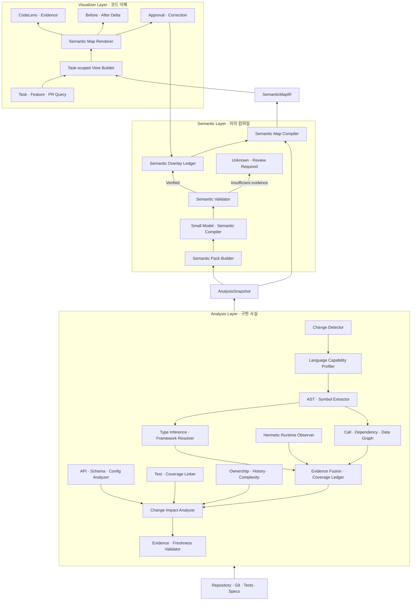

# Semantic Map Layered Architecture 상세 설계안

- 상태: 현재 대화 범위의 최종 제안
- 작성일: 2026-09-01
- 범위: AI 보조 개발에서 코드 이해 속도와 정확도를 높이는 Semantic Map 제품
- 핵심 구조: `Analysis Layer → Semantic Layer → Visualizer Layer`

## Question

AI가 생성하거나 변경하는 코드의 양이 증가할 때 발생하는 인지 부채를 줄이기 위해, 정확한 구현 분석과 빠른 생성 성능, 직관적인 코드 이해 UX를 제공하는 Semantic Map 시스템은 어떻게 설계해야 하는가?

특히 다음 항목을 상세히 정의한다.

1. 결정적 분석과 작은 언어 모델의 책임 경계
2. 작은 언어 모델이 코드 관계에 의미를 부여하는 방법
3. Fine-tuning 적용 시점과 준비 조건
4. Semantic Map 생성과 표시 계약
5. CodeFlow에서 재사용할 구조
6. LSP 도입 여부
7. 정적 언어와 동적 언어에 동일한 사실 발행 정확도를 적용하는 방법
8. 현재 Go 기반 구현을 유지하는 것이 성능, 정확도, 배포 측면에서 최적인지

## Answer Summary

Semantic Map은 코드베이스 전체를 단순히 시각화하는 그래프가 아니다. 개발자가 현재 작업을 이해하는 데 필요한 구현 사실, 동작 의미, 변경 영향, 코드 근거를 제한된 흐름으로 제공하는 작업 중심 지도다.

권장 구조는 다음과 같다.

```text
Analysis Layer
정적 분석과 범위가 명시된 runtime evidence로 구현 사실과 변경 영향을 재현 가능하게 분석한다.

        ↓ AnalysisSnapshot

Semantic Layer
검증된 사실을 사람이 이해할 행동과 의미 관계로 컴파일한다.

        ↓ SemanticMapIR

Visualizer Layer
작업 목적에 맞는 흐름, 변경 차이, 코드 근거를 점진적으로 보여준다.
```

작은 언어 모델은 `Semantic Compiler` 역할만 담당한다. 호출 관계, 분기, 상태 변경 같은 구현 사실을 만들거나 수정하지 않는다. CodeFlow와 정적 분석기가 만든 사실을 입력받아 행동 그룹, 의미 관계, 짧은 설명, 표시 중요도, 이해 확인 질문을 제안한다.

Fine-tuning은 초기 요구사항이 아니다. 먼저 범용 3B~8B 코드 모델, 제한된 Evidence Pack, 닫힌 의미 분류 체계, JSON 출력 계약으로 기준 성능을 측정한다. 반복 오류와 충분한 인간 승인 데이터가 확보된 뒤 필요한 작업만 SFT 또는 LoRA로 최적화한다.

구현 언어는 단일 언어로 통일하지 않는다. Go는 repository lifecycle, 분석 orchestration, 사실 검증, SemanticMapIR 컴파일과 발행을 담당한다. 언어 의미 분석은 Dart Analyzer, TypeScript Compiler API/Pyright 같은 원언어 도구가 담당하고, 로컬 추론은 `llama.cpp`, UI는 TypeScript가 담당한다. 현재 CodeFlow 실측과 작업 분해를 기준으로 이 polyglot 구조가 MVP의 기본 결정이다.

LSP는 초기 구조에 포함하지 않는다. 언어별 AST와 Compiler API가 현재 목적에 더 직접적이고 통제 가능하다. LSP는 실제 분석 정확도 부족이 측정되고 그 부족을 유의미하게 해소할 때만 별도 Provider로 재검토한다.

동적 언어는 `정적 후보 분석 → 타입·제약 추론 → 프레임워크 규칙 해석 → 격리된 런타임 관찰 → 증거 융합`으로 분석한다. 정적 언어와 동적 언어는 동일한 Fact 발행 기준을 사용한다. 다만 동적 언어의 실행되지 않은 경로까지 정적 언어와 동일한 coverage로 확정하는 것은 불가능하다. 따라서 제품은 `발행 정확도`와 `분석 coverage`를 분리하고, 확인하지 못한 관계를 `unknown`으로 표시한다.

## 1. 문제 정의

### 1.1 인지 부채

인지 부채는 코드가 수행하는 동작과 개발팀이 실제로 이해하는 동작 사이의 차이다. 기술 부채가 코드 구조와 구현에 존재한다면 인지 부채는 사람과 팀의 공유된 이해에 존재한다.

AI 코드 생성은 구현 속도를 높일 수 있지만 다음 상황을 확대할 수 있다.

- 개발자가 검증하지 않은 코드를 병합한다.
- 테스트 통과를 이해의 증거로 오해한다.
- 코드 변경 이유와 제약이 외부화되지 않는다.
- 코드 양이 리뷰와 이해 속도보다 빠르게 증가한다.
- 시스템의 중요한 동작을 설명할 사람이 줄어든다.

Semantic Map은 코드 생성을 제한하는 제품이 아니다. 빠르게 생성된 코드를 더 빠르고 정확하게 이해하도록 지원하는 제품이다.

### 1.2 제품 목표

- G1. 정확한 구현 내용을 파악한다.
- G2. Semantic Map 생성 시간을 짧게 유지한다.
- G3. 개발자가 기능 흐름과 변경 영향을 직관적으로 이해한다.
- G4. 모든 설명에서 실제 코드, 테스트, 계약 근거로 이동할 수 있다.
- G5. 확인되지 않은 의미를 사실처럼 표시하지 않는다.
- G6. 모델이 없거나 실패해도 기본 지도를 제공한다.
- G7. 정적 언어와 동적 언어에 동일한 Fact 발행 정확도와 근거 정책을 적용한다.

### 1.3 비목표

- 전체 저장소를 한 화면에 표시하는 거대한 그래프
- 코드 생성 도구 자체의 대체
- 개인별 개발자 평가 또는 감시
- 작은 모델이 코드 동작의 최종 권위가 되는 구조
- 정적 분석만으로 비즈니스 의도를 확정하는 구조
- 초기 단계의 저장소별 모델 Fine-tuning
- 실행하지 않은 동적 경로의 대상을 완전하게 확정하는 구조
- 모든 언어에서 동일한 분석 coverage를 보장한다는 주장

## 2. 용어

### Semantic Map

검증된 코드 사실과 승인 또는 추론된 의미를 작업 범위에 맞게 결합한 코드 이해 지도다.

### AnalysisSnapshot

특정 repository revision과 worktree fingerprint에서 추출한 구현 사실, 관계, 변경 영향, 근거, 미확인 영역의 불변 스냅샷이다.

### Semantic Overlay

구조적 사실을 변경하지 않고 사람이 읽기 쉬운 의미를 추가하는 별도 데이터다.

### SemanticMapIR

Semantic Map Renderer가 소비하는 언어 중립 중간 표현이다. 행동 노드, 의미 관계, 코드 근거, 상태, 표시 힌트를 포함한다.

### Evidence Anchor

사실이나 의미 주장을 실제 파일, 심볼, 바이트 범위, 해시, revision에 연결하는 근거 식별자다.

### Semantic Compiler

AnalysisSnapshot을 사람이 이해할 의미 후보로 변환하는 작은 언어 모델 기반 컴포넌트다.

## 3. 핵심 아키텍처 결정

- D1. 시스템은 `Analysis Layer → Semantic Layer → Visualizer Layer`로 구성한다.
- D2. 구현 사실은 Analysis Layer만 생성하고 소유한다.
- D3. 작은 모델은 Semantic Overlay만 제안한다.
- D4. 모델 출력은 검증 후에만 SemanticMapIR에 포함한다.
- D5. 사람이 승인한 의미가 모델 제안보다 높은 권위를 가진다.
- D6. provenance와 freshness를 별도 상태로 관리한다.
- D7. 모델 추론은 비동기 보강이며 기본 지도 생성을 막지 않는다.
- D8. Fine-tuning은 실제 반복 오류와 승인 데이터가 확보된 뒤 수행한다.
- D9. LSP는 초기 Analysis Layer에 포함하지 않는다.
- D10. 전체 코드 그래프가 아니라 작업별 7~15개 핵심 행동을 기본 표시한다.
- D11. 하나의 인지 부채 점수보다 근거 범위, 이해 정확도, 지식 집중도, 결함 결과를 분리 측정한다.
- D12. 동적 언어는 정적 분석과 격리된 런타임 관찰을 결합한 Hybrid Dynamic Analysis로 처리한다.
- D13. 모든 언어는 동일한 Fact 발행 품질 기준을 통과해야 한다.
- D14. 발행 정확도와 분석 coverage를 별도 지표로 관리한다.
- D15. 실행되지 않았거나 해석하지 못한 동적 관계는 추론 Fact가 아니라 `unknown`으로 발행한다.

## 4. 전체 구조



### 4.1 의존 방향

하위 레이어는 상위 레이어를 알지 않는다.

```text
Analysis Layer  ──data──> Semantic Layer ──data──> Visualizer Layer
```

Visualizer Layer의 승인 피드백은 Semantic Overlay Ledger에만 들어간다. AnalysisSnapshot의 사실은 변경하지 않는다.

### 4.2 장애 격리

- Analysis 실패: 지도 생성 불가 또는 부분 분석 상태 표시
- 작은 모델 실패: 구조 기반 기본 지도 유지
- Semantic Validator 실패: 해당 주장만 `unknown`
- Renderer 실패: SemanticMapIR은 보존되어 다른 표면에서 재사용 가능
- 승인 저장 실패: 현재 화면은 유지하되 승인 완료로 표시하지 않음

## 5. Analysis Layer 상세 설계

### 5.1 책임

Analysis Layer는 코드가 실제로 어떻게 구현되었는지 재현 가능한 근거 pipeline으로 분석한다. 정적 결과는 repository snapshot에, runtime 결과는 repository snapshot과 scenario에 함께 고정한다.

주요 입력은 다음과 같다.

- repository files
- Git baseline과 현재 worktree
- 언어별 Compiler와 AST
- API, schema, configuration
- tests와 coverage
- dependency manifest와 lockfile
- ownership과 Git history
- complexity 결과
- 언어 runtime과 dependency 환경
- 테스트, fixture, 명시적으로 승인된 실행 시나리오

### 5.2 구성요소

#### A1. Repository Snapshot Manager

동일한 분석에 서로 다른 코드 시점이 섞이지 않도록 기준을 고정한다.

```yaml
RepositorySnapshot:
  repositoryId: string
  baselineRevision: string | null
  headRevision: string
  worktreeFingerprint: string
  dirty: boolean
  analyzerVersions: object
```

#### A2. Change Detector

- 추가, 수정, 삭제된 파일
- 변경된 심볼
- API와 데이터 schema 변경
- dependency 변경
- test 변경
- configuration과 permission 변경

#### A3. AST and Compiler Adapter

언어별 공식 Compiler 또는 Analyzer API를 우선 사용한다.

- declaration과 symbol
- call과 return
- guard와 branch
- state mutation
- error와 throw
- external effect
- resolved type
- implementation과 override

Adapter는 다음 두 분석 mode 중 하나를 선언한다.

- `compiler_resolved`: compiler가 symbol, type, call target을 직접 해석하는 정적 언어 mode
- `hybrid_dynamic`: 정적 후보, 제약 추론, framework 규칙, runtime evidence를 융합하는 동적 언어 mode

단순 parser로 얻기 어려운 정보는 언어별 analyzer API를 직접 사용한다. LSP를 거치지 않는다. 지원하지 못한 관계는 추측하지 않는다.

#### A4. Dependency and Relation Graph

닫힌 구조 관계를 생성한다.

```text
calls
reads
writes
implements
overrides
depends_on
transitions_to
emits
handles
tested_by
owned_by
```

`calls`를 `결제를 위임한다`로 바꾸는 것은 Semantic Layer의 책임이다.

#### A5. API, Schema and Configuration Analyzer

- public API와 endpoint
- request와 response contract
- database schema와 migration
- event와 message contract
- configuration flag
- permissions와 authorization boundary

#### A6. Test Linker

- 테스트가 직접 참조하는 symbol
- behavior와 test case 연결
- 변경된 코드와 관련 테스트
- test 실행 결과
- coverage가 있을 때의 범위

테스트 통과는 코드 이해의 증거가 아니다. 테스트는 기대 동작과 검증 범위를 지지하는 근거다.

#### A7. Ownership, History and Complexity Analyzer

- CODEOWNERS
- 최근 수정자와 주요 기여자
- 변경 빈도와 hotspot
- symbol과 method complexity
- 파일과 module size
- 변경 집중도

ownership은 권위를 결정하지 않는다. 검토 대상과 지식 집중 위험을 찾는 정보로 사용한다.

#### A8. Change Impact Analyzer

변경된 사실에서 영향을 받는 영역을 계산한다.

- 상위 caller
- 하위 dependency
- 영향받는 behavior
- public API consumer
- data state
- test
- external system
- visible result
- owner

#### A9. Evidence and Freshness Validator

모든 사실을 코드 근거에 연결한다.

```yaml
EvidenceAnchor:
  id: string
  kind: code | test | config | contract | trace | session
  path: string
  symbol: string | null
  lineRange: [int, int] | null
  byteRange: [int, int] | null
  fileHash: string
  spanHash: string | null
  astFingerprint: string | null
  capturedAtRevision: string
```

코드 변경 후 처리 상태는 다음과 같다.

- `fresh`: 현재 근거와 일치
- `stale`: 관련 근거 변경
- `orphaned`: 관련 symbol 삭제
- `unknown`: 확인 불가

#### A10. Language Capability Profiler

분석 시작 전에 언어, runtime, dependency, framework, 설정을 감지하고 실제 분석 가능 범위를 선언한다. Adapter가 지원하지 않는 기능을 자동으로 성공 처리하지 않는다.

```yaml
LanguageCapabilityProfile:
  language: javascript | python | ruby | other
  analysisMode: compiler_resolved | hybrid_dynamic
  runtimeVersion: string
  dependencyFingerprint: string
  analyzerVersions: object
  capabilities:
    syntax: supported | partial | unavailable
    moduleResolution: supported | partial | unavailable
    symbolResolution: supported | partial | unavailable
    typeResolution: supported | partial | unavailable
    callResolution: supported | partial | unavailable
    dataFlow: supported | partial | unavailable
    frameworkResolution: supported | partial | unavailable
    runtimeObservation: supported | partial | unavailable
  limitations: [string]
```

Profile은 AnalysisSnapshot에 포함된다. Visualizer Layer는 이를 이용해 "분석 완료"와 "일부 기능 미지원"을 구분한다.

분석 mode는 compiler 또는 interpreter라는 실행 방식이 아니라 실제 symbol·type·dispatch 해석 능력으로 선택한다. JIT 또는 bytecode runtime을 사용하는 언어도 compiler가 call target을 안정적으로 해석하면 `compiler_resolved`를 사용할 수 있다.

#### A11. Dynamic Static Candidate Analyzer

동적 언어도 실행 전에 최대한 많은 후보를 좁힌다. 이 단계의 출력은 확정 Fact가 아니라 `candidate set + constraint`다.

- lexical scope, closure, symbol table
- import와 module resolution
- literal과 assignment 기반 local type propagation
- parameter, return, attribute constraint
- JSDoc, type hint, stub, declaration file
- decorator, annotation, metaclass, descriptor
- prototype 변경, monkey patch, dynamic import
- string 기반 dispatch와 reflection 경계
- dependency injection registration

JavaScript는 TypeScript analyzer의 JavaScript 검사 기능과 module resolution을 직접 사용할 수 있다. TypeScript의 [`checkJs`](https://www.typescriptlang.org/tsconfig/checkJs.html)와 [`allowJs`를 포함한 TSConfig](https://www.typescriptlang.org/tsconfig/)를 사용해 JavaScript 파일의 type error, JSDoc type, module 관계를 분석한다. Python은 AST, symbol table, import graph, type hint와 stub을 결합하고, 선택한 type checker의 직접 API 또는 CLI 결과를 Provider로 수집한다. 이 결과만으로 target이 하나로 좁혀지지 않으면 `candidate` 상태를 유지한다.

#### A12. Framework Semantics Adapter

동적 언어의 중요한 관계는 언어 문법보다 framework convention에 의해 결정되는 경우가 많다. Framework Adapter는 다음 정보를 versioned rule로 해석한다.

- route 등록과 handler
- dependency injection container
- ORM model, query, lifecycle hook
- event subscriber와 message consumer
- middleware와 plugin chain
- serializer와 validation schema
- test fixture와 factory

Framework rule은 `framework name + version range + rule version + fixture test`를 가져야 한다. 검증된 rule만 구조 Fact를 만들 수 있다. 버전을 식별하지 못하거나 rule test가 실패하면 후보 또는 `unknown`으로 남긴다.

#### A13. Scenario Planner and Hermetic Runtime Observer

정적 후보로 대상이 하나로 좁혀지지 않는 중요한 경로만 runtime 관찰 대상으로 선택한다.

시나리오 우선순위는 다음과 같다.

1. 기존 단위·통합 테스트
2. 사용자가 지정한 test command와 entrypoint
3. 저장된 request, event fixture의 안전한 replay
4. 별도 승인을 받은 synthetic scenario

관찰은 product source를 수정하지 않는 격리 환경에서 수행한다.

- network 기본 차단
- 임시 filesystem과 read-only source mount
- secret 제거와 최소 환경 변수
- CPU, memory, process, timeout 제한
- command allowlist
- 외부 service는 fixture 또는 mock으로 대체
- 실행 command, input, dependency, runtime fingerprint 기록

Python 3.12 이상에서는 공식 [`sys.monitoring`](https://docs.python.org/3/library/sys.monitoring.html) API로 call, return, branch, jump, exception event를 수집할 수 있다. 다른 runtime은 언어별 profiler, trace hook 또는 [OpenTelemetry instrumentation](https://opentelemetry.io/docs/concepts/instrumentation/)을 Provider로 사용한다. OpenTelemetry는 code-based와 zero-code instrumentation, trace context와 semantic convention을 제공하지만, 수집된 trace가 실행하지 않은 경로까지 증명하지는 않는다.

```yaml
RuntimeEvidence:
  runId: string
  scenarioId: string
  repositorySnapshotId: string
  runtimeFingerprint: string
  dependencyFingerprint: string
  commandDigest: string
  inputDigest: string
  environmentFingerprint: string
  startedAt: timestamp
  completedAt: timestamp
  result: passed | failed | timeout | blocked
  eventRefs: [string]
  traceHash: string
  sideEffectPolicy: string
```

```yaml
RuntimeEvent:
  id: string
  runId: string
  sequence: int
  kind: call | return | branch | jump | exception | read | write | external_effect
  sourceAnchorRef: string | null
  callerCandidateRef: string | null
  targetCandidateRef: string | null
  runtimeType: string | null
  parentEventRef: string | null
  executionContextId: string
  valueShapeHash: string | null
```

Runtime symbol은 `module identity + qualified name + source span + code hash`로 정적 candidate에 연결한다. source map이 있으면 생성 코드 위치를 원본 위치로 변환한다. `eval` 또는 runtime code generation처럼 원본 위치가 없으면 synthetic anchor를 만들고 source-backed Fact로 승격하지 않는다. 인자와 반환값의 raw value는 기본 수집하지 않고 type, shape, allowlisted digest만 기록한다.

Runtime evidence가 증명하는 범위는 해당 revision, 환경, 입력, 시나리오에서 실제 관찰한 동작뿐이다.

#### A14. Evidence Fusion and Coverage Ledger

정적 근거와 runtime 근거를 동일한 symbol ID와 code span에 연결해 최종 Fact 상태를 결정한다.

| 입력 상태 | 최종 처리 |
|---|---|
| compiler 또는 analyzer가 target을 유일하게 해석 | `observed_static` |
| runtime에서 실제 target 호출을 관찰 | `observed_runtime`, scenario scope 필수 |
| 독립된 정적·runtime 근거가 일치 | `corroborated` |
| 정적 후보와 runtime target이 충돌 | `conflicting`, 자동 확정 금지 |
| 여러 정적 후보만 존재 | `unresolved`, 후보 목록 보존 |
| 분석 기능 또는 시나리오 없음 | `unavailable` 또는 `unknown` |

동적 생성 관계가 runtime에서 관찰되었더라도 모든 입력에 대한 보편 Fact로 일반화하지 않는다. 일반화하려면 정적 제약, 여러 독립 시나리오 또는 framework contract가 추가로 일치해야 한다.

융합 순서는 고정한다.

```text
dynamic boundary 선택
→ 같은 RepositorySnapshot의 static candidate 조회
→ 같은 source anchor의 runtime event 조회
→ runtime type과 target을 candidate constraint로 검증
→ framework contract와 충돌 확인
→ publication rule 적용
→ Fact, conflict 또는 unknown 발행
```

```yaml
CoverageLedger:
  discoveredEntryPoints: [string]
  exercisedEntryPoints: [string]
  discoveredBranches: int
  exercisedBranches: int
  dynamicBoundaries:
    total: int
    resolved: int
    conflicting: int
    unresolved: int
  criticalFlows:
    - flowId: string
      requiredBoundaryRefs: [string]
      resolvedBoundaryRefs: [string]
      status: complete | partial | unknown
  scenarioRefs: [string]
```

CoverageLedger는 "발행한 Fact가 정확한가"와 "중요한 경로를 얼마나 해석했는가"를 분리한다. 정적 언어와 동적 언어는 동일한 precision gate를 통과해야 하지만, coverage 차이는 수치와 `unknown`으로 노출한다.

작은 모델은 이 과정에 참여하지 않는다. dynamic target 선택, runtime event 연결, Fact 승격은 모두 검증 가능한 Analyzer와 Evidence Fusion 규칙이 담당한다. 작은 모델은 최종 AnalysisSnapshot이 발행된 뒤 의미 설명만 제안한다.

### 5.3 AnalysisSnapshot 계약

```yaml
AnalysisSnapshot:
  version: 1
  snapshotId: string
  basisSha: string
  repositorySnapshot: RepositorySnapshot
  languageCapabilities: [LanguageCapabilityProfile]

  facts:
    - id: fact-1
      kind: call
      subject: PaymentController.submit
      object: PaymentService.process
      status: observed_static
      evidenceRefs: [ev-1]
      scenarioScope: null

  relations:
    - id: relation-1
      fromFactRef: fact-1
      toFactRef: fact-2
      type: causes
      resolution: resolved

  changeImpact:
    changedFactRefs: []
    affectedSymbols: []
    affectedTestRefs: []
    affectedAPIs: []
    affectedOwners: []

  unknowns:
    - subject: string
      reason: string
      requiredEvidence: string | null

  runtimeEvidence: [RuntimeEvidence]
  coverage: CoverageLedger
  evidence: [EvidenceAnchor]
```

### 5.4 신뢰 상태

단일 confidence 숫자만으로 결과를 숨기지 않는다.

```text
observed_static  compiler, analyzer 또는 검증된 framework rule에서 확인
observed_runtime 특정 scenario 실행에서 확인
corroborated     여러 독립 근거가 일치
conflicting      근거가 서로 충돌
unresolved       후보는 있으나 대상을 하나로 해석하지 못함
unavailable      분석 기능을 지원하지 않음
unknown          근거나 실행 scenario가 없음
stale            입력 코드 또는 환경 변경
```

### 5.5 Analysis Layer가 하지 않는 일

- 비즈니스 목적 추론
- 자연어 업무 설명 생성
- 화면에 표시할 중요도 확정
- 모델 제안 저장
- 최종 흐름 UX 구성
- runtime에서 관찰한 한 사례를 전체 동작으로 일반화
- 불완전한 dynamic candidate를 확정 Fact로 승격

## 6. LSP 결정

### 6.1 현재 결정

LSP는 초기 Analysis Layer에 추가하지 않는다.

### 6.2 이유

- CodeFlow는 언어별 AST와 Compiler API에서 구조적 사실을 직접 추출한다.
- LSP의 기능과 정확도는 언어 서버마다 다르다.
- Language Server 실행, 인덱싱, 설정, lifecycle 관리가 운영 비용을 늘린다.
- 정의와 참조 탐색은 기존 symbol graph와 CodeLens 목적과 겹친다.
- LSP는 control flow, data flow, framework convention, state 의미를 완성하지 못한다.
- cold start와 workspace indexing이 지도 생성 시간을 늘릴 수 있다.
- 동적 언어의 미확정 target은 LSP 응답만으로 해결되지 않는다. direct analyzer와 runtime evidence가 필요하다.

### 6.3 재검토 조건

다음 문제가 측정될 때만 독립 `LspProvider`로 재검토한다.

- 특정 언어의 Compiler API 통합 비용이 과도하다.
- cross-file 참조 정확도가 수용 기준보다 낮다.
- 기존 IDE의 warm Language Server를 안정적으로 재사용할 수 있다.
- 비교 실험에서 LSP가 중요한 관계 누락을 유의미하게 줄인다.

## 7. Semantic Layer 상세 설계

### 7.1 책임

Semantic Layer는 AnalysisSnapshot을 개발자가 빠르게 이해할 행동, 의미 관계, 설명으로 변환한다.

작은 모델은 이 레이어의 한 컴포넌트다. Semantic Layer 전체가 모델에 의존하지 않는다.

### 7.2 Semantic Pack Builder

현재 작업과 연결된 최소 근거만 작은 모델에 전달한다.

```yaml
SemanticPack:
  version: 1
  basisSha: string
  flowId: string

  task:
    query: string
    type: understand | review | debug | onboarding | impact
    locale: ko

  facts:
    - id: fact-1
      kind: condition
      subject: SignUpController
      object: email.isEmpty
      evidenceRefs: [ev-1]

  relations: []
  steps: []
  evidence: []
  intentEvidence: []
  approvedKnowledge: []
  glossary: []
  unknowns: []
  allowedSemanticRelations: []
```

입력 구성 규칙은 다음과 같다.

- 저장소 전체를 모델에 전달하지 않는다.
- 현재 flow와 직접 연결된 사실만 포함한다.
- 코드, 테스트, 명세, 세션 근거를 구분한다.
- 모든 snippet에 Evidence Anchor를 연결한다.
- 오래된 승인 지식은 `stale`로 표시한다.
- secret scanner를 통과한 내용만 포함한다.
- 동일 입력을 재현할 수 있도록 `basisSha`를 포함한다.

### 7.3 Small Model Semantic Compiler

#### 역할

- 관계 의미 분류
- 여러 코드 사실을 행동 단위로 그룹화
- 기술 표현을 업무 표현으로 변환
- 작업별 중요도 제안
- 변경 의미 설명
- 근거 부족 영역의 확인 질문 생성
- 개발자 이해 확인 질문 생성

#### 하지 않는 일

- 새로운 Fact 생성
- call, branch, state transition 변경
- 실제 코드 실행 결과 확정
- 코드만 보고 제품 목적 확정
- 최종 map layout 결정
- 인간 이해도 인증

### 7.4 작업 분리

하나의 큰 프롬프트 대신 같은 모델을 좁은 작업으로 실행한다.

```text
relation_label
구조 관계에 닫힌 의미 유형을 부여한다.

behavior_group
여러 사실을 개발자가 읽을 행동 단위로 묶는다.

intent_link
코드 밖의 intent evidence가 있을 때만 의도와 구현을 연결한다.

map_rank
현재 작업에서 중요한 행동을 제안한다.

explain
업무 수준과 기술 수준의 짧은 설명을 만든다.

question_generate
미확인 영역과 개발자 이해 확인 질문을 만든다.
```

### 7.5 닫힌 의미 분류 체계

초기 의미 관계는 제한된 목록으로 시작한다.

```text
validates
authorizes
loads
persists
transforms
delegates
emits
navigates
calls_external
handles_failure
compensates
returns_result
unknown
```

모델이 적절한 관계를 찾지 못하면 새로운 이름을 만들지 않고 `unknown`을 선택한다.

### 7.6 주장 종류와 근거 정책

| 주장 | 필요한 근거 |
|---|---|
| 현재 동작 | code 또는 test |
| 기대 동작 | test 또는 contract |
| 상태 변경 | mutation fact |
| 외부 영향 | external call 또는 contract |
| 실패 동작 | branch, error handling 또는 test |
| 변경 이유 | PR, task, ADR 또는 human input |
| 비즈니스 목적 | product spec 또는 human approval |
| 운영 결과 | trace, log 또는 incident evidence |

코드는 무엇을 하는지는 지지할 수 있지만 왜 하는지는 항상 지지하지 않는다. 의도 근거가 없으면 `intent: null`과 구체적인 이유를 반환한다.

### 7.7 SemanticProposal 계약

```yaml
SemanticProposal:
  version: 1
  proposalId: string
  flowId: string
  basisSha: string

  model:
    id: string
    version: string
    promptVersion: string

  claims:
    - claimId: claim-1
      targetRef: fact-1
      kind: business_action
      text: 회원가입 입력을 검증한다
      semanticRelation: validates
      evidenceRefs: [ev-1, ev-2]
      confidence: 0.91
      uncertainty: null

  groups:
    - groupId: group-1
      title: 입력 검증
      factRefs: [fact-1, fact-2]
      evidenceRefs: [ev-1, ev-2]

  mapHints:
    - targetRef: fact-1
      importance: 0.85
      collapsedByDefault: false

  questions:
    - text: 이메일 검증이 실패하면 다음 단계는 실행되는가?
      answerEvidenceRefs: [ev-1]

  abstentions:
    - targetRef: fact-3
      reason: external API contract is unavailable
```

### 7.8 Semantic Validator

모델 출력은 다음 검증을 모두 통과해야 한다.

- V1. 모든 target, fact, evidence reference가 입력에 존재한다.
- V2. 모델이 Fact, branch, state transition을 만들거나 변경하지 않았다.
- V3. `basisSha`와 현재 snapshot이 일치한다.
- V4. 주장 종류에 필요한 근거가 존재한다.
- V5. 설명이 구조 사실과 충돌하지 않는다.
- V6. 허용된 의미 관계만 사용한다.
- V7. secret 또는 제외 대상 source가 포함되지 않는다.
- V8. 출력 크기와 그룹 크기가 계약 범위 안이다.
- V9. 근거 부족 주장은 전체 실패 대신 `unknown`으로 강등한다.
- V10. 모델의 자체 confidence를 최종 신뢰도로 사용하지 않는다.

### 7.9 Semantic Overlay Ledger

모델 제안과 사람 승인을 구현 사실과 분리해 저장한다.

```yaml
SemanticClaim:
  id: claim-1
  targetRef: fact-1
  kind: business_action
  text: 결제 처리를 서비스에 위임한다
  relation: delegates
  evidenceRefs: [ev-1]
  producer: small-model
  modelVersion: string
  promptVersion: string
  status: inferred
  freshness: fresh
  confidence: 0.88
```

상태는 다음과 같다.

```text
inferred   모델 제안
confirmed  사람 승인
rejected   사람 거절
stale      코드 변경
orphaned   관련 Fact 삭제
unknown    근거 부족
```

변경 이력은 append-only event로 남기고 현재 view는 event replay로 구성한다.

### 7.10 Semantic Map Compiler

Semantic Map Compiler는 결정적으로 실행된다.

```text
AnalysisSnapshot
+ confirmed SemanticOverlay
+ verified inferred SemanticOverlay
+ task scope
+ presentation policy
→ SemanticMapIR
```

모델이 없을 때도 다음 정보로 기본 SemanticMapIR을 만든다.

- 구조적 이름
- 레이어 흐름
- call과 state transition
- code와 test evidence
- unknown
- 승인된 기존 의미

## 8. 작은 모델 전략

### 8.1 초기 모델 요구사항

- 3B~8B급 code-capable instruct model
- 한국어와 영어 설명 품질
- 안정적인 JSON structured output
- local execution 가능
- 제한된 8K~16K context에서 충분한 성능
- 낮은 temperature에서 출력 안정성
- 4-bit 또는 적절한 quantization 지원

모델 이름은 설계 계약이 아니다. `SemanticModel` 인터페이스 뒤에서 교체 가능해야 한다.

```go
type SemanticModel interface {
    Propose(
        context.Context,
        SemanticPack,
        SemanticJob,
    ) (SemanticProposal, error)
}
```

### 8.2 모델 라우팅

```text
deterministic baseline
→ small model fast path
→ validator
→ low confidence 또는 high-risk
→ human review 또는 선택적 stronger model
```

항상 실행되는 두 번째 모델은 두지 않는다.

### 8.3 Fine-tuning 결정

초기에는 Fine-tuning하지 않는다.

다음 조건이 충족될 때만 수행한다.

- 동일한 의미 관계를 반복해서 잘못 분류한다.
- 조직 고유 용어를 glossary만으로 해결하지 못한다.
- JSON과 근거 연결 계약을 반복해서 위반한다.
- 프롬프트와 Evidence Pack 개선 후에도 성능이 정체된다.
- 충분한 인간 승인, 수정, 거절 데이터가 쌓였다.
- Fine-tuning 전후를 비교할 고정 평가 세트가 있다.

권장 순서는 다음과 같다.

```text
범용 작은 모델
→ prompt와 schema
→ repository glossary와 approved knowledge retrieval
→ 실제 사용 데이터 수집
→ 반복 오류 분석
→ 좁은 작업 대상 SFT 또는 LoRA
```

학습 데이터는 다음 구조를 유지한다.

```text
SemanticPack
+ 모델 최초 제안
+ 사람이 수정한 최종 의미
+ 승인 또는 거절 이유
+ 잘못 사용된 근거
+ 누락된 중요한 행동
```

저장소마다 전체 모델을 다시 학습하지 않는다. 공통 모델, 저장소 glossary, 승인 지식을 우선 조합한다.

## 9. SemanticMapIR 계약

```yaml
SemanticMapIR:
  version: 1
  mapId: string
  generationId: string
  basisSha: string

  task:
    query: string
    type: understand | review | debug | onboarding | impact

  nodes:
    - id: node-1
      type: behavior | component | state | decision | test | external
      title: 회원가입 입력을 검증한다
      technicalTitle: SignUpController.validate
      factRefs: [fact-1, fact-2]
      evidenceRefs: [ev-1, ev-2]
      structuralStatus: corroborated
      evidenceScope: repository | scenario
      scenarioRefs: []
      semanticStatus: confirmed
      freshness: fresh
      importance: high
      layer: controller

  edges:
    - id: edge-1
      from: node-1
      to: node-2
      structuralRelation: call
      semanticRelation: delegates
      semanticStatus: inferred
      evidenceRefs: [ev-3]

  deltas:
    addedNodeRefs: []
    removedNodeRefs: []
    changedNodeRefs: []

  unknowns: []
  coverageSummary:
    criticalFlowsComplete: int
    criticalFlowsPartial: int
    unresolvedDynamicBoundaries: int
  questions: []
  warnings: []
```

### 9.1 안정성 규칙

- Fact ID는 Analysis Layer가 소유한다.
- Semantic node는 참조하는 Fact가 같으면 안정적인 ID를 유지한다.
- baseline과 current는 같은 schema와 analyzer version으로 비교한다.
- map generation time은 IR 본문 결정성에서 제외하고 envelope에 둔다.
- model ID와 prompt version은 inferred claim에 기록한다.

### 9.2 FlowView 산출물 파이프라인

FlowView는 AnalysisSnapshot, SemanticProposal, SemanticOverlay를 직접 읽지 않는다. Visualizer Layer가 읽는 canonical document는 SemanticMapIR이고, 기존 CodeFlow FlowView를 사용할 때는 이를 `FlowViewProjection`으로 변환한다.

```text
AnalysisSnapshot JSON
+ SemanticOverlay Ledger JSONL
+ task scope와 presentation policy
→ SemanticMapIR JSON
→ FlowViewProjection JSON
→ FlowView
```

각 산출물의 기록 형식과 권위는 다음과 같다.

| 산출물 | 형식 | 저장 정책 | 권위 |
|---|---|---|---|
| AnalysisSnapshot | versioned JSON | generation별 저장 | 구현 사실의 권위 |
| RuntimeEvidence manifest | JSON | run별 저장 | 실행 scenario 범위의 근거 |
| RuntimeEvent | JSONL | run별 저장 | 대용량 실행 event stream |
| SemanticPack | JSON | 기본 미저장, hash만 기록 | 작은 모델 입력 |
| SemanticProposal | JSON | 임시 또는 audit 저장 | 검증 전 모델 제안 |
| SemanticOverlay Ledger | append-only JSONL | 영구 저장 | 승인·수정·거절 의미 이력 |
| SemanticMapIR | versioned JSON | generation별 저장 | renderer 중립 map |
| FlowViewProjection | versioned JSON | generation별 저장 | FlowView 표시 전용 projection |
| Generation Index와 Pointer | JSON | 영구 저장 | active generation 선택 |

`FlowViewProjection`은 별도 지식 원장이 아니다. 같은 AnalysisSnapshot, Overlay Ledger, presentation policy에서 다시 생성할 수 있어야 한다.

### 9.3 FlowViewProjection 계약

현재 CodeFlow FlowView는 `schemas/flowspec.schema.json`의 FlowSpec을 읽는다. Semantic Map 제품에서는 기존 필드를 유지하고 구조 상태, 의미 상태, scenario 범위, coverage, delta를 additive field로 확장한다.

```yaml
FlowViewProjection:
  version: 4
  flowId: string
  mapId: string
  generationId: string
  title: string
  description: string | null
  basisSha: string

  task:
    type: understand | review | debug | onboarding | impact
    query: string

  summary:
    businessAction: string
    start: string
    outcome: string

  steps:
    - ordinal: int
      stepId: string
      nodeRef: string
      name: string
      technicalName: string
      layer: presentation | controller | usecase | domain | data | infra | external | unknown
      kind: guard | mutation | call | branch
      structuralStatus: observed_static | observed_runtime | corroborated | conflicting | unknown | stale
      semanticStatus: confirmed | inferred | unknown
      provenance: approved | session | derived | unknown
      freshness: fresh | stale | orphaned
      evidenceScope: repository | scenario
      scenarioRefs: [string]
      rules: [string]
      stateDelta:
        before: string
        after: string
      sideEffect: string | null
      branch: string | null
      anchor: EvidenceAnchor
      codeLens:
        path: string
        startLine: int
        endLine: int
        viewStartLine: int
        viewEndLine: int

  edges:
    - fromStepRef: string
      toStepRef: string | null
      toSymbolPath: string
      toLayer: string
      structuralRelation: string
      semanticRelation: string | null
      resolutionStatus: resolved | unresolved_dynamic | unresolved_type | conflicting
      evidenceRefs: [string]

  coverageSummary:
    criticalFlowsComplete: int
    criticalFlowsPartial: int
    unresolvedDynamicBoundaries: int
    exercisedScenarioRefs: [string]

  deltas:
    addedStepRefs: [string]
    changedStepRefs: [string]
    removedSteps: []

  unknowns: []
  warnings: []
```

현재 CodeFlow의 FlowSpec v3가 이미 제공하는 필드는 `step, layer, kind, anchor, codeLens, provenance, freshness, confidence, stateDelta, sideEffect, branch, edge, unknown`이다. 위 계약에서 추가가 필요한 핵심 필드는 `structuralStatus, semanticStatus, evidenceScope, scenarioRefs, coverageSummary, deltas`다.

### 9.4 저장 경로

```text
.codeflow/
  facts/
    analysis/<snapshot-id>.json
    runtime/<run-id>/manifest.json
    runtime/<run-id>/events.jsonl
    coverage/<snapshot-id>.json
    slice/<cache-key>.json

  semantics/
    proposals/<proposal-id>.json
    events/events.jsonl

  generations/<generation-id>/
    analysis-snapshot.json
    semantic-map-ir.json
    flows/<flow-id>.json
    index.json

  pointer.json
```

FlowView는 `pointer.json → active generation → flows/<flow-id>.json`만 따라간다. generation 생성 중의 부분 파일을 읽지 않는다.

### 9.5 Schema 검증 규칙

- 모든 JSON document는 schema version을 가진다.
- publish 전에 JSON Schema validation을 통과해야 한다.
- 모든 step은 stable ID, layer, kind, Evidence Anchor를 가져야 한다.
- FlowViewProjection의 node와 edge는 존재하는 SemanticMapIR reference만 사용할 수 있다.
- `observed_runtime`은 하나 이상의 scenario reference를 가져야 한다.
- `unknown`과 `conflicting`은 renderer에서 제거할 수 없다.
- generation의 모든 문서는 동일한 `basisSha`를 가져야 한다.
- active pointer는 모든 문서 검증이 성공한 뒤 원자적으로 교체한다.

### 9.6 Schema source of truth와 구현 상태

현재 CodeFlow에서 실제 JSON Schema로 강제되는 계약은 다음과 같다.

- `schemas/core-artifact.schema.json`: agent가 `publish_core_flow`에 제출하는 핵심 흐름
- `schemas/sliced-payload.schema.json`: language adapter에서 Fusion으로 전달되는 구조 slice
- `schemas/session-artifact.schema.json`: session semantic draft
- `schemas/flowspec.schema.json`: 현재 FlowView가 읽는 최종 계약
- `schemas/identity.schema.json`: anchor, flow ID, step ID, provenance, freshness

Semantic Map 설계 구현 시 다음 schema를 새 source of truth로 추가한다.

- `schemas/analysis-snapshot.schema.json`
- `schemas/language-capability-profile.schema.json`
- `schemas/runtime-evidence.schema.json`
- `schemas/coverage-ledger.schema.json`
- `schemas/semantic-pack.schema.json`
- `schemas/semantic-proposal.schema.json`
- `schemas/semantic-map-ir.schema.json`
- `schemas/flowview-projection.schema.json`

이 문서의 YAML은 설계 계약이다. 위 JSON Schema 파일과 contract fixture가 구현되고 CI validation을 통과하기 전에는 구현 완료로 간주하지 않는다. 특히 현재 FlowSpec v3에는 `structuralStatus, semanticStatus, scenarioRefs, coverageSummary, deltas`가 없으므로 Semantic Map FlowView에는 schema 확장이 필요하다.

## 10. Visualizer Layer 상세 설계

### 10.1 책임

Visualizer Layer는 개발자가 기능과 변경 영향을 가장 짧은 시간에 이해하게 한다.

의미를 새로 추론하지 않는다. SemanticMapIR을 작업 목적에 맞게 선택하고 표현한다.

### 10.2 Task-scoped View

지원하는 기본 작업은 다음과 같다.

- feature understanding
- PR review
- change impact
- bug investigation
- incident analysis
- onboarding

전체 map을 기본 표시하지 않는다. 기본 화면은 7~15개의 핵심 행동으로 제한한다.

### 10.3 Progressive Disclosure

정보는 세 단계로 제공한다.

```text
1. Business Flow
회원가입 입력 검증 → 회원 저장 → 로그인 상태 생성

2. Technical Flow
Controller → UseCase → Repository → API

3. Evidence
함수, 코드 범위, 테스트, 상태 변경, 계약
```

### 10.4 기본 UI 구성

- flow title과 사용자 목적
- 핵심 행동 timeline 또는 layer flow
- 현재 선택한 행동의 incoming cause
- 현재 선택한 행동의 outgoing result
- state before와 after
- external effect
- unknown과 missing evidence
- 정적 확인, runtime 관찰, 상호 검증, 충돌 상태
- critical flow별 coverage와 실행한 scenario
- inferred와 confirmed 의미 구분
- CodeLens
- baseline과 current delta

### 10.5 변경 차이

```text
추가됨: 결제 실패 재시도
변경됨: 최대 재시도 3회 → 5회
제거됨: 즉시 실패 처리
영향: PaymentService, RetryPolicy, PaymentFlowTest
```

구조 변경과 의미 변경을 구분한다.

### 10.6 CodeLens

모든 Semantic Map 요소는 실제 근거로 이동할 수 있어야 한다.

```text
Semantic node
→ behavior group
→ Fact
→ Evidence Anchor
→ source와 test
```

### 10.7 Human Feedback

사용자는 모델 의미를 다음과 같이 처리한다.

- 승인
- 수정 후 승인
- 거절
- 근거 부족 표시
- 중요한 행동으로 고정
- 기본 접힘 처리

피드백은 Semantic Overlay Ledger로만 전달한다.

### 10.8 UX 수용 기준

- 사용자는 첫 화면에서 기능의 시작, 핵심 변화, 결과를 설명할 수 있다.
- 모든 중요한 노드는 실제 코드 또는 테스트로 이동할 수 있다.
- `observed_static`, `observed_runtime`, `corroborated`, `conflicting`, `unknown` 구조 상태가 구분된다.
- inferred와 confirmed 의미 상태가 구조 상태와 별도로 구분된다.
- 사용자는 전체 그래프를 읽지 않고 관련 흐름만 탐색할 수 있다.
- baseline과 current의 동작 차이를 코드 diff보다 먼저 이해할 수 있다.
- 모델 결과가 늦어도 기본 지도를 사용할 수 있다.

### 10.9 UX의 기본 문장

Visualizer Layer가 가장 먼저 답해야 하는 질문은 다음 하나다.

> 이 기능은 어디서 시작하고, 어떤 핵심 판단과 상태 변화를 거쳐, 무엇을 결과로 만드는가?

따라서 첫 화면은 전체 architecture graph가 아니라 `Business Summary + Core Flow Timeline + 선택 단계 Evidence`로 구성한다. Architecture Map은 현재 흐름의 경계를 빠르게 확인하는 보조 지도다.

### 10.10 화면 정보 구조

```text
┌────────────────────────────────────────────────────────────────────┐
│ Flow title · task · revision · freshness · coverage               │
├────────────────────────────────────────────────────────────────────┤
│ Business Summary                                                   │
│ 시작: 결제 요청 → 핵심: 검증·승인·저장 → 결과: 결제 완료 응답       │
├────────────────────────────────────────────────────────────────────┤
│ Mini Architecture Path                                             │
│ Controller → UseCase → Domain → Data → External                    │
├───────────────────────────────┬────────────────────────────────────┤
│ Core Flow Timeline            │ Selected Step Evidence             │
│ 01 요청을 검증한다             │ 의미와 기술 이름                    │
│ 02 결제를 승인한다  ← selected │ 상태 변화·분기·외부 효과             │
│ 03 결과를 저장한다             │ 코드 근거·테스트·scenario            │
│ 04 완료를 반환한다             │ provenance·freshness                │
├───────────────────────────────┴────────────────────────────────────┤
│ Inline unknown, conflict, stale, and change explanations           │
└────────────────────────────────────────────────────────────────────┘
```

desktop에서는 Timeline과 Evidence를 나란히 표시한다. 좁은 화면에서는 Timeline 아래에 선택 단계 Evidence를 배치한다. 별도의 전체 graph 탐색을 기본 화면에 강제하지 않는다.

### 10.11 Progressive Disclosure 계약

정보는 다음 세 수준으로 고정한다.

1. `무엇을 하는가`: 승인 또는 검증된 행동 이름과 전체 flow 순서
2. `어떻게 하는가`: layer, technical symbol, branch, state delta, delegation
3. `왜 믿을 수 있는가`: source, test, contract, runtime scenario, freshness

사용자는 1단계만 읽고 기능을 설명할 수 있어야 한다. 2단계는 선택한 step에서 바로 보이고, 3단계는 CodeLens와 Evidence Inspector로 확인한다.

### 10.12 Step Card 계약

```text
02  결제를 승인한다
    PaymentUseCase.approve
    [UseCase] [호출] [정적+실행 확인] [fresh]

    규칙      승인 금액이 한도를 넘으면 거절
    상태      pending → approved
    위임      PaymentGateway.authorize → External
    분기      승인 실패 → 실패 상태 저장

    근거 보기 · 분기 펼치기
```

Step Card의 필드 binding은 다음과 같다.

| 화면 요소 | FlowViewProjection source |
|---|---|
| 행동 이름 | `steps[].name` |
| 기술 이름 | `steps[].technicalName` |
| Layer | `steps[].layer` |
| 행동 종류 | `steps[].kind` |
| 사실 상태 | `steps[].structuralStatus` |
| 의미 상태 | `steps[].semanticStatus` |
| 최신성 | `steps[].freshness` |
| 규칙 | `steps[].rules` |
| 상태 변화 | `steps[].stateDelta` |
| 외부 영향 | `steps[].sideEffect` |
| 분기 | `steps[].branch` |
| 위임 대상 | `edges[]`의 step reference |
| 코드 | `steps[].codeLens`와 `anchor` |
| 실행 범위 | `steps[].scenarioRefs` |

카드에는 값이 있는 행만 표시한다. confidence 숫자는 기본 카드에 표시하지 않는다. 사용자가 판단해야 할 것은 모델 점수가 아니라 근거 종류, freshness, unresolved 여부다.

### 10.13 상태 표현

상태는 색상만으로 구분하지 않고 label, icon, line style을 함께 사용한다.

| 상태 | 기본 표현 | 사용자 의미 |
|---|---|---|
| `corroborated` | `정적+실행 확인` | 독립 근거가 일치 |
| `observed_static` | `코드 확인` | 현재 repository에서 확인 |
| `observed_runtime` | `실행 확인 · scenario명` | 해당 실행 범위에서 확인 |
| `inferred` semantic | `의미 제안` | 모델 제안이며 미승인 |
| `confirmed` semantic | `의미 승인` | 사람이 승인한 설명 |
| `conflicting` | flow 위치의 충돌 카드 | 근거가 서로 충돌 |
| `unknown` | flow 위치의 `?` 카드와 끊긴 선 | 확인할 수 없음 |
| `stale` | `재확인 필요` | 근거가 변경됨 |

`unknown`, `conflicting`, `stale`은 하단 경고 목록에만 모으지 않는다. 원래 발생해야 하는 Timeline 위치에 실제 step 또는 edge로 표시한다.

### 10.14 핵심 상호작용

- Timeline step 선택 → Architecture Path, Evidence, CodeLens가 같은 step으로 동기화된다.
- Architecture Path의 layer 선택 → 해당 layer step만 강조하고 나머지는 숨기지 않는다.
- delegation 선택 → 대상 symbol과 다음 layer를 강조한다.
- branch 선택 → 현재 위치에서 세로로 확장한다. 전체 branch graph를 한꺼번에 펼치지 않는다.
- evidence status 선택 → static, test, contract, runtime scenario 근거 목록을 표시한다.
- CodeLens 선택 → 함수 단위 view를 기본으로 열고 정확한 evidence line을 강조한다.
- approval은 의미 이름과 규칙에만 적용한다. 구조 Fact, target, branch는 수정할 수 없다.

### 10.15 Task별 기본 강조

별도 mode picker를 요구하지 않는다. SemanticMapIR의 `task.type`으로 기본 강조만 바꾼다.

| Task | 첫 화면에서 우선 표시 |
|---|---|
| `understand` | 시작, 핵심 행동, 결과 |
| `review` | added, changed, removed behavior와 영향 |
| `debug` | 실패 branch, exception, 마지막 확인 상태 |
| `onboarding` | layer traversal, 주요 ownership, glossary |
| `impact` | 변경 symbol에서 영향받는 caller, state, API, test |

사용자가 화면 구조를 새로 학습하지 않도록 Timeline, Evidence, CodeLens 배치는 task가 바뀌어도 유지한다.

### 10.16 변경과 비동기 갱신 UX

- review task에서는 code diff보다 `Behavior Delta`를 먼저 보여준다.
- added, changed, removed step은 기존 Timeline 위치를 기준으로 표시한다.
- runtime 또는 model enrichment가 늦게 도착해도 기존 step 순서와 선택 상태를 유지한다.
- 보강된 정보는 해당 card 안에서 갱신하며 화면 전체를 재배치하지 않는다.
- runtime evidence가 stale되면 이전 사실을 조용히 유지하지 않고 `재확인 필요`로 변경한다.
- active generation 전환은 완성된 Projection 단위로 이루어져 부분 map이 깜빡이지 않는다.

### 10.17 Visualizer 비목표

- 저장소 전체 dependency graph를 기본 화면에 표시
- 모든 symbol을 같은 중요도로 표시
- 모델 confidence를 신뢰도처럼 크게 노출
- unknown을 숨겨 완성된 흐름처럼 표현
- 의미 승인과 구조 Fact 수정을 같은 동작으로 제공
- 사용자에게 여러 view mode를 먼저 선택하도록 요구

### 10.18 UX 연구 근거

Visualizer UX는 다음 연구 결과를 설계 근거로 사용한다.

- F1. 개발자는 관련 코드를 찾은 뒤 incoming·outgoing dependency를 반복해서 따라가며, 파일 사이를 이동하는 기계적 navigation에 상당한 시간을 사용한다. 한 관찰 연구에서는 평균 35%가 navigation mechanics에 소비되었다. 따라서 선택 step에서 caller, callee, state, test로 직접 이동할 수 있어야 한다. [Ko et al., 2006](https://doi.org/10.1109/TSE.2006.116)
- F2. task context로 관련 artifact를 filtering·ranking하고 context를 보존한 Mylar 연구는 16명의 산업 개발자 field study에서 생산성 지표의 통계적 개선을 보고했다. 따라서 repository 구조보다 현재 task scope를 우선한다. [Kersten and Murphy, 2006](https://www.cs.ubc.ca/~murphy/papers/mylar/2006-11-mylar-fse.pdf)
- F3. 개발자는 change task에서 initial focus, 관련 지점 확장, 연결된 subgraph 이해, 여러 subgraph 통합에 걸친 다양한 질문을 한다. 한 연구는 44가지 질문 유형을 분류했다. 따라서 UI는 하나의 설명만 제공하지 않고 현재 step에서 다음 질문으로 이동할 수 있어야 한다. [Sillito et al., 2006](https://www.cs.ubc.ca/~murphy/papers/other/asking-answering-fse06.pdf)
- F4. method 단위 working set을 동시에 유지하는 Code Bubbles는 file tab 전환보다 code relation을 공간적으로 보존하는 방향을 제시했다. 따라서 CodeLens는 파일 전체보다 caller, current, callee method를 작은 working set으로 유지한다. [Bragdon et al., 2010](https://www.andrewbragdon.com/papers/p2503-bragdon.pdf)
- F5. execution trace visualization의 controlled experiment는 IDE만 사용한 집단 대비 이해 시간 22% 감소와 정답률 43% 증가를 보고했다. 따라서 동적 언어의 runtime evidence는 log 목록보다 선택 scenario의 실제 path로 표현한다. [Cornelissen et al., 2011](https://repository.tudelft.nl/record/uuid:6d3ac25b-ac24-47e9-adff-595e5da3c5b6)
- F6. 산업 환경의 change-understanding 연구는 completeness, consistency, 다른 component에 대한 영향 정보를 얻기 어렵고, 복합 변경을 issue-aligned sub-change로 분해할 필요가 있음을 보고했다. 따라서 review 화면은 파일 diff보다 Behavior Delta와 영향 경계를 먼저 보여준다. [Tao et al., 2012](https://www.microsoft.com/en-us/research/publication/how-do-software-engineers-understand-code-changes-an-exploratory-study-in-industry/)
- F7. 최근 code review 관찰 연구는 reviewer가 context-building 후 code inspection, test, discussion을 이용해 mental model을 만든다고 설명한다. 따라서 Visualizer는 `Context → Flow → Evidence → Verify` 순서를 유지한다. [Gonçalves et al., 2025](https://arxiv.org/abs/2503.21455)

이 연구들은 특정 UI 배치의 보편적 우월성을 증명하지 않는다. 설계 방향을 정하는 근거로 사용하고, 최종 효과는 실제 Semantic Map 사용자 실험으로 검증한다.

### 10.19 Comprehension Workspace

기존 `Timeline + CodeLens`를 다음 네 영역의 단일 workspace로 확장한다.

```text
Context Strip
현재 task, revision, baseline, scope, coverage, change summary

Flow Story
7~15개 핵심 행동, branch, state delta, visible result

Evidence Workbench
caller · current · callee working set, source, test, runtime scenario

Question Lens
현재 step에서 다음 이해 질문으로 이동
```

화면을 dashboard 카드 모음으로 만들지 않는다. 네 영역은 하나의 선택 상태를 공유하며, Timeline에서 step 하나를 선택하면 나머지 영역이 함께 갱신된다.

### 10.20 Question Lens

Question Lens는 자유형 chatbot이 아니라 현재 AnalysisSnapshot에서 답할 수 있는 닫힌 탐색 동작이다.

```text
누가 이 단계를 호출하는가?       incoming relation
다음에 무엇을 호출하는가?         outgoing relation
어떤 상태를 바꾸는가?             mutation fact
어떤 분기가 결과를 바꾸는가?      branch fact
어떤 테스트가 검증하는가?         tested_by relation
이번 변경으로 무엇이 달라졌는가?  FlowDelta
왜 필요한가?                      intent evidence, 없으면 unknown
```

질문을 선택하면 새 화면으로 이동하지 않는다. Timeline의 관련 step과 Evidence Workbench의 근거를 강조한다. 답할 근거가 없으면 자연어를 생성하지 않고 `unknown + 필요한 근거`를 표시한다.

### 10.21 Evidence Working Set

선택 step의 CodeLens는 다음 세 method를 동시에 유지할 수 있다.

```text
Caller       이 단계로 들어오는 근거
Current      현재 선택한 핵심 구현
Callee       다음 layer 또는 external boundary로 나가는 근거
```

- 기본은 Current method만 연다.
- caller 또는 callee를 선택하면 옆에 추가하며 기존 Current를 닫지 않는다.
- working set은 task별로 보존한다.
- 최대 3개 method를 기본 노출하고 추가 항목은 접는다.
- 각 method에는 어느 질문의 답인지, 어떤 step과 연결되는지를 표시한다.
- raw file tab 수가 아니라 이해에 필요한 relation을 기준으로 구성한다.

### 10.22 Runtime Path UX

runtime evidence가 있는 flow는 선택된 scenario의 관찰 경로를 Timeline 위에 겹쳐 표시한다.

- 실행된 step은 `실행 확인` label과 scenario reference를 표시한다.
- 실행되지 않은 branch는 흐리게 처리하지 않고 `이 scenario에서 미실행`이라고 명시한다.
- 여러 scenario를 동시에 합쳐 하나의 보편 경로처럼 표시하지 않는다.
- scenario 변경 시 Timeline 순서는 유지하고 관찰 marker만 변경한다.
- exception, retry, asynchronous hop은 event sequence와 execution context로 연결한다.
- static candidate와 runtime target이 충돌하면 해당 edge를 `conflicting`으로 표시한다.

### 10.23 Behavior Delta UX

review와 impact task에서는 다음 순서로 변경을 읽는다.

```text
변경 목적 또는 task
→ Behavior Delta
→ 영향받는 flow와 boundary
→ 변경된 step의 코드
→ test와 runtime verification
→ unresolved risk
```

Behavior Delta는 파일별 diff가 아니라 coherent change story로 나눈다.

- added behavior
- changed rule 또는 branch
- removed behavior
- state transition change
- external contract change
- newly affected caller, API, test
- new unknown 또는 coverage loss

변경 이유는 task, PR, ADR, human input 근거가 없으면 생성하지 않는다. change decomposition은 noise를 줄일 수 있지만 rationale을 자동으로 제공하지는 않으므로 별도 intent evidence가 필요하다.

### 10.24 흑백 Visual Language

CodeFlow의 흑백 UI를 유지하면서 정보 밀도와 상태 구분을 강화한다.

- 의미 강조는 색이 아니라 type scale, weight, whitespace, border, line style로 표현한다.
- 선택 step은 검은 배경과 흰 글자 또는 강한 outline으로 표현한다.
- confirmed와 corroborated는 실선, inferred는 가는 점선, unknown은 끊긴 선과 `?`, conflicting은 이중선과 `충돌` label을 사용한다.
- layer는 색상이 아니라 고정 순서, 짧은 label, column alignment로 구분한다.
- code focus는 회색 background와 line marker로 표시한다.
- 변화는 `+`, `~`, `−` symbol과 직접 label을 함께 사용한다.
- badge를 과도하게 늘리지 않고 사실 상태, 의미 상태, freshness 중 현재 판단에 필요한 항목만 노출한다.
- hover에만 정보를 두지 않는다. 핵심 상태와 근거 범위는 항상 읽을 수 있어야 한다.

## 11. 런타임 시나리오

### 11.1 최초 분석

```text
repository snapshot
→ language detection
→ Language Capability Profile 생성
→ AST와 Compiler 또는 Analyzer adapter 실행
→ 정적 Fact와 dynamic candidate 생성
→ framework rule 적용
→ 정적으로 확정된 Fact와 relation 생성
→ 미확정 dynamic boundary를 CoverageLedger에 기록
→ evidence validation
→ 부분 AnalysisSnapshot 발행
→ 기본 SemanticMapIR 발행
→ 필요한 runtime scenario를 비동기 계획
→ 격리 실행과 runtime evidence 수집
→ evidence fusion과 CoverageLedger 갱신
→ 보강된 AnalysisSnapshot 발행
→ 모델 의미 보강 비동기 실행
→ 검증된 overlay 반영
→ 새 map generation 발행
```

초기 화면은 runtime 관찰을 기다리지 않는다. 미확정 관계는 `unknown`으로 보이며, 관찰이 끝난 관계만 generation 단위로 교체한다.

### 11.2 동적 경로 분석

```text
unresolved dynamic boundary
→ 중요도와 task scope 평가
→ 관련 test 또는 fixture 선택
→ 실행 보장 수준 판정
→ container 또는 OS sandbox 실행
→ call, branch, state, exception event 수집
→ source span과 symbol candidate에 연결
→ 정적 근거와 runtime 근거 융합
→ observed_runtime, corroborated, conflicting, unknown 결정
→ CoverageLedger와 SemanticMapIR 갱신
```

실패, timeout, 환경 부족은 코드 동작의 부재를 의미하지 않는다. 해당 scenario 결과와 `unknown`을 함께 기록한다.

`hermetic`이라는 단일 표현을 사용하지 않는다. 실제 실행 보장을 다음과 같이 기록한다.

| Isolation level | 의미 | 실행 정책 |
|---|---|---|
| `containerized` | 고정 image, read-only source, 제한된 network와 resource policy | 승인된 scenario 자동 실행 가능 |
| `sandboxed` | 검증된 OS sandbox policy 적용 | 승인된 scenario 자동 실행 가능 |
| `trusted_local` | 현재 사용자 환경에서 실행하며 완전한 격리를 보장하지 못함 | command와 권한을 표시하고 실행마다 승인 |
| `blocked` | 필요한 격리나 dependency를 제공할 수 없음 | 실행하지 않고 coverage gap 기록 |

모든 RuntimeEvidence는 isolation level, policy version, command digest, environment fingerprint를 포함한다. `trusted_local` 결과도 근거로 사용할 수 있지만 보장 수준을 UI에서 숨기지 않는다.

### 11.3 코드 변경

```text
file event 또는 Git diff
→ 변경 symbol 계산
→ 영향받는 Fact와 flow만 재분석
→ 관련 runtime evidence를 stale 처리
→ 영향을 받는 scenario만 재실행
→ 기존 overlay freshness 확인
→ stale claim 제외 또는 표시
→ 부분 SemanticMapIR 갱신
→ 필요한 semantic job만 재실행
```

### 11.4 PR 리뷰

```text
baseline snapshot + current snapshot
→ structural delta
→ affected behavior 계산
→ semantic delta 생성
→ PR Semantic Map 표시
→ reviewer 승인과 수정 저장
```

### 11.5 모델 사용 불가

```text
AnalysisSnapshot
+ deterministic names
+ approved existing overlays
→ 기본 Semantic Map
```

UI에는 의미 보강을 사용할 수 없다는 상태만 표시한다. 구현 사실을 숨기지 않는다.

## 12. 저장 구조

CodeFlow의 사실과 의미 분리 원칙을 재사용한다.

```text
.codeflow/
  facts/
    ast/
    slice/
    analysis/
    runtime/
    coverage/

  semantics/
    events/
    views/
    proposals/

  generations/
    <generation-id>/
      analysis-snapshot.json
      semantic-map-ir.json
      index.json

  cache/
    model/
    baseline/
```

### 저장 권위

- `facts`: 분석 결과, 재생성 가능
- `semantics/events`: 인간 승인과 거절 이력, 보존 가치가 높음
- `semantics/proposals`: 모델 제안, 필요 시 정리 가능
- `generations`: 특정 basis에서 발행된 일관된 결과
- `cache`: 삭제 후 재생성 가능

## 13. 성능 설계

### 13.1 단계적 표시

```text
Phase 1: Immediate Map
정적 AnalysisSnapshot + approved knowledge
→ partial coverage를 포함한 기본 지도 즉시 표시

Phase 2: Dynamic Evidence Enrichment
선택된 sandbox scenario
→ runtime evidence와 coverage 보강

Phase 3: Semantic Enrichment
small model jobs
→ 검증된 의미를 부분 반영
```

### 13.2 목표 예산

초기 기준은 20만 LOC 저장소와 변경 파일 15개 이하로 둔다.

| 작업 | 목표 |
|---|---|
| 캐시된 Semantic Map 열기 | p95 1초 이하 |
| 파일 변경에서 영향 후보 계산 | p95 1초 이하 |
| 변경 파일 재분석 | p95 5초 이하 |
| 캐시 적중 map 재컴파일 | p95 10초 이하 |
| CodeLens 열기 | p95 500ms 이하 |
| 동적 경로 분석 | 비동기, scenario별 별도 예산과 timeout 적용 |
| 의미 보강 | 비동기, 기본 화면을 막지 않음 |

숫자는 초기 제품 목표이며 실제 저장소 측정으로 조정한다.

동적 분석은 test suite 전체를 매 변경마다 실행하지 않는다. 변경된 symbol에서 도달 가능한 unresolved boundary와 critical flow에 관련된 scenario만 선택한다. 결과가 시간, random seed, 외부 상태에 의존하면 deterministic replay 조건을 기록하고, 재현할 수 없는 runtime evidence는 cache하지 않는다.

### 13.3 캐시 키

```text
repository ID
+ baseline revision
+ HEAD revision
+ worktree fingerprint
+ analysis schema version
+ language adapter version
+ runtime version
+ dependency fingerprint
+ framework adapter와 rule version
+ scenario ID와 command digest
+ input과 environment fingerprint
+ semantic schema version
+ model ID
+ model version
+ prompt version
+ task scope hash
```

Analysis cache와 Semantic cache를 분리한다. 모델 변경은 구조 분석 cache를 무효화하지 않는다.

## 14. 보안과 프라이버시

- local-first 실행
- product source read-only
- secret scanner 이후 모델 입력 생성
- `.env*`, build output, generated file 기본 제외
- 모델에는 제한된 Evidence Pack만 전달
- raw prompt와 response를 기본 영구 저장하지 않음
- 승인 지식에는 source evidence와 author를 기록
- Webview는 Extension Host를 통해서만 Core에 접근
- 모델 runtime은 교체 가능한 local interface
- 외부 모델 사용은 명시적 설정이 있을 때만 허용
- runtime 관찰은 명시적으로 허용된 test 또는 command만 실행
- `containerized`와 `sandboxed` runtime의 network 기본 차단
- source read-only mount와 임시 filesystem 사용
- CPU, memory, process, timeout 제한
- 실행 전 secret과 credential 제거
- production traffic 또는 production credential을 분석 입력으로 직접 사용하지 않음

## 15. 품질 평가

### 15.1 Analysis 품질

- Fact correctness
- symbol resolution accuracy
- cross-file relation recall
- branch와 state transition accuracy
- important behavior omission rate
- stale detection accuracy
- unknown precision
- 언어별 published Fact precision
- 언어별 critical flow coverage
- 언어별 relation recall과 false-negative rate
- dynamic boundary resolution rate
- static과 runtime evidence conflict rate
- scenario replay 안정성
- runtime observation overhead

정적 언어와 동적 언어의 비교 기준은 다음과 같다.

- 같은 relation 종류에 같은 precision 하한을 적용한다.
- coverage는 별도 측정하고 누락을 숨기지 않는다.
- reflection, metaprogramming, monkey patch, dynamic import, DI, decorator fixture를 평가 세트에 포함한다.
- runtime에서 실행하지 않은 branch를 맞춘 것으로 계산하지 않는다.
- 중요한 dynamic boundary가 unresolved이면 해당 flow를 `complete`로 평가하지 않는다.

### 15.2 Semantic 품질

- grounded claim precision
- 의미 관계 분류 정확도
- 행동 그룹의 완전성
- 중요한 행동 누락률
- unsupported claim rate
- 적절한 abstention 정확도
- 사람이 수정한 문장 비율
- 같은 입력의 출력 안정성

### 15.3 UX 품질

- 기능을 정확히 설명하기까지 걸린 시간
- 변경 영향 질문 정답률
- 코드 위치를 찾기까지 걸린 시간
- PR review 시간
- map 사용 후 잘못된 영향 판단 수
- 7일 뒤 delayed comprehension accuracy
- 다른 개발자의 unfamiliar code 이해 시간

### 15.4 운영 guardrail

- cycle time
- escaped defect
- revert rate
- incident recovery time
- review comment acceptance
- map generation latency
- model failure rate

하나의 Cognitive Debt Score로 합치지 않는다. 각 지표를 독립적으로 관찰한다.

## 16. 주요 위험과 대응

### R1. 모델이 그럴듯한 의미를 사실처럼 생성

대응:

- Fact와 Overlay 물리적 분리
- claim별 evidence 필수
- intent claim에 code-only evidence 금지
- validator 실패 시 unknown
- inferred와 confirmed UX 구분

### R2. 오래된 의미가 현재 코드에 남음

대응:

- basisSha
- fileHash, spanHash, AST fingerprint
- 변경 시 stale 처리
- stale claim을 기본 map에서 제외하거나 경고

### R3. 전체 그래프가 새로운 인지 부담을 만듦

대응:

- task-scoped map
- 기본 7~15개 행동
- progressive disclosure
- 중요도 규칙과 사용자 고정

### R4. 작은 모델이 복잡한 flow를 잘못 압축

대응:

- fact 순서 변경 금지
- hidden facts 재확장 가능
- group size 제한
- high-risk와 low-confidence human review

### R5. 사람 승인 데이터가 잘못된 학습 신호가 됨

대응:

- 승인 근거 저장
- reviewer와 model provenance 분리
- disputed sample 제외
- 고정 평가 세트 유지

### R6. 모델 호출이 지도 생성을 느리게 함

대응:

- 기본 지도 우선 발행
- 비동기 semantic enrichment
- affected flow만 재실행
- job별 cache

### R7. 개발자가 지도만 보고 코드를 검증하지 않음

대응:

- 모든 중요한 node에서 CodeLens 제공
- 이해 확인 질문
- unknown과 근거 상태 노출
- high-risk change는 사람 설명 요구

### R8. Runtime 관찰을 전체 동작으로 오해

대응:

- 모든 runtime Fact에 scenario scope 표시
- 실행하지 않은 branch는 unknown 유지
- 여러 scenario와 정적 제약이 일치할 때만 corroborated 승격
- Visualizer에서 coverage와 scenario 목록 제공

### R9. 분석 과정에서 사용자 코드가 외부 효과를 발생

대응:

- sandbox와 read-only source
- network 기본 차단
- command allowlist와 resource limit
- fixture와 mock 우선
- 실행 불가 시 정확도를 가장하지 않고 unknown 처리

### R10. Framework 또는 runtime 버전 차이로 규칙이 오래됨

대응:

- framework rule의 지원 version 범위 기록
- dependency fingerprint 변경 시 관련 Fact stale 처리
- adapter fixture test 실패 시 rule 비활성화
- 지원하지 않는 version은 unknown 처리

### R11. 동적 언어의 coverage 부족을 정확도 부족과 혼동

대응:

- precision과 coverage 대시보드 분리
- critical flow coverage gate
- unresolved dynamic boundary 수 노출
- 언어별 동일한 Fact publication gate 적용

### R12. 큰 graph에서 Go heap과 GC 비용 증가

대응:

- pointer가 많은 object graph 대신 정수 ID, 연속 slice, interned string을 사용한다.
- 전체 repository graph를 장기 보관하지 않고 immutable generation과 bounded cache로 제한한다.
- SQLite는 query projection으로 사용하고 메모리 graph의 복제본으로 만들지 않는다.
- benchmark에서 Core wall time, RSS, allocation rate, GC CPU, p95 query latency를 분리 측정한다.
- 기준을 넘으면 전체 Core 재작성 전에 해당 hot path만 별도 process로 분리해 같은 versioned adapter contract로 교체한다.

### R13. 취소되거나 오래된 분석 결과가 현재 generation에 혼입

대응:

- workspaceEpoch, snapshotID, requestID를 모든 batch에 포함
- branch와 compiler configuration 변경 시 epoch 교체
- staging merge와 publish 직전에 epoch 재검사
- 취소된 request와 stale epoch 결과 즉시 폐기

### R14. adapter output이 Core 처리 속도를 초과

대응:

- Content-Length frame size 제한
- unacknowledged batch 수 제한
- explicit acknowledgment와 cancellation
- stdout은 protocol 전용, stderr는 log 전용
- queue saturation과 malformed frame fault injection

### R15. runtime 실행 격리 수준을 과장

대응:

- containerized, sandboxed, trusted_local, blocked를 구분
- 실행 전 command, network, filesystem, credential policy 표시
- trusted_local은 실행마다 사용자 승인
- 실제 isolation level을 RuntimeEvidence와 UI에 유지

## 17. CodeFlow 재사용 매핑

| Semantic Map 구조 | CodeFlow에서 재사용할 부분 |
|---|---|
| Analysis Layer | Harvest, Slicing, Fact Anchor, layer classification, Unknown |
| AnalysisSnapshot | SlicedPayload, FlowSpec의 구조 사실과 basisSha |
| Dynamic candidate | 기존 Unknown과 Fact Anchor를 확장 |
| Runtime evidence | 신규 Provider와 scenario-scoped evidence가 필요 |
| CoverageLedger | 신규 계약이 필요 |
| Semantic Layer | Fusion, SemanticOverlay, provenance, freshness |
| Semantic Overlay Ledger | session draft, approve/reject event log |
| Semantic Map Compiler | E1/E2/E3 fusion 원칙 |
| Visualizer Layer | FlowView, CodeLens, layer timeline, FlowDelta |
| 보안 | secret redaction, local loopback server |
| 저장 | facts, semantics, generations 분리 |

CodeFlow의 다음 원칙은 그대로 유지한다.

- 구조적 사실은 의미 제안으로 변경할 수 없다.
- 확인하지 못한 것은 `unknown`이다.
- 의미와 사실을 분리한다.
- 모델 없이 기본 flow를 생성한다.
- 승인된 의미가 가장 높은 권위를 가진다.
- 코드 변경 시 관련 의미를 `stale` 처리한다.

현재 CodeFlow의 관련 근거:

- `HOME/workspace/codeflow/internal/slicing/slice.go`
- `HOME/workspace/codeflow/internal/fusion/fusion.go`
- `HOME/workspace/codeflow/internal/fusion/eventlog.go`
- `HOME/workspace/codeflow/docs/design-v2.md`
- `HOME/workspace/codeflow/docs/codeflow-production-design-ko.md`
- `HOME/workspace/codeflow/docs/PROJECT-ko.md`

## 18. MVP 기술 스펙 결정

이 절은 기술 후보를 나열하는 문서가 아니다. 현재 CodeFlow 자산을 기준으로 MVP 구현에 사용할 기본값, 교체 가능한 경계, release gate를 고정한다.

### 18.1 기술 결정

- D16. Semantic Map은 별도 Core 제품이 아니라 CodeFlow Go Core의 신규 capability로 구현한다.
- D17. Core와 daemon의 control plane 및 deterministic artifact compiler는 Go 1.26을 유지한다. 언어별 semantic analyzer, 모델 runtime, UI까지 Go로 통일하지 않는다.
- D18. 신규 언어별 분석 계약은 `Content-Length framed JSON-RPC 2.0 over stdio`를 사용한다. 현재 NDJSON adapter는 migration bridge로만 수용한다.
- D19. VS Code Extension Host와 Core는 macOS/Linux에서 Unix Domain Socket, Windows에서 Named Pipe 기반 JSON-RPC를 사용한다. Webview는 Extension Host의 `postMessage`만 사용한다.
- D20. 로컬 모델은 Core에 직접 링크하지 않고 `llama.cpp` 기반 user-level model host로 실행한다.
- D21. Core는 vendor-neutral `SemanticModel` interface를 소유하고, local과 remote provider를 동일한 계약으로 처리한다.
- D22. 모델 출력은 schema-constrained JSON이어야 하며 기존 Go JSON Schema validator를 다시 통과해야 한다.
- D23. MVP 기본 모델 후보는 `Qwen3-4B-Instruct-2507`의 검증된 GGUF Q4_K_M pack으로 둔다.
- D24. `Granite 4.2 3B`와 `Qwen2.5-Coder-7B-Instruct`를 고정 challenger로 평가한다.
- D25. 모델은 repository 전체를 읽지 않고 최대 12K token의 Evidence Pack만 받는다.
- D26. canonical artifact는 versioned JSON으로 유지하고, 빠른 질의를 위한 SQLite index는 삭제 가능한 projection으로만 사용한다.
- D27. MVP 언어는 Dart와 TypeScript/JavaScript다. Python은 다음 adapter지만 GA 이전에 같은 dynamic-language publication gate를 통과해야 한다.
- D28. Tree-sitter는 공통 syntax fallback이다. compiler, type checker, runtime evidence를 대체하지 않는다.
- D29. 모델, vector database, cloud service가 없어도 deterministic Semantic Map이 생성되어야 한다.
- D30. Fine-tuning, embedding retrieval, agent framework, 중앙 협업 서버는 MVP 범위에서 제외한다.
- D31. Rust 전환 여부는 선호가 아니라 repository benchmark와 profiler 결과로 결정한다. 임계치를 넘더라도 hot path sidecar를 먼저 검증하고 Core 전체 재작성은 마지막 선택으로 둔다.
- D32. TypeScript 7은 빠른 compiler와 language server로 사용하되, 안정된 programmatic API가 없는 7.0에서는 symbol extraction을 TypeScript 6 Compiler API adapter로 유지한다. 새 API가 공개되면 contract test를 통과한 뒤 교체한다.
- D33. in-memory graph는 정수 ID, interned string, 연속 slice를 기본 표현으로 사용한다.
- D34. SQLite projection write는 workspace별 단일 writer goroutine이 순서대로 처리한다.
- D35. 모든 분석 요청과 결과는 `workspaceEpoch`, `snapshotID`, `requestID`를 포함한다. 현재 epoch와 다른 결과는 발행 전에 폐기한다.
- D36. runtime 실행 보장은 `containerized`, `sandboxed`, `trusted_local`, `blocked`로 구분하고 artifact와 UI에 기록한다.
- D37. MVP Core는 Go로만 구현한다. Rust는 MVP dependency에 추가하지 않고 post-MVP profiler와 benchmark가 전환 조건을 충족할 때만 재검토한다.

### 18.2 제품 실행 구조

```text
VS Code Extension · TypeScript
  │
  │ UDS / Windows Named Pipe · JSON-RPC 2.0
  ▼
CodeFlow Core/Daemon · Go
  ├── Analysis Orchestrator
  ├── Semantic Compiler
  ├── Schema Validator
  ├── Artifact Publisher
  ├── SQLite Query Projection
  │
  ├── framed JSON-RPC stdio ──▶ Dart Analyzer Adapter
  ├── framed JSON-RPC stdio ──▶ TypeScript/JavaScript Adapter
  ├── framed JSON-RPC stdio ──▶ Runtime Observer
  │
  └── HTTP loopback ─▶ CodeFlow Model Host
                         └── llama.cpp + GGUF model
```

Webview는 Core에 직접 연결하지 않는다. `Webview ↔ postMessage ↔ Extension Host ↔ local IPC ↔ Core` 경로만 허용한다. Core는 repository, adapter, artifact의 lifecycle을 소유한다. Model Host는 text generation만 수행하며 repository path, source filesystem, Git credential에 접근하지 않는다.

### 18.3 구현 언어

| Component | 언어 | 결정 이유 |
|---|---|---|
| CodeFlow Core와 daemon | Go 1.26 | 기존 CodeFlow 재사용, subprocess와 I/O orchestration, 단일 binary 배포 |
| JSON Schema와 artifact | JSON Schema 2020-12, JSON | 현재 contract harness와 FlowSpec 호환 |
| VS Code extension | TypeScript | VS Code native extension API와 editor integration |
| Visualizer client | TypeScript + React | 복합 선택 상태, Timeline과 Evidence 동기화, 테스트 가능한 UI state |
| Dart adapter | Dart | Dart Analyzer SDK의 compiler-resolved symbol과 type 사용 |
| TypeScript/JavaScript adapter | TypeScript 7 native tool + TypeScript 6/Node.js API adapter | 빠른 project check는 native tool, symbol extraction은 안정된 Compiler API 사용. adapter contract 뒤에서 교체 가능 |
| Python adapter | TypeScript wrapper + Pyright Type Server, Python runtime probe | type resolution은 Pyright, runtime event는 Python `sys.monitoring` 사용 |
| 공통 syntax fallback | Tree-sitter Go binding | 빠른 incremental CST, 오류가 있는 파일의 제한적 구조 복구 |
| 로컬 추론 runtime | llama.cpp sidecar | GGUF, CPU와 GPU backend, schema-constrained output, cross-platform 배포 |

MVP에서는 Core를 Rust 또는 TypeScript로 다시 작성하지 않는다. 이것은 Go가 모든 처리에서 가장 빠르기 때문이 아니다. Core의 주된 책임이 subprocess lifecycle, incremental job scheduling, file I/O, schema validation, generation publish이기 때문이다. CPU와 메모리를 많이 사용하는 compiler/type analysis와 모델 추론은 이미 별도 process에 있다. Core 언어를 바꿔도 이 비용은 줄지 않는다.

Go Core에는 C/C++ 모델 binding을 직접 넣지 않는다. CGo를 피해야 CodeFlow Core의 단일 binary와 cross-compilation 특성을 유지할 수 있다. `llama-server`는 별도 process로 실행하고 crash, timeout, 메모리 사용을 Core와 분리한다.

#### 18.3.1 Go 적합성 재검토

2026-09-01 현재 CodeFlow checkout에서 다음 baseline을 확인했다.

| 측정 | 결과 | 해석 범위 |
|---|---:|---|
| `go test ./...` | 전체 통과, wall 10.77초 | 현재 package와 contract test의 정상 동작 확인. 대규모 repository 분석 성능은 아님 |
| `go build ./cmd/codeflow` | wall 0.39초 | 개발 iteration과 packaging 비용이 작음 |
| release binary | 11MB | model과 language adapter를 제외한 Core 배포 크기 |
| `codeflow doctor .` 최대 RSS | 약 19MB | 초기화와 schema 점검 baseline. 전체 graph peak memory는 아님 |
| module graph | 직접 외부 dependency 2개 | dependency와 supply-chain surface가 작음 |

현재 수치만으로 대규모 graph에서 Go가 최적이라고 증명할 수는 없다. 그러나 기존 Core를 교체해야 할 병목도 발견되지 않았다. Go 유지 결정의 신뢰도는 control plane에는 높고, 수백만 node의 in-memory graph에는 benchmark 전까지 중간이다.

#### 18.3.2 대안 비교

| 후보 | 강점 | 이 제품에서의 제약 | 결정 |
|---|---|---|---|
| Go | 작은 단일 binary, 빠른 build, subprocess와 concurrent I/O, 기존 CodeFlow 자산 | pointer-rich 대형 graph는 heap과 GC 비용을 측정해야 함 | Core 기본값 |
| Rust | GC 없음, memory layout 제어, CPU/메모리 집약 graph kernel에 유리 | 기존 Core 재작성 비용, graph ownership 복잡도, 현재 병목을 직접 줄이지 않음 | profiler가 지목한 hot path 후보 |
| TypeScript/Node.js | VS Code와 TS tooling 생태계, UI 개발 속도 | CPU 작업은 worker 관리가 필요하고 runtime packaging이 추가됨. Core와 TS analyzer 장애가 같은 process에 묶임 | UI와 TS6 API adapter에 한정 |
| Python | Pyright/runtime probe 및 ML 실험 접근성 | local daemon 배포, 장기 process 성능, 환경 재현성에서 Core 요구와 맞지 않음 | Python runtime probe와 평가 tooling에 한정 |
| C/C++ | `llama.cpp`와 native library 직접 통합 가능 | memory safety와 cross-platform build 비용이 Core 책임을 복잡하게 함 | model host 내부에 한정 |

Rust는 유효한 대안이지만 현재 구조에서는 compiler와 model이 이미 Core 밖에 있다. 따라서 Rust의 효과가 예상되는 부분은 `graph fusion`, `reachability`, `layout preprocessing`처럼 profiler가 확인한 계산 kernel이다. 이 부분은 adapter protocol로 먼저 분리할 수 있으므로 전체 재작성 없이 비교할 수 있다.

TypeScript/JavaScript 분석 경로는 별도로 갱신한다. TypeScript 7의 compiler와 language server는 Go native 구현으로 전환되어 대규모 project에서 큰 성능 향상을 제공하지만, 7.0은 programmatic API를 제공하지 않는다. 따라서 초기 adapter는 다음 두 경로를 병행한다.

```text
TypeScript 7 native compiler/language server
  -> fast project load, type check, diagnostics

TypeScript 6 Compiler API adapter · Node.js
  -> Program, Symbol, Type, reference extraction
  -> AnalysisSnapshot normalization
```

TypeScript 7.1 이후 API는 다음 조건을 모두 만족할 때 TypeScript 6 adapter를 대체한다.

- 동일 fixture에서 symbol, definition, implementation, reference 결과가 contract-compatible하다.
- unsupported framework plugin의 coverage가 기존보다 낮지 않다.
- cold start, incremental update, peak RSS가 기존 adapter보다 개선된다.
- API가 preview 또는 internal package가 아니라 지원되는 public surface다.

#### 18.3.3 성능 결정 gate

기술 전환은 50K, 200K, 1M LOC fixture에서 end-to-end와 component 시간을 함께 측정한 뒤 수행한다.

| Gate | 전환 검토 조건 | 우선 조치 |
|---|---|---|
| G1. Core 비중 | model 제외 map 생성 p95에서 Go Core가 20% 초과 | pprof로 상위 allocation과 CPU path 수정 |
| G2. Memory | 20만 LOC에서 model과 adapter 제외 Core peak RSS가 300MB를 초과하거나 repository 크기에 비선형 증가 | compact ID/slice representation과 bounded cache 적용 |
| G3. GC | steady-state 분석에서 GC CPU가 10% 초과 | allocation 감소, object lifetime과 GOGC 측정 |
| G4. Query | indexed graph query p95가 200ms 초과 | SQLite index와 graph layout 수정 |
| G5. Native kernel | 한 계산 path가 Core CPU의 30% 이상이고 Rust prototype이 같은 fixture에서 2배 이상 개선 | 해당 path만 Rust sidecar로 승격 |

이 수치는 제품 요구를 판정하기 위한 초기 budget이다. 실제 사용자 저장소 분포가 확보되면 benchmark 결과와 함께 조정한다. G1~G4 중 하나가 초과되어도 곧바로 언어를 바꾸지 않는다. profiler로 원인을 확인하고 데이터 구조와 증분 범위를 먼저 수정한다.

### 18.4 CodeFlow package 구조

```text
cmd/codeflow/

internal/
  analysis/             AnalysisSnapshot orchestration
  capability/           LanguageCapabilityProfile
  runtimeevidence/      scenario와 runtime event 정규화
  coverage/             CoverageLedger
  semanticpack/         bounded Evidence Pack 생성
  semanticcompiler/     model proposal과 overlay compiler
  modelprovider/        provider-neutral model interface
    llamacpp/
    openaicompat/
  semanticvalidator/    reference, taxonomy, grounding 검증
  semanticmap/          deterministic SemanticMapIR compiler
  adapterprotocol/      framed JSON-RPC, cancellation, backpressure
  graphstore/           compact immutable graph generation
  workspaceepoch/       snapshot과 stale result control
  ipc/                  UDS와 Windows Named Pipe local RPC
  index/                disposable SQLite projection
  storage/              generation과 atomic pointer 확장

adapters/
  dart/
  typescript/
  javascript-runtime/
  python/               M2

editors/
  vscode/

web/
  semantic-map/

legacy/
  ndjsonbridge/         기존 adapter migration 전용

schemas/
  analysis-snapshot.schema.json
  language-capability-profile.schema.json
  runtime-evidence.schema.json
  coverage-ledger.schema.json
  semantic-pack.schema.json
  semantic-proposal.schema.json
  semantic-overlay.schema.json
  semantic-map-ir.schema.json
```

기존 `harvest`, `slicing`, `fusion`, `flowview`, `storage`, `secret`, `contractharness` package는 유지한다. 신규 package는 기존 구조 사실을 복제하지 않고 확장 artifact를 만든다.

#### 18.4.1 Language Adapter Protocol

Semantic Map adapter는 LSP method를 재사용하지 않는 독립 JSON-RPC 2.0 계약이다. LSP와 같은 `Content-Length` framing을 사용하지만 method와 schema는 Analysis Layer가 소유한다. stdout은 protocol 전용이며 log는 stderr에 structured JSON으로 출력한다.

```text
adapter/initialize
workspace/open
snapshot/analyze
snapshot/applyChanges
analysis/cancel
analysis/factBatch
analysis/unknownBatch
analysis/diagnostic
analysis/complete
adapter/shutdown
```

모든 request, response, notification은 다음 공통 context를 가진다.

```json
{
  "workspaceID": "ws_...",
  "workspaceEpoch": "epoch_...",
  "snapshotID": "snap_...",
  "requestID": "req_...",
  "traceID": "trace_...",
  "schemaVersion": "1.0",
  "deadlineUnixMs": 0
}
```

`adapter/initialize`은 adapter와 compiler version, 지원 언어, relation, incremental capability, runtime fingerprint, 알려진 제한을 반환한다. `protocolVersion`과 `schemaHash`가 맞지 않으면 분석을 시작하지 않는다.

기본 flow control은 최대 2MiB batch, job당 최대 2개 unacknowledged batch로 시작한다. 이 값은 release benchmark에서 조정한다. Core가 acknowledgment를 반환하기 전에는 adapter가 다음 batch를 계속 밀어 넣지 않는다. `analysis/cancel` 이후 도착한 결과와 현재 epoch가 아닌 결과는 schema가 유효해도 폐기한다.

기존 NDJSON adapter는 `legacy/ndjsonbridge`가 새 protocol로 변환한다. bridge는 cancellation과 양방향 backpressure를 완전히 제공하지 못하므로 capability에 제한을 표시하고, MVP adapter가 모두 이관되면 제거한다. [JSON-RPC 2.0](https://www.jsonrpc.org/specification), [LSP Base Protocol](https://microsoft.github.io/language-server-protocol/specifications/lsp/3.17/specification/#base-protocol)

#### 18.4.2 Compact Incremental Graph

Go Core의 장기 graph는 pointer가 많은 object network 대신 ID와 연속 slice로 구성한다.

```text
NodeID, EdgeID, StringID: uint32

GraphGeneration
  nodes              []Node
  edges              []Edge
  outgoingRanges     []Range
  incomingRanges     []Range
  internedStrings    StringTable
  fileToSymbols      []Posting
  symbolToDependents []Posting
  evidenceIndex      []Posting
```

`uint32` 범위를 넘는 repository는 지원 실패가 아니라 versioned 64-bit representation으로 승격한다. serialized artifact의 stable ID와 in-memory dense ID는 분리한다. generation은 immutable하게 공개하고 query가 끝난 이전 generation만 회수한다. 전체 repository graph를 여러 객체 형태로 중복 보관하지 않는다.

변경 처리는 다음 순서를 따른다.

```text
file hash change
→ affected project와 symbol 재분석
→ exported semantic fingerprint 비교
→ changed node와 edge 식별
→ dependent invalidation closure
→ 관련 Fact, runtime evidence, overlay stale 처리
→ staging GraphGeneration 생성
→ deterministic validation
→ SemanticMapIR 부분 컴파일
→ generation pointer atomic 교체
```

Go concurrency는 I/O와 lifecycle용 bounded goroutine pool, CPU graph 작업용 고정 worker pool, SQLite write용 단일 goroutine으로 분리한다. request cancellation은 `context.Context`로 전달하며 CPU loop도 주기적으로 취소 상태를 확인한다.

#### 18.4.3 Workspace Epoch와 발행 일관성

Core는 workspace open, branch switch, compiler configuration 또는 dependency graph 변경 때 새 `workspaceEpoch`을 발급한다. 단순 파일 변경은 같은 epoch 안에서 새 `snapshotID`를 만든다.

- adapter 결과의 epoch가 현재 값과 다르면 폐기한다.
- 취소된 request의 batch는 staging generation에 합치지 않는다.
- adapter crash 또는 partial result는 이전 valid generation을 손상하지 않는다.
- 새 generation은 manifest, artifact checksum, coverage 검증이 끝난 뒤 공개한다.
- pointer 교체 직전 현재 epoch를 다시 검사한다.
- 반복 crash는 job당 최대 2회 재시작 후 circuit open으로 처리하고 capability를 partial로 표시한다.

### 18.5 언어 분석 기술 스택

#### Dart

- Dart Analyzer SDK가 AST, resolved element, type, import, reference의 권위다.
- 새 adapter protocol 뒤에서 Dart Analyzer process pool을 유지한다.
- Flutter framework profile은 Riverpod, Bloc, route, state mutation, repository boundary를 선언적으로 제공한다.
- LSP 결과는 보조 navigation evidence로만 사용할 수 있다.

#### TypeScript

- TypeScript 7 native compiler/language server는 빠른 project load, type check, diagnostics에 사용한다.
- TypeScript 7.0에는 public programmatic API가 없으므로 `Program`, `TypeChecker`, `LanguageService` 기반 symbol extraction은 TypeScript 6 API adapter가 담당한다.
- import resolution, symbol, type, definition, implementation, reference는 compiler 결과에서 추출한다.
- 변경 파일은 `ScriptSnapshot`과 project version을 이용해 증분 갱신한다.
- LSP를 분석 권위로 사용하지 않는다. 같은 Language Service의 editor-oriented projection으로만 취급한다.

TypeScript Compiler API는 AST와 `Program`, `Symbol`, `TypeChecker`를 제공하고, Language Service는 long-lived incremental program과 on-demand query를 제공한다. 따라서 문자열 기반 scanner보다 cross-file resolution 근거가 강하다. TypeScript 7.0은 native compiler와 language server를 제공하지만 public API는 7.1로 예정되어 있으므로 6.0 API와 병행하는 것이 공식 전환 경로다. [TypeScript Compiler API](https://github.com/Microsoft/TypeScript/wiki/Using-the-Compiler-API), [TypeScript Language Service API](https://github.com/microsoft/typescript/wiki/using-the-language-service-api), [TypeScript 7.0](https://devblogs.microsoft.com/typescript/announcing-typescript-7-0/)

#### JavaScript

- TypeScript Compiler API의 `allowJs`, JSDoc, declaration, package resolution을 사용한다.
- 정적으로 해석된 관계는 `observed_static` 후보가 된다.
- dynamic property, monkey patch, runtime DI, dynamic import는 확정하지 않는다.
- task-scoped test를 임시 build directory에서 instrument하여 call, branch, exception, state probe를 수집한다.
- source repository는 변경하지 않고 instrumented output과 source map을 임시 sandbox에 생성한다.
- static candidate와 runtime event가 일치할 때 `corroborated`로 승격한다.

#### Python

Python은 MVP 직후 첫 추가 언어다.

- syntax는 Python AST 또는 Tree-sitter로 추출한다.
- type, import, definition은 Pyright Type Server를 사용한다.
- Pyright가 `Unknown`으로 반환한 type을 임의로 보완하지 않는다.
- runtime call, branch, exception은 Python `sys.monitoring` event로 관찰한다.
- decorator, descriptor, import hook, monkey patch fixture를 별도 benchmark에 포함한다.

Pyright Type Server는 editor 기능 중심 LSP보다 직접적인 computed type, declared type, import resolution, snapshot 질의를 제공한다. [Pyright Type Server](https://github.com/microsoft/pyright/blob/main/docs/type-server.md) Python `sys.monitoring`은 call, branch, raise 등 실행 event를 제공한다. [Python sys.monitoring](https://docs.python.org/3/library/sys.monitoring.html)

#### 공통 fallback

Tree-sitter는 빠른 incremental parsing과 syntax error 복구에 사용한다. Tree-sitter 결과만 있는 symbol relation은 `syntax_candidate`이며 published call edge가 아니다. Tree-sitter는 여러 언어에서 같은 CST 수집 기반을 제공하지만 type resolution은 제공하지 않는다. [Tree-sitter](https://tree-sitter.github.io/)

### 18.6 LSP의 최종 위치

LSP는 제품에서 제외하지 않는다. 다음 책임만 갖는다.

- IDE가 이미 실행 중인 language server에서 definition과 reference를 빠르게 얻는 optional fast path
- CodeLens와 source navigation
- compiler adapter가 준비되지 않은 언어의 capability probe

다음 책임은 갖지 않는다.

- branch와 state transition 확정
- dynamic dispatch 확정
- runtime path 증명
- AnalysisSnapshot의 유일한 producer

LSP는 go-to-definition, find references 같은 editor 기능을 표준화한 JSON-RPC protocol이다. Semantic Map의 전체 프로그램 분석 계약과는 목적이 다르므로 보조 evidence adapter로 유지한다. [Language Server Protocol](https://microsoft.github.io/language-server-protocol/)

### 18.7 작은 모델 인터페이스

Core 내부 interface는 다음 책임으로 제한한다.

```go
type SemanticModel interface {
    Capabilities(ctx context.Context) (ModelCapabilities, error)
    Generate(ctx context.Context, req SemanticRequest) (SemanticProposal, GenerationMeta, error)
    Health(ctx context.Context) error
}
```

```text
SemanticRequest
  contractVersion
  schemaID
  taxonomyVersion
  promptPackVersion
  locale
  task
  evidencePack
  generationPolicy

SemanticProposal
  proposalID
  behaviorGroups[]
  relationLabels[]
  explanations[]
  displayPriorities[]
  questions[]
  abstentions[]
```

모든 proposal item은 허용된 `factRefs[]` 또는 `behaviorRefs[]`를 참조해야 한다. 모델은 file path, source range, call target, branch, mutation, runtime observation을 새로 만들 수 없다.

#### Provider transport

MVP local provider는 `llama-server`의 OpenAI-compatible loopback endpoint를 사용한다.

```text
POST /v1/chat/completions
Authorization: Bearer <per-run-token>

model: model pack ID
messages: versioned system prompt + serialized SemanticPack
response_format: SemanticProposal JSON Schema
stream: false
```

`llama.cpp` server는 CPU와 GPU quantized inference, OpenAI-compatible endpoint, JSON Schema constrained output을 제공한다. macOS에서는 Metal을 기본 지원하고 CUDA, Vulkan 등 별도 backend build도 제공한다. [llama.cpp server](https://github.com/ggml-org/llama.cpp/blob/master/tools/server/README.md), [llama.cpp build backends](https://github.com/ggml-org/llama.cpp/blob/master/docs/build.md)

팀 inference provider는 같은 Core interface를 사용하고 vLLM의 OpenAI-compatible server와 structured output을 지원할 수 있다. 외부 provider는 기본 비활성화한다. [vLLM structured outputs](https://docs.vllm.ai/en/latest/features/structured_outputs/), [vLLM OpenAI-compatible server](https://docs.vllm.ai/en/latest/serving/online_serving/openai_compatible_server/)

#### 검증 순서

```text
Model response
→ JSON parse
→ SemanticProposal schema validation
→ factRef와 behaviorRef 존재 검증
→ taxonomy enum 검증
→ claim과 evidence type compatibility 검증
→ 길이와 group size 검증
→ secret scanner 재실행
→ deterministic Semantic Map Compiler
```

검증 실패 시 validation error만 포함해 한 번 재시도한다. 두 번째 실패, timeout, crash는 deterministic map fallback으로 종료한다. 실패한 proposal은 Overlay Ledger에 기록하지 않는다.

### 18.8 모델 실행 정책

| 항목 | MVP 기본값 |
|---|---|
| 입력 상한 | Evidence Pack 12K token |
| 출력 상한 | 2K token |
| runtime context | 16K token |
| generation | greedy baseline, temperature 0 |
| seed | 고정 seed, runtime build와 함께 cache key에 포함 |
| response | SemanticProposal JSON Schema constrained |
| 대화 | single-turn |
| tool call | 사용하지 않음 |
| reasoning trace | 저장하지 않음 |
| retry | validation 실패에 한해 1회 |
| timeout | local 15초 기본, task별 설정 가능 |
| concurrency | device별 1 active generation, bounded queue |
| idle shutdown | 마지막 job 이후 5분 |

모델이 128K 또는 256K context를 지원하더라도 MVP는 16K runtime context를 사용한다. 긴 context를 모델 품질의 대체물로 사용하지 않는다. 필요한 코드 사실은 Analysis Layer에서 선택하고 압축한다.

greedy generation도 hardware와 runtime version이 바뀌면 byte-identical 결과를 보장하지 않는다. cache key에는 model revision, GGUF hash, llama.cpp build, prompt pack, schema, generation parameter를 모두 포함한다. 제품의 결정성은 모델 문자열이 아니라 validator와 compiler의 허용 결과에서 보장한다.

### 18.9 권장 모델 라인업

| Tier | 모델 | 역할 | 결정 |
|---|---|---|---|
| Local Default Candidate | Qwen3-4B-Instruct-2507 GGUF Q4_K_M | 행동 그룹, 관계 label, 한국어 설명 | MVP 기본 benchmark 대상 |
| Local Enterprise Challenger | Granite 4.2 3B GGUF Q4_K_M | 한국어 포함 다국어, commercial-friendly 대안 | 고정 비교 대상 |
| Local Quality Challenger | Qwen2.5-Coder-7B-Instruct GGUF Q4_K_M | code-specific reasoning 비교 | 메모리 여유 profile |
| Team Server Optional | Qwen3-Coder-30B-A3B-Instruct | 높은 품질의 서버 추론 | 로컬 기본에서 제외 |

`Qwen3-4B-Instruct-2507`은 Apache 2.0, 4B, non-thinking 전용, 256K context이며 instruction following, coding, multilingual 성능 개선을 명시한다. Semantic Map은 long reasoning보다 제한된 fact의 안정적인 구조화가 중요하므로 non-thinking 4B가 기본 후보에 적합하다. [Qwen3-4B-Instruct-2507 model card](https://huggingface.co/Qwen/Qwen3-4B-Instruct-2507)

`Granite 4.2 3B`은 Apache 2.0, 3B, 128K native context, 한국어를 포함한 12개 tested language, 공식 GGUF 배포를 제공한다. 다만 2026-08-25 공개된 신규 모델이므로 제품 기본값으로 고정하기 전에 llama.cpp compatibility와 Semantic Map benchmark를 통과해야 한다. [Granite 4.2 3B model card](https://huggingface.co/ibm-granite/granite-4.2-3b), [Granite 4.2 3B GGUF](https://huggingface.co/ibm-granite/granite-4.2-3b-GGUF)

`Qwen2.5-Coder-7B-Instruct`는 Apache 2.0, 7.61B, code-specific instruct model이며 32K 기본 configuration과 long-context 확장 경로를 제공한다. 작은 모델의 의미 압축 품질이 4B에서 부족할 때 사용할 quality tier다. [Qwen2.5-Coder-7B-Instruct model card](https://huggingface.co/Qwen/Qwen2.5-Coder-7B-Instruct)

`Qwen2.5-Coder-3B-Instruct`는 크기는 적합하지만 model card의 license가 `qwen-research`이므로 commercial MVP 기본 pack에서 제외한다. [Qwen2.5-Coder-3B-Instruct model card](https://huggingface.co/Qwen/Qwen2.5-Coder-3B-Instruct)

model 공개 benchmark로 기본 모델을 최종 선택하지 않는다. 세 후보를 동일한 Semantic Map gold set, 동일한 quantization, 동일한 runtime context에서 측정한다. 첫 release default는 다음 gate에서 가장 작은 통과 모델로 결정한다.

### 18.10 Model Pack 계약

모델 파일은 application binary와 별도 배포한다.

```yaml
modelPackVersion: "1"
modelID: qwen3-4b-instruct-2507
upstreamRevision: "<immutable revision>"
sourceURL: "<approved artifact URL>"
license: Apache-2.0
format: GGUF
quantization: Q4_K_M
sha256: "<required>"
chatTemplate: qwen3
runtime:
  provider: llamacpp
  minBuild: "<pinned compatible build>"
context:
  runtime: 16384
  evidencePack: 12288
  maxOutput: 2048
promptPackVersion: semantic-v1
semanticSchemaVersion: "1.0"
```

Model Pack 설치 시 license 표시, SHA-256 검증, immutable upstream revision 기록이 필수다. `latest` URL을 사용하지 않는다. model과 llama.cpp compatibility를 CodeFlow release manifest에 pin한다.

### 18.11 저장과 index

기존 `.codeflow` generation 구조를 canonical source로 유지한다.

```text
.codeflow/
  facts/
  semantics/
  generations/
    .staging/
    <generation-id>/
      manifest.json
      analysis-snapshot.json
      semantic-map-ir.json
      checksums.json
  pointer.json

  index/
    semantic-map.sqlite     삭제 가능한 local projection

HOME/.cache/codeflow/
  models/
    <model-id>/<revision>/
  runtimes/
    llamacpp/<build-id>/
  run/
    model-host.lock
    model-host.json
```

`run/` directory는 user-only `0700`, endpoint와 token metadata는 `0600` permission을 사용한다. Model Host는 사용자 계정당 하나만 실행해 여러 IDE window가 같은 model memory를 공유한다.

SQLite에는 다음 query projection만 둔다.

- symbol과 source span index
- incoming과 outgoing relation
- task와 revision별 affected flow
- evidence와 test reverse lookup
- freshness와 coverage 상태
- generation metadata

사람 승인 이력, canonical AnalysisSnapshot, SemanticMapIR은 SQLite만의 데이터가 될 수 없다. SQLite 파일은 JSON artifact로 완전히 재생성 가능해야 한다.

Go driver는 CGo-free `modernc.org/sqlite`의 검증된 version을 정확히 pin한다. 이 선택은 CodeFlow Core의 cross-compilation을 유지한다. [modernc.org/sqlite](https://pkg.go.dev/modernc.org/sqlite)

SQLite는 local filesystem에서 WAL mode를 사용한다. WAL은 reader와 writer가 동시에 진행할 수 있지만 network filesystem을 전제로 하지 않는다. `.codeflow/index`가 network mount에 있으면 rollback journal 또는 memory index로 fallback한다. [SQLite WAL](https://www.sqlite.org/wal.html)

SQLite write는 workspace별 단일 writer goroutine이 bounded channel에서 순서대로 처리한다. generation ID와 transaction ID를 연결하고, 새 projection transaction이 commit된 뒤에만 해당 generation을 query 대상으로 표시한다. `SQLITE_BUSY`, corruption, schema migration 실패 시 canonical generation은 유지하고 index를 폐기한 뒤 재생성한다.

### 18.12 Local Core RPC

VS Code Extension Host와 local client가 사용하는 최소 JSON-RPC method는 다음과 같다.

```text
workspace/open
analysis/refresh
analysis/cancel
map/query
map/get
evidence/get
scenario/run
semantic/approve
semantic/reject
capabilities/get
health/get
```

긴 작업은 즉시 `jobID`를 반환하고 진행 상태와 새 generation은 JSON-RPC notification으로 전달한다.

```text
analysis.started
analysis.partial
analysis.completed
runtime.started
runtime.completed
semantic.started
semantic.completed
generation.published
job.failed
```

macOS와 Linux는 user-only runtime directory의 Unix Domain Socket을 사용한다. Windows는 현재 사용자 SID로 제한한 Named Pipe를 사용한다. Extension이 daemon을 시작할 때 생성한 per-run nonce를 initialize handshake에서 검증한다.

WebSocket, gRPC, public TCP port는 MVP에 추가하지 않는다. CLI와 test client도 같은 local RPC를 사용한다. 독립 browser와 remote HTTP API는 실제 제품 요구가 생기기 전까지 제공하지 않는다. VS Code Remote에서는 Extension Host와 Core를 remote workspace 쪽에서 함께 실행한다.

### 18.13 VS Code 기술 스택

- extension host: TypeScript
- activation: command, CodeLens, context menu에서만 lazy activation
- Core lifecycle: extension이 compatible CodeFlow binary를 찾고 workspace daemon을 시작하거나 연결
- main view: editor-area Webview panel
- Webview transport: VS Code `postMessage`
- Extension Host transport: UDS 또는 Windows Named Pipe JSON-RPC
- source navigation: VS Code URI, document, selection API
- renderer: React와 TypeScript
- styling: VS Code theme token과 CodeFlow 흑백 visual language
- build: Vite library build 후 정적 asset을 release package에 포함

VS Code extension은 TypeScript entry point와 manifest를 사용하며, custom visualization은 Webview panel로 제공할 수 있다. Webview는 context가 있을 때만 열고 extension activation을 지연한다. Webview에는 daemon endpoint, socket path, model token을 전달하지 않는다. source navigation과 Core RPC는 Extension Host가 대신 수행하며 Webview message는 command allowlist와 payload schema로 검증한다. [VS Code Extension Anatomy](https://code.visualstudio.com/api/get-started/extension-anatomy), [VS Code Webview](https://code.visualstudio.com/api/ux-guidelines/webviews)

browser-only VS Code extension은 MVP target이 아니다. Analysis Layer와 local model은 browser sandbox에서 실행할 수 없기 때문이다. Codespaces와 remote development는 remote workspace 쪽에 CodeFlow Core를 설치하는 별도 deployment profile로 처리한다.

### 18.14 배포 형태

```text
codeflow-core archive
  codeflow native binary
  schemas와 FlowView assets

language-adapter packs
  dart adapter
  typescript/javascript adapter
  runtime observer

inference-runtime pack
  llama-server platform build

model pack
  GGUF + manifest + license + checksum

editor package
  VS Code VSIX

CI image
  core + selected adapters
  model은 opt-in layer
```

#### Tier 1 release matrix

- macOS arm64: Go Core + llama.cpp Metal
- Linux x86_64: Go Core + llama.cpp CPU
- Linux x86_64 NVIDIA: optional CUDA runtime pack

#### Tier 2

- macOS x86_64
- Linux arm64
- Windows x86_64 CPU 또는 Vulkan

Core는 모든 지원 platform에서 같은 schema와 artifact를 생성해야 한다. 모델 문자열의 byte equality는 요구하지 않지만 accepted proposal의 contract와 reference validation은 동일해야 한다.

모델은 installer에 포함하지 않는다. 첫 semantic enrichment 시 사용자가 model pack을 설치하거나, 관리자가 offline pack을 제공한다. 모델이 없으면 deterministic map만 표시한다.

Docker는 CI와 `containerized` runtime scenario에 사용한다. 개발자 workstation의 필수 runtime으로 만들지 않는다.

### 18.15 보안 경계

- Core는 user-scoped UDS 또는 Named Pipe만 열고 public TCP port에 bind하지 않는다.
- socket directory 또는 Named Pipe ACL은 현재 사용자만 허용한다.
- Extension Host와 Core는 process 시작 시 생성한 per-run nonce를 사용한다.
- model host는 random loopback port에 bind하고 Core와 공유하는 별도 bearer token을 사용한다.
- Webview에는 Core endpoint, nonce, model host token을 노출하지 않는다.
- model host는 repository filesystem 권한을 갖지 않는다.
- Core는 secret redaction 후 serialized Evidence Pack만 전송한다.
- raw prompt와 raw response는 기본 저장하지 않는다.
- external provider는 workspace별 명시적 opt-in과 destination 표시가 필요하다.
- runtime observer는 read-only source와 temporary output에서 실행한다.
- `trusted_local` runtime은 실행마다 사용자 승인을 받고 `blocked`는 실행하지 않는다.
- network, environment, credential은 allowlist 방식으로 제공한다.
- model pack, adapter pack, runtime pack은 checksum과 compatibility manifest를 검증한다.
- 승인 event만 durable knowledge이며 model proposal은 cache다.

### 18.16 MVP 성능 예산

Reference machine은 `8-core CPU, 16GB RAM, SSD`로 정의한다. Apple Silicon은 Metal을 사용하고 Linux CPU-only 결과도 별도 기록한다.

| 작업 | MVP target |
|---|---|
| cached map open | p95 1초 이하 |
| changed file parse와 impact candidate | p95 1초 이하 |
| task-scoped deterministic refresh | p95 5초 이하 |
| Core RPC cached query | p95 200ms 이하 |
| CodeLens evidence open | p95 500ms 이하 |
| local 4B semantic proposal · Metal | p95 15초 이하 |
| local 4B semantic proposal · CPU-only | p95 30초 이하 |
| model host cold start | p95 10초 이하, UI 비차단 |
| Core idle memory | 250MB 이하, model 제외 |
| 20만 LOC Core peak memory | 300MB 이하, adapter와 model 제외 |
| local model working set | 5GB 이하 target |

이 값은 release target이며 현재 측정 결과가 아니다. hardware profile별 benchmark 결과가 target을 통과하기 전에는 성능 완료로 표시하지 않는다.

### 18.17 모델 선택 benchmark

공개 code-generation leaderboard는 Semantic Compiler 선택 기준이 아니다. 고정 gold set을 만든다.

```text
500 Semantic Pack cases
  Dart 150
  TypeScript 150
  JavaScript 150
  adversarial unknown/conflict 50
```

각 case는 다음을 포함한다.

- 허용 Fact와 relation
- 올바른 behavior grouping
- 허용 relation label
- 금지된 unsupported claim
- 적절한 abstention
- 한국어와 영어 expected label
- task별 display priority
- schema-valid expected shape

#### Release gate

| Metric | Gate |
|---|---|
| JSON Schema validity | constrained generation 이후 100% |
| 존재하지 않는 factRef acceptance | 0 |
| unsupported structural claim acceptance | 0 |
| taxonomy relation classification | macro F1 0.90 이상 |
| behavior grouping | human acceptance 85% 이상 |
| high-risk explanation 수정률 | 10% 이하 |
| 적절한 abstention | precision 95% 이상 |
| Korean label human rating | 5점 기준 평균 4.0 이상 |
| 4B reference latency · Metal | p95 15초 이하 |
| 4B reference latency · CPU-only | p95 30초 이하 |

한 후보가 품질 gate를 통과하면 그중 resident memory와 latency가 가장 낮은 모델을 기본으로 선택한다. 4B가 품질 gate를 통과하지 못하면 7B를 기본으로 올린다. 어느 후보도 통과하지 못하면 model enrichment를 experimental로 유지하고 deterministic map만 GA로 발행한다.

### 18.18 Fine-tuning 진입 조건

MVP에서는 Fine-tuning하지 않는다. 다음 조건을 모두 만족할 때만 SFT 또는 LoRA 실험을 시작한다.

- 최소 20개 서로 다른 repository에서 수집
- 최소 5,000개의 승인, 수정, 거절 sample
- license와 개인정보가 정리된 training corpus
- 반복 오류가 prompt나 validator로 해결되지 않음
- 고정 holdout set과 repository-level data split 존재
- baseline 대비 품질 또는 latency 개선 목표가 수치로 정의됨

Fine-tuning 대상은 전체 코드 이해가 아니라 좁은 작업으로 제한한다.

- relation classification
- behavior grouping
- abstention
- 짧은 bilingual label

Fine-tuned model도 같은 SemanticModel interface, schema, validator, release gate를 통과해야 한다.

### 18.19 MVP에서 사용하지 않는 기술

- LangChain 같은 agent orchestration framework
- autonomous tool-calling model loop
- vector database와 embedding RAG
- repository 전체를 model context에 넣는 방식
- model output을 직접 FlowSpec으로 저장하는 방식
- graph database를 canonical store로 사용하는 방식
- IDE extension process 안에 compiler와 model을 모두 적재하는 방식
- local 개발에 Docker를 강제하는 방식

Evidence Pack은 deterministic graph query로 생성할 수 있으므로 embedding retrieval은 초기 요구사항이 아니다. 관련 Fact 선택 품질이 부족하다는 측정 결과가 생기기 전에는 추가하지 않는다.

### 18.20 MVP 기술 완료 조건

- Go Core가 기존 CodeFlow test와 schema contract를 유지한다.
- Dart와 TypeScript/JavaScript adapter가 JSON-RPC version negotiation, cancellation, bounded batch, crash policy를 통과한다.
- 기존 NDJSON adapter는 bridge를 통과하며 제한 capability가 artifact에 기록된다.
- Webview가 Core에 직접 연결하지 않고 Extension Host 경유만 사용하는 것이 검증된다.
- stale workspace epoch와 취소된 request 결과가 published generation에 포함되지 않는다.
- SQLite projection failure 후 canonical generation에서 index를 재생성할 수 있다.
- 모든 RuntimeEvidence가 실제 isolation level과 policy version을 기록한다.
- 모델 없이 deterministic SemanticMapIR을 생성한다.
- local model provider가 schema-constrained SemanticProposal을 생성한다.
- invalid factRef와 unsupported claim이 compiler에 진입하지 못한다.
- model crash와 timeout이 deterministic map을 손상하지 않는다.
- cached와 incremental 성능 target이 reference machine에서 측정된다.
- fixed model benchmark가 release artifact와 함께 저장된다.
- model, runtime, adapter, prompt, schema의 immutable version이 generation provenance에 포함된다.
- VS Code에서 symbol → map → evidence → source 이동이 end-to-end로 작동한다.

## 19. 구현 단계

### M0. 계약 고정

- AnalysisSnapshot schema
- EvidenceAnchor schema
- LanguageCapabilityProfile schema
- RuntimeEvidence schema
- CoverageLedger schema
- SemanticPack schema
- SemanticProposal schema
- SemanticOverlay schema
- SemanticMapIR schema
- 의미 관계 taxonomy
- provenance, status, freshness 정의
- stable ID와 cache key 정의
- adapter JSON-RPC method, framing, cancellation, backpressure 정의
- workspaceEpoch, snapshotID, requestID lifecycle 정의
- runtime isolation level과 승인 정책 정의

완료 조건: 동일한 입력에서 구현자마다 동일한 출력 계약과 실패 상태를 적용할 수 있다.

### M1. Analysis Foundation

- 첫 compiler-resolved 언어 지원
- repository snapshot
- workspace epoch와 stale result discard
- framed JSON-RPC adapter와 NDJSON migration bridge
- AST와 symbol 추출
- compact ID 기반 relation graph
- change impact
- evidence anchor
- unknown
- staging generation과 atomic publish
- SQLite single-writer projection
- 기본 AnalysisSnapshot

완료 조건: 모델 없이 실제 feature flow와 변경 영향을 근거와 함께 설명할 수 있다.

### M2. Hybrid Dynamic Analysis

- 첫 hybrid-dynamic 언어 지원
- Language Capability Profiler
- static candidate와 constraint 추출
- type hint, stub, declaration 수집
- 주요 framework adapter 1~2개
- Scenario Planner
- isolation-aware runtime observer
- static/runtime evidence fusion
- CoverageLedger와 scenario-scoped Fact
- dynamic fixture benchmark

완료 조건: 발행한 Fact가 compiler-resolved 언어와 동일한 precision 기준을 통과한다. 중요한 미확정 경로는 모두 `unknown`과 coverage gap으로 표시되며, runtime 관찰 없이 확정되지 않는다.

### M3. Deterministic Semantic Map

- 구조 이름 변환
- layer flow
- state delta
- CodeLens
- task-scoped map
- 기본 SemanticMapIR
- 기본 Visualizer UX

완료 조건: 작은 모델이 없어도 사용할 수 있는 Semantic Map이 생성된다.

### M4. Small Model Semantic Enrichment

- Semantic Pack Builder
- relation_label
- behavior_group
- explain
- question_generate
- Semantic Validator
- inferred 상태 표시

완료 조건: 규칙 기반 지도보다 개발자의 이해 시간을 줄이고 unsupported claim 기준을 통과한다.

### M5. Human Approval and Durable Knowledge

- 승인, 수정, 거절
- append-only ledger
- confirmed overlay
- stale와 orphaned 처리
- approved knowledge retrieval

완료 조건: 코드 변경과 승인 이력이 안전하게 공존하며 사실을 변경하지 않는다.

### M6. Evaluation and Optional Fine-tuning

- 고정 평가 세트
- 실제 사용자 비교 실험
- 반복 오류 분류
- 필요할 때 SFT 또는 LoRA
- model과 prompt version 비교

완료 조건: Fine-tuning이 기준 모델보다 정확도 또는 성능을 유의미하게 개선한다.

## 20. 제품 수용 기준

### 정확도

- 모든 중요한 Fact에 Evidence Anchor가 있다.
- 정적 언어와 동적 언어에 relation 종류별 동일한 precision threshold를 적용한다.
- 초기 release gate는 critical published edge precision 99% 이상, 전체 published Fact precision 97% 이상으로 둔다.
- dynamic language adapter가 같은 benchmark gate를 통과하지 못하면 GA 지원으로 표시하지 않는다.
- 지원 대상 feature subset에서는 dynamic language와 compiler-resolved language에 같은 critical-flow coverage threshold를 적용한다.
- critical flow coverage가 제품 기준보다 낮으면 해당 flow를 `partial`로 표시한다.
- runtime Fact는 scenario, input, runtime, dependency scope를 항상 표시한다.
- 실행하지 않은 dynamic path를 관찰된 Fact로 표시하지 않는다.
- Semantic claim은 하나 이상의 유효한 evidence를 참조한다.
- 모델이 새로운 Fact를 만들 수 없다.
- unknown과 unsupported가 사실처럼 표시되지 않는다.
- baseline과 current가 같은 분석 기준으로 비교된다.

### 성능

- 기본 지도는 모델을 기다리지 않는다.
- 변경된 flow만 증분 분석한다.
- 모델과 prompt 변경은 Analysis cache를 무효화하지 않는다.
- 목표 저장소에서 p95 성능 예산을 측정한다.

### UX

- 첫 화면에서 시작, 핵심 행동, 결과를 설명할 수 있다.
- 초기 map은 7~15개 행동을 기본으로 한다.
- inferred, confirmed, unknown이 구분된다.
- 정적 확인, runtime 관찰, 상호 검증, 충돌 상태가 구분된다.
- 사용자는 flow별 coverage와 실행된 scenario를 확인할 수 있다.
- 모든 중요한 node에서 코드와 테스트로 이동할 수 있다.
- 변경 전후 의미 차이를 직접 확인할 수 있다.

### 복원력

- 모델 미설치 또는 실패 상태에서도 기본 map이 생성된다.
- stale overlay가 현재 사실로 표시되지 않는다.
- 부분 분석은 유효 영역과 미확인 영역을 구분한다.
- runtime 실행 실패가 동작 부재로 변환되지 않는다.
- runtime evidence의 환경 또는 dependency가 바뀌면 stale 처리된다.
- 승인 저장 실패가 구현 사실을 손상하지 않는다.

## 21. Pages Consulted

- `wiki/index.md`

현재 Vault에는 인지 부채 또는 Semantic Map을 직접 다루는 durable page가 없다. 이 문서는 기존 Wiki 지식을 갱신하지 않고 새 설계 보고서로 작성했다.

## 22. Sources Consulted

### CodeFlow

- `HOME/workspace/codeflow/AGENTS.md`
- `HOME/workspace/codeflow/codeflow.layers.yaml`
- `HOME/workspace/codeflow/docs/PROJECT-ko.md`
- `HOME/workspace/codeflow/docs/design-v2.md`
- `HOME/workspace/codeflow/docs/codeflow-production-design-ko.md`
- `HOME/workspace/codeflow/internal/slicing/slice.go`
- `HOME/workspace/codeflow/internal/fusion/fusion.go`
- `HOME/workspace/codeflow/internal/fusion/eventlog.go`
- `HOME/workspace/codeflow/internal/mcp/coreflow.go`
- `HOME/workspace/codeflow/internal/storage/storage.go`

### External research

- Margaret-Anne Storey, [From Technical Debt to Cognitive and Intent Debt](https://arxiv.org/abs/2603.22106)
- Muhammad Ovais Ahmad, [Comprehension Debt in GenAI-Assisted Software Engineering Projects](https://arxiv.org/abs/2604.13277)
- Qiao et al., [Comprehension-Performance Gap in GenAI-Assisted Brownfield Programming](https://arxiv.org/abs/2511.02922)
- Xia et al., [Measuring Program Comprehension: A Large-Scale Field Study with Professionals](https://xin-xia.github.io/publication/TSE17.pdf)
- METR, [Measuring the Impact of Early-2025 AI on Experienced Open-Source Developer Productivity](https://metr.org/blog/2025-07-10-early-2025-ai-experienced-os-dev-study/)
- METR, [We are Changing our Developer Productivity Experiment Design](https://metr.org/blog/2026-02-24-uplift-update/)
- DORA, [State of AI-assisted Software Development 2025](https://dora.dev/research/2025/dora-report/)
- Microsoft, [Language Server Protocol](https://microsoft.github.io/language-server-protocol/)
- JSON-RPC, [JSON-RPC 2.0 Specification](https://www.jsonrpc.org/specification)
- TypeScript, [TSConfig Reference](https://www.typescriptlang.org/tsconfig/)
- TypeScript, [checkJs](https://www.typescriptlang.org/tsconfig/checkJs.html)
- Python, [sys.monitoring](https://docs.python.org/3/library/sys.monitoring.html)
- OpenTelemetry, [Instrumentation](https://opentelemetry.io/docs/concepts/instrumentation/)
- Ko et al., [An Exploratory Study of How Developers Seek, Relate, and Collect Relevant Information during Software Maintenance Tasks](https://doi.org/10.1109/TSE.2006.116)
- Kersten and Murphy, [Using Task Context to Improve Programmer Productivity](https://www.cs.ubc.ca/~murphy/papers/mylar/2006-11-mylar-fse.pdf)
- Sillito et al., [Questions Programmers Ask During Software Evolution Tasks](https://www.cs.ubc.ca/~murphy/papers/other/asking-answering-fse06.pdf)
- Bragdon et al., [Code Bubbles: A Working Set-based Interface for Code Understanding and Maintenance](https://www.andrewbragdon.com/papers/p2503-bragdon.pdf)
- Cornelissen et al., [A Controlled Experiment for Program Comprehension through Trace Visualization](https://repository.tudelft.nl/record/uuid:6d3ac25b-ac24-47e9-adff-595e5da3c5b6)
- Tao et al., [How Do Software Engineers Understand Code Changes?](https://www.microsoft.com/en-us/research/publication/how-do-software-engineers-understand-code-changes-an-exploratory-study-in-industry/)
- di Biase et al., [The Effects of Change Decomposition on Code Review](https://arxiv.org/abs/1805.10978)
- Gonçalves et al., [Code Review Comprehension: Reviewing Strategies Seen Through Code Comprehension Theories](https://arxiv.org/abs/2503.21455)
- Qwen, [Qwen3-4B-Instruct-2507](https://huggingface.co/Qwen/Qwen3-4B-Instruct-2507)
- Qwen, [Qwen2.5-Coder-7B-Instruct](https://huggingface.co/Qwen/Qwen2.5-Coder-7B-Instruct)
- IBM, [Granite 4.2 3B](https://huggingface.co/ibm-granite/granite-4.2-3b)
- llama.cpp, [HTTP Server](https://github.com/ggml-org/llama.cpp/blob/master/tools/server/README.md)
- llama.cpp, [Build Backends](https://github.com/ggml-org/llama.cpp/blob/master/docs/build.md)
- vLLM, [Structured Outputs](https://docs.vllm.ai/en/latest/features/structured_outputs/)
- Tree-sitter, [Introduction](https://tree-sitter.github.io/)
- Microsoft, [TypeScript Compiler API](https://github.com/Microsoft/TypeScript/wiki/Using-the-Compiler-API)
- Microsoft, [Pyright Type Server](https://github.com/microsoft/pyright/blob/main/docs/type-server.md)
- SQLite, [Write-Ahead Logging](https://www.sqlite.org/wal.html)
- Go Packages, [modernc.org/sqlite](https://pkg.go.dev/modernc.org/sqlite)
- Visual Studio Code, [Extension Anatomy](https://code.visualstudio.com/api/get-started/extension-anatomy)
- Visual Studio Code, [Webviews](https://code.visualstudio.com/api/ux-guidelines/webviews)
- Go, [A Guide to the Go Garbage Collector](https://go.dev/doc/gc-guide)
- Go, [Diagnostics](https://go.dev/doc/diagnostics)
- Rust, [Understanding Ownership](https://doc.rust-lang.org/book/ch04-00-understanding-ownership.html)
- Node.js, [Worker Threads](https://nodejs.org/api/worker_threads.html)
- Node.js, [Single Executable Applications](https://nodejs.org/api/single-executable-applications.html)
- TypeScript, [Announcing TypeScript 7.0](https://devblogs.microsoft.com/typescript/announcing-typescript-7-0/)
- TypeScript, [Why Go?](https://github.com/microsoft/typescript-go/discussions/411)

## 23. Confidence

### High confidence

- 구현 사실과 모델 의미를 분리해야 한다.
- 모든 의미 주장에 코드 또는 외부 의도 근거가 필요하다.
- 작은 모델은 비동기 보강이어야 하며 기본 지도 생성을 막지 않아야 한다.
- CodeFlow의 anchor, provenance, freshness, unknown, approval 구조를 재사용할 수 있다.
- LSP는 현재 목적에 필수 구성요소가 아니다.
- 동적 언어에서는 정적 후보 분석, framework rule, 격리된 runtime 관찰, evidence fusion이 필요하다.
- 발행 정확도와 coverage를 분리해야 동적 분석 결과를 과장하지 않을 수 있다.
- Go는 현재 CodeFlow의 control plane과 deterministic artifact compiler에 적합하다.
- 언어 분석기, 모델 runtime, UI를 각 생태계의 구현으로 격리하는 polyglot 구성이 단일 언어 구현보다 적합하다.

### Medium confidence

- 3B~8B 범용 모델이 초기 관계 의미 분류와 행동 그룹에 충분한지 여부
- 8K~16K Semantic Pack이 다양한 저장소에서 충분한지 여부
- 7~15개 기본 행동이 모든 작업 유형에서 적절한지 여부
- 실제 저장소에서 동적 언어가 정적 언어와 같은 critical-flow coverage에 도달할 수 있는지 여부
- runtime instrumentation 비용과 scenario 실행 시간이 허용 범위인지 여부
- 200K~1M LOC repository에서 Go graph representation의 peak RSS와 GC CPU가 budget 안에 드는지 여부
- TypeScript 7.1 이후 public API가 TypeScript 6 adapter의 symbol extraction과 framework compatibility를 대체할 수 있는지 여부
- adapter batch 2MiB와 inflight 2개가 실제 analyzer throughput과 cancellation latency에 적절한지 여부

이 항목은 prototype과 사용자 실험으로 검증해야 한다.

## 24. Contradictions

- AI 코드 도구는 제한된 greenfield 과제에서 속도와 코드 품질을 높일 수 있지만, mature repository의 experienced developer 과제에서는 결과가 다르다. 생산성 효과는 작업, 도구, 사용자 경험, 저장소 특성에 따라 달라진다.
- GenAI 사용이 코드 이해를 항상 낮춘다는 직접 증거는 아직 부족하다. 일부 연구는 성능 향상과 이해 향상이 분리될 수 있음을 보이며, 장기 전문 개발팀의 인지 부채를 직접 측정한 연구는 제한적이다.
- 작은 모델이 큰 모델보다 제품 품질이 높다는 근거는 없다. 작은 모델의 선택 이유는 제한된 작업에서의 latency, privacy, cost, local execution 가능성이다. 실제 품질은 평가로 결정해야 한다.
- 동적 언어가 정적 언어와 동일한 전체 경로 coverage를 항상 제공한다는 요구는 충족할 수 없다. reflection, runtime code generation, monkey patch, 환경별 dispatch는 실행하지 않은 경로의 target을 확정할 수 없기 때문이다. 대신 발행된 Fact의 precision을 동일하게 유지하고 coverage 차이를 명시한다.
- greenfield라는 조건만으로 Rust가 Go보다 우선한다는 근거는 없다. persistent large graph가 핵심 workload이고 같은 알고리즘의 benchmark에서 유의미한 차이가 확인될 때 Rust 선택 근거가 생긴다. 현재 MVP는 Go로 구현한다.

## 25. Reusable Capture Recommendation

이 설계는 reusable value가 높다. 다만 다음 결정이 남아 있어 현재는 `scratch/reports`에 유지한다.

- 첫 benchmark repository fixture set
- SemanticMapIR v1 실제 schema
- 의미 관계 taxonomy v1
- baseline UX prototype 결과
- Semantic model benchmark 결과와 최종 기본 model pack

위 결정과 prototype 검증이 끝나면 다음 durable page로 분리해 publish-draft하는 것이 적절하다.

- `systems/semantic-map`
- `decisions/use-three-layer-semantic-map-architecture`
- `concepts/semantic-compiler`
- `workflows/evidence-grounded-semantic-map-generation`

## 26. 최종 제안

Semantic Map 시스템의 최종 책임 구조는 다음과 같다.

```text
Analysis Layer
정적 분석과 Hybrid Dynamic Analysis로 정확한 구현 사실, 관계, 변경 영향, 근거, coverage를 산출한다.

Semantic Layer
작은 모델을 선택적으로 사용해 검증된 사실을 이해 가능한 의미로 컴파일한다.

Visualizer Layer
SemanticMapIR을 작업 중심의 제한된 흐름, 변경 차이, CodeLens로 전달한다.
```

작은 모델은 제품의 최종 권위가 아니다. CodeFlow와 Analysis Layer의 근거 기반 분석 결과를 개발자가 빠르게 이해할 수 있도록 압축하는 선택적 Semantic Compiler다.

MVP Core는 Go로 구현한다. 신규 adapter는 framed JSON-RPC 계약을 사용하고 기존 NDJSON adapter는 제한된 migration bridge로 수용한다. Webview는 Extension Host를 거쳐 user-scoped local IPC로만 Core와 통신한다. compact graph, workspace epoch, staging generation, SQLite single writer가 증분 분석의 성능과 일관성을 담당한다.

동적 언어 지원의 핵심은 작은 모델이 아니라 `Language Capability Profile + Static Candidate + Framework Adapter + Isolation-scoped Runtime Evidence + Evidence Fusion + CoverageLedger`다. 이 구조는 확인된 Fact에는 정적 언어와 같은 발행 정확도를 적용하고, 확인하지 못한 영역은 숨기지 않는다.
