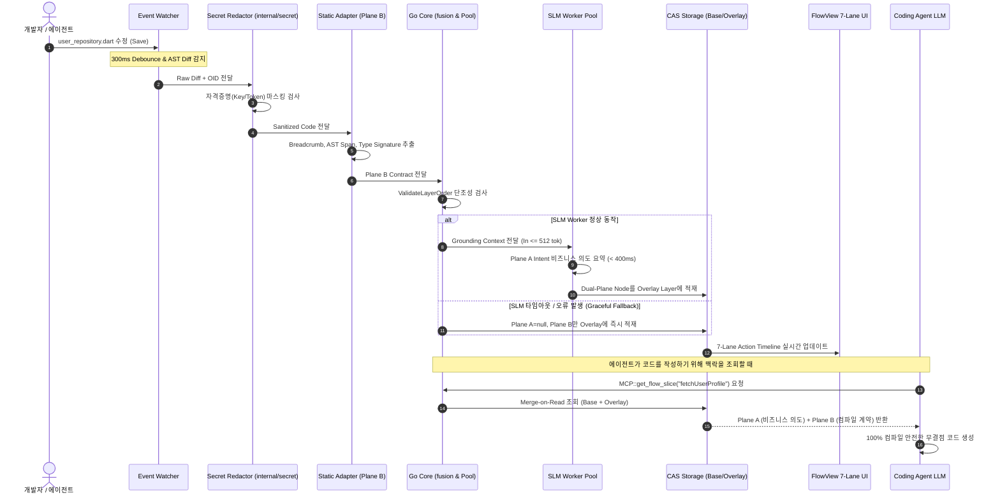

# SLM-LLM 하이브리드 기반 코드 이해 및 실시간 맥락 동기화 시스템 아키텍처 명세서
**로컬 정적 앵커링(Deterministic Grounding), 듀얼 플레인 맥락(Dual-Plane Context), AST-Level Git CAS 기반 고성능 코드 인텔리전스 엔진**

- **상태:** 최종 확정 설계 명세서 (Final Architecture Specification)
- **작성일:** 2026-09-02
- **범위:** 대규모 코드베이스에서의 Go Core 통합 단일 MCP Server + 로컬 SLM Worker Pool(Context Enrichment) + 코딩 에이전트 LLM(Code Generation) + FlowView 7-Lane 통합 타임라인 협업 시스템

---

## 1. 시스템 개요 (System Overview)

본 시스템은 대규모 코드베이스 환경에서 코딩 에이전트(LLM)와 인간 개발자가 협업할 때 발생하는 **인지적 과부하(Cognitive Overload)**, **컨텍스트 윈도우 오염(Context Bloat)**, 그리고 **빈번한 브랜치 전환/리베이스 시의 캐시 오염 및 재인덱싱 병목**을 해결하기 위한 하이브리드 파이프라인입니다.

CodeFlow의 핵심 아키텍처 원칙(Track A 레이어 격리, Single-Gate Secret Redaction, Go Core 단일 권한, FlowView 7-Lane 불변성)을 완벽하게 준수하면서 다음 **4대 핵심 아키텍처 기둥**을 구현합니다:

1. **Single Authority & Single-Gate Security (단일 권한 및 보안 관문):**
   * Go Core(`internal/mcp`)가 시스템의 유일한 MCP Server로 동작하며, SLM은 Go Core 내부의 격리된 Worker Pool(`internal/slm/pool`)로 관리됩니다.
   * 모든 파일 변경 이벤트는 분석 및 추론 전에 반드시 `internal/secret` 단일 게이트를 통과하여 API 키, 토큰 등의 평문 유출을 원천 차단합니다.
2. **Deterministic Grounding & AST-Level CAS 3중 키 (정적 앵커링):**
   * 파일 전체(Blob)가 아닌 함수/Step 단위의 `hash(normalized AST span)`를 CAS 키로 사용하여 정밀한 캐시 무효화 및 `fresh / stale / orphaned` 라이프사이클을 추적합니다.
   * 컴파일러/정적 분석기가 시그니처와 호출 사실(Fact)을 확정적으로 주입하여 SLM의 환각을 구조적으로 방지합니다.
3. **Dual-Plane Semantic Specification (이원화 무손실 모델):**
   * 비즈니스 의도(Plane A: Intent)와 정밀 코드 제약(Plane B: Contract)을 분리하여 인간 개발자에게는 직관적인 액션 로그를, 코딩 에이전트에게는 100% 컴파일 안전성을 제공합니다.
4. **Fail-Safe Fallback & 2-Phase Cold Start (무중단 및 온디맨드 실행):**
   * SLM 장애/타임아웃 발생 시 100% 신뢰 가능한 정적 사실(Plane B)만으로 즉시 무중단 서빙(Graceful Fallback)합니다.
   * 10만 파일 대규모 레포에서도 최초 인덱싱 시 정적 분석(Plane B)을 고속 빌드하고, SLM 추론(Plane A)은 On-Demand / Lazy 큐로 처리하여 0초에 가까운 온보딩을 달성합니다.

---

## 2. 전체 시스템 아키텍처 (End-to-End Architecture)

```mermaid
graph TD
    subgraph Local_Workspace ["1. Local Workspace & Git Lifecycle Watcher"]
        IDE["IDE / Developer / Coding Agent"] -->|File Edit / Save| Watcher["Git Lifecycle Aware Watcher<br/>(Debounce 300ms + MaxBatch 50)"]
        Watcher -->|Raw AST Diff + OID| SecretFilter["Single-Gate Secret Redactor<br/>(internal/secret)"]
    end

    subgraph Go_Core_Engine ["2. CodeFlow Go Core Engine (Single Authority Host)"]
        SecretFilter -->|Sanitized Diff| StaticAdapters["Polyglot Language Adapters<br/>(Dart Analyzer / TS Scanner / Tree-sitter)"]
        StaticAdapters -->|Plane B: Structural Contract| FusionEngine["fusion Engine<br/>(ValidateLayerOrder & Grounding Gate)"]
        
        FusionEngine -->|Grounding Context| SLMPool["internal/slm/pool<br/>(Local Worker: Qwen2.5-Coder Q4)"]
        SLMPool -.->|Plane A: Intent Summary (Fallback on Error)| DualCompiler["Dual-Plane Compiler<br/>(Schema v1.0.0)"]
        FusionEngine -->|Validated Anchors| DualCompiler
        
        DualCompiler --> StorageEngine["Git-Aware CAS Storage Engine<br/>(internal/storage: Base CAS + Working Overlay)"]
    end

    subgraph Unified_Surfaces ["3. Unified Consumers & Surfaces"]
        StorageEngine --> CoreMCP["Go Core MCP Server (internal/mcp)<br/>- publish_core_flow, get_flow_slice<br/>- get_domain_summaries, report_unknowns"]
        StorageEngine --> FlowViewUI["FlowView 7-Lane Browser UI (127.0.0.1)<br/>- Embedded Real-time Action Timeline Panel"]
        CoreMCP --> CodingAgentLLM["Coding Agent LLM (Claude Code / Cursor / Windsurf)"]
    end
```

---

## 3. 핵심 컴포넌트 상세 명세

### 3.1. Git Lifecycle Aware Watcher & Ingestion Gate
* **역할:** 파일 시스템 및 Git 메타데이터의 변경을 감지하여 불필요한 연산을 스로틀링하고 백프레셔를 제어.
* **이벤트 감지 및 큐잉 정책:**
  1. `Source File Modify/Save`:
     * **Debounce (300ms):** 키 입력 폭주를 방지하기 위해 300ms 버퍼링 적용.
     * **배치 윈도우 (MaxBatch 50):** 린터 포맷팅이나 일괄 수정 시 최대 50개 파일을 묶음 처리.
     * **Bounded Queue (용량 100):** 채널 큐 포화 시 오래된 미처리 이벤트를 버리는 `Drop-Oldest` 정책 적용.
     * **AST Diff Skip:** 공백, 단순 주석 변경 등 AST 구조 변경이 없는 경우 파이프라인 즉시 스킵(Zero Cost).
  2. `Git Worktree & HEAD Lifecycle`:
     * `.git`이 디렉토리가 아닌 파일(`gitdir: ...`)인 `git worktree` 환경 지원 (`git rev-parse --git-dir`로 실제 gitdir 동적 해석).
     * `packed-refs` 환경을 고려하여 단순 파일 이벤트 외에 `internal/watch` 기반 주기적 HEAD 포인터 폴링 병행.
     * `Branch Switch / Checkout`: Working Overlay를 즉시 리셋하고 `HEAD` 포인터를 새 Commit OID로 스왑 (< 50ms).
     * `git commit`: Overlay Layer에 누적된 Dirty 노드들을 불변 Base CAS 스토리지로 원자적 트랜잭션 승격(Promotion).

### 3.2. Single-Gate Secret Redaction (`internal/secret`)
* **역할:** 소스 코드, Diff, SLM 입력 프롬프트, CAS 적재 데이터, FlowView 전송 데이터에서 모든 자격 증명을 사전 차단.
* **파이프라인 불변식 (Security Invariant):**
  $$\text{File Event} \longrightarrow \mathbf{Secret\ Redactor\ (internal/secret)} \longrightarrow \text{Static Engine} \longrightarrow \text{SLM} \longrightarrow \text{CAS Storage}$$
* **필터링 대상:** API 키, 비밀번호, OAuth 토큰, Private Key, Bearer 토큰 등 정규식 패턴(`(?i)\b(?:api[_-]?key|secret|token|password)...`).

### 3.3. Deterministic Static Engine (Polyglot Language Adapters)
* **역할:** 언어별 어댑터(`adapters/dart`, `adapters/typescript` 등)를 통해 컴파일러 수준의 결정론적 사실(Plane B)을 추출.
* **Track A 원칙 준수 ([`docs/ARCHITECTURE.md:32`](docs/ARCHITECTURE.md)):**
  * 어댑터는 순수 AST 사실(`guard`, `mutation`, `call`, `effect`, `branch`, `signature`, `callees`, `dependencies`)만 추출.
  * 레이어 분류는 `codeflow.layers.yaml` 규칙에 따라 표준 7-Lane 소문자 명칭으로 정규화:
    $$\text{presentation} \longrightarrow \text{controller} \longrightarrow \text{usecase} \longrightarrow \text{domain} \longrightarrow \text{data} \longrightarrow \text{infra} \longrightarrow \text{external}$$
  * 동적 디스패치나 타입 누락 구간은 `unresolved_dynamic` 및 `unknowns[]`로 명시하여 [`report_unknowns`](docs/PROJECT.md) 도구와 바인딩.

### 3.4. Go Core SLM Worker Pool (`internal/slm/pool`)
* **역할:** Go Core 서브프로세스 풀 패턴(`stdio NDJSON v1`)으로 경량 로컬 SLM을 구동하여 순수 **비즈니스 의도(Plane A)**만을 요약.
* **런타임 및 모델 사양:**
  * **엔진:** `llama.cpp` (Cgo 또는 독립 stdio 바이너리)
  * **모델:** `Qwen2.5-Coder-1.5B/3B-Instruct` (GGUF `Q4_K_M` 양자화, VRAM < 2.0GB)
  * **토큰 예산:** 입력 Context $\le$ 512 Tokens, 출력 $\le$ 64 Tokens
  * **P95 지연 목표:** **< 400ms** (Apple Silicon Metal / AVX2 기준)
* **프롬프트 가드레일 & Grounding 후검증 (Anti-Hallucination Gate):**
  * 프롬프트에 "Plane B Contract(thrown_types, side_effects, callees)에 없는 비즈니스 규칙(예: 세션 만료 등) 날조 금지" 룰 하드코딩.
  * Go Core `fusion` 엔진에서 SLM이 생성한 `business_rule`이 정적 사실과 모순되는지 대조 검증.
* **Graceful Degradation (장애 무중단 폴백):**
  * SLM 프로세스 크래시, 응답 타임아웃(> 400ms), 또는 JSON 스키마 위반 시:
    * `plane_a_intent = null` 처리.
    * 100% 신뢰 가능한 `plane_b_contract`만으로 Overlay에 저장하고 UI에는 `"요약 생성 대기 중"` 표시. 시스템은 절대 멈추지 않음.

### 3.5. Dual-Plane Context Schema (v1.0.0)

모든 노드는 파일(Blob) 해시가 아닌 **함수/Step 단위의 정규화된 AST Span Hash**를 키로 관리됩니다.

```json
{
  "schema_version": "1.0.0",
  "node_id": "auth.user_repository.fetchUserProfile",
  "content_hash": "e3b0c44298fc1c149afbf4c8996fb92427ae41e4649b934ca495991b7852b855",
  "file_hash": "a8f9c2d1e4b6781290aa34cd...",
  "source_anchor": {
    "file_path": "lib/features/auth/data/user_repository.dart",
    "range": { "start_line": 10, "end_line": 25, "start_byte": 240, "end_byte": 680 },
    "layer": "data",
    "module": "auth",
    "freshness": "fresh"
  },
  
  "plane_a_intent": {
    "domain": "User Profile",
    "role": "원격 서버에서 사용자 프로필 데이터 조회",
    "business_rule": "사용자 프로필 요청 실패 시 Auth Error 발생",
    "human_action_log": "사용자 프로필 데이터 조회 로직 수정됨"
  },

  "plane_b_contract": {
    "signature": "Future<User> fetchUserProfile(Ref ref) async",
    "dependencies": ["apiClientProvider"],
    "return_type": "Future<User>",
    "thrown_types": ["Exception('Auth Error')"],
    "side_effects": ["HTTP GET /profile"],
    "callees": ["apiClient.get", "User.fromJson"],
    "unresolved_dynamic": [],
    "unknowns": []
  }
}
```

* **Step 라이프사이클 관리:**
  * `fresh`: 소스 코드의 현재 AST Span Hash와 `content_hash`가 완벽히 일치.
  * `stale`: 파일이 수정되어 라인 범위나 AST 해시가 변경됨 (재요약 대상).
  * `orphaned`: 심볼/함수가 삭제되거나 다른 파일로 이동함.

### 3.6. Git Merkle CAS & Base-Overlay Storage Engine (`internal/storage`)
* **역할:** 대규모 코드베이스에서 브랜치 전환/리베이스 시 제로 재인덱싱과 완벽한 데이터 일관성 보장.
* **3중 인덱싱 키:**
  $$\text{Storage Key} = \text{node\_id} + \text{content\_hash (AST Span)} + \text{file\_hash}$$
* **계층형 스토리지 구조:**
  * **Base Layer (Immutable CAS in SQLite):** 커밋된 모든 버전의 불변 지식 그래프. 모든 브랜치와 워크트리가 공유.
  * **Overlay Layer (Ephemeral In-Memory/SQLite):** 현재 작업 세션의 Dirty Delta 노드만 보관. Multi-worktree 환경에서는 `Workspace Session ID + LWW(Last-Write-Wins)`로 격리.
* **2-Phase Cold Start 온보딩 전략 (10만 파일 대응):**
  * **Phase 1 (정적 Fast-Path):** 전체 레포에 대해 정적 어댑터만 실행하여 `Plane B Contract` 및 CAS 인덱스를 수초~수십초 내에 100% 빌드.
  * **Phase 2 (Lazy / On-Demand SLM 추론):** 전체 파일 일괄 SLM 추론을 금지하고, 사용자가 조회하는 Flow 진입점(`publish_core_flow`, `get_flow_slice`) 및 실시간 수정 파일만 On-Demand / LRU 백그라운드 큐로 `Plane A Intent`를 지연 생성.

---

## 4. 통합 MCP 인터페이스 및 FlowView 서피스 명세

### 4.1. Go Core 단일 MCP Server (`internal/mcp`)
외부 코딩 에이전트는 오직 Go Core의 단일 stdio MCP Server와만 통신합니다.

* `publish_core_flow`: 원자적 앵커 검증 및 7-Lane 코어 플로우 발행.
* `get_flow_slice`:
  * **설명:** 특정 진입점 심볼 기준 End-to-End 슬라이스 조회. Go Core가 CAS에서 Plane B를 조회하고 필요 시 SLM Worker에 Plane A 생성을 위임한 뒤 `ValidateLayerOrder` 검증을 거쳐 반환.
  * **입력:** `{ "entry_symbol": "fetchUserProfile", "include_contract": true }`
* `get_domain_summaries`: 프로젝트 전체 또는 도메인별 거시적 비즈니스 구조(Plane A 중심) 반환.
* `get_action_timeline`: 현재 작업 세션의 실시간 변경 이력 조회.
* `report_unknowns`: 정적 미해결 동적 디스패치 및 타입 누락 리포트.

### 4.2. FlowView 7-Lane 통합 Web UI
* 별도의 독립 UI를 생성하지 않고, 기존 FlowView 7-Lane 인터랙티브 뷰어(`http://127.0.0.1:<port>/?token=...`) 내부에 **"Real-time Session Action Timeline"** 패널을 서브 탭으로 통합 임베딩.
* 동일한 세션 토큰 인증 및 루프백 서버를 재사용하여 UI 상태 동기화 비용 제로화.

---

## 5. 단계별 데이터 처리 흐름 시퀀스



---

## 6. SLO 및 검증 품질 지표 (Evaluation Harness)

본 시스템은 측정 불가능한 과장 지표를 배제하고, 다음 **정량적 SLO 및 평가 하네스**를 통해 품질을 검증합니다.

| 검증 항목 | 목표 SLO | 측정 및 검증 방식 |
| :--- | :--- | :--- |
| **SLM 추론 지연 (P95)** | **< 400ms** | 단일 함수 Step 요약 기준 벤치마크 하네스 측정 |
| **Grounding 위반율** | **< 1.0%** | Plane B 사실과 모순되는 Plane A 비즈니스 룰 자동 대조 검증 |
| **Layer Attribution 정확도** | **> 98.0%** | `codeflow.layers.yaml` 규칙 기반 `fusion.ValidateLayerOrder` 검증 |
| **Cold Start 정적 빌드** | **< 30초** (10만 파일 기준) | Phase 1 Polyglot 어댑터 병렬 파싱 벤치마크 |
| **브랜치 전환 캐시 적중률** | **> 99.0%** | `git switch` 후 AST Span Content Hash 일치 노드 0ms 재사용률 |
| **Secret 누출 차단율** | **100% (Zero Leak)** | `internal/secret` 테스트 스위트 100% 통과 필수 |

---

## 7. 단계별 구현 로드맵 (Phased Implementation Roadmap)

```
[Phase 1] Static Engine & Secret Gate (기반 및 보안)
   └── Polyglot AST Extractor + Dual-Plane Schema v1.0.0 + internal/secret 관문 강제

[Phase 2] AST-Level CAS & Overlay Engine (스토리지 및 Worktree)
   └── SQLite/Memory CAS + 3중 키잉 + git worktree/HEAD 폴링 훅 연동

[Phase 3] Go Core SLM Worker Pool & Fallback (추론 및 무중단 서빙)
   └── internal/slm/pool (stdio NDJSON v1) + Qwen2.5-Coder Q4 + Anti-Hallucination 후검증

[Phase 4] FlowView 7-Lane 통합 UI & E2E 검증 (통합 및 제품화)
   └── FlowView 타임라인 서브 패널 + Claude Code/Cursor MCP 도구 연동 + 평가 하네스 실행
```

* **Phase 1: Deterministic Static Engine & Security Gate (기반 및 보안)**
  * 언어별 어댑터 기반 AST Span, Breadcrumb, 시그니처, Callees 추출기 구현.
  * Dual-Plane JSON Schema v1.0.0 정의 (`schema_version`, `unknowns[]` 포함).
  * 파이프라인 최우선 관문으로 `internal/secret` 마스킹 강제 연동.
* **Phase 2: AST-Level Git CAS & Working Overlay Engine (스토리지 및 동기화)**
  * 함수 단위 3중 키(`node_id` + `content_hash` + `file_hash`) 기반 SQLite CAS 스토리지 구축.
  * In-Memory Overlay Layer 및 `git worktree` / `packed-refs` 라이프사이클 훅 연동.
  * 10만 파일 Fast-Path Cold Start 인덱서 구현.
* **Phase 3: Go Core SLM Worker Pool & Fallback Engine (추론 엔진)**
  * Go Core 내부 `internal/slm/pool` 서브프로세스 풀 구축 (`stdio NDJSON v1`).
  * `Qwen2.5-Coder-1.5B/3B-Instruct` (Q4_K_M) 연동 및 프롬프트 가드레일 하드코딩.
  * SLM 타임아웃/에러 시 `plane_b` 단독 무중단 Graceful Fallback 파이프라인 구축.
* **Phase 4: FlowView 7-Lane Integration & Evaluation Harness (통합 및 검증)**
  * FlowView 7-Lane 웹 뷰어 내 실시간 세션 액션 타임라인 패널 통합.
  * Go Core MCP 인터페이스(`get_flow_slice` 등) 확장 및 Claude Code / Cursor 실전 연동.
  * P95 지연, Grounding 위반율, Layer 단조성 검증 하네스 스크립트 실행 및 배포.
