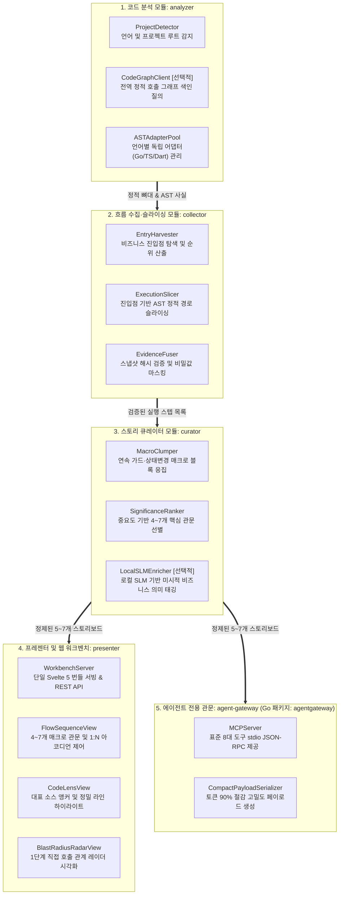

# CodeFlow 아키텍처 재설정 및 스토리보드 전환 종합 명세서

- 문서 ID: `SPEC-CODEFLOW-ARCHITECTURAL-RESET-AND-STORYBOARD`
- 상태: 승인됨 (Approved)
- 작성일자: 2026-09-16
- 문서 목적: 비본질적 부채(약 35,000 라인) 정리 목록 확정, 고정 7계층 아키텍처 강제 탈피, FlowSequence와 실행 타임라인의 비대칭 1:N 계층 관계 정립, 선택적 경량 모델 외장 플러그인 설계, CodeGraph와의 조화로운 고속 연동 지침 통합

---

## 1. 개요 및 배경

CodeFlow는 대규모 코드베이스에서 개발자가 비즈니스 실행 흐름을 직관적으로 이해할 수 있도록 돕는 도구입니다. 그러나 이전 개발 주기에서 여러 무거운 정책(로컬 언어 모델 호스팅 엔진, 2단계 커밋 기반 SQLite 결재 트랜잭션, 실시간 파일 감시자 및 자동 재분석 루프 등)이 제안되었다가 취소되거나 전환되었음에도, 관련 코드가 온전히 정리되지 않고 누적되어 시스템 복잡도가 비대해졌습니다.

또한, 실세계의 모든 프로젝트가 고정된 7계층 아키텍처(Presentation, Controller, UseCase, Domain, Data, Infra, External)를 준수하지 않음에도 이를 무리하게 강제하려다 보니 타임라인에 과도한 노이즈가 발생했습니다.

본 명세서는 **개발자 코드 이해(Code Comprehension) 최우선 원칙**으로 회귀하기 위해 다음 5대 핵심 방향을 규정합니다:
1. **정리 대상 내역의 명확한 확정**: 비본질적 부채 약 35,000 라인 및 레거시 템플릿(306 KB)의 완전한 제거 인벤토리 확정.
2. **스토리 기반 관문 시퀀스로의 전환**: 획일적 7계층 분류를 지양하고, 비즈니스 사건 중심의 핵심 관문(4~7개)으로 흐름을 요약.
3. **FlowSequence와 타임라인의 비대칭 1:N 계층 관계 정립**: 거시적 비즈니스 의미(FlowSequence)와 미시적 코드 실행 순서(Timeline)의 명확한 개념 분리 및 인터랙션 동기화.
4. **선택적 경량 모델(SLM) 외장 플러그인 아키텍처**: Go 코어 내 복잡성을 배제하고, 외부 로컬 런타임(Ollama/vLLM)을 활용한 비동기 점진적 보강 인터페이스(~150줄) 제공.
5. **CodeGraph와의 자연스러운 조화**: 전역 호출 그래프 색인(.codegraph)을 활용하여 수집/슬라이싱/레이더를 가속하고 AI 에이전트의 컨텍스트 토큰을 90% 이상 절감하면서도, CodeFlow 고유의 독립성과 불변 스냅샷 검증을 엄격히 유지.

---

## 2. 정리 및 제거 대상 상세 인벤토리 (Cleanup Inventory)

다음 목록은 취소되었거나 Svelte 5 단일 워크벤치 전환에 따라 불필요해진 레거시 구성요소로, 이번 개편을 통해 안전하게 절제(Prune)할 대상입니다.

### 2.1 제거 대상 모듈 및 코드 목록 (총 약 35,000 라인 + 306 KB HTML)

| 구분 | 파일 및 디렉터리 경로 (프로덕션 + 직결 테스트) | 코드 규모 | 제거 사유 및 대체 방안 |
|---|---|---|---|
| **로컬 모델 런타임** | `internal/protocol/model_host*.go`<br>`internal/protocol/model_host_sandbox_darwin.go`<br>`internal/protocol/model_host_test.go` | 약 7,399줄 | **제거**: Go 코어 내에서 직접 로컬 SLM 바이너리를 fork/exec하고 OS Seatbelt 샌드박스를 구성하던 과도한 런타임. 외장 HTTP 플러그인으로 완전 대체. |
| **모델 수명주기** | `internal/flowview/model_host_lifecycle.go`<br>`internal/mcp/model_host*.go`<br>`internal/flowview/model_host_factory_endpoint_test.go` | 약 1,863줄 | **제거**: 워크스페이스 라이프사이클에 결합되어 있던 프로세스 락, 드레인 로직 및 MCP 모델 팩토리, 연관 테스트 제거. |
| **분산 결재 트랜잭션** | `internal/semantic/approval_transaction*.go` (9,590줄)<br>`internal/mcp/approval_*.go` (15개 파일, 3,356줄) | 약 12,946줄 | **제거**: 로컬 개발자 도구에 불필요한 SQLite WAL 기반 2단계 커밋(2PC) 결재 상태 머신 제거. 불변 스냅샷 차이 비교(`SemanticDelta`)로 환원. |
| **실시간 파일 감시자** | `internal/flowview/live_pipeline.go`, `event_hub.go`, `live_watcher.go` (2,300줄)<br>`internal/flowview/live_pipeline_*_test.go`, `event_hub_*_test.go` 등 (5,420줄) | 약 7,720줄 | **제거**: 코드를 읽는 개발자의 시선을 어지럽히던 자동 파일 변경 감시, SSE 이벤트 허브, 실시간 재분석 파이프라인 및 연관 테스트 제거. 명시적 1회성 분석만 유지. |
| **7계층 강제 추론기** | `internal/flowview/lanes.go`<br>(호출부: `server.go:1108` `applyLayersWith`) | 약 729줄 | **제거**: 임의의 프로젝트를 7계층에 억지로 끼워 맞추기 위한 729줄의 이웃 노드 투표/추론 알고리즘 및 `server.go` 호출부 제거. 스토리보드 2단계 큐레이터로 대체. |
| **과도한 수직 기능** | `internal/semantic/{release_v2,failure_v2,onboarding_v2}*.go`<br>`internal/flowview/failure_endpoint*.go`, `internal/mcp/failure_v2*.go` | 약 9,800줄 | **제거**: 핵심 흐름 시각화와 무관하게 비대해진 엔터프라이즈 전용 보조 분석 로직 및 엔드포인트 전면 제거. |
| **구형 레거시 HTML** | `internal/flowview/flow_view.html`<br>`internal/flowview/live_view.html` | 약 306 KB | **제거**: Svelte 5 단일 빌드(`svelte_flow_view.html`)만 서빙하도록 단일화하고 레거시 템플릿 파일 및 백업 로직 전면 삭제. |
| **비핵심 MCP 도구** | `internal/mcp/` 내 15개 보조 도구 핸들러 | 약 3,000줄 | **정리**: 23개로 비대해진 MCP 도구를 공식 8대 핵심 도구(`publish_core_flow`, `harvest_flows`, `get_flow_payload`, `analyze_flow`, `submit_flow_draft`, `approve_step`, `report_unknowns`, `open_review`)로 축소. |
| **비핵심 HTTP 라우트** | `internal/flowview/server.go` 내 21개 보조 라우트 | 약 1,500줄 | **정리**: `/api/workspace/stream`, `/api/live/*` 등 불필요한 라우트를 제거하고 약 10개의 필수 API로 슬림화. |

### 2.2 유지 및 강화할 필수 핵심 모듈 (5대 목표 모듈 재배치 매핑)

기존 레거시 코드베이스의 핵심 기능은 소실 없이 유지되며, 제6장에 명시된 **5대 역할별 단방향 모듈**로 체계적으로 재배치(Relocate)됩니다:

1. **`analyzer` (`internal/analyzer`)로 통합**:
   - `internal/detect/`: 프로젝트 루트 및 지원 언어(Go/TypeScript/Dart) 감지.
   - `CodeGraphClient`: 전역 정적 호출 그래프 색인(`.codegraph`) 고속 질의 클라이언트 신설.
   - `adapters/dart`, `adapters/typescript`: 표준 입출력(stdio) 기반 다국어 AST 팩트 추출기 풀 관리.
2. **`collector` (`internal/collector`)로 통합**:
   - `internal/harvest/`: 핵심 비즈니스 진입점 발견, 휴리스틱 매니페스트 적용 및 인텐트 스코어링.
   - `internal/slicing/`: 언어 어댑터 프로세스 관리 및 AST 전방/후방 정적 슬라이싱.
   - `internal/fusion/`: 단일 스냅샷 기반 팩트 병합, 소스 증거 해시 검증 및 식별자 정규화.
   - `internal/secret/`: 소스코드 내 비밀값(API 키, 패스워드 등) 정규식 단일 관문 마스킹.
3. **`curator` (`internal/curator`)로 통합**:
   - `internal/semantic/storyboard.go`: 2단계 큐레이션 알고리즘(매크로 응집 + 중요도 선별) 기반 스토리보드 프로젝션.
   - `LocalSLMEnricher`: 선택적 외장 로컬 SLM 연동을 통한 미시적 비즈니스 의미 태깅 플러그인 신설.
4. **`presenter` (`internal/presenter` + `web/flowview`)로 통합**:
   - `internal/flowview/server.go`: 약 10개의 핵심 REST API 제공 및 저장된 뷰 관리.
   - `web/flowview/` (Svelte 5): 3열 워크벤치(FlowSequence, 코드 렌즈, 레이더) 단일 프로덕션 프론트엔드 서빙.
5. **`agent-gateway` (`internal/agentgateway`)로 통합**:
   - `internal/mcp/`: 8대 핵심 표준 MCP 도구 stdio JSON-RPC 게이트웨이 및 ~500토큰 고밀도 압축 페이로드 직렬화기.

---

## 3. 스토리 기반 비즈니스 관문과 실행 타임라인의 1:N 계층 관계

### 3.1 7계층 아키텍처 모델 탈피의 원칙
- 모든 소프트웨어가 7계층 클린 아키텍처를 준수하지 않습니다. 마이크로서비스 이벤트 핸들러, 함수형 파이프라인, 풀스택 프레임워크(Next.js Server Actions, Django) 등 구조가 평평하거나 다른 형태의 프로젝트에서도 핵심 비즈니스 흐름이 온전히 드러나야 합니다.
- 따라서 정적인 물리적 계층 분류를 최상위 분류 기준으로 삼지 않고, 실행 흐름 상에서 일어나는 **비즈니스 사건(Story)**을 중심으로 모델을 재구성합니다.

### 3.2 FlowSequence vs 실행 타임라인(Timeline)의 명확한 정의

FlowSequence와 타임라인은 **1:1 평면 매핑이 아닌, 거시적 의도(Macro Intent)와 미시적 코드 실행(Micro Execution Trace)을 연결하는 비대칭 1:N 계층적 포함 관계**입니다.

```
┌─────────────────────────────────────────────────────────────────────────────┐
│  [거시적 의미] FlowSequence                                                 │
│  - 단위: 장면 (FlowFrame)                                                   │
│  - 분류: 6대 비즈니스 관문 (entry, decision, process, effect, result, boundary)│
│  - 수량: 전체 흐름당 4~7개의 엄선된 핵심 카드                                 │
│  - 사용자 인지: "시스템이 비즈니스 관점에서 무엇을 하려 하는가?"               │
└──────────────────────────────────────┬──────────────────────────────────────┘
                                       │ 1:N 계층적 포함 관계 (Parent-to-Children)
                                       ▼
┌─────────────────────────────────────────────────────────────────────────────┐
│  [미시적 실행] 실행 타임라인 (Execution Timeline)                            │
│  - 단위: 구체적 코드 실행 단계 (SemanticStep)                                 │
│  - 분류: 함수 호출(call), 가드 검증(guard), 상태 변경(mutation), 실패/반환    │
│  - 수량: 프레임당 1개 ~ N개 (접힌 아코디언 내부에 보존)                       │
│  - 사용자 인지: "해당 비즈니스 처리를 위해 실제 어떤 줄의 코드가 실행되는가?" │
└─────────────────────────────────────────────────────────────────────────────┘
```

### 3.3 백엔드 2단계 타임라인 큐레이션 알고리즘
타임라인에 모든 문장과 if문이 노출되면 흐름 파악이 불가능해집니다. 따라서 백엔드는 다음 2단계를 통해 타임라인을 큐레이션합니다:

1. **1단계: 매크로 블록 응집 (Macro Clumping)**:
   - 동일 함수/블록 내에서 연속으로 실행되는 2개 이상의 단순 가드문(`if err != nil`, 널 체크 등)을 하나의 `decision` 관문("사전 유효성 검증")으로 결합합니다.
   - 연속된 상태 필드 할당은 단일 `process` 관문으로 병합합니다.
   - 단순 DTO 변환, 로깅, toString 등 비즈니스 의미가 없는 호출은 독립 카드를 발급하지 않고 직전 관문의 접힌 세부 스텝(`CollapsedDetail.Count++`)으로 흡수합니다.
2. **2단계: 중요도 기반 선별 (Significance Scoring)**:
   - 응집 후에도 관문 수가 7개를 초과할 경우, 중요도 가중치를 산출합니다:
     $$\text{시작(Entry: 100)} > \text{외부연동(Effect: 90)} > \text{영속상태변경(Process: 85)} > \text{핵심분기(Decision: 80)} > \text{내부연산(50)}$$
   - 상위 4~7개 핵심 관문만 타임라인 메인 카드로 승격하고, 하위 순위 관문은 인접 핵심 관문의 접힌 세부 목록으로 편입합니다.

3. **극단적 흐름 규모에 대한 경계 규칙 (Floor & Ceiling Bounds)**:
   - **하한선(Floor: 3단계 미만 또는 0개 분기)**:
     - 1~2개 단계로 끝나는 단순 getter나 패스스루 흐름의 경우, 억지로 4개의 관문을 채우기 위한 가상 관문(Dummy Frame)을 생성하지 않습니다. 실제 존재하는 1~2개의 스텝을 원형 그대로 `entry` 및 필요시 `result` 프레임으로 정직하게 표현합니다.
     - 분기문이 전혀 없는(0 branch) 선형 흐름에서는 `decision` 관문 없이 순차 처리(`entry` $\to$ `process` $\to$ `effect` $\to$ `result`)만 구성하며, UI 조건 필터는 비활성화 대신 안내 텍스트("분기 조건 없는 순차 실행")와 함께 잠김 없이 작동합니다.
   - **상한선(Ceiling: 30개 파일, 150단계 이상의 대규모 분산 흐름)**:
     - 수십 개 파일에 걸친 150단계 이상의 방대한 트레이스라도, FlowSequence 메인 뷰에는 **엄격히 최대 7개의 핵심 비즈니스 관문 카드만 노출**됩니다.
     - 1차 매크로 응집 후 남은 다수의 중간 처리 단계는 2차 중요도 선별에서 하위 점수로 판정되어 직전 핵심 관문의 `stepRefs` 아코디언 내부로 흡수됩니다. 개발자는 레일에서 7개 카드로 거시 맥락을 즉시 파악하고, 필요한 관문만 펼쳐 150단계의 미시적 라인을 정밀 추적할 수 있습니다.
     - 큐레이션 알고리즘은 단일 패스 순회($O(N)$)로 구현되어 1,000단계의 스텝도 5ms 이내에 메모리 상에서 안정적으로 처리를 완결합니다.

### 3.4 프론트엔드 명칭 정비 및 인터랙션 동기화
1. **헤더 텍스트 수정**:
   - `web/flowview/src/components/NavRail.svelte`의 `<h2>실행 타임라인 (STORYBOARD)</h2>` 헤더를 `<h2>FlowSequence</h2>`로 수정합니다.
   - 각 프레임 하위의 아코디언 요약을 `<summary>실행 타임라인 ({frame.stepRefs.length}단계)</summary>`로 분리 표기합니다.
2. **2단계 선택 동기화**:
   - 좌측 레일의 **프레임 카드 클릭**: 해당 관문의 대표 코드 앵커(`primaryStepRef`)로 중앙 코드 패널이 부드럽게 스크롤됩니다.
   - 프레임 내부의 **타임라인 개별 단계 클릭**: 부모 프레임 맥락을 유지한 상태에서 해당 실행 라인의 코드 문장(`CodeLens.Focus`)만 정밀하게 핀포인트 하이라이트됩니다.

---

## 4. 로컬 경량 모델(SLM)의 미시적 의미 부여(Micro-Semantic Labelling) 아키텍처

### 4.1 도입 배경: 메인 에이전트와 로컬 경량 모델의 명확한 역할 분담
사용자가 고지능 메인 프론티어 에이전트(Claude 3.5 Sonnet, GPT-4o, Antigravity 등)를 활용하고 있는 환경에서도, 로컬 경량 모델(Qwen2.5-Coder 1.5B/3B 등)을 로컬에 두는 핵심 목적은 다음과 같습니다:

1. **메인 에이전트의 토큰 폭증 및 컨텍스트 오염 방지**:
   - 메인 에이전트에게 수십 개의 함수 구현체와 if 조건문 라인을 일일이 읽히며 미시적 의미를 해석하게 하면, 질의당 수만~수십만 토큰이 낭비되고 대기 시간이 길어집니다.
2. **로컬 SLM의 특화 임무 (미시적 의미 라벨링 전처리)**:
   - 로컬 SLM의 목적은 복잡한 설계나 전역 추론이 아닙니다.
   - AST 슬라이스 결과로 도출된 개별 가드 조건(`if stock < req`), 상태 변경, 함수 호출에 대해 **"이 코드는 비즈니스적으로 '재고 부족 검증'이다"**, **"이 호출은 'PG 결제 승인 요청'이다"**라는 **미시적 코드 의미(Micro-Semantics)를 로컬에서 비용 0원으로 즉시 태깅하는 전처리(Pre-computation) 특화 작업**을 담당합니다.
3. **가장 적합한 로컬 구동 방식**:
   - Go 코어 내부에 무거운 C++ 추론 엔진이나 샌드박스를 심지 않고, 개발자 환경에 대중화된 **로컬 런타임(Ollama / llama-server)과 표준 HTTP 규격(`POST http://localhost:11434/v1/chat/completions`)으로 통신하는 120줄짜리 초경량 인터페이스**로 구현합니다.

### 4.2 CodeGraph + 로컬 SLM의 완벽한 로컬 3중주 시너지

```
┌─────────────────────────────────────────────────────────────────────────────┐
│ 1단계: CodeGraph (정적 뼈대 공급, 0ms)                                       │
│   - SQLite 색인에서 해당 함수의 호출자, 피호출자, 인터페이스 구현체를 즉시 인출   │
│   - 예: "OrderService.pay()는 TossPaymentClient.approve()를 호출함"         │
└──────────────────────────────────────┬──────────────────────────────────────┘
                                       │ 정밀 심볼 맥락 + 호출 뼈대 전달
                                       ▼
┌─────────────────────────────────────────────────────────────────────────────┐
│ 2단계: 로컬 경량 모델 SLM (미시적 의미 부여, 150ms)                         │
│   - CodeGraph가 보증한 호출 사실을 기반으로 환각 없이 정확한 비즈니스 의미 태깅   │
│   - 의미 생성: "토스페이먼츠 PG 결제 승인 API 호출 및 결제키 발급 처리"     │
└──────────────────────────────────────┬──────────────────────────────────────┘
                                       │ 100% 로컬에서 완성된 고밀도 요약본
                                       ▼
┌─────────────────────────────────────────────────────────────────────────────┐
│ 3단계: 메인 에이전트 (토큰 95% 절감 및 고차원 작업 집중)                    │
│   - 수십 개 파일을 읽을 필요 없이, 이미 의미가 해석된 500토큰짜리 관문 요약 수신│
│   - 고차원 아키텍처 리팩토링 및 복잡한 버그 해결에 온전히 집중               │
└─────────────────────────────────────────────────────────────────────────────┘
```

- **SLM 환각의 원천 차단**: 로컬 SLM에게 코드만 주는 것이 아니라, **CodeGraph가 이미 확인해 준 정확한 호출 대상(Callee 심볼, 타입 정보)**을 함께 주입함으로써 초경량 1.5B/3B 모델도 100% 신뢰할 수 있는 정확한 비즈니스 의미를 산출합니다.
- **100% 로컬 완결**: CodeGraph 색인(0ms) $\to$ CodeFlow 슬라이싱(5ms) $\to$ 로컬 SLM 라벨링(150ms)의 전 과정이 인터넷 연결 없이 개발자 PC에서 0.2초 만에 완결됩니다.

### 4.3 아키텍처 및 인터페이스 설계

```go
// EnrichedNarrative는 특정 관문에 보강된 비즈니스 서사 정보입니다.
type EnrichedNarrative struct {
    FrameID   string `json:"frameId"`
    Narrative string `json:"narrative"`
    Status    string `json:"status"` // enriched | fallback | timed_out
}

// SemanticEnricher는 스토리보드 관문의 비즈니스 내러티브를 보강하는 선택적 플러그인 인터페이스입니다.
type SemanticEnricher interface {
    EnrichStoryboard(ctx context.Context, frames []FlowFrame) ([]EnrichedNarrative, error)
    IsAvailable(ctx context.Context) bool
}

// ExternalHTTPEnricher는 OpenAI 호환 로컬 엔드포인트와 통신하는 초경량 구현체입니다.
// 프론트엔드는 POST /api/semantic/enrich 엔드포인트를 통해 비동기 보강을 요청합니다.
type ExternalHTTPEnricher struct {
    endpoint string        // 예: "http://localhost:11434/v1"
    model    string        // 예: "qwen2.5-coder:1.5b"
    timeout  time.Duration // 기본값: 500ms
    client   *http.Client
}
```

### 4.4 점진적 보강(Progressive Enrichment) 무지연 파이프라인
1. **1단계 (즉시 렌더링, <30ms)**:
   - 사용자가 흐름을 조회하면, Go 코어는 AST 정적 사실 기반의 기본 스토리보드를 즉시 반환합니다. 개발자는 0ms 대기 시간으로 코드 탐색을 시작합니다.
2. **2단계 (비동기 점진적 보강, 150~300ms)**:
   - 플러그인이 활성화된 경우, 백그라운드에서 비동기로 외장 엔드포인트를 호출하여 각 관문의 한 줄 한국어 비즈니스 요약(내러티브)을 받아옵니다.
   - 응답이 도착하면 카드의 텍스트만 부드럽게 전환(업데이트)됩니다.
3. **무장애 폴백 및 비정상 응답 방어 (Fault Tolerance & Safe Fallback)**:
   - **JSON 파싱 견고성**: 로컬 모델이 마크다운 코드블록(```json ... ```)이나 불완전한 JSON 문자열을 반환하는 경우, 정규화 전처리기를 통해 마크다운 태그를 선제 제거한 후 언마샬링합니다. 그래도 파싱이 실패하면 에러를 삼키고(Silent Fallback) AST 기본 사실 텍스트를 그대로 유지합니다. 개발자에게 에러 모달을 띄워 작업 흐름을 끊지 않습니다.
   - **타임아웃 보장**: 500ms(설정 가능) 경과 시 `context.WithTimeout`에 의해 HTTP 커넥션이 즉시 단절되며, 내부 상태는 `timed_out`으로 안전하게 표기됩니다.
   - **화면 전환 시 지연 응답 폐기 (Stale Response Discarding)**: 사용자가 SLM 비동기 호출 도중 다른 장면 카드를 클릭하거나 새로운 흐름을 요청한 경우, 프론트엔드는 `AbortController.abort()`를 즉시 호출함과 동시에 요청별 단조 증가 시퀀스 번호(`generationSequence` / `requestId`)를 비교하여 지연 도착한 과거 응답을 무조건 폐기합니다. 이로써 화면 깜빡임, 상태 덮어쓰기 레이스 컨디션을 원천 차단합니다.

---

## 5. CodeGraph 조화로운 연계 및 융합 지침

### 5.1 역할의 명확한 분담
- **CodeGraph**: 리포지토리 전체의 함수, 클래스, 라우트 간의 호출(call), 구현(implement), 참조(reference) 관계를 0ms 단위로 질의하는 **전역 정적 지식 그래프 색인기** (`.codegraph/codegraph.db`).
- **CodeFlow**: 특정 사용자 질문/이벤트에서 시작하여 7계층을 관통하는 실행 순서를 추출하고, 비즈니스 관문 스토리보드로 시각화하는 **비즈니스 흐름 서사 워크벤치**.

### 5.2 4대 자연스러운 융합 가속 포인트

```
[사용자 질의: "결제 흐름 분석해줘"]
               │
               ▼
 ┌─────────────────────────────────────────────────────────────┐
 │ 1. 진입점 수집 가속 (Harvesting Acceleration)                │
 │    - CodeGraph 색인 질의(`query -k route`)로 5ms 내 진입점 확보│
 └────────────────────────────┬────────────────────────────────┘
                              ▼
 ┌─────────────────────────────────────────────────────────────┐
 │ 2. 동적 디스패치 해소 (Dynamic Dispatch Resolution)          │
 │    - 인터페이스/추상 클래스 호출 시 CodeGraph 다형성 홉 질의 │
 │    - 미확인 연결(`Unknown`)을 검증된 구체 구현체 호출로 승격 │
 └────────────────────────────┬────────────────────────────────┘
                              ▼
 ┌─────────────────────────────────────────────────────────────┐
 │ 3. 영향도 레이더 고속화 (Blast Radius Radar Acceleration)    │
 │    - CodeGraph `callers -j` / `impact -j`로 10ms 내 관계 산출│
 └────────────────────────────┬────────────────────────────────┘
                              ▼
 ┌─────────────────────────────────────────────────────────────┐
 │ 4. AI 에이전트 토큰 90% 절감 (Slashing Agent Tokens)         │
 │    - 파일 수십 개를 grep/read_file하던 낭비 제거             │
 │    - CodeGraph 1-shot 소스 + CodeFlow 3열 뷰모델(~500 토큰)  │
 └─────────────────────────────────────────────────────────────┘
```

1. **진입점 탐색 가속 (수 초 $\to$ 5ms)**:
   - 디렉터리 전체를 재순회하지 않고, CodeGraph의 색인을 통해 API 라우트와 진입점을 밀리초 단위로 수집합니다.
2. **동적 디스패치 및 다형성 홉 해소**:
   - 단일 파일 AST 파서가 추적하기 어려운 Go 인터페이스, Dart/TypeScript 추상 클래스 호출 지점에서 CodeGraph의 피호출자 질의(`codegraph callees -j`)를 통해 실제 구현체 메서드로 연결하여 분석 결손을 없앱니다.
3. **영향도 레이더(Blast Radius Radar) 즉시 렌더링**:
   - 우측 레이더 렌더링 시 CodeGraph의 호출자/피호출자 색인을 조회하여 10ms 내에 1단계 직접 관계망을 완성합니다.
4. **AI 에이전트 토큰 90% 이상 절감**:
   - AI 에이전트가 15~20개의 파일을 열어보며 5만~10만 토큰을 소모하던 방식을, **CodeGraph 1-shot 소스 탐색 + CodeFlow의 정제된 스토리보드 페이로드(`get_flow_payload`, 약 500 토큰)** 조합으로 대체하여 비용과 속도를 극대화합니다.

### 5.3 결합 분리 안전 불변식 및 소스 불일치 회복력
- **독립성 보장 (Zero Hard Dependency)**: `.codegraph/`가 없거나 데몬이 정지되어 있어도 CodeFlow는 자체 내장 AST 어댑터로 100% 정상 구동됩니다.
- **증거 자기 검증 (Self-Validation & Stale Index Resilience)**:
  - CodeGraph 색인(`.codegraph/codegraph.db`)은 정적 빌드 시점에 생성되므로, 개발자가 파일을 수정하고 커밋하지 않았거나 색인이 최신화되지 않은 경우 바이트 오프셋이나 라인 번호가 어긋날 수 있습니다.
  - CodeFlow의 `EvidenceFuser`는 CodeGraph가 제공한 심볼 위치 정보에 대해 현재 파일 시스템의 불변 스냅샷 SHA-256 해시 및 바이트 범위를 상호 대조(Cross-check)합니다.
  - 바이트 내용과 심볼 시그니처가 일치하지 않으면(Stale Index 감지), CodeFlow는 즉시 내부 AST 파서 또는 정규식 패턴 탐색을 통해 최신 파일 내에서 해당 심볼의 정확한 위치를 실시간 재조정(Re-anchor)합니다.
  - 파일 수정 과정에서 심볼 자체가 완전히 삭제된 경우, 시스템 크래시를 유발하지 않고 해당 단계를 안전하게 `unknown` 분석 경계(`boundary`) 상태로 격리 표출합니다.
- **텔레메트리 은닉 (Anti-Telemetry Guard)**: CodeGraph의 인덱싱 소요 시간, 캐시 히트율, DB 파일 크기 등 내부 측정 텔레메트리를 UI 화면에 절대 누출하지 않으며 오직 비즈니스 흐름과 검증된 소스 증거만 표출합니다.

---

## 6. 역할별 5대 모듈화 아키텍처 규격 (Role-Based Modular Architecture)

시스템의 유지보수성과 확장성을 극대화하기 위해, 시스템 전체를 **단방향 의존성(Unidirectional Dependency)**을 갖는 5대 독립 모듈로 재편합니다.



### 6.1 5대 모듈별 정식 명칭 및 책임 명세

| 모듈 명칭 (도메인 / Go 패키지) | 핵심 질문 및 역할 | 주요 컴포넌트 및 책임 범위 |
|---|---|---|
| **`analyzer`**<br>(`internal/analyzer`) | *"코드베이스에 어떤 심볼과 호출 관계가 존재하는가?"* | • 언어 및 프로젝트 감지 (`ProjectDetector`)<br>• CodeGraph 색인 고속 질의 클라이언트 (`CodeGraphClient`)<br>• 독립 어댑터(`adapters/*`) 프로세스 생명주기 관리 (`ASTAdapterPool`) |
| **`collector`**<br>(`internal/collector`) | *"요청된 흐름이 어떤 코드 라인들을 거쳐 실행되는가?"* | • 진입점 탐색 및 인텐트 스코어링 (`EntryHarvester`)<br>• 전방/후방 AST 정적 슬라이싱 (`ExecutionSlicer`)<br>• 파일 스냅샷 해시 검증 및 비밀값 마스킹 (`EvidenceFuser`) |
| **`curator`**<br>(`internal/curator`) | *"수백 개 스텝 중 핵심 비즈니스 관문은 무엇인가?"* | • 매크로 블록 응집 (`MacroClumper`): 연속 if/상태변경 병합<br>• 중요도 선별 (`SignificanceRanker`): 4~7개 핵심 관문 압축<br>• 미시적 의미 태깅 (`LocalSLMEnricher`): 로컬 SLM 150ms 1줄 태그 보강 |
| **`presenter`**<br>(`internal/presenter` + `web/flowview`) | *"개발자가 시각적으로 편안하게 코드를 탐색할 수 있는가?"* | • Svelte 5 번들 서빙 및 약 10개 REST API 제공 (`WorkbenchServer`)<br>• FlowSequence (4~7개) 및 1:N 아코디언 인터랙션 제어<br>• 메인 뷰포트 코드 렌즈 및 1단계 영향도 레이더 시각화 |
| **`agent-gateway`**<br>(`internal/agentgateway`) | *"AI 에이전트가 토큰을 아끼며 흐름을 즉시 이해하는가?"* | • 표준 8대 MCP 도구 stdio JSON-RPC 제공 (`MCPServer`)<br>• 10만 토큰을 500토큰으로 압축한 고밀도 스토리보드 페이로드 공급<br>• 단순 API Gateway가 아닌 **AI 에이전트 전용 특화 관문** |

### 6.2 모듈화의 구조적 이점
1. **단방향 데이터 파이프라인**: `analyzer` $\to$ `collector` $\to$ `curator` $\to$ `presenter / agent-gateway`로 단방향 흐름을 유지하여 순환 참조를 원천 방지합니다.
2. **언어 확장 독립성**: 새 언어(파이썬, 자바, 러스트) 추가 시 `adapters/` 하위 어댑터 1개만 작성하면 `collector`, `curator`, `presenter`, `agent-gateway`는 전혀 수정할 필요가 없습니다.
3. **독립적 단위 테스트 가능**: 웹 서버나 DB 없이도 `curator`의 2단계 큐레이션 알고리즘을 100% 독립 단위 테스트로 검증할 수 있습니다.

### 6.3 각 모듈의 단독 실행 가능성 및 독립 기능 명세 (Standalone Capability)

모든 모듈은 다른 모듈이 없어도 **명확한 입력(Input) $\to$ 독립적 기능 수행(Processing) $\to$ 명확한 출력(Output)**을 완결할 수 있는 순수 독립성을 보장합니다.

```
┌──────────────┐     ┌──────────────┐     ┌──────────────┐     ┌────────────────────────────┐
│   analyzer   │ ──> │  collector   │ ──> │   curator    │ ──> │ presenter / agent-gateway  │
│ [단독 호출]  │     │ [단독 호출]  │     │ [단독 호출]  │     │ [단독 서빙 / 단독 통신]    │
└──────────────┘     └──────────────┘     └──────────────┘     └────────────────────────────┘
```

1. **`analyzer` (코드 구조 분석기 - 단독 동작)**:
   - **단독 기능**: 프로젝트 루트를 주면, 어떠한 웹 서버나 슬라이서 없이도 해당 리포지토리의 언어 환경, 진입점 심볼 목록, 전역 정적 호출 그래프(`CallGraph`)를 독립적으로 추출합니다.
   - **입력**: 리포지토리 파일 시스템 경로 (`repoRoot`)
   - **출력**: `ProjectMeta`, `CallGraph` (순수 데이터 모델)
   - **단독 CLI/테스트**: `codeflow analyze [path]` / `analyzer_test.go`
2. **`collector` (흐름 수집·슬라이서 - 단독 동작)**:
   - **단독 기능**: 특정 진입점 심볼이 주어지면, 화면 표출이나 스토리보드 가공 없이도 해당 심볼에서 시작하는 원시 실행 경로(AST 호출 순서, 가드 조건, 상태 변경)를 순수하게 슬라이싱하여 추출합니다.
   - **입력**: 진입점 심볼 (`CandidateEntry`), 파일 불변 스냅샷
   - **출력**: `RawExecutionTrace` (원시 실행 스텝 배열, 바이트 범위, 해시 증거)
   - **단독 CLI/테스트**: `codeflow collect <symbol>` / `collector_test.go`
3. **`curator` (스토리 큐레이터/의미 부여기 - 단독 동작)**:
   - **단독 기능**: 원시 실행 트레이스 JSON(`RawExecutionTrace`)만 주어지면, 소스코드 파서나 네트워크 연결 없이도 순수 인메모리 함수형 알고리즘으로 4~7개 매크로 관문으로 압축하고 미시적 의미를 부여한 `Storyboard`를 생성합니다.
   - **입력**: `RawExecutionTrace`
   - **출력**: `Storyboard` (4~7개 프레임 + 1:N 하위 스텝 + 미시적 의미 태그)
   - **단독 CLI/테스트**: `codeflow curate <trace.json>` / `curator_test.go`
4. **`presenter` (플로우뷰 워크벤치 - 단독 동작)**:
   - **단독 기능**: 정제된 `Storyboard` JSON만 주어지면, 앞단의 정적 파서나 슬라이서가 없어도 독립적으로 3열 워크벤치 웹 UI(FlowSequence, 코드 렌즈, 레이더)를 띄워 개발자가 탐색할 수 있도록 서빙합니다.
   - **입력**: `Storyboard` 데이터 모델 (저장된 JSON 파일 포함)
   - **출력**: 로컬 HTTP 서버 및 Svelte 5 3열 인터랙티브 웹 UI
   - **단독 CLI/테스트**: `codeflow view <storyboard.json>` / `presenter_test.go`
5. **`agent-gateway` (에이전트 게이트웨이 - 단독 동작)**:
   - **단독 기능**: 웹 브라우저나 UI 없이도, AI 에이전트의 stdio JSON-RPC 요청을 받아 독립적으로 처리하고 ~500토큰 고밀도 압축 페이로드를 반환하는 헤드리스(Headless) 게이트웨이로 단독 구동됩니다.
   - **입력**: stdio JSON-RPC 2.0 메시지
   - **출력**: 고밀도 압축 JSON 응답 (`CompactPayload`)
   - **단독 CLI/테스트**: `codeflow mcp` / `agentgateway_test.go`

---

## 7. FlowView 3열 워크벤치 UX 보존 및 화면 결함 해결

### 7.1 3열 레이아웃의 100% 보존
기존 Svelte 5 워크벤치([`web/flowview/src/App.svelte`](file:///Users/junhyounglee/workspace/codeflow/web/flowview/src/App.svelte)) 구조는 단 1픽셀도 버리지 않고 그대로 유지합니다:
- **상단**: 매크로 컨텍스트 스토리보드 (4~7개 비즈니스 관문 타임라인 조망).
- **좌측**: FlowSequence (관문 카드 목록 및 내부 타임라인 스텝 아코디언).
- **중앙**: 메인 코드 렌즈 뷰포트 (선택된 코드 라인 및 주변 컨텍스트).
- **우측**: 맥락 및 영향도 레이더 (1단계 직접 호출자/피호출자 관계망).

### 7.2 7대 화면 결함 해결 명세 ([`2026-09-15-flowview-review-corrections-ko.md`](file:///Users/junhyounglee/workspace/codeflow/docs/design/specs/2026-09-15-flowview-review-corrections-ko.md))
1. **후보 ID vs 흐름 ID 불일치 해결**: 발원지인 [`internal/flowview/server.go:1880`](file:///Users/junhyounglee/workspace/codeflow/internal/flowview/server.go#L1880)에서 `FlowID: resolved.CandidateID`를 `resolved.FlowID`로 정상 치환하고, 기존 저장 파일 호환을 위한 비파괴 접두사 정규화 폴백을 추가합니다.
2. **기존 flow URL 소스 문맥 복원 실패 해결 (1순위 긴급 결함)**: [`internal/flowview/task_view_persistence.go`](file:///Users/junhyounglee/workspace/codeflow/internal/flowview/task_view_persistence.go)의 `RestoreLegacyFlow`에서 `flowContexts`와 `sourceFiles`를 무손실 복원하여, 저장 뷰 로딩 시 *"이 분석에 연결된 소스가 없습니다"*가 표시되던 현상을 원천 해결합니다.
3. **거짓 검증 상태 수정**: [`internal/semantic/storyboard.go:196-199`](file:///Users/junhyounglee/workspace/codeflow/internal/semantic/storyboard.go#L196-L199)에서 근거 코드의 `ValidationStatus`가 부재하거나 `unknown`인 장면에 대해 `verified` 표기를 엄격히 금지합니다.
4. **컴파일러 경계 프레임 매칭**: [`internal/semantic/compiler.go:211`](file:///Users/junhyounglee/workspace/codeflow/internal/semantic/compiler.go#L211) 및 [`storyboard.go:232-235`](file:///Users/junhyounglee/workspace/codeflow/internal/semantic/storyboard.go#L232-L235)의 식별자 합성 키를 정규화하여 5개 경계가 스토리보드 카드에 정상 노출되도록 수정합니다.
5. **레이더 마우스 호버 좌표 이탈 해결**: [`web/flowview/src/components/BlastRadiusRadar.svelte:323-326`](file:///Users/junhyounglee/workspace/codeflow/web/flowview/src/components/BlastRadiusRadar.svelte#L323-L326)의 SVG 좌표와 충돌하는 CSS `scale(1.04)`를 제거하여 호버 시 노드가 (0,0)으로 튀는 현상을 해결합니다.
6. **조건 필터 잠김(Lockup) 해결**: [`web/flowview/src/App.svelte:109`](file:///Users/junhyounglee/workspace/codeflow/web/flowview/src/App.svelte#L109)에서 분기문이 없는 장면에 진입해도 조건 선택창이 영구 비활성화되지 않도록 필터 해제 옵션을 상시 노출합니다.
7. **빌드/테스트 및 설치 스크립트 정상화**: `Makefile:32`에 `CGO_ENABLED=0`을 명시하여 macOS 환경에서 링커 충돌 없이 모든 단위 테스트가 통과하도록 수정하고, `scripts/install.sh`의 스킬 업데이트 검사 대상에 참조 문서 디렉터리를 포함합니다.

---

## 8. 예외 상황 처리 및 시스템 회복력 보장 규격 (Edge Cases & Resilience Guarantees)

실제 프로덕션 환경의 다양한 예외적 코드 구조와 런타임 결함 상황에서도 시스템이 중단되거나 개발자 경험이 훼손되지 않도록 다음 6대 예외 처리 규격을 엄격히 보장합니다:

### 8.1 순환 및 재귀 호출 처리 규격 (Cycles & Recursive Calls)
1. **슬라이싱 수집 단계(`collector`)**:
   - `ExecutionSlicer`는 AST 탐색 중 방문 심볼 집합(`visitedSymbolSet`)을 추적합니다.
   - 동일 심볼 경로로의 재진입(순환 또는 자기 재귀)이 감지되면 [`internal/semantic/models.go:28`](file:///Users/junhyounglee/workspace/codeflow/internal/semantic/models.go#L28)의 `SemanticEdge` 중 `Kind == "cycle"` 또는 `ResolutionStatus == "cycle"`인 역방향 간선(Back-edge)을 명시적으로 기록하고, 탐색 깊이를 최대 1회 반복(Max Unrolling Depth = 1)으로 제한하여 슬라이싱을 즉시 중단합니다. 이를 통해 무한 AST 탐색과 메모리 고갈을 원천 차단합니다.
2. **스토리보드 큐레이터 단계(`curator`)**:
   - 순환 루프 구간의 스텝들이 무한히 관문 카드를 생성하지 않도록 역방향 간선이 포함된 스텝들을 단일 대표 프레임(`decision` 또는 `process`)으로 자동 응집합니다.
   - 프레임의 `CollapsedDetail`에 `Reason: "재귀/순환 실행 경로 접힘"` 및 순환 횟수를 기록하고, UI 카드에 순환 뱃지("↺ RECURSION")를 표기하여 개발자가 비즈니스 흐름 상의 루프임을 명확히 인지하게 합니다.

### 8.2 CodeGraph 색인의 소스 불일치 및 스냅샷 자기 검증 (Stale Symbol Locations)
1. **불일치 원인**:
   - 개발자가 에디터에서 코드를 수정하고 저장했으나, `.codegraph/` 백그라운드 색인이 아직 갱신되지 않았거나 커밋되지 않은 변경사항이 존재하는 경우 라인 번호와 바이트 오프셋이 실제 파일과 어긋날 수 있습니다.
2. **불변 스냅샷 기반 자기 검증 (Self-Validation)**:
   - CodeGraph가 반환한 심볼 위치(`byteRange`, `line`)에 대해, [`internal/fusion/fusion.go:380-430`](file:///Users/junhyounglee/workspace/codeflow/internal/fusion/fusion.go#L380-L430)의 `checkFreshnessBytes` 및 `SpanHash` 검증 파이프라인을 통과시켜 최신 불변 파일 스냅샷 SHA-256 해시 및 바이트 텍스트를 즉각 검증합니다.
3. **2단계 회복 폴백 (Fallback Strategy)**:
   - **1단계 (실시간 앵커 재조정, Re-anchoring)**: 바이트 내용이 심볼 시그니처와 불일치할 경우, `fusion.go`의 선언문 정규식/AST 재탐색을 통해 최신 라인 및 바이트 범위를 5ms 내에 자동 재조정합니다.
   - **2단계 (안전 강등, Safe Demotion)**: 파일 수정으로 심볼이 완전히 삭제되어 재탐색에 실패한 경우, 시스템 크래시를 방지하고 해당 단계를 `unknown` 분석 경계(`boundary`) 관문으로 안전하게 강등하여 표출합니다.

### 8.2.1 Git 브랜치 전환(Branch Switching) 시 대규모 색인 동기화 지연 방어 규격
1. **발생 상황 및 위험성**:
   - 개발자가 터미널이나 IDE에서 `git switch` 또는 `git checkout`으로 다른 브랜치로 전환하면, 수십~수백 개의 소스 파일이 동시에 교체·추가·삭제됩니다.
   - CodeGraph 백그라운드 데몬이 새 브랜치를 완전히 재색인(Re-indexing)하기까지 수 초~수십 초의 **인덱싱 지연(Indexing Lag)**이 발생하거나, SQLite DB에 쓰기 락(`busy`)이 걸릴 수 있습니다.
   - 이 시점에 CodeFlow가 CodeGraph에만 의존할 경우, 이전 브랜치의 낡은 심볼 경로를 반환하여 엉뚱한 코드가 표출되거나 DB 락 에러로 분석이 중단될 위험이 있습니다.
2. **3대 동기화 방어 메커니즘**:
   - **1단계: Git HEAD 정합성 선제 핸드셰이크 (Head Revision Handshake)**:
     - `CodeGraphClient`는 질의 시 현재 작업 공간의 `.git/HEAD` 커밋 해시와 CodeGraph 메타데이터의 색인 커밋 해시를 1ms 내에 대조합니다.
   - **2단계: 불일치/재색인 락 감지 시 'CodeFlow 자체 AST 슬라이서'로 즉시 무중단 바이패스 (Automatic AST Bypass)**:
     - Git HEAD가 불일치하거나, CodeGraph 질의 결과의 스냅샷 검증 실패율이 연속 2회 이상 발생하거나, SQLite `busy` 락 응답이 수신되면:
     - CodeFlow는 에러를 내거나 CodeGraph 색인이 끝날 때까지 개발자를 대기시키지 않고, **즉각 CodeGraph를 건너뛰고(Bypass) CodeFlow 자체 AST 슬라이서(`adapters/go, ts, dart`)로 직행**합니다.
     - 현재 체크아웃된 작업 트리의 실제 디스크 소스 파일을 직접 파싱하여 100% 신선하고 정확한 최신 브랜치 코드로 실행 흐름을 분석합니다.
   - **3단계: 차분한 UI 상태 안내 (Calm Notification)**:
     - 사용자 화면에는 "브랜치 전환 감지: 최신 작업 트리 AST 기반 분석 완료 (CodeGraph 색인 동기화 중)"라는 정직한 상태 배지만 작게 표시하고, 분석 결과는 최신 브랜치 기준으로 한 치의 오차 없이 정상 표출됩니다.

### 8.3 로컬 경량 모델(SLM) 장애, 타임아웃 및 요청 경쟁 해소 (SLM Resilience & Cancellation)
1. **비정상 응답 포맷 방어 (Malformed JSON)**:
   - 로컬 경량 모델이 마크다운 코드블록(```json ... ```)이나 불필요한 설명 텍스트를 전후로 반환할 수 있습니다.
   - `LocalSLMEnricher`는 정규식 기반 JSON 추출기(`ExtractJSONPayload`)를 통해 순수 JSON 블록만 선제 추출하여 파싱합니다.
   - JSON 구조가 여전히 깨져 있거나 스키마와 불일치할 경우, 에러 모달 팝업 없이 조용히 AST 기본 사실 텍스트를 유지(Silent Fallback)합니다.
2. **엄격한 타임아웃 단절**:
   - 500ms 경과 시 `context.WithTimeout`에 의해 외장 HTTP 요청 커넥션이 즉각 강제 단절되며, `EnrichmentStatus = "timed_out"`으로 기록됩니다.
3. **화면 전환 시 지연 응답 폐기 (In-Flight Request Cancellation & Discarding)**:
   - 사용자가 SLM 비동기 호출 도중 다른 스토리보드 장면을 클릭하거나 새로운 흐름을 요청한 경우:
     - 프론트엔드는 활성 `AbortController`의 `.abort()`를 즉시 호출하여 브라우저 네트워크 자원을 회수합니다.
     - 요청별 단조 증가 시퀀스 번호(`generationSequence` / `requestId`)를 대조하여, 네트워크 레이턴시로 인해 뒤늦게 도착한 과거 응답은 프론트엔드 스토어(`flowStore`)에서 조건 없이 폐기합니다.

### 8.4 극단적 흐름 규모 경계 조건 처리 (Extreme Bounds)
1. **0개 분기 및 초단기 흐름 (<3 스텝)**:
   - 단순 getter나 패스스루 등 1~2단계로 종료되는 흐름에서 억지로 4개의 관문을 채우기 위한 가상 관문(Dummy Frame)을 절대 생성하지 않습니다.
   - 실제 존재하는 1~2개 스텝을 원형 그대로 `entry` 및 `result` 관문으로만 정직하게 구성합니다.
   - 분기 조건이 전혀 없는 선형 흐름에서는 중앙 조건 선택바에 "분기 조건 없는 순차 실행" 안내를 표기하며 영구 잠김 현상 없이 정상 작동합니다.
2. **대규모 분산 흐름 (30개 파일, 150단계 이상)**:
   - 30개 파일에 걸친 150단계 이상의 대규모 트레이스라도, FlowSequence 메인 뷰에는 **엄격히 최대 7개의 핵심 비즈니스 관문 카드만 노출**됩니다.
   - 나머지 140여 단계는 관문 하위 아코디언(`stepRefs`)에 100% 보존되어 필요 시에만 세부 라인을 점진적으로 펼쳐 확인할 수 있습니다.
   - 큐레이션 알고리즘은 단일 패스 순회($O(N)$)로 작동하여 1,000단계의 스텝도 5ms 이내에 메모리 상에서 안정적으로 처리를 완결합니다.

### 8.5 후보 식별자(CandidateID)와 흐름 식별자(FlowID) 매핑 실패 시 비파괴 정규화
1. **불일치 발원지 및 상황**:
   - [`internal/flowview/server.go:1880`](file:///Users/junhyounglee/workspace/codeflow/internal/flowview/server.go#L1880)에서 `resolved.CandidateID`를 `FlowID`에 잘못 할당하던 버그를 `resolved.FlowID`로 수정합니다.
   - 외부 MCP 클라이언트나 구형 저장 뷰에서 `cand-` 접두사로 시작하는 임시 후보 식별자를 영구 흐름 식별자(`flow-`) 위치에 전달한 경우에도 대응합니다.
2. **비파괴 접두사 정규화 알고리즘**:
   - `ResolveFeatureQueryTarget` 및 `SaveTaskView` 진입 시:
     - `cand-` 접두사를 만나면 진입점 심볼 경로의 SHA-256 해시를 계산하여 정규 `flow-` 식별자로 자동 승격 변환합니다.
     - 매핑 메타데이터가 완전히 소실된 경우에도 접두사 대체(`flow-` + `strings.TrimPrefix(id, "cand-")`) 또는 결정론적 합성 키(`flow-recovered-<hash>`)를 부여하여 뷰 복원 시 500 에러를 원천 차단하고 정상 로딩을 보장합니다.

### 8.6 진입점 미발견(Zero Entrypoints) 시 안내 및 회복 워크플로우
1. **발생 상황 및 에러 규격**:
   - 리포지토리가 지원 프레임워크의 표준 라우트 구조를 갖추지 않았거나, 소스 디렉터리가 비어 있어 `EntryHarvester`가 진입점 후보를 0개 발견한 경우.
   - [`internal/semantic/query.go:219`](file:///Users/junhyounglee/workspace/codeflow/internal/semantic/query.go#L219)에서 후보 목록이 비어 있을 때 500 장애 대신 명시적인 `code: "no_entrypoints_found"` (400 Bad Request)를 반환하도록 분기를 정비합니다.
2. **무중단 회복 안내 워크플로우**:
   - 서버는 시스템 장애(500)가 아닌 구조화된 안내 응답(400 Bad Request, `code: "no_entrypoints_found"`)을 반환합니다.
   - 프론트엔드 홈 화면은 흰 화면 대신 다음 3대 회복 수단을 사용자에게 즉시 제시합니다:
     1) **직접 진입 심볼 입력창 포커스**: (예: `main.go#main`, `server.ts#bootstrap`) 직접 입력 유도.
     2) **CodeGraph 색인 실행 안내**: `.codegraph/` 색인 생성 명령(`codegraph index`) 가이드 제공.
     3) **최상위 공개 심볼 추천**: 소스 분석 모듈(`analyzer`)이 감지한 프로젝트 내 최상위 공개 함수/타입 3~5개를 클릭 가능한 추천 진입점 버튼으로 렌더링.

---

## 9. 단계별 실행 계획 (Roadmap)

코드 작업 착수 시 다음 4단계를 순차적으로 실행하며, 각 단계마다 회복력 검증 테스트를 병행합니다:

```
[1단계: UI 명칭 정비 및 결함·회복력 해결] ➔ [2단계: 비본질적 부채 35k 라인 제거] ➔ [3단계: 5대 모듈 재배치 & 2단계 큐레이터/CodeGraph] ➔ [4단계: 경량 모델 외장 플러그인]
```

### 1단계: UI 명칭 정비, 화면 결함 해결 및 식별자 정규화
- `web/flowview/src/components/NavRail.svelte`의 명칭을 `FlowSequence`와 `실행 타임라인`으로 분리.
- 7대 화면 결함(후보 ID 불일치, 레이더 호버 튐, 조건 필터 잠김 등) 해결.
- `CandidateID` $\to$ `FlowID` 비파괴 정규화 폴백 구현 및 `Makefile`에 `CGO_ENABLED=0` 적용.

### 2단계: 비본질적 부채 35,000 라인 제거
- `internal/protocol/model_host*.go` (7,399줄), `approval_transaction*.go` (9,590줄), `live_pipeline.go` (3,500줄), `lanes.go` (729줄), 레거시 HTML(306 KB) 안전하게 삭제.
- MCP 도구를 8개로, 웹 API를 약 10개로 축소하고 단위 테스트 통과 검증.

### 3단계: 5대 모듈 재배치 및 스토리보드 2단계 큐레이터/CodeGraph 연동
- `analyzer`, `collector`, `curator`, `presenter`, `agent-gateway` (Go 패키지: `internal/agentgateway`)의 5대 모듈로 패키지 책임 재배치.
- 매크로 블록 응집 및 중요도 선별 알고리즘을 `curator`에 적용 (하한 1개, 상한 7개, 순환 호출 단일 관문 응집 보장).
- `analyzer/codegraph_client.go`를 작성하여 CodeGraph 색인을 통한 진입점/동적 디스패치/레이더 고속화 구현 (미커밋 수정 시 스냅샷 자기 검증 및 재조정 폴백 포함).

### 4단계: 선택적 로컬 SLM 외장 플러그인 구축
- `curator` 내 `LocalSLMEnricher` (약 120줄) 구현 및 `codeflow.config.json` 연동.
- 비정상 마크다운/JSON 전처리 추출기, 500ms 타임아웃 강제 단절, 화면 이탈 시 지연 응답 폐기 로직 완성.
- CodeGraph 뼈대 주입 기반의 무환각 미시적 의미 태깅 파이프라인 완성.

---

## 10. 완료 및 검증 기준 (Acceptance Criteria)

- [ ] **AC-01 (클린 아키텍처)**: 35,000줄 이상의 불필요한 코드가 제거되고, 5대 모듈 단방향 의존성을 준수하며, `make fmt`, `make vet`, `CGO_ENABLED=0 make test`가 100% 통과한다.
- [ ] **AC-02 (스토리보드 큐레이션)**: 임의의 대형 실행 흐름에 대해 FlowSequence에 4~7개의 핵심 비즈니스 관문 카드만 깔끔하게 노출된다.
- [ ] **AC-03 (1:N 계층 인터랙션)**: 프레임 클릭 시 관문 대표 코드로 이동하고, 아코디언 내부 스텝 클릭 시 해당 코드 라인이 정밀 하이라이트된다.
- [ ] **AC-04 (CodeGraph 조화)**: `.codegraph/`가 있는 환경에서 진입점 탐색과 레이더 렌더링이 10ms 내외로 가속되고, 미설치 환경에서도 무중단 정상 작동한다.
- [ ] **AC-05 (선택적 로컬 SLM)**: 외장 로컬 SLM 연동 시 30ms 내 정적 렌더링 후 비동기로 미시적 비즈니스 의미가 화면에 보강된다.
- [ ] **AC-06 (FlowView UX 무결성)**: 3열 레이아웃이 100% 보존되며 레이더 노드 튐, 조건 필터 잠김, 소스 미표시 결함이 발생하지 않는다.
- [ ] **AC-07 (순환 호출 및 극단적 규모 회복력)**: 재귀 및 순환 호출 발생 시 무한 루프 없이 단일 관문으로 응집되고, 0분기/초단기 흐름은 가상 관문 없이 1~2개 프레임으로 표출되며, 150단계 이상의 대규모 흐름도 정확히 최대 7개의 관문으로 큐레이션된다.
- [ ] **AC-08 (CodeGraph 불일치/브랜치 전환 자기 검증 및 SLM 무장애 폴백)**: Git 브랜치 전환 시 CodeGraph의 인덱싱 지연이나 DB 락이 감지되면 즉시 CodeFlow 자체 AST 슬라이서로 자동 바이패스하여 최신 브랜치 코드를 100% 정상 분석하고, 미커밋 수정으로 색인 위치가 어긋나도 실시간 스냅샷 재조정으로 정확한 코드를 렌더링하며, SLM 지연/파싱 에러 시 에러 모달 없이 기본 정적 텍스트를 유지하고 화면 이탈 시 지연 응답이 무조건 폐기된다.
- [ ] **AC-09 (후보/흐름 ID 매핑 및 진입점 미발견 안내)**: `cand-`와 `flow-` 접두사 간 불일치가 발생해도 뷰 복원이 실패하지 않고, 진입점이 0개 발견된 경우 사용자에게 3대 회복 선택지가 명확히 제시된다.


