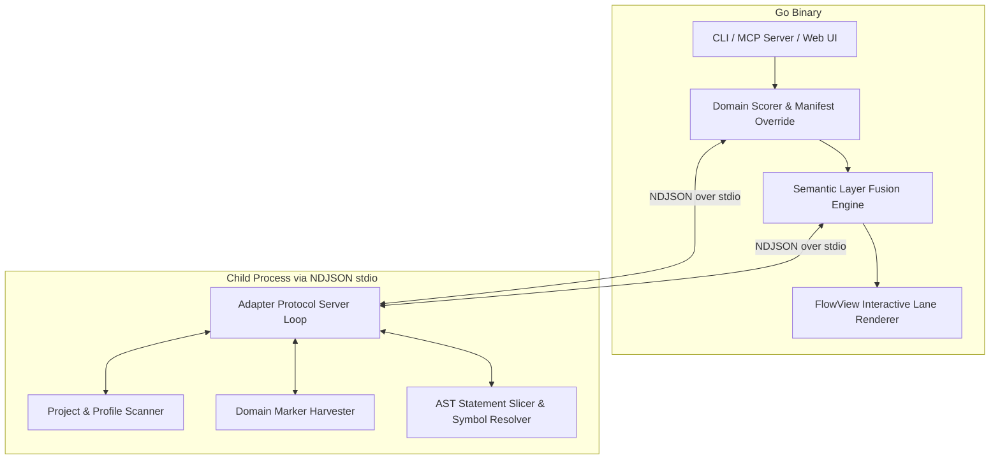
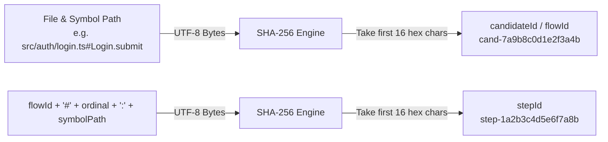
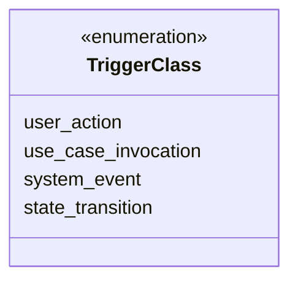
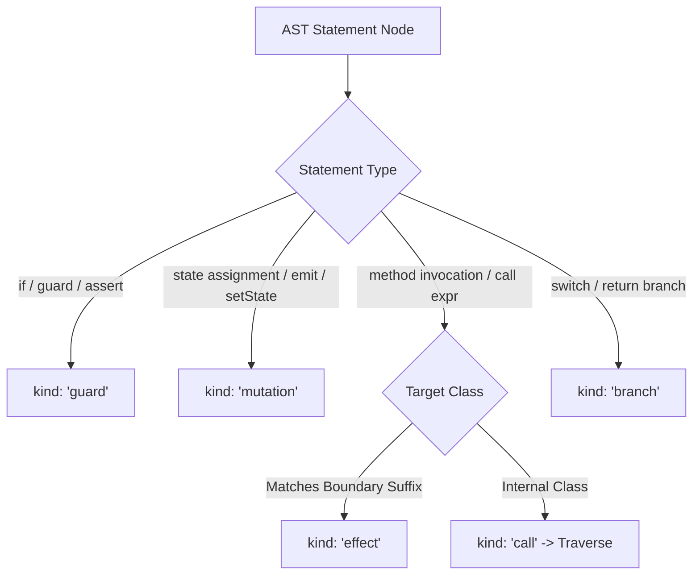

# CodeFlow LLM Language Adapter Protocol & Implementation Specification (v1.0)

> **Document Purpose**: This document is the normative, fully concrete technical specification for implementing a Language Adapter for CodeFlow. Any AI Agent (LLM) or human engineer reading this specification will have complete, unambiguous mathematical algorithms, AST traversal rules, wire schemas, state machines, and reference code necessary to implement a 100% compliant adapter in any programming language (TypeScript, Kotlin, Swift, Python, Go, Java, Rust, C#, etc.).

---

## 1. System Architecture & Role of an Adapter

CodeFlow is an architectural tool that identifies, extracts, and visualizes end-to-end business core flows (from entry points like UI clicks, route changes, or API requests through controllers, use cases, domain logic, to data/external boundaries).

### 1.1 Core vs Adapter Division of Labor



1. **CodeFlow Core Engine (Language-Neutral Go Binary)**:
   - Manages child process lifecycles and connection pools (`internal/protocol/pool.go`).
   - Recomputes priority scores using cross-flow heuristics: `score = marker_specificity * fan_in * boundary_reachability`.
   - Fuses sliced AST steps into architectural layers according to `codeflow.layers.yaml`.
   - Serves the MCP tools (`list_core_flows`, `inspect_core_flow`, `publish_core_flow`) and renders FlowView.

2. **Language Adapter (Language-Specific Subprocess)**:
   - Must run as a persistent, stateful child process communicating with Core over standard streams (`stdin` / `stdout`).
   - Performs **high-fidelity static AST parsing** and lexical analysis for its target language ecosystem.
   - Discovers entrypoint candidates and extracts statement-level slices down to domain boundaries.
   - Emits language-neutral, cryptographically anchored `SlicedPayload` data structures.

---

## 2. Wire Protocol & IPC Specification

The communication wire format between CodeFlow Core and the Language Adapter is strictly **Newline-Delimited JSON (NDJSON)** over `stdio`.

### 2.1 Transport Rules (Normative)
1. **Framing**: Every request from Core is sent as **exactly one line of JSON** terminated by `\n` on `stdin`. Every response from Adapter must be sent as **exactly one line of JSON** terminated by `\n` on `stdout`.
2. **Correlation ID**: Every response MUST echo the exact `id` string received in the request.
3. **No Unstructured Output**: Standard output (`stdout`) MUST ONLY contain valid JSON response lines. Any diagnostic logging, debugging text, or compiler warnings MUST be written to standard error (`stderr`).
4. **Buffer Limit**: The maximum permitted size for any single JSON envelope is **1 MiB (1,048,576 bytes)**. Envelopes exceeding this bound are rejected with `E_BAD_REQUEST`.
5. **Concurrency & Backpressure**: Core may send up to 64 concurrent requests before receiving responses. If the adapter's internal task queue is overwhelmed, it MUST return an error envelope with code `E_BACKPRESSURE` and `retryable: true`.

---

### 2.2 Wire Envelope Schemas

#### Request Envelope (`Core -> Adapter`)
```json
{
  "v": 1,
  "id": "req-019283aa-bbcc",
  "op": "ping | detect | harvest_candidates | slice | shutdown",
  "params": {
    "timeoutMs": 30000,
    "cancellationToken": "tok-998877",
    "...": "op-specific parameters"
  }
}
```

#### Success Response Envelope (`Adapter -> Core`)
```json
{
  "id": "req-019283aa-bbcc",
  "ok": true,
  "result": {
    "...": "op-specific result object"
  }
}
```

#### Error Response Envelope (`Adapter -> Core`)
```json
{
  "id": "req-019283aa-bbcc",
  "ok": false,
  "err": {
    "code": "E_TIMEOUT | E_CANCELLED | E_CRASHED | E_BACKPRESSURE | E_BAD_REQUEST | E_UNSUPPORTED_VERSION | E_ADAPTER_INTERNAL",
    "message": "Human readable error description",
    "retryable": false,
    "detail": "Optional diagnostic stack trace or context"
  }
}
```

---

### 2.3 Closed Error Codes Specification

| Error Code | Description | `retryable` |
| :--- | :--- | :--- |
| `E_TIMEOUT` | Execution time exceeded `params.timeoutMs`. | `true` |
| `E_CANCELLED` | Operation was aborted because `cancellationToken` was signalled. | `false` |
| `E_CRASHED` | Internal crash or unrecoverable subsystem failure. | `false` |
| `E_BACKPRESSURE` | Adapter inbound queue capacity exceeded limit. | `true` |
| `E_BAD_REQUEST` | Malformed JSON, missing mandatory parameters, or schema violation. | `false` |
| `E_UNSUPPORTED_VERSION` | Request `v` is not equal to `1`. | `false` |
| `E_ADAPTER_INTERNAL` | Unhandled exception caught during AST parsing or slicing. | `false` |

---

## 3. Mandatory Operations Specification

An adapter MUST implement the following five operations:

### 3.1 `ping` (Handshake & Version Negotiation)
Executed immediately upon spawning the adapter process to verify compatibility.
* **Request**:
  ```json
  { "v": 1, "id": "req-1", "op": "ping", "params": {} }
  ```
* **Success Result**:
  ```json
  {
    "id": "req-1",
    "ok": true,
    "result": {
      "adapterVersion": "0.1.0",
      "protocolVersion": 1
    }
  }
  ```

---

### 3.2 `detect` (Project & Framework Discovery)
Probes the target repository to determine whether it matches this adapter and discovers active frameworks.
* **Request**:
  ```json
  {
    "v": 1,
    "id": "req-2",
    "op": "detect",
    "params": {
      "repoRoot": "/path/to/project"
    }
  }
  ```
* **Success Result**:
  ```json
  {
    "id": "req-2",
    "ok": true,
    "result": {
      "matched": true,
      "language": "typescript",
      "projectName": "my-web-app",
      "frameworks": ["react", "nextjs", "redux-toolkit", "axios"],
      "entryRoot": "src",
      "sourceExtensions": [".ts", ".tsx", ".js", ".jsx"]
    }
  }
  ```

---

### 3.3 `harvest_candidates` (Stage 1 Domain Flow Discovery)
Scans the codebase to discover potential business flow entrypoints matching domain/UI/system markers.
* **Request**:
  ```json
  {
    "v": 1,
    "id": "req-3",
    "op": "harvest_candidates",
    "params": {
      "repoRoot": "/path/to/project"
    }
  }
  ```
* **Success Result**:
  ```json
  {
    "id": "req-3",
    "ok": true,
    "result": {
      "candidates": [
        {
          "candidateId": "cand-7a9b8c0d1e2f3a4b",
          "triggerClass": "user_action",
          "markerKind": "route_callback",
          "entrySymbolPath": "src/features/cart/CartButton.tsx#CartButton.handleClick",
          "intentSignals": {
            "className": "CartButton",
            "derivedName": "Handle click",
            "docLine": "Handles cart item submission",
            "packageName": "my-web-app"
          },
          "score": 0.5,
          "fanIn": 1,
          "boundaryReachable": true,
          "rootEquivalenceKey": "CartButton.handleClick",
          "tieBreakRank": 0,
          "manifestOverride": "none",
          "dedupedInto": null
        }
      ]
    }
  }
  ```

---

### 3.4 `slice` (Stage 2 Structural AST Statement Slicing)
Performs deep statement-level slicing starting from a designated candidate entry point, traversing cross-file calls down to architectural boundaries.
* **Request**:
  ```json
  {
    "v": 1,
    "id": "req-4",
    "op": "slice",
    "params": {
      "repoRoot": "/path/to/project",
      "candidateId": "cand-7a9b8c0d1e2f3a4b",
      "entrySymbolPath": "src/features/cart/CartButton.tsx#CartButton.handleClick",
      "opts": {
        "maxDepth": 5
      }
    }
  }
  ```
* **Success Result**:
  ```json
  {
    "id": "req-4",
    "ok": true,
    "result": {
      "candidateId": "cand-7a9b8c0d1e2f3a4b",
      "language": "typescript",
      "entrySymbolPath": "src/features/cart/CartButton.tsx#CartButton.handleClick",
      "steps": [
        {
          "ordinal": 1,
          "kind": "guard",
          "description": "if (!item.isValid) return",
          "symbolPath": "CartButton.handleClick",
          "guardCondition": "!item.isValid",
          "stateBefore": null,
          "stateAfter": null,
          "effectTarget": null,
          "anchor": {
            "repoRelativePath": "src/features/cart/CartButton.tsx",
            "byteRange": [120, 155],
            "fileHash": "a1b2c3d4e5f6...",
            "spanHash": "b2c3d4e5f6a1...",
            "enclosingSymbolPath": "CartButton.handleClick",
            "canonicalAstFingerprint": "c3d4e5f6a1b2...",
            "symbolRange": [50, 420]
          }
        },
        {
          "ordinal": 2,
          "kind": "call",
          "description": "cartService.addItem(item)",
          "symbolPath": "CartButton.handleClick",
          "guardCondition": null,
          "stateBefore": null,
          "stateAfter": null,
          "effectTarget": "CartService.addItem",
          "anchor": {
            "repoRelativePath": "src/features/cart/CartButton.tsx",
            "byteRange": [160, 192],
            "fileHash": "a1b2c3d4e5f6...",
            "spanHash": "d4e5f6a1b2c3...",
            "enclosingSymbolPath": "CartButton.handleClick",
            "canonicalAstFingerprint": "e5f6a1b2c3d4...",
            "symbolRange": [50, 420]
          }
        }
      ],
      "edges": [
        {
          "kind": "resolved_cross_file",
          "toSymbolPath": "src/services/CartService.ts#CartService.addItem",
          "resolutionStatus": "resolved",
          "depth": 1,
          "stepOrdinal": 2
        }
      ],
      "truncated": false,
      "visitedCycleDetected": false,
      "redactedCount": 0
    }
  }
  ```

---

### 3.5 `shutdown` (Graceful Teardown)
Flushes buffers and cleanly terminates the process.
* **Request**:
  ```json
  { "v": 1, "id": "req-5", "op": "shutdown", "params": {} }
  ```
* **Success Result**:
  ```json
  { "id": "req-5", "ok": true, "result": { "acknowledged": true } }
  ```

---

## 4. Cryptographic Identity & Hashing Algorithms (Normative)

All identifiers across CodeFlow are strictly deterministic and cryptographically anchored to the codebase source.



### 4.1 Identification Formulae

1. **`canonicalEntrySymbolPath`**:
   $$\text{path} = \text{<repoRelativePath>} + \text{"#"} + \text{<TopLevelDeclaration>} + (\text{"."} + \text{<NestedMember>})^*$$
   * Must use forward slashes `/`.
   * Left of `#`: File path relative to repo root (e.g. `src/features/cart/CartButton.tsx`).
   * Right of `#`: Dotted symbol hierarchy (e.g. `CartButton.handleClick`).

2. **`candidateId`**:
   $$\text{candidateId} = \text{"cand-"} + \text{SHA256}(\text{UTF8}(\text{canonicalEntrySymbolPath}))[0..16]$$

3. **`flowId`**:
   $$\text{flowId} = \text{"flow-"} + \text{SHA256}(\text{UTF8}(\text{canonicalEntrySymbolPath}))[0..16]$$

4. **`stepId`**:
   $$\text{stepId} = \text{"step-"} + \text{SHA256}(\text{UTF8}(\text{flowId} + \text{"#"} + \text{ordinal} + \text{":"} + \text{symbolPath}))[0..16]$$

---

### 4.2 Anchor Hashes & Byte Ranges

Every step in a slice MUST provide a verifiable `anchor` object:

```json
{
  "repoRelativePath": "src/features/cart/CartButton.tsx",
  "byteRange": [120, 155],
  "fileHash": "e3b0c44298fc1c149afbf4c8996fb92427ae41e4649b934ca495991b7852b855",
  "spanHash": "a1b2c3d4e5f60718293a4b5c6d7e8f90123456789abcdef0123456789abcdef0",
  "enclosingSymbolPath": "CartButton.handleClick",
  "canonicalAstFingerprint": "f1e2d3c4b5a69788796a5b4c3d2e1f00112233445566778899aabbccddeeff00",
  "symbolRange": [50, 420]
}
```

* **`byteRange`**: Half-open range `[startByte, endByte)` in **UTF-8 byte offsets** (not UTF-16 character indices or line numbers).
* **`fileHash`**: SHA-256 of the complete file content (64 lowercase hex characters).
* **`spanHash`**: SHA-256 of exactly the raw bytes within `byteRange`.
* **`canonicalAstFingerprint`**: Whitespace- and comment-normalized structural AST hash:
  $$\text{normalized} = \text{nodeText}.\text{replace}(/\/\/.*|\/\*.*?\*\//\text{g}, \text{' '}).\text{replace}(/\backslash\text{s}+/\text{g}, \text{' '}).\text{trim}()$$
  $$\text{canonicalAstFingerprint} = \text{SHA256}(\text{UTF8}(\text{normalized}))$$
* **`symbolRange`**: (Optional) `[startByte, endByte)` encompassing the entire enclosing method/function signature to closing brace.

---

## 5. Stage 1: Domain Candidate Harvesting Guidelines

### 5.1 Trigger Classifications (`triggerClass`)
Every candidate discovered must belong to one of four closed trigger classes:



1. **`user_action`** (`markerKind`: `route_callback`):
   - Direct user UI interactions.
   - React: `onClick`, `onSubmit`, `onChange`, `onKeyDown`.
   - Android / Compose: `onClick`, `onValueChange`.
   - iOS / SwiftUI: `Button(action: ...)`, `.onTapGesture`.
   - Vue: `@click`, `@submit`.
   - Flutter: `onPressed`, `onTap`.

2. **`use_case_invocation`** (`markerKind`: `usecase_call`):
   - Invocation of Clean Architecture UseCases / Domain Services / Command Handlers.
   - Methods: `.execute()`, `.call()`, `.handle()`, `.invoke()`.

3. **`system_event`** (`markerKind`: `lifecycle_callback`):
   - Background tasks, message queue consumers, webhooks, lifecycle events.
   - Kafka / RabbitMQ: `@KafkaListener`, `onMessage`.
   - Push: FCM `onBackgroundMessage`.
   - Lifecycle: `DOMContentLoaded`, `onMount`, `ApplicationStarted`.

4. **`state_transition`** (`markerKind`: `bloc_handler`, `notifier_method`, `state_mutation`):
   - Redux Toolkit: Slice reducers, `createAsyncThunk`.
   - Zustand: Actions modifying state.
   - BLoC: `on<Event>((event, emit) => ...)`.
   - Riverpod: Methods inside `Notifier` / `AsyncNotifier`.

---

### 5.2 Deterministic `intentSignals` Synthesis

Adapters synthesize readable English intent names deterministically without LLM calls:

#### Identifier Word Splitting Algorithm
```typescript
function splitIdentifierWords(name: string): string[] {
  // Strip leading underscores or event prefixes
  let s = name.replace(/^_+/, '').replace(/^on([A-Z])/, '$1');
  const words: string[] = [];
  let current = '';

  for (let i = 0; i < s.length; i++) {
    const ch = s[i];
    if (ch === '_' || ch === '$') {
      if (current) words.push(current);
      current = '';
      continue;
    }
    const isUpper = ch >= 'A' && ch <= 'Z';
    const prevLowerOrDigit = i > 0 && (s[i-1] >= 'a' && s[i-1] <= 'z' || s[i-1] >= '0' && s[i-1] <= '9');
    const nextLower = i + 1 < s.length && (s[i+1] >= 'a' && s[i+1] <= 'z');

    // camelCase boundary (fooBar) or Acronym boundary (URLLoader -> URL, Loader)
    if (isUpper && (prevLowerOrDigit || (current.length >= 2 && nextLower))) {
      if (current) words.push(current);
      current = ch;
    } else {
      current += ch;
    }
  }
  if (current) words.push(current);
  return words;
}

function humanizeIdentifier(rawName: string): string {
  const words = splitIdentifierWords(rawName).map(w => w.toLowerCase());
  if (words.length === 0) return 'Unnamed';
  words[0] = words[0].charAt(0).toUpperCase() + words[0].slice(1);
  return words.join(' ');
}
```

* Examples:
  * `submitOrder` $\rightarrow$ `"Submit order"`
  * `_onItemAdded` $\rightarrow$ `"Item added"`
  * `handleCheckoutClick` $\rightarrow$ `"Handle checkout click"`
  * `URLLoader` $\rightarrow$ `"Url loader"`

---

## 6. Stage 2: Structural AST Statement Slicing Guidelines

### 6.1 Statement Step Classification (`kind`)

When parsing the body of a method/function, every statement is mapped to a `SliceStep`:



1. **`guard`**:
   - Condition nodes that exit early or throw errors:
   - `if (!user.isValid) return;`
   - `guard let token = token else { throw AuthError.noToken }`
   - `assert(amount > 0);`
2. **`mutation`**:
   - Direct updates to component/state variables:
   - `this.state = newState;`
   - `emit(LoadedState(data));`
   - `setCount(c => c + 1);`
3. **`call`**:
   - Internal business function or service method invocations:
   - `this.orderValidator.validate(order);`
   - `await calculateDiscountUseCase(items);`
4. **`effect`**:
   - Calls targeting external boundaries or infrastructure:
   - `await this.http.post('/api/checkout', data);`
   - `await db.orders.insert(order);`
5. **`branch`**:
   - Multi-path execution split points (`switch`, conditional sub-blocks).

---

### 6.2 Cross-File Call Resolution & Boundary Termination

1. **Import Resolution**:
   - When encountering a `call` step (e.g. `cartService.addItem(item)`):
   - Locate the receiver type (`cartService` $\rightarrow$ `CartService`).
   - Find the declaration of `CartService` in the file's `import` statements.
   - Read the target file, locate `CartService.addItem`, and recursively slice it at `depth + 1`.
2. **Boundary Termination**:
   - If a target class or interface ends with a known boundary suffix:
     * `Repository`, `Service`, `Client`, `ApiClient`, `Dao`, `Gateway`, `Vault`, `DataSource`, `RemoteSource`
   - Classify as `effectTarget`, record the step, emit a `boundary_call` edge, and **DO NOT traverse into third-party / external SDK internals**.
3. **Cycle & Depth Guards**:
   - Maintain a `visitedSet: Set<string>` containing `"<repoRelPath>#<enclosingSymbolPath>"`.
   - If `entryKey` is already in `visitedSet`, set `visitedCycleDetected: true` and return.
   - If `depth > 5`, set `truncated: true` and return.

---

### 6.3 UI Noise Denylist & Secret Redaction (Normative)

#### UI Noise Denylist
Statements that solely define visual styles or layouts MUST NOT be emitted as business steps:
* React/CSS: `styled.*`, `sx={...}`, `className="..."`, `style={...}`, `Box`, `Flex`, `Grid`, `Spacer`, `Container`
* Flutter: `TextStyle`, `EdgeInsets`, `BoxDecoration`, `BorderRadius`, `Color`, `SizedBox`, `Padding`, `Center`
* SwiftUI: `.padding()`, `.foregroundColor()`, `.background()`, `.frame()`, `.font()`

#### Secret Redaction Pattern (Single-Gate Match with `internal/secret`)
All code snippets, guard descriptions, and mutation strings leaving the adapter MUST be sanitized using the standard pattern:
```regex
\b(?:api[_-]?key|secret|token|password)\s*[:=]\s*['"]?[^\s;'"]{3,}['"]?
```
* Matched string $\rightarrow$ `***REDACTED***`
* Increment `redactedCount` for each replacement.

#### Boundary Resolution Hierarchy
1. **Primary Authority**: `codeflow.layers.yaml` `LayersConfig.PathPatterns` defines project-specific layer and boundary boundaries.
2. **Default Fallback Suffixes**: In the absence of explicit path patterns, class names ending with `Repository`, `Service`, `Client`, `ApiClient`, `Dao`, `Gateway`, `Vault`, `DataSource`, `RemoteSource` terminate deep traversal as boundary effects (`boundary_call`).

---

## 7. Reference Implementation (TypeScript - Non-Normative Informative)

> [!NOTE]
> **Non-Normative Informative Reference**: Below is an architectural reference skeleton demonstrating how to structure an adapter's event loop, regex/AST scanning, and payload emission in TypeScript/Node.js. Production implementations should use full AST compilers (e.g. `@babel/parser`, `ts-morph`, or Kotlin PSI) and enforce memory and buffer bounds.

```typescript
#!/usr/bin/env node
import * as readline from 'readline';
import * as crypto from 'crypto';
import * as fs from 'fs';
import * as path from 'path';

const PROTOCOL_VERSION = 1;
const ADAPTER_VERSION = "0.1.0";
const MAX_DEPTH = 5;

// --- Wire Framing & Event Loop ---

const rl = readline.createInterface({
  input: process.stdin,
  output: process.stdout,
  terminal: false,
});

rl.on('line', (line: string) => {
  if (!line.trim()) return;
  try {
    const req = JSON.parse(line);
    const res = handleRequest(req);
    process.stdout.write(JSON.stringify(res) + '\n');
  } catch (err: any) {
    const errRes = {
      id: "",
      ok: false,
      err: {
        code: "E_BAD_REQUEST",
        message: err.message || "Invalid JSON",
        retryable: false,
      }
    };
    process.stdout.write(JSON.stringify(errRes) + '\n');
  }
});

function handleRequest(req: any) {
  if (typeof req !== 'object' || req === null) {
    return { id: "", ok: false, err: { code: "E_BAD_REQUEST", message: "Request must be an object", retryable: false } };
  }
  const id = typeof req.id === 'string' ? req.id : "";
  if (req.v !== PROTOCOL_VERSION) {
    return { id, ok: false, err: { code: "E_UNSUPPORTED_VERSION", message: `Expected protocol v=${PROTOCOL_VERSION}`, retryable: false } };
  }

  const op = req.op;
  const params = req.params || {};

  switch (op) {
    case 'ping':
      return { id, ok: true, result: { adapterVersion: ADAPTER_VERSION, protocolVersion: PROTOCOL_VERSION } };

    case 'detect':
      return { id, ok: true, result: detectProject(params.repoRoot) };

    case 'harvest_candidates':
      return { id, ok: true, result: harvestCandidates(params.repoRoot) };

    case 'slice':
      return { id, ok: true, result: sliceFlow(params) };

    case 'shutdown':
      setTimeout(() => process.exit(0), 10);
      return { id, ok: true, result: { acknowledged: true } };

    default:
      return { id, ok: false, err: { code: "E_BAD_REQUEST", message: `Unknown op: ${op}`, retryable: false } };
  }
}

// --- Cryptographic Utilities ---

function sha256Hex(content: string | Buffer): string {
  return crypto.createHash('sha256').update(content).digest('hex');
}

function canonicalAstFingerprint(nodeText: string): string {
  const norm = nodeText
    .replace(/\/\/[^\n]*/g, ' ')
    .replace(/\/\*[\s\S]*?\*\//g, ' ')
    .replace(/\s+/g, ' ')
    .trim();
  return sha256Hex(norm);
}

// --- Project & Framework Detection ---

function detectProject(repoRoot: string) {
  const pkgPath = path.join(repoRoot, 'package.json');
  if (!fs.existsSync(pkgPath)) {
    return { matched: false, language: "typescript", frameworks: [], entryRoot: "src", sourceExtensions: [] };
  }
  const pkg = JSON.parse(fs.readFileSync(pkgPath, 'utf-8'));
  const deps = { ...(pkg.dependencies || {}), ...(pkg.devDependencies || {}) };
  
  const frameworks: string[] = [];
  if (deps['react']) frameworks.push('react');
  if (deps['next']) frameworks.push('nextjs');
  if (deps['@reduxjs/toolkit']) frameworks.push('redux-toolkit');
  if (deps['express']) frameworks.push('express');

  return {
    matched: true,
    language: "typescript",
    projectName: pkg.name || path.basename(repoRoot),
    frameworks,
    entryRoot: fs.existsSync(path.join(repoRoot, 'src')) ? 'src' : '.',
    sourceExtensions: [".ts", ".tsx", ".js", ".jsx"]
  };
}

// --- Domain Candidate Harvesting ---

function harvestCandidates(repoRoot: string) {
  const candidates: any[] = [];
  const files = listSourceFiles(repoRoot);

  for (const relPath of files) {
    const fullPath = path.join(repoRoot, relPath);
    const code = fs.readFileSync(fullPath, 'utf-8');
    
    // Regex or AST visitor matching UI callbacks or handlers
    const handlerRegex = /(?:function|const|let)\s+([A-Za-z0-9_$]+(?:Click|Submit|Change|Handler|Pressed))\b/g;
    let m;
    while ((m = handlerRegex.exec(code)) !== null) {
      const symName = m[1];
      const entrySymbolPath = `${relPath}#${symName}`;
      const candHash = sha256Hex(entrySymbolPath).substring(0, 16);
      
      candidates.push({
        candidateId: `cand-${candHash}`,
        triggerClass: "user_action",
        markerKind: "route_callback",
        entrySymbolPath,
        intentSignals: {
          className: path.basename(relPath, path.extname(relPath)),
          derivedName: humanizeIdentifier(symName),
          docLine: null,
          packageName: path.basename(repoRoot),
        },
        score: 0.5,
        fanIn: 1,
        boundaryReachable: true,
        rootEquivalenceKey: symName,
        tieBreakRank: 0,
        manifestOverride: "none",
        dedupedInto: null,
      });
    }
  }

  // Deterministic sorting
  candidates.sort((a, b) => a.entrySymbolPath.localeCompare(b.entrySymbolPath));
  return { candidates };
}

// --- Structural Code Slicing ---

function sliceFlow(params: any) {
  const { repoRoot, candidateId, entrySymbolPath } = params;
  const [relPath, symbol] = entrySymbolPath.split('#');
  
  const steps: any[] = [];
  const edges: any[] = [];
  const visitedSet = new Set<string>();
  let truncated = false;
  let visitedCycleDetected = false;
  let redactedCount = 0;

  function redact(text: string) {
    let count = 0;
    const pat = /\b(?:api[_-]?key|secret|token|password)\s*[:=]\s*['"]?[^\s;'"]{3,}['"]?/gi;
    const sanitized = text.replace(pat, () => {
      count++;
      return '***REDACTED***';
    });
    redactedCount += count;
    return sanitized;
  }

  const fullPath = path.join(repoRoot, relPath);
  if (fs.existsSync(fullPath)) {
    const code = fs.readFileSync(fullPath, 'utf-8');
    const fileHash = sha256Hex(code);

    // Synthetic demonstration step
    steps.push({
      ordinal: 1,
      kind: "call",
      description: redact(`Execute ${symbol}`),
      symbolPath: symbol,
      guardCondition: null,
      stateBefore: null,
      stateAfter: null,
      effectTarget: null,
      anchor: {
        repoRelativePath: relPath,
        byteRange: [0, Math.min(code.length, 100)],
        fileHash: fileHash,
        spanHash: sha256Hex(code.substring(0, Math.min(code.length, 100))),
        enclosingSymbolPath: symbol,
        canonicalAstFingerprint: canonicalAstFingerprint(code.substring(0, Math.min(code.length, 100))),
      }
    });
  }

  return {
    candidateId,
    language: "typescript",
    entrySymbolPath,
    steps,
    edges,
    truncated,
    visitedCycleDetected,
    redactedCount
  };
}

function listSourceFiles(dir: string, base = ''): string[] {
  let results: string[] = [];
  const list = fs.readdirSync(path.join(dir, base)).sort();
  for (const file of list) {
    if (file === 'node_modules' || file.startsWith('.')) continue;
    const rel = base ? `${base}/${file}` : file;
    const full = path.join(dir, rel);
    const stat = fs.statSync(full);
    if (stat.isDirectory()) {
      results = results.concat(listSourceFiles(dir, rel));
    } else if (/\.(ts|tsx|js|jsx)$/.test(file)) {
      results.push(rel);
    }
  }
  return results;
}

function humanizeIdentifier(name: string): string {
  const parts = name.replace(/^_+/, '').replace(/([A-Z])/g, ' $1').trim().toLowerCase().split(/\s+/);
  if (parts.length === 0) return 'Unnamed';
  parts[0] = parts[0].charAt(0).toUpperCase() + parts[0].slice(1);
  return parts.join(' ');
}
```

---

## 8. Verification & Conformance Checklist

Any adapter author (LLM or human) must ensure the following tests pass prior to shipping:

| Category | Verification Item | Expected Behavior |
| :--- | :--- | :--- |
| **Transport** | Malformed JSON on `stdin` | Returns `E_BAD_REQUEST` with `id: ""` without terminating process. |
| **Transport** | Version mismatch `v: 2` | Returns `E_UNSUPPORTED_VERSION`. |
| **Transport** | Framing | Exactly 1 line per response; no unstructured logs on `stdout`. |
| **Identity** | Derivation | `candidateId` and `flowId` exactly match `cand-/flow-` + 16-hex hash of `canonicalEntrySymbolPath`. |
| **Determinism** | Byte-Identical Output | Running `harvest_candidates` or `slice` 10 times in a row on same repo produces 100% identical byte responses. |
| **Boundary** | Stopping Condition | Does not traverse deeper once reaching `*Repository`, `*Service`, `*ApiClient`. |
| **Security** | Redaction | Secrets and credentials in code snippets are replaced with `***REDACTED***`. |
| **Safety** | Recursion & Cycles | Cyclic function calls set `visitedCycleDetected: true` and never enter infinite loops. |
