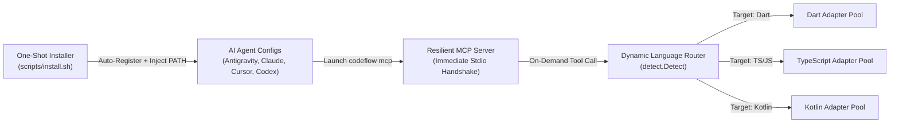
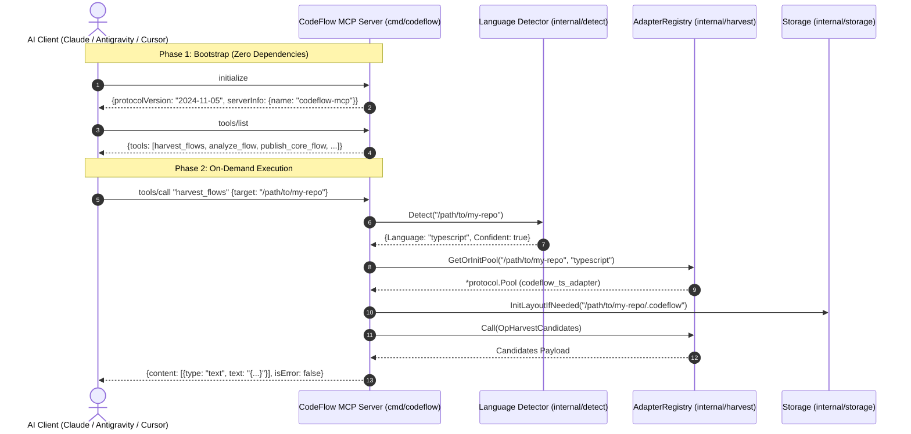

# CodeFlow Resilient MCP Lifecycle & Installer Auto-Configuration Specification (v2.1)

> **Document Status**: Normative Technical Specification & Architecture Standard  
> **Target Scope**: MCP Server Resilient Bootstrap, Dynamic Multi-Language Adapter Routing, Multi-Agent Auto-Registration, GUI Environment PATH Auto-Injection  
> **Authors**: CodeFlow Architecture Team  
> **Reference Issues / ADRs**: Decision #16 (Resilient MCP Lifecycle), Multi-Language Foundation Plan (v2.0)

---

## 1. Executive Summary & Goal-Driven Objectives

CodeFlow connects AI agents (Claude Desktop, Cursor, Antigravity, Codex) to codebase business flow engines via the Model Context Protocol (MCP). Previously, one-shot installation did not guarantee that CodeFlow MCP would run immediately due to eager startup checks, unconfigured agent settings, and missing desktop GUI environment variables.

This specification defines a **Goal-Driven Architecture** that guarantees CodeFlow MCP runs reliably, immediately, and adaptively under all installation environments.



### 1.1 Goal-Driven Objectives

| Goal ID | Objective | Success Metric |
| :--- | :--- | :--- |
| **G1** | **Zero-Crash Server Bootstrap** | `codeflow mcp` MUST complete MCP `initialize` and `tools/list` handshakes in $<50\text{ms}$ in any working directory (including empty dirs, `HOME`, or `/`) without requiring adapters or `.codeflow` storage. |
| **G2** | **Dynamic On-Demand Adapter Routing** | Adapters MUST be resolved and pooled on-demand based on the `target` parameter in tool invocations (e.g. `harvest_flows`, `analyze_flow`) rather than fixed at startup. |
| **G3** | **100% Automated Multi-Agent Registration** | `scripts/install.sh` MUST automatically discover, scaffold, and configure MCP across all 4 supported agents: Antigravity, Claude Desktop, Cursor, and Codex. |
| **G4** | **Zero-Config GUI Environment Injection** | `scripts/install.sh` MUST automatically collect and inject runtime `$PATH` (Homebrew, NVM, local bins) into JSON configs so GUI desktop apps seamlessly execute `node` and `dart`. |
| **G5** | **Graceful Degradation over Hard Crashes** | Missing language runtimes or unsupported project directories MUST return structured, actionable MCP tool errors (`isError: true`) and MUST NEVER terminate the MCP stdio process (`os.Exit(1)`). |

### 1.2 Non-Goals

* **NG1**: Modifying the Stage 1 / Stage 2 internal protocol schemas ([`schemas/adapter-protocol.schema.json`](../../schemas/adapter-protocol.schema.json)).
* **NG2**: Managing system-level installation of third-party runtimes (`node`, `dart`, `java`) directly; CodeFlow provides automatic discovery, path injection, and actionable diagnostics, but does not execute `brew install` or `apt-get` on behalf of the user.

---

## 2. Architecture & Lifecycle Specification

### 2.1 Two-Phase Lifecycle: Bootstrap vs. Execution

The MCP server architecture is strictly decoupled into two phases:

1. **Bootstrap Phase (Lightweight & Unconditional)**:
   * Initializes JSON-RPC 2.0 stdio scanner.
   * Registers tool schemas for `tools/list`.
   * Responds to `initialize` and `ping`.
   * **Zero disk I/O** (no `.codeflow/` creation in CWD).
   * **Zero subprocess spawning** (no adapters launched).

2. **Execution Phase (On-Demand & Scoped)**:
   * Triggered when a tool is called via `tools/call`.
   * Resolves the target repository path from tool arguments (defaulting cleanly to CWD only when invoked).
   * Executes [`detect.Detect`](file:///Users/junhyounglee/workspace/codeflow/internal/detect/detect.go) on the target repository.
   * Retrieves or instantiates the corresponding language adapter pool from `AdapterRegistry`.
   * Scopes `.codeflow/` storage operations strictly to the target repository.



---

## 3. Detailed Component Specifications

### 3.1 Server Bootstrap & Multi-Language Registry ([`internal/mcp/server.go`](file:///Users/junhyounglee/workspace/codeflow/internal/mcp/server.go))

#### 3.1.1 Registry Data Model

```go
type Server struct {
    defaultRoot string
    registry    *AdapterRegistry
    storageMap  sync.Map // map[string]*storage.Storage (keyed by absRepoRoot)
    eventLogMap sync.Map // map[string]*fusion.EventLog
    fv          *flowview.Server
    fvMu        sync.Mutex
}

type AdapterRegistry struct {
    mu    sync.RWMutex
    pools map[string]*protocol.Pool // key: "repoRoot:language"
}
```

#### 3.1.2 Startup Contract

* `NewServer(cfg Config) (*Server, error)`:
  * MUST NOT call `st.InitLayout()`.
  * MUST NOT call `harvest.ResolveAdapter()`.
  * MUST return a ready-to-serve `*Server` instance in $O(1)$ time.

#### 3.1.3 Tool Execution Scoping Contract

When executing tools accepting a `target` parameter (`harvest_flows`, `analyze_flow`, `publish_core_flow`, etc.):

1. **Path Resolution**:
   ```go
   targetPath := resolveTargetPath(s.defaultRoot, args["target"])
   ```
2. **Language Resolution**:
   * If language is explicitly provided via tool arguments, use it.
   * Otherwise, execute `detect.Detect(targetPath)`.
   * If detection is not confident, return a structured error with available supported languages.
3. **Storage Scoping**:
   * Initialize layout only inside `filepath.Join(targetPath, ".codeflow")`.

---

### 3.2 Non-Crashing Error Handling Protocol

When an adapter or runtime requirement is missing (e.g. Node.js missing for a TypeScript repo, or Dart SDK missing for a Dart repo), the server MUST NOT exit. It MUST return an RFC-compliant MCP tool error payload:

```json
{
  "jsonrpc": "2.0",
  "id": 2,
  "result": {
    "isError": true,
    "content": [
      {
        "type": "text",
        "text": "CodeFlow Adapter Error: TypeScript adapter requires Node.js runtime on PATH.\nTarget Directory: /path/to/project\n\nRemediation:\n- Install Node.js (https://nodejs.org or 'brew install node')\n- Ensure node is accessible on system PATH"
      }
    ]
  }
}
```

---

## 4. One-Shot Installer Specification ([`scripts/install.sh`](file:///Users/junhyounglee/workspace/codeflow/scripts/install.sh))

### 4.1 Multi-Agent Registration Matrix

The installer MUST configure all detected and standard agent directories. If a target agent config directory does not exist, the installer MUST scaffold it using `mkdir -p`.

| Agent | Target Config Path | Registration Format | Key Properties |
| :--- | :--- | :--- | :--- |
| **Antigravity (Gemini CLI)** | `HOME/.gemini/config/mcp_config.json`<br/>`HOME/.gemini/antigravity-cli/skills/codeflow` | JSON (`mcpServers.codeflow`)<br/>Directory Copy | `command`, `args: ["mcp"]`, `env.PATH` |
| **Claude Desktop** | macOS: `HOME/Library/Application Support/Claude/claude_desktop_config.json`<br/>Linux: `HOME/.config/Claude/claude_desktop_config.json` | JSON (`mcpServers.codeflow`) | `command`, `args: ["mcp"]`, `env.PATH` |
| **Cursor IDE** | `HOME/.cursor/mcp.json`<br/>`HOME/.cursor/skills/codeflow` | JSON (`mcpServers.codeflow`)<br/>Directory Copy | `command`, `args: ["mcp"]`, `env.PATH` |
| **Codex CLI** | `codex mcp add codeflow` | CLI command / Config | `-- "$INSTALL_PATH" mcp` |

### 4.2 Automated Runtime `$PATH` Collection & Injection

To guarantee that desktop GUI apps (which run in stripped `/usr/bin:/bin` environments) can launch `node`, `dart`, and child adapter binaries:

1. **Path Harvester Routine**:
   The installer constructs a consolidated `MCP_RUNTIME_PATH` containing:
   * Current active `$PATH` from the installation shell.
   * Homebrew paths: `/opt/homebrew/bin`, `/opt/homebrew/sbin`, `/usr/local/bin`.
   * Standard local bins: `HOME/.local/bin`, `HOME/bin`.
   * Active Node/NVM paths: `HOME/.nvm/versions/node/$(active_version)/bin`, `HOME/.local/share/fnm/current/bin`, `HOME/.asdf/shims`, `HOME/.volta/bin`.
   * Active Dart/Flutter paths: `HOME/.pub-cache/bin`, `HOME/fvm/default/bin`, `HOME/flutter/bin`.

2. **JSON Injection Template**:
   ```json
   {
     "mcpServers": {
       "codeflow": {
         "command": "HOME/.local/bin/codeflow",
         "args": ["mcp"],
         "env": {
           "PATH": "<MCP_RUNTIME_PATH>"
         }
       }
     }
   }
   ```

### 4.3 Terminal `$PATH` Verification & Shell Guidance

At the end of installation, the installer checks if `HOME/.local/bin` is present in `$PATH`:
* If missing: It prints a clear, colored reminder with exact lines to add to `~/.zshrc` or `~/.bashrc`:
  ```bash
  export PATH="$HOME/.local/bin:$PATH"
  ```

---

## 5. Adapter Engine Hardening ([`internal/harvest/run.go`](file:///Users/junhyounglee/workspace/codeflow/internal/harvest/run.go))

### 5.1 Fallback Binary & Runtime Search

When `exec.LookPath("node")` or `exec.LookPath("dart")` fails due to minimal process environment:

1. CodeFlow inspects a curated list of standard paths:
   * `/opt/homebrew/bin/node`, `/usr/local/bin/node`
   * `HOME/.nvm/versions/node/*/bin/node` (picks latest valid)
   * `/opt/homebrew/bin/dart`, `/usr/local/bin/dart`
2. If found, the full absolute executable path is used directly to spawn the adapter pool.

### 5.2 TypeScript Adapter Wrapper Hardening

`HOME/.local/bin/codeflow_ts_adapter` wrapper MUST use robust runtime resolution:

```bash
#!/usr/bin/env bash
TS_TARGET="HOME/.local/share/codeflow/adapters/typescript/bin/codeflow_ts_adapter.js"

if command -v node >/dev/null 2>&1; then
  NODE_BIN="$(command -v node)"
elif [ -x "/opt/homebrew/bin/node" ]; then
  NODE_BIN="/opt/homebrew/bin/node"
elif [ -x "/usr/local/bin/node" ]; then
  NODE_BIN="/usr/local/bin/node"
else
  echo "Error: Node.js runtime not found on PATH or standard Homebrew locations" >&2
  exit 1
fi

exec "$NODE_BIN" "$TS_TARGET" "$@"
```

---

## 6. Verification & Test Matrix

| Test Level | Test Identifier | Scenario | Expected Behavior |
| :--- | :--- | :--- | :--- |
| **Unit** | `TestMCP_Bootstrap_EmptyCWD` | Spawning `NewServer` in `/tmp/empty` with no adapters and no `.codeflow` dir | Returns server in $<10\text{ms}$; handles `initialize` & `tools/list` with 0 disk writes |
| **Unit** | `TestMCP_Error_MissingRuntime` | Calling `harvest_flows` on a TS project when `node` is absent | Returns `{isError: true, text: "...Node.js..."}` without killing process |
| **Integration** | `TestMCP_PolyglotSwitching` | Consecutive calls to `harvest_flows` targeting (1) Dart repo, (2) TS repo | Lazily spawns Dart pool then TS pool; caches pools in `AdapterRegistry` |
| **Integration** | `TestStorage_NoPollutionInCWD` | Running `codeflow mcp` in `HOME` and analyzing `/tmp/sample-repo` | `.codeflow/` is created ONLY in `/tmp/sample-repo/.codeflow`, never in `HOME` |
| **E2E** | `TestInstaller_AllAgentsConfigured` | Running `scripts/install.sh` on a clean mock environment | Verified valid JSON in Antigravity, Claude Desktop, Cursor configs with `env.PATH` |

---

## 7. Migration & Rollout Plan

1. **Phase 1: MCP Core Engine Refactor**
   * Refactor `internal/mcp/server.go` to implement `AdapterRegistry` and lazy per-target resolution.
   * Update `cmd/codeflow/main.go` to remove eager startup validation in `runMCP`.
2. **Phase 2: Installer & Path Injection Update**
   * Update `scripts/install.sh` with Antigravity registration, automatic directory creation, and consolidated `PATH` harvesting.
3. **Phase 3: Test Matrix Execution**
   * Execute `go test ./internal/mcp/... ./internal/harvest/...` and installer verification tests.
