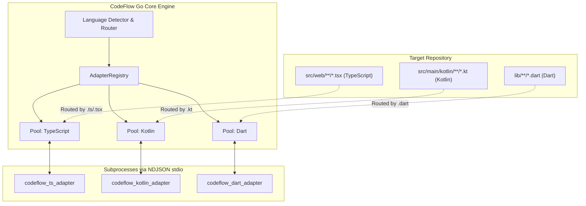
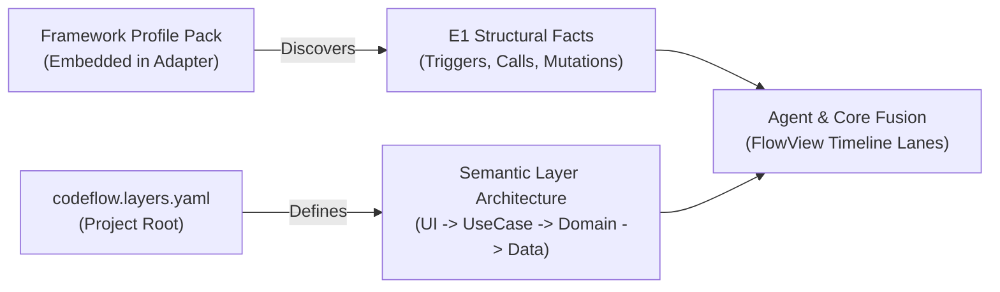

# CodeFlow Multi-Language Foundation & Strategic Roadmap Plan (v2.0)

> **Document Status**: Normative Strategic Roadmap & Architecture Foundation Plan  
> **Target Scope**: Multi-Language Protocol Standardization, Polyglot Routing, Schema Alignment, and Phase-by-Phase Roadmap (Dart $\rightarrow$ TypeScript $\rightarrow$ Kotlin $\rightarrow$ Swift)

---

## 1. Executive Summary & Core Architectural Decisions

CodeFlow's vision is to extract and visualize architectural core flows across any major language ecosystem. To support multiple languages safely without breaking existing Dart/Flutter functionality, this plan codifies the following canonical architectural decisions:

### 1.1 Canonical Decisions (Resolutions R1 ~ R5)

1. **R1 Layer Authority (O1 Track A Convergence)**:
   * **Adapter Role (E1 Facts)**: Language Adapters extract pure structural facts (`kind`: guard/mutation/call/effect/branch, AST spans, byte ranges, SHA-256 hashes, call targets).
   * **Agent Role (Semantic Authority)**: The LLM Agent assigns business semantic layers (`UI`, `Controller`, `UseCase`, `Domain`, `Data`, etc.) based on `codeflow.layers.yaml` and publishes via `publish_core_flow`.
   * **Core Role (Validation)**: Core enforces monotonic layer progression via `ValidateLayerOrder` (`StrictOrder: true, AllowUnknown: false`).
2. **R2 Identity Namespace Disambiguation**:
   * `candidateId` (`cand-[a-f0-9]{16}`): Ephemeral discovery key for Stage 1 harvest and dedup/tie-break.
   * `flowId` (`flow-[a-f0-9]{16}`): Immutable, lifecycle-tracked identifier for published flows (with collision suffixes `-2`, `-3` and `supersedes` chains).
   * Formally codified in [`schemas/identity.schema.json`](../../schemas/identity.schema.json).
3. **R3 Protocol Single Source of Truth (SSOT)**:
   * [`schemas/adapter-protocol.schema.json`](../../schemas/adapter-protocol.schema.json) is the definitive SSOT. Legacy `docs/contracts/dart-adapter-v1.md` is deprecated.
4. **R4 Payload & Artifact Capacity Budget**:
   * **Wire Transport Limit (Adapter $\rightarrow$ Core)**: Max **1 MiB** (`DefaultMaxMessageSizeBytes`) to accommodate rich AST statements and cross-file edges.
   * **Published Artifact Limit (Core Flow)**: Max **512 KiB** (`maxCoreArtifactBytes`) to ensure compact, high-signal LLM context windows.
5. **R5 Unified Secret Scanner & Boundary Resolution**:
   * **Secret Redaction**: Strict single-gate pattern `(?i)\b(?:api[_-]?key|secret|token|password)\s*[:=]\s*['"]?[^\s;'"]{3,}['"]?` matching `internal/secret`.
   * **Boundary Resolution**: `codeflow.layers.yaml` `LayersConfig.PathPatterns` takes absolute precedence; standard class suffixes (`Repository`, `Service`, `Client`, `Dao`, `Gateway`) serve as default fallback markers.

---

## 2. Multi-Language Router & Process Pool Architecture (Action A5)

In polyglot monorepositories (e.g. Next.js TypeScript frontend + Kotlin Spring Boot backend), CodeFlow manages independent adapter child processes via an `AdapterRegistry`.



### 2.1 Multi-Pool Data Structures (`internal/protocol/pool.go`)

```go
// Language represents a registered language identifier.
type Language string

const (
    LangDart       Language = "dart"
    LangTypeScript Language = "typescript"
    LangKotlin     Language = "kotlin"
    LangSwift      Language = "swift"
    LangPython     Language = "python"
    LangGo         Language = "go"
)

// AdapterRegistry manages language-specific process pools.
type AdapterRegistry struct {
    mu    sync.RWMutex
    pools map[Language]*Pool
    cfgs  map[Language]Config
}

// NewAdapterRegistry initializes a multi-language pool manager.
func NewAdapterRegistry() *AdapterRegistry {
    return &AdapterRegistry{
        pools: make(map[Language]*Pool),
        cfgs:  make(map[Language]Config),
    }
}

// GetPool returns or initializes the Pool for a given language.
func (r *AdapterRegistry) GetPool(lang Language) (*Pool, error) {
    r.mu.Lock()
    defer r.mu.Unlock()
    if p, ok := r.pools[lang]; ok {
        return p, nil
    }
    cfg, ok := r.cfgs[lang]
    if !ok {
        return nil, fmt.Errorf("no adapter registered for language %q", lang)
    }
    pool := NewPool(cfg, 4) // max 4 idle processes per language
    r.pools[lang] = pool
    return pool, nil
}
```

---

## 3. Relationship: Framework Profile Packs vs `codeflow.layers.yaml`



1. **Framework Profile Pack (Adapter-Side)**:
   - Language- and framework-specific heuristic rules (e.g. `Riverpod`, `BLoC`, `React Redux`, `Spring Boot`, `SwiftUI`).
   - Identifies raw entrypoint markers (`route_callback`, `notifier_method`, `usecase_call`), parameters, and syntax patterns.
2. **`codeflow.layers.yaml` (Project-Side)**:
   - Architectural layer definitions and ordering for the specific codebase.
   - Declares `layers`, `aliases`, `strictOrder`, and `pathPatterns`.
3. **Synthesis**:
   - Adapter discovers what the code *does* structurally; `codeflow.layers.yaml` defines what the code *means* architecturally.

---

## 4. Phased Roadmap (Dart $\rightarrow$ TypeScript $\rightarrow$ Kotlin $\rightarrow$ Swift)

| Milestone | Target Scope | Key Deliverables & Validation Criteria |
| :--- | :--- | :--- |
| **M1 (Current)** | **Dart / Flutter Foundation** | • Existing Dart adapter running NDJSON v1.<br>• 100% backward compatibility on existing testdata (`eval_app`, `example_app`). |
| **M2** | **Core Foundation & Protocol SSOT** | • Generalize `schemas/identity.schema.json` & `schemas/adapter-protocol.schema.json`.<br>• Implement `AdapterRegistry` multi-pool in Go Core.<br>• Multi-language project detection in `internal/detect/detect.go`. |
| **M3** | **TypeScript / Node / Web Adapter** | • Native TypeScript adapter (`adapters/typescript/`) using TypeScript Compiler API.<br>• React (`onClick`, `onSubmit`), Next.js App Router, Redux/Zustand harvesting.<br>• E2E FlowView verification on real React/TypeScript test repo. |
| **M4** | **Kotlin / JVM Adapter (Milestone M6 Target)** | • Native Kotlin adapter (`adapters/kotlin/`) using Kotlin PSI / Embeddable Compiler.<br>• Android Compose + Spring Boot `@RestController` / `@Service` harvesting.<br>• Automated contract test conformance against `schemas/adapter-protocol.schema.json`. |
| **M5** | **Swift / iOS Adapter** | • Swift adapter (`adapters/swift/`) using `SwiftSyntax`.<br>• SwiftUI `Button`, Combine/AsyncSequence, Clean Architecture harvesting. |

---

## 5. Migration & Backward Compatibility Standards

1. **Zero Regression for Dart Flows**:
   - All existing Dart golden test fixtures (`internal/harvest/run_test.go`, `internal/fusion/fusion_test.go`, `internal/protocol/conformance_test.go`) MUST pass without modification.
2. **Deterministic Golden Fixtures**:
   - Every new language adapter MUST provide at least 2 golden fixture apps in `testdata/<lang>_app/` verifying deterministic JSON outputs across consecutive runs.
3. **Failure Isolation**:
   - A crash or failure in one language adapter (e.g. TS) MUST NEVER affect another language adapter (e.g. Dart or Kotlin) within the same CodeFlow session.
