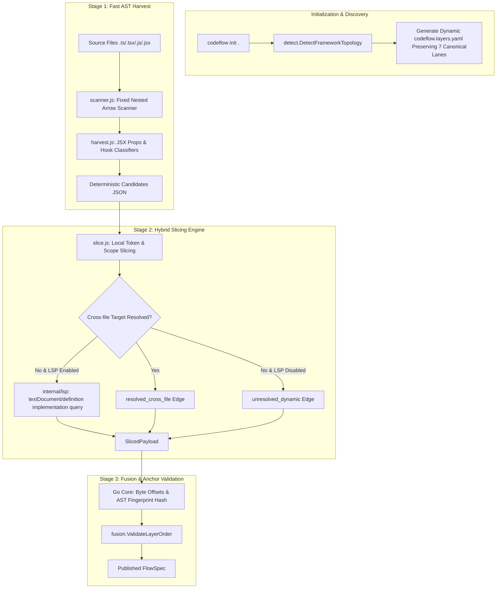

# CodeFlow TypeScript Frontend Analysis & Dynamic Architecture Specification

> **Document Status**: Normative Engineering Specification  
> **Target Path**: `docs/spec/ts-frontend-analysis-and-dynamic-architecture-spec.md`  
> **Scope**: TypeScript/JavaScript Frontend Precision, Component & Hook Discovery, Dynamic Framework Architecture Inference, 7-Lane Preservation, and Hybrid LSP Semantic Enrichment.

---

## 1. Executive Summary & Goal-Driven Objectives

CodeFlow must analyze modern TypeScript/JavaScript frontend applications (React, Next.js, Vue, Svelte, Feature-Sliced Design, Redux/Zustand) with high precision while strictly preserving CodeFlow Core invariants:
1. **7-Lane Architecture Invariant**: Strict monotonic progression across the 7 canonical lanes (`presentation` $\rightarrow$ `controller` $\rightarrow$ `usecase` $\rightarrow$ `domain` $\rightarrow$ `data` $\rightarrow$ `infra` $\rightarrow$ `external`).
2. **Deterministic 6-Field Anchor Verification**: Byte-level span verification (`repoRelativePath`, `byteRange`, `fileHash`, `spanHash`, `enclosingSymbolPath`, `canonicalAstFingerprint`).
3. **Sub-second CLI & Agent Performance**: Zero cold-start penalty for routine operations; fast local AST extraction by default with optional, isolated semantic enrichment.

### 1.1 Goal-Driven Key Results (OKRs)

| ID | Objective | Measurable Key Result | Target Timeline |
| :--- | :--- | :--- | :--- |
| **G1** | **Component Handler & Hook Discovery** | Discover 100% of nested JSX event handlers (`handleSubmit`, `onClick`) and async hooks (`useMutation`, `useAuth`) in functional components. | Phase 1 |
| **G2** | **Dynamic Architecture Inference** | Automatically infer project architecture (FSD, Next.js App Router, React SPA, Clean Arch) during `codeflow init` and generate valid 7-lane `pathPatterns`. | Phase 2 |
| **G3** | **Zero Layer Violation on Init** | 0 `layer_order_violation` errors on standard React/Next.js/FSD starter templates after `codeflow init`. | Phase 2 |
| **G4** | **Hybrid Semantic Slicing (LSP)** | Provide optional cross-file DI & symbol resolution via isolated `internal/lsp` sessions without breaking NDJSON stateless pool contracts. | Phase 3 |
| **G5** | **Actionable Diagnostics (`doctor`)** | Provide 100% reproducible, non-destructive environment checks in `codeflow doctor` without global npm package mandates. | Phase 4 |

---

## 2. Problem Statement & Root Cause Mapping

### 2.1 Findings (F1 ~ F5)

* **F1 (Scanner Nested Skip Bug)**: In [`adapters/typescript/lib/scanner.js`](../../adapters/typescript/lib/scanner.js), scanning top-level arrow function components (e.g., `export const LoginPage = () => { ... }`) sets `arrowRe.lastIndex = bodyEnd + 1`, skipping all inner event handlers (`handleSubmit`), callbacks, and local hooks.
* **F2 (OOP-Biased Harvest Heuristics)**: In [`adapters/typescript/lib/harvest.js`](../../adapters/typescript/lib/harvest.js), `classifyMarker` only matches class methods with names like `execute`, `handle`, `usecase`, or `service`. Functional React components and custom hooks return `null`.
* **F3 (Chained & Destructured Call Disconnect)**: In [`adapters/typescript/lib/slice.js`](../../adapters/typescript/lib/slice.js), `callMatch` regex assumes single-dot invocations (`receiver.method()`). Destructured hooks (`const { login } = useAuth(); login()`) and chained API calls (`api.v1.auth.login()`) resolve to `unresolved_dynamic`.
* **F4 (Static 7-Lane Path Pattern Mismatch)**: In [`internal/initcmd/initcmd.go`](../../internal/initcmd/initcmd.go), `ensureStarterLayersYaml()` generates fixed Clean Architecture paths (`**/controllers/**`, `**/usecases/**`). Frontend code residing in `**/hooks/**`, `**/features/**`, or `**/pages/**` fails `ValidateLayerOrder` with `layer_order_violation`.
* **F5 (LSP Independence & 6-Field Anchor Invariant)**: LSP `Range` operates in UTF-16 lines/characters and cannot produce `byteRange` or `canonicalAstFingerprint`. Go Core must retain sole authority over file reading and anchor verification.

---

## 3. Architecture & Detailed Design



---

### 3.1 Component & Hook Discovery Engine (Phase 1)

#### A. Nested Arrow Function Traversal (`adapters/typescript/lib/scanner.js`)
Modify `scanSource` to recursively scan nested function bodies instead of advancing `arrowRe.lastIndex` past `bodyEnd`:

```javascript
// scanner.js: Hierarchical symbol scanning
function scanFunctionBody(source, bodyStart, bodyEnd, parentScope) {
  const innerCode = source.substring(bodyStart, bodyEnd);
  const innerFunctions = [];

  // Match nested arrow functions and handler declarations
  const nestedArrowRe = new RegExp(arrowRegex.source, 'g');
  let match;
  while ((match = nestedArrowRe.exec(innerCode)) !== null) {
    const fnName = match[1];
    const subStart = bodyStart + match.index + match[0].length;
    const subEnd = findMatchingBrace(source, subStart - 1);
    innerFunctions.push({
      name: `${parentScope}.${fnName}`,
      localName: fnName,
      bodyStart: subStart,
      bodyEnd: subEnd >= 0 ? subEnd : bodyEnd,
      isAsync: match[0].includes('async'),
    });
  }
  return innerFunctions;
}
```

#### B. Frontend Trigger Classifiers (`adapters/typescript/lib/harvest.js`)
Extend `classifyMarker` to recognize functional UI actions and state mutations:

```javascript
// harvest.js: Frontend-aware marker classification
function classifyMarker(enclosingName, symbolName, code) {
  // 1. User Actions: UI Event Handlers & Form Actions
  if (/^(handle|on)[A-Z0-9_$]*(click|submit|press|change|select|drag|drop|input)/i.test(symbolName) ||
      /^(handle|on)[A-Z]/.test(symbolName) ||
      symbolName.endsWith('Action')) {
    return { triggerClass: 'user_action', markerKind: 'route_callback' };
  }

  // 2. State Transitions: Custom Hooks, TanStack Mutations, Slices
  if (/^use[A-Z0-9_$]*(mutation|login|auth|cart|order|submit|update)/i.test(symbolName) ||
      /^(set|update|mutate|dispatch|commit)[A-Z]/.test(symbolName)) {
    return { triggerClass: 'state_transition', markerKind: 'notifier_method' };
  }

  // 3. System Events: Next.js Route Handlers & Server Actions
  if (/^(GET|POST|PUT|DELETE|PATCH)$/.test(symbolName) ||
      code.includes("'use server'") || code.includes('"use server"')) {
    return { triggerClass: 'system_event', markerKind: 'lifecycle_callback' };
  }

  return classifyLegacyOopMarker(enclosingName, symbolName, code);
}
```

---

### 3.2 Dynamic Architecture Inference (Phase 2)

#### A. Topology Detector (`internal/detect/topology.go`)
Inspect directory hierarchy and `package.json` dependencies during `codeflow init`:

```go
type ArchitecturePattern string

const (
    PatternFeatureSlicedDesign ArchitecturePattern = "fsd"
    PatternNextAppRouter       ArchitecturePattern = "nextjs_app"
    PatternStandardReactSPA    ArchitecturePattern = "react_spa"
    PatternCleanArchitecture   ArchitecturePattern = "clean_arch"
    PatternGenericFrontend     ArchitecturePattern = "generic_fe"
)

func DetectArchitecturePattern(repoRoot string) ArchitecturePattern {
    // 1. FSD Pattern: entities/, features/, widgets/, pages/
    if existsDir(repoRoot, "src/features") && existsDir(repoRoot, "src/entities") {
        return PatternFeatureSlicedDesign
    }
    // 2. Next.js App Router: app/**/page.tsx or app/**/route.ts
    if existsDir(repoRoot, "app") || existsDir(repoRoot, "src/app") {
        if existsFile(repoRoot, "next.config.js") || existsFile(repoRoot, "next.config.mjs") || existsFile(repoRoot, "next.config.ts") {
            return PatternNextAppRouter
        }
    }
    // 3. React SPA / Hooks-centric: components/ + hooks/
    if existsDir(repoRoot, "src/hooks") || existsDir(repoRoot, "src/components") {
        return PatternStandardReactSPA
    }
    return PatternCleanArchitecture
}
```

#### B. 7-Lane Preserving Starter Layer Configurations
`ensureStarterLayersYaml()` in [`internal/initcmd/initcmd.go`](../../internal/initcmd/initcmd.go) generates tailored `pathPatterns` and `aliases` while keeping the 7 Canonical Lanes intact:

```yaml
# Generated codeflow.layers.yaml for Next.js App Router
version: 1
strictOrder: true
allowUnknownLayer: false

layers:
  - name: presentation
    description: "App Router Pages, Layouts, and UI Components"
    aliases: [ui, view, component, page, layout, screen]
    pathPatterns: ["**/app/**/page.*", "**/app/**/layout.*", "**/components/**", "**/views/**"]

  - name: controller
    description: "Client Hooks, Context Providers, and State Stores"
    aliases: [controller, hook, context, store, slice, state]
    pathPatterns: ["**/hooks/**", "**/contexts/**", "**/providers/**", "**/stores/**"]

  - name: usecase
    description: "Server Actions, Route Handlers, and Business Services"
    aliases: [usecase, service, action, handler, feature]
    pathPatterns: ["**/actions/**", "**/app/api/**", "**/services/**", "**/lib/actions/**"]

  - name: domain
    description: "Domain Entities, TypeScript Types, and Schemas"
    aliases: [domain, entity, model, schema, types]
    pathPatterns: ["**/types/**", "**/models/**", "**/schemas/**", "**/domain/**"]

  - name: data
    description: "ORM/Database Repositories and Fetch DataSources"
    aliases: [data, repository, db, datasource, queries]
    pathPatterns: ["**/db/**", "**/queries/**", "**/repositories/**", "**/data/**"]

  - name: infra
    description: "Auth Utilities, Caching, and Server Configs"
    aliases: [infra, infrastructure, config, auth, middleware]
    pathPatterns: ["**/middleware.*", "**/lib/auth.*", "**/config/**", "**/infra/**"]

  - name: external
    description: "3rd-Party SDKs, Payment Gateways, and Remote Clients"
    aliases: [external, client, api, gateway, sdk]
    pathPatterns: ["**/clients/**", "**/gateways/**", "**/lib/api.*", "**/services/external/**"]
```

---

### 3.3 Hybrid Semantic Slicing & LSP Session Management (Phase 3)

#### A. Protocol & Pool Separation (`internal/lsp/session.go`)
* Existing [`internal/protocol/pool.go`](../../internal/protocol/pool.go) remains purely stateless for NDJSON adapter IPC.
* `internal/lsp/` manages stateful, workspace-bound JSON-RPC sessions:

```go
package lsp

import (
    "context"
    "sync"
)

// Session represents a sticky, workspace-bound Language Server connection.
type Session struct {
    repoRoot string
    cmd      string
    conn     *jsonrpcConn
    mu       sync.Mutex
}

// SessionPool caches active LSP sessions per absolute repository root.
type SessionPool struct {
    mu       sync.RWMutex
    sessions map[string]*Session
}
```

#### B. Fallback Strategy for Cross-File Resolution
1. **Primary**: Fast local AST resolution via `resolveCallTarget()` in [`adapters/typescript/lib/slice.js`](../../adapters/typescript/lib/slice.js).
2. **Secondary (Opt-in via `CODEFLOW_EXPERIMENTAL_LSP=1`)**: If target is unresolved and LSP session is active, query `textDocument/definition` and `textDocument/implementation`.
3. **Fallback**: If LSP is unavailable, times out (>500ms), or returns empty, emit `resolutionStatus: "unresolved_dynamic"`. Slicing never crashes.

---

### 3.4 Actionable Diagnostics (`codeflow doctor`) (Phase 4)

Enhance [`internal/doctor/doctor.go`](../../internal/doctor/doctor.go) to verify local project dependencies without demanding global package installations:

```go
func checkTypeScriptToolchain(repoRoot string) CheckResult {
    // 1. Check Node.js runtime (v18+)
    nodePath, err := exec.LookPath("node")
    if err != nil {
        return CheckResult{
            Name: "Node.js Runtime",
            Passed: false,
            Message: "node executable not found in PATH (Node.js 18+ required)",
        }
    }

    // 2. Check local project LSP before global fallback
    localLsp := filepath.Join(repoRoot, "node_modules", ".bin", "typescript-language-server")
    if _, err := os.Stat(localLsp); err == nil {
        return CheckResult{
            Name: "TypeScript LSP",
            Passed: true,
            Message: fmt.Sprintf("Found project-local LSP (%s)", localLsp),
        }
    }

    if globalLsp, err := exec.LookPath("typescript-language-server"); err == nil {
        return CheckResult{
            Name: "TypeScript LSP",
            Passed: true,
            Message: fmt.Sprintf("Found global LSP (%s)", globalLsp),
        }
    }

    return CheckResult{
        Name: "TypeScript LSP",
        Passed: false,
        Message: "typescript-language-server not found (optional: npx typescript-language-server)",
    }
}
```

---

## 4. Invariant & Contract Verification Matrix

| Invariant / Contract | Source of Truth | Verification Method | Enforcement Point |
| :--- | :--- | :--- | :--- |
| **7-Lane Monotonicity** | [`internal/fusion/layers.go`](../../internal/fusion/layers.go#L27) | `ValidateLayerOrder()` | `fusion.Fuse` & `publish_core_flow` |
| **6-Field Anchor Integrity** | [`schemas/candidate.schema.json`](../../schemas/candidate.schema.json) | SHA-256 byte comparison & AST fingerprint | `verifyAnchor()` in Go Core |
| **NDJSON Adapter Protocol** | [`schemas/adapter-protocol.schema.json`](../../schemas/adapter-protocol.schema.json) | Contract harness validation | `protocol.Pool.Call()` |
| **Sub-second Harvest SLA** | Performance Baseline | Automated benchmark test on 500+ file repo | CI Harvest Test Suite ($< 800\text{ms}$) |

---

## 5. Implementation Roadmap & Milestones

```
Phase 1: Local Scanner & Harvest Fixes (Immediate / P0)
├── [P1.1] Fix scanner.js nested arrow function body skipping
├── [P1.2] Implement React JSX prop & hook trigger classifiers in harvest.js
└── [P1.3] Add Jest unit tests for React component event harvesting

Phase 2: Dynamic Architecture Layer Inference (P1)
├── [P2.1] Implement Topology Detector in internal/detect/topology.go
├── [P2.2] Extend initcmd.go to generate framework-tailored 7-lane configurations
└── [P2.3] Validate 0 layer_order_violation errors on Next.js/FSD test fixtures

Phase 3: Hybrid LSP Enrichment PoC (P2)
├── [P3.1] Build internal/lsp stateful workspace session manager
├── [P3.2] Connect resolveCallTarget fallback to textDocument/definition
└── [P3.3] Gate via CODEFLOW_EXPERIMENTAL_LSP flag with timeout protection

Phase 4: Doctor & Installer Polishing (P3)
├── [P4.1] Update doctor.go to inspect local node_modules/.bin binaries
└── [P4.2] Document non-destructive setup in docs/local-usage.md
```
